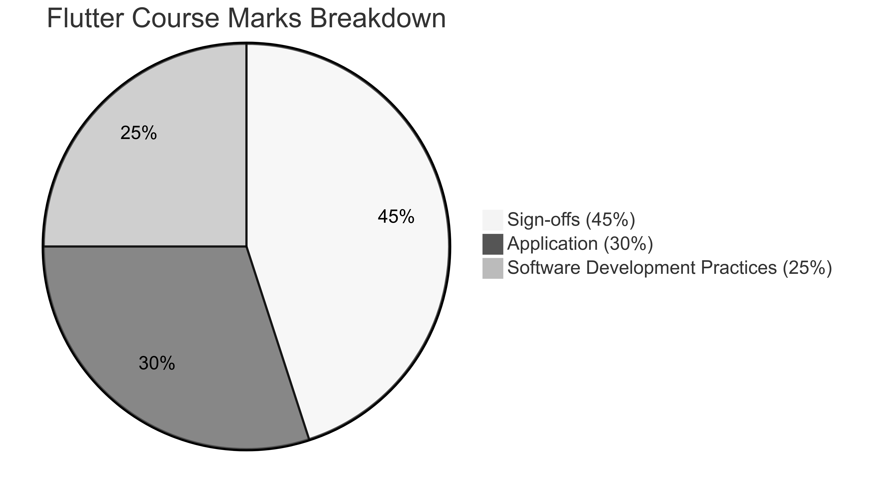

# **Flutter Course**

This is the homepage for the Flutter course which is the first half of the Programming Applications and Programming Languages (M30235) and User Experience Design and Implementation (M32605) modules. (It is called "sandwich_shop" because the worksheets build an app for a sandwich shop.)

## **Schedule**

| Week Commencing | Week Ending | CMIS Week | Worksheet | Deadline | Lecture Topics |
|-----------------|-------------|-----------|-----------|----------|---------------------------------|
| 29/09/2025 | 03/10/2025 | 9 | Worksheet 0 | | GitHub intro |
| 06/10/2025 | 10/10/2025 | 10 | Worksheet 1 | 0 | Flutter intro |
| 13/10/2025 | 17/10/2025 | 11 | Worksheet 2 | 0, 1 | Debugging and inspection |
| 20/10/2025 | 24/10/2025 | 12 | Worksheet 3 | 1, 2 | AI-Driven Development |
| 27/10/2025 | 31/10/2025 | 13 | **Consolidation week** | | |
| 03/11/2025 | 07/11/2025 | 14 | Worksheet 4 | 2, 3 | Coursework intro |
| 10/11/2025 | 14/11/2025 | 15 | Worksheet 5 | 3, 4 | Test-Driven Development |
| 17/11/2025 | 21/11/2025 | 16 | Worksheet 6 | 4, 5 | More AI-Driven Development |
| 24/11/2025 | 28/11/2025 | 17 | Worksheet 7 | 5, 6 | Firebase |
| 01/12/2025 | 05/12/2025 | 18 | Worksheet 8 | 6, 7 | No Lecture |
| 08/12/2025 | 12/12/2025 | 19 | Marking | 7, 8 | No Lecture |
| 15/12/2025 | 19/12/2025 | 20 | Marking | 8 | No Lecture |
| 22/12/2025 | 26/12/2025 | 21 | **Xmas Vacation** | | |

## **Teaching material**

We only have worksheets for this course. This is because there is no exam for this part of the module, so we do not have lecture slides.

You should aim to complete the worksheets in the order they are presented below. Do not skip Worksheet 0 and it is fine if you cannot make it all the way to Worksheet 8.

* [Worksheet 0: Introduction to Dart, Git and GitHub](./worksheet-0.md)
* [Worksheet 1: Introduction to Flutter](./worksheet-1.md)
* [Worksheet 2: Stateless Widgets](./worksheet-2.md)
* [Worksheet 3: Stateful Widgets](./worksheet-3.md)
* [Worksheet 4: App Architecture and Testing](./worksheet-4.md)
* [Worksheet 5: Data Models and Assets](./worksheet-5.md)
* [Worksheet 6: AI-Driven Development and Navigation](./worksheet-6.md)
* [Worksheet 7: State Management and Persistence](./worksheet-7.md)
* [Worksheet 8: Integration Testing, Firebase, and Deployment](./worksheet-8.md)

Every worksheet ends with a handful of **exercises**.  After completing these exercises, show a member of staff your work for a **sign-off**. **Each sign-off is worth 5%** of the Flutter Course mark.

There are a total of 9 sign-offs (one for each worksheet), and you have a two-week window to get each sign-off. For example, you can get the sign-off for Worksheet 0 in either Week 1 or Week 2. You can get the sign-off for Worksheet 1 in either Week 2 or Week 3, and so on.

## **Assessment**

This course is assessed through a single coursework (Item 1 in the module specification). This **coursework is worth 50%** of your module mark and will be accessible on the Teaching Block 1 (TB1) section of the Moodle page.

The mark for the Flutter Course is made up of the mark for the weekly sign-offs (45%), the mark for the application that you are submitting as part of the coursework (30%) and the mark for your software development practices used while developing this application (25%). See the diagram below for a breakdown of the marks.

By software development practices, we are referring to the following: version control (GitHub), verification (testing), utilisation of cloud services (Firebase), and the application of AI tools (evidence of correct AI-driven development).

## **Getting help**

To get support with the worksheets, join the [Discord channel](https://portdotacdotuk-my.sharepoint.com/:b:/g/personal/mani_ghahremani_port_ac_uk/EbX583gvURRAhqsnhYqmbSEBwIFw6tXRyz_Br1GxIyE8dg) and ask your questions there. Otherwise, attend your timetabled session and ask a member of staff for help.

## **Feedback**

To provide feedback on the organisation of the Flutter part of the module, complete this anonymous [feedback form](https://forms.office.com/e/88jd4UGAui). Note that you need to be logged into Microsoft with your student account to be able to access the form, but your username will not be collected.

The worksheets are not perfect. If you notice any mistakes or would like any improvements, please open [the repository](https://github.com/manighahrmani/sandwich_shop), go to the Issues tab and open a new issue describing the mistake. Provide as much detail as possible so that we can fix it quickly.

## **Sign-offs Tracker**

This [Excel sheet](https://portdotacdotuk-my.sharepoint.com/:x:/g/personal/mani_ghahremani_port_ac_uk/EU37A4NaOt5LrYCW2OJZgsoBr1rTjj-nLj1n9SrpVsIs2w?e=SxcJC3) allows you to track which sign-offs you have completed. Search for your UP number with **Ctrl + F** or **⌘ + F** to find your row quickly. If you cannot find your UP number, please let me know by messaging me on Discord.
