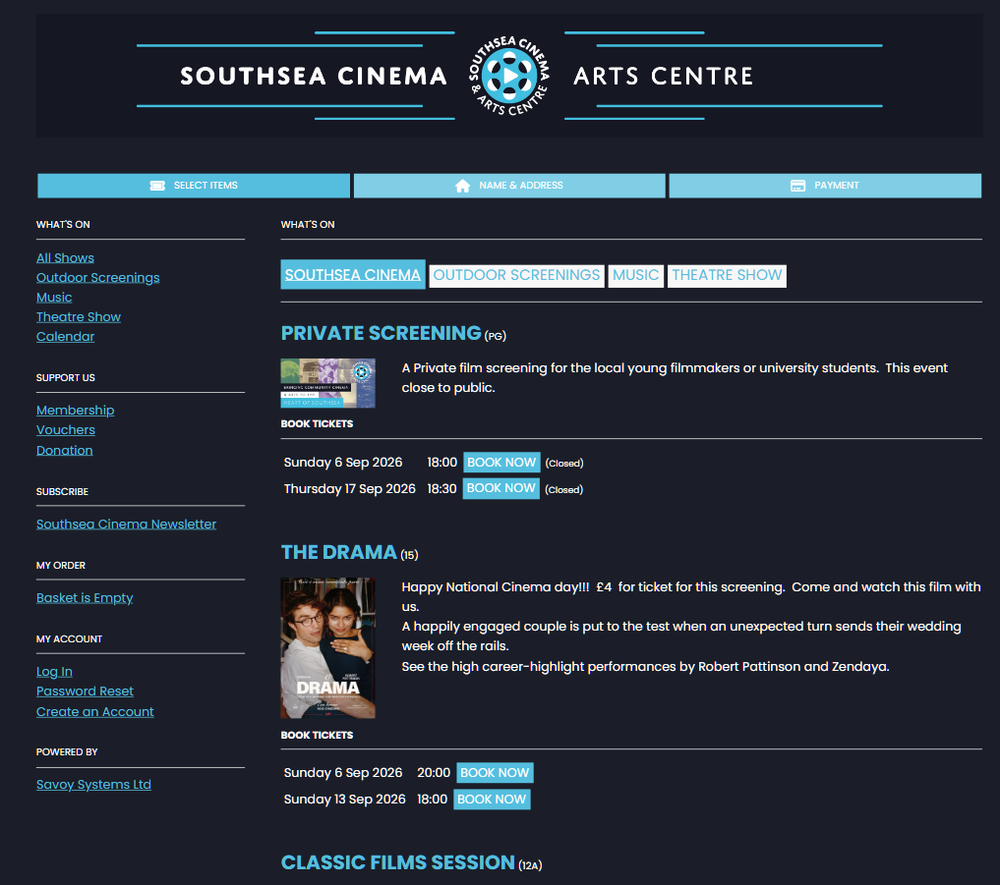
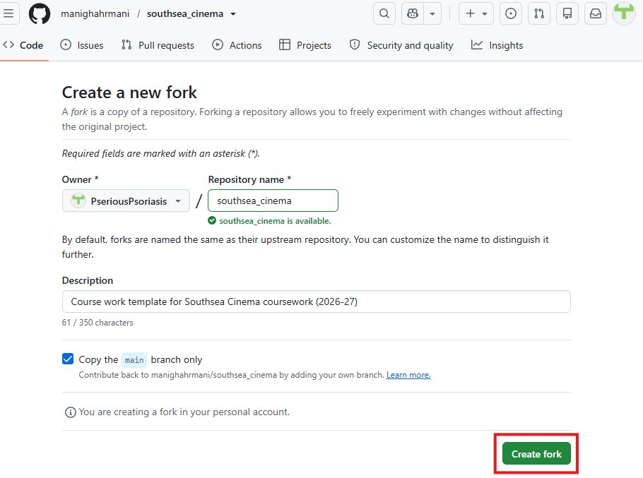
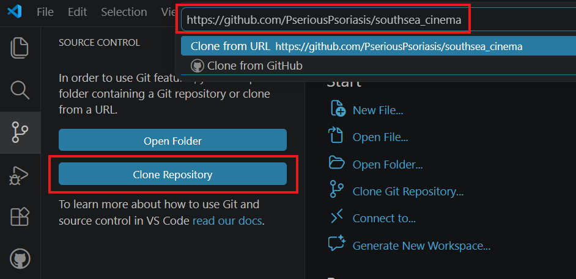
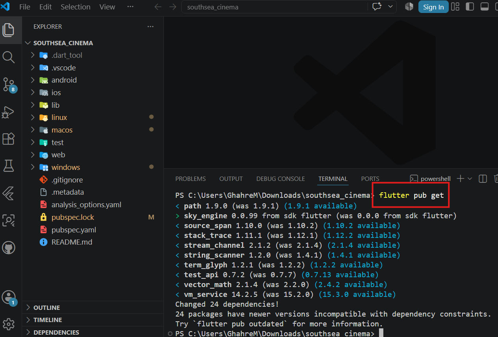
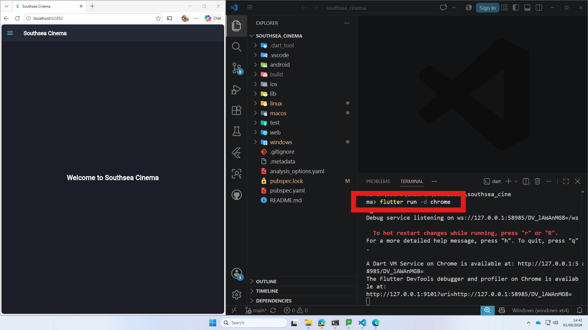

# Southsea Cinema — Flutter Coursework

School of Computing, Mathematics and Physics 2026/27

| | |
| --- | --- |
| Module Title and Code | **PROGRAMMING APPLICATIONS AND PROGRAMMING LANGUAGES - M30235 - FHEQ 5** <br> **USER EXPERIENCE DESIGN AND IMPLEMENTATION - M32605 - FHEQ 5** |
| Module Coordinator | [mani.ghahremani@port.ac.uk](mailto:mani.ghahremani@port.ac.uk) |
| Assessment Item number | Item 1 |
| Assessment Title | Southsea Cinema — Flutter Coursework |
| Date Issued | 2026-09-21 |

## Schedule and Deliverables

| Deliverable | Format | Weight | Date of demos |
| --- | --- | --- | --- |
| GitHub Repository | Link to your repository submitted to Moodle | 100% | Demo 1 by 02/10/2026 <br> Demo 2 by 16/10/2026 <br> Demo 3 by 06/11/2026 <br> Demo 4 by 20/11/2026 <br> Demo 5 by 04/12/2026 |

Demo: 10 minutes demo in your timetabled practical. All marks awarded in the demo.

## Notes and Advice

* The [Extenuating Circumstances procedure](https://myport.port.ac.uk/my-course/extenuating-circumstances) is there to support you if you have had any circumstances that have been significant enough to prevent you from attending, completing or submitting an assessment on time. If you complete an Extenuating Circumstances Form (ECF) for this assessment, use the correct module code, item number and deadline (not the late deadline) given above.
* [ASDAC](http://www2.port.ac.uk/additional-support-and-disability-advice-centre/) are available to any students who disclose a disability or require additional support for their academic studies.
* The University takes any form of academic misconduct (such as plagiarism) seriously, so please make sure your work is your own. Please ensure you adhere to our [Student Conduct Policy](https://policies.docstore.port.ac.uk/policy-261.pdf) and watch the video on [Plagiarism.](https://www.youtube.com/watch?v=2a0QJnCmfEs)
* Any material included in your coursework should be fully cited and referenced in **APA 7** format. Detailed advice on referencing is available from the [library](https://library.port.ac.uk/w165.html), also see TECFAC 08 Plagiarism and [library.port.ac.uk/referencing](https://library.port.ac.uk/referencing).
* Any material submitted that does not meet format or submission guidelines or falls outside of the submission deadline could be subject to a cap on your overall result or disqualification entirely.
* If you need additional assistance, you can ask your personal tutor, student engagement officer [ana.baker@port.ac.uk](mailto:ana.baker@port.ac.uk) or your lecturers.
* If you are concerned about your well-being, contact our [Well-being service](https://myport.port.ac.uk/guidance-and-support/health-and-wellbeing)

## Overview

Your task is to recreate a mobile-friendly version of the Southsea Cinema website using Flutter. You must not start from scratch: begin by forking the [southsea_cinema starter repository](https://github.com/manighahrmani/southsea_cinema), then build your own version of the app step by step as you work through the weekly worksheets on the [Flutter Course homepage](https://manighahrmani.github.io/sandwich_shop/).



Reference website: [Southsea Cinema](https://southseacinema.savoysystems.co.uk/SouthseaCinema.dll/)

We have provided a starter app for this coursework which is deliberately minimal. It contains only a basic theme, an empty home page, a small drawer, and a default widget test. You are expected to add screens, widgets, data models, tests, persistence, and cloud services during the coursework.

## Getting Started

### Prerequisites

You must already have a GitHub account to be able to start this coursework, and you need to be able to edit and run a Flutter project in your environment of choice and to commit your changes to a GitHub repository. All of these are explained in [Worksheet 1](https://manighahrmani.github.io/sandwich_shop/worksheet-1.html); complete it before continuing if you have not done so already.

You need:

* A GitHub account
* A way to edit and run Flutter projects
* Git installed and connected to your GitHub account

Follow the [development environment instructions in Worksheet 1](https://manighahrmani.github.io/sandwich_shop/worksheet-1.html). You can use your own device or access the university machines remotely.

### Fork the Repository

Open the [southsea_cinema repository](https://github.com/manighahrmani/southsea_cinema) and click **Fork** (or use [this link](https://github.com/manighahrmani/southsea_cinema/fork)):


On the "Create a new fork" page, leave the default options as they are (do not change the repository name) and click **Create fork**:



Your fork must be named `southsea_cinema` (if you already have a repository with this name, rename it beforehand) and should have a URL like:

```text
https://github.com/YOUR-USERNAME/southsea_cinema
```

### Clone Your Forked Repository

On your forked repository page, click the green **Code** button and copy the HTTPS URL:


If you are using VS Code, open the Source Control panel and click **Clone Repository** (or open the Command Palette with `Ctrl+Shift+P` / `Cmd+Shift+P` and choose "Git: Clone"), then paste the URL you copied:



Alternatively, if you are using a terminal, run:

```bash
git clone https://github.com/YOUR-USERNAME/southsea_cinema.git
cd southsea_cinema
```

Replace `YOUR-USERNAME` with your GitHub username.

### Install Dependencies

When you open the project, VS Code may show a popup asking if you want to fetch missing packages. If you see it, click **Run 'pub get'**:


If you do not see this popup, open a terminal and run the command manually:

```bash
flutter pub get
```



### Run the Application

This coursework targets Flutter Web and should be viewed in mobile view using your browser's developer tools. We recommend Chrome or Edge.

```bash
flutter run -d chrome
```

or:

```bash
flutter run -d edge
```

The app should open in your browser and show the Southsea Cinema starter home page:



To view it in mobile view, open developer tools (right-click the page and choose **Inspect**, or press F12), then click the **Toggle device toolbar** button:


Finally, choose a phone-sized device preset from the dropdown menu:


## Assessment Structure

Your module (PAPL — M30235, or UXDI — M32605, depending on your cohort) has two assessments. This Southsea Cinema coursework is **Item 1**, worth **50% of the overall module mark**. Item 1 is assessed as a portfolio, not as a single submission: you build the app in five stages and demonstrate each stage to a member of staff during a timetabled demo window.

You must submit the link to your public GitHub repository on Moodle before the first demo, then attend your timetabled practical session to demo your work. Marks are awarded only at the demos.

Summary of how the marks work:

* There are five demos, but only your best four count towards Item 1. The fifth demo is a safety net, so you can miss (or do poorly on) one demo without harming your mark.
* Each demo is worth 25% of Item 1 (12.5% of the module). At each demo a member of staff assesses Functionality (9% of Item 1) by watching you run your app, inspects Code quality (8%), and asks you two questions to test your understanding of your own code (8%).
* Only one demo can take place per window. If you miss a demo, you demonstrate the missed stage at the next window (you lose that window's slot). Missing one demo does not harm your mark; missing two caps your Item 1 mark at 75% of Item 1 (37.5% of the module), and so on.

⚠️ You will only receive marks if you attend your timetabled practical. You cannot get marks in practicals at a different time to what is shown on your timetable.

For the full details of how you are assessed — including the exact mark breakdown, the missed-demo rules, and how Extenuating Circumstances affect Item 1 — read the [Assessment Guide](https://portdotacdotuk-my.sharepoint.com/:w:/g/personal/mani_ghahremani_port_ac_uk/IQC9nZoNwb2jT40MnFQPZWVvAVdTK2PGBmZ8jPff30RRyPc).

For the overall dates and worksheet schedule, visit the [Flutter Course homepage](https://manighahrmani.github.io/sandwich_shop/).

## Submission

You need to submit the link to your public forked repository on Moodle before the first demo. You are not submitting a zip file or a copy of the source code.

Make sure your repository is public. Test this by opening your repository link in a private/incognito browser window (you should not get a 404 error).

## Demonstration

During each demo, you must be able to run your app and answer questions about your code. Before attending a demo, check that the app runs from a clean clone:

```bash
flutter pub get
flutter run -d chrome
```

## Project Structure

The starter repository is intentionally small:

```text
southsea_cinema/
├── lib/
│   ├── constants.dart          # Shared colours, text styles, and app title
│   ├── main.dart               # Main app and route setup
│   ├── views/
│   │   └── home_view.dart      # Starter home page
│   └── widgets/
│       └── nav_drawer.dart     # Minimal starter drawer
├── test/
│   └── widget_test.dart        # Basic widget test
├── pubspec.yaml                # Project dependencies
└── README.md                   # This file
```

Note that this is the initial structure. You are expected to create additional files and directories as needed to complete the coursework, and you can reorganise the project structure as you see fit.

## Referral/Deferral Assessment

More information about what referral/deferral are will be provided later in Moodle. Referral/deferral dates are on [the University Key Dates page](https://www.port.ac.uk/about-us/key-dates).

The referral/deferral assessment for this Flutter Course is a coursework that you need to complete during the referral/deferral period. This coursework is not the same as the coursework brief above. It will be added to Moodle nearer the time.

## Extenuating Circumstances

If there are external reasons stopping you from engaging with the module, submit an [Extenuating Circumstances Form (ECF)](https://myport.port.ac.uk/my-course/extenuating-circumstances) as soon as you can. You must also tell a member of staff so your Item 1 mark can be handled correctly.

Note that ECFs apply to the whole of Item 1 (the entire Flutter Coursework, 50% of the module). You cannot use an ECF just for individual demos.

If you have an approved ECF, your Item 1 mark is recorded as 0 for the demo portfolio, and you are instead expected to take the deferral assessment in the week beginning Monday 22 February 2027; your Item 1 mark then comes from that deferral coursework alone (not from the demos).

If you go on to attend demos and earn marks, you will override the ECF.

If you do not have an approved ECF, you simply receive the marks for the demos you completed. For the full ECF rules, see the [Assessment Guide](https://portdotacdotuk-my.sharepoint.com/:w:/g/personal/mani_ghahremani_port_ac_uk/IQC9nZoNwb2jT40MnFQPZWVvAVdTK2PGBmZ8jPff30RRyPc).

## Help with Coursework

If you have questions or encounter issues while working on this coursework, use the [Discord guide](https://portdotacdotuk-my.sharepoint.com/:p:/g/personal/mani_ghahremani_port_ac_uk/IQCMJP6IiR_bQoYUMdXJSRDYAWnajEALZYEXFZyrJkHS1QU) to find the dedicated Discord channel and ask for help. Before posting a new question, check the existing posts to see if your question has already been answered. You can also attend your timetabled practical sessions to get face-to-face support from teaching staff.
