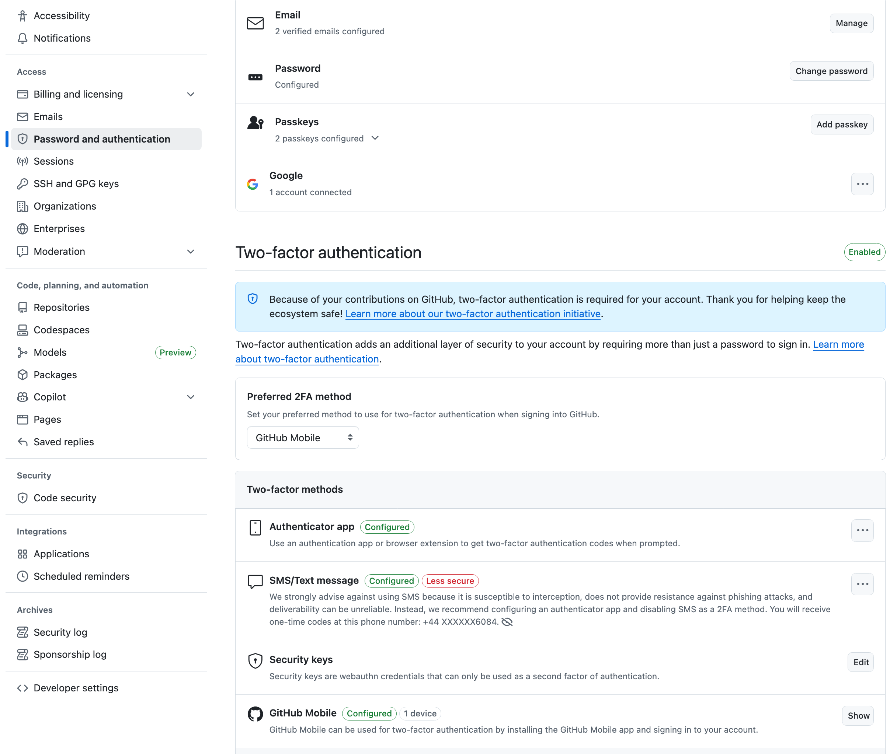

# Worksheet 0 — Introduction to Dart, Git and GitHub

If you're new to the Dart programming language or haven't used Git and GitHub before, completing these materials is essential for you. If you're already comfortable with these topics, feel free to skip to the [Exercises](#exercises) section.

## Getting help

To get support with this worksheet, join the [Discord channel](https://portdotacdotuk-my.sharepoint.com/:b:/g/personal/mani_ghahremani_port_ac_uk/EbX583gvURRAhqsnhYqmbSEBwIFw6tXRyz_Br1GxIyE8dg) and ask your questions there. Otherwise, attend your timetabled session and ask a member of staff for help.

## Introduction to Git and GitHub

Git is the version control system we'll use to track changes in our code, while GitHub is the platform where we'll host our code online. Since your coursework must be submitted via GitHub, a solid understanding of both is necessary for this module.

The following free courses from GitHub will get you up to speed:

### 1 - Introduction to GitHub

This course covers the basics of creating repositories, committing changes, working with branches, and using pull requests.

⚠️ **Note**: Use a personal email address (not your university email) to sign up for GitHub. If you already have a GitHub account with your university email, you need to change the primary email to a personal one.


Make sure to verify both email addresses in your GitHub account settings and enable two-factor authentication (2FA). We recommend using the GitHub mobile app for 2FA as shown below.



Once you have done this, complete the following
[introduction course](https://github.com/skills/introduction-to-github).

### 2 - Introduction to GitHub Copilot

GitHub's AI can assist you with tasks such as explaining code, fixing bugs, and even writing code snippets. As a student, you're eligible for a free Copilot subscription through the [GitHub Student Developer Pack](https://education.github.com/pack).

⚠️ **Note**: While signing up for GitHub for education, you need to be on-campus (or use the [VPN](https://myport.port.ac.uk/it-support/student-it-support/guide-to-the-virtual-private-network-vpn)) so that they can verify you are on the university campus.

Once you have access to Copilot, complete the following
[getting started course](https://github.com/skills/getting-started-with-github-copilot).

## Introduction to the Dart language

Dart is the programming language developed by Google. It is a statically typed language, compiled to native code, language with C-style syntax. Even though it may not be as popular as languages like C or Java, it is the language of the Flutter framework which we will be using for cross-platform app development in this module.

If you have not used Dart before or need a refresher, below are the resources from our first-year Programming module that will get you started.

### 1 - Getting started with Dart

- [**Worksheet**](https://portdotacdotuk-my.sharepoint.com/:w:/g/personal/mani_ghahremani_port_ac_uk/ESkq3xBzVgpPh8U0zkb3WXQB49yLKZjjC9QxM-f3V-PTiQ?e=p5ckav)
- [**Lecture**](https://portdotacdotuk-my.sharepoint.com/:p:/g/personal/mani_ghahremani_port_ac_uk/EQZicReK_3ZLkNAOj--M3psBntl0cZRT7piu6W3j4OFPcg)
- [**GitHub Repository**](https://github.com/Programming-M30299/week-15-dart-code)

### 2 - Functions and control flow in Dart

- [**Worksheet**](https://portdotacdotuk-my.sharepoint.com/:w:/g/personal/mani_ghahremani_port_ac_uk/EVXFsog_gS9LlAFbUTUMXj4BXbKfWxQj0WjyN0dk9mblLw)
- [**Lecture**](https://portdotacdotuk-my.sharepoint.com/:p:/g/personal/mani_ghahremani_port_ac_uk/EbUO-PZOSWNPoA9TL1AqiSkBgURErCT0WE7I81dSu2OEQA?e=ZvHyB0)
- [**GitHub Repository**](https://github.com/Programming-M30299/week-16-dart-code)

### 3 - Strings and collections in Dart

- [**Worksheet**](https://portdotacdotuk-my.sharepoint.com/:w:/g/personal/mani_ghahremani_port_ac_uk/EV6lZOGcgydPuoR65cCrVfcBXW1SaRNSRgjqv3hzjd-EOA?e=o6d2EM)
- [**Lecture**](https://portdotacdotuk-my.sharepoint.com/:p:/g/personal/mani_ghahremani_port_ac_uk/EbUO-PZOSWNPoA9TL1AqiSkBgURErCT0WE7I81dSu2OEQA?e=N2Xhcy)
- [**GitHub Repository**](https://github.com/Programming-M30299/week-17-dart-code)

### 4 - Object-oriented programming in Dart

- [**Worksheet**](https://portdotacdotuk-my.sharepoint.com/:w:/g/personal/mani_ghahremani_port_ac_uk/ERG7VQKzCdVEsX0mc-s-nT4BLFUNsoR3lSpS3tLjSXYaLA)
- [**Lecture**](https://portdotacdotuk-my.sharepoint.com/:p:/g/personal/mani_ghahremani_port_ac_uk/EcpaP0-SOaJBqpDuSlcl4xwBTSzN9HgPhCOMnL74Zw54Zw)
- [**GitHub Repository**](https://github.com/Programming-M30299/week-18-dart-code)

## Exercises

Complete the exercises below and show your work to a member of staff present at your next practical for **a sign-off**.

1. Your GitHub profile is your developer portfolio.

    As a small but important step, personalise your profile by adding a profile picture. Then write a short, one-line bio about yourself.

    Include what skills you have and what roles you are interested in.
    And if you already know how to use GitHub, create repositories for the courseworks and projects that you have completed in the past.

    ⚠️ **Show your GitHub profile to a member of staff** for feedback and a sign-off.

2. Follow the instructions on [this document](https://portdotacdotuk-my.sharepoint.com/:w:/g/personal/mani_ghahremani_port_ac_uk/ERXv27njJSZBsmQd5zCrGAMBvuuicqakKSQAk47e0IKf5g) to install Dart SDK and Visual Studio Code on your computer.

    Next, get [the GitHub for student pack](https://education.github.com/pack) and install the GitHub Copilot extension in Visual Studio Code. For more information, check out [this section](#introduction-to-git-and-github) of this worksheet.

    Install [the GitHub Copilot extension in VS Code](https://marketplace.visualstudio.com/items?itemName=GitHub.copilot) if it's not already installed. Finally, make a Dart file, e.g., `hello_dart.dart` and use Copilot. You can, for example, add a comment to ask Copilot to write a new function for you:

    ```text
    // Write a function that returns the sum of two integers
    ```

    ⚠️ **Show your Dart file to a member of staff** for a sign-off.
