# **Worksheet 1 — Dart, Git, GitHub and Flutter**

## **What you need to know beforehand**

This worksheet combines the introductory Dart, Git, GitHub and Flutter material.
Complete it before continuing to Worksheet 2.

## **Getting help**

To get support with this worksheet, follow the [Discord guide](https://portdotacdotuk-my.sharepoint.com/:p:/g/personal/mani_ghahremani_port_ac_uk/IQCMJP6IiR_bQoYUMdXJSRDYAWnajEALZYEXFZyrJkHS1QU) and ask your questions there. Otherwise, attend your timetabled session and ask a member of staff for help.

## **Introduction to Git and GitHub**

Git is the version control system we'll use to track changes in our code. GitHub is the platform where we'll host our code online. Your coursework must be submitted via GitHub so you need a good understanding of it.

### **0 - Sign up to GitHub**

Start by signing up for a GitHub account if you don't already have one: [GitHub Sign Up](https://github.com/signup)

⚠️ Use a personal email address (not your university one). Your university account will be deleted once you graduate.

If you already have a GitHub account with your university email, you need to change the primary email to a personal one.

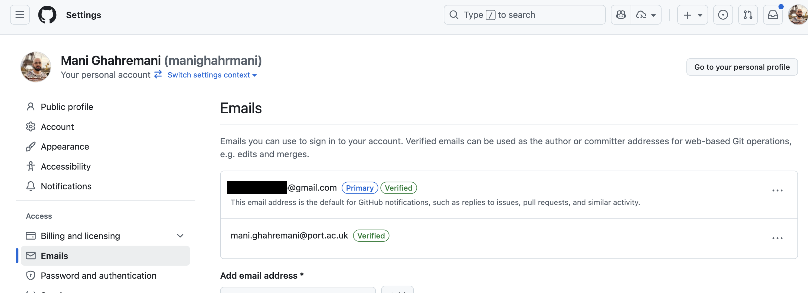

Make sure to verify both email addresses in your GitHub account settings and enable two-factor authentication (2FA).

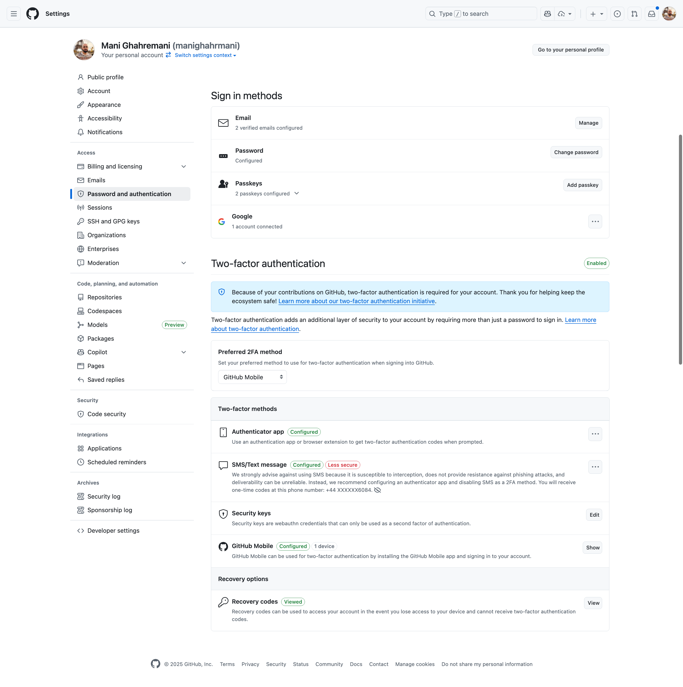

### **1 - Introduction to GitHub**

Once you have a GitHub account, complete the following [introduction course](https://github.com/skills/introduction-to-github).

### **2 - Introduction to GitHub Copilot**

GitHub's AI can assist you with tasks such as explaining code, fixing bugs, finding resources, and writing code snippets. As a student, you're eligible for a free Copilot subscription through the [GitHub Student Developer Pack](https://education.github.com/pack).

⚠️ While signing up for GitHub for education, you need your student ID and you need to be on-campus (or use the [VPN](https://myport.port.ac.uk/it-support/student-it-support/guide-to-the-virtual-private-network-vpn)) so that they can verify you are a student.

Once you have access to Copilot, complete this [getting started course](https://github.com/skills/getting-started-with-github-copilot). If you get stuck, ask for help on the Discord channel or during your practical session.

## **Introduction to the Dart language**

Dart is the programming language developed by Google. It is a statically typed language used by the Flutter framework for cross-platform app development.

If you have not used Dart before or need a refresher, use the [Dart software and resources guide](https://portdotacdotuk-my.sharepoint.com/:w:/g/personal/mani_ghahremani_port_ac_uk/IQAeCWXLehKuTou1gTpjrNKRAcCHcRGxPJSinskA7x1opXg?e=lfIK0S).

## **Set up your development environment**

Developing a Flutter application can be demanding on your computer. If you have a capable device, you can install Flutter locally. Otherwise, use the university machines. Follow the appropriate guide below.

### **A - On your own device**

Follow the [official Flutter installation guide](https://docs.flutter.dev/install/quick) to set up Flutter on your device.

### **B - Using the university machines on campus**

Log into GitHub on the university machine, then open [the `flutter_vscode_package` repository](https://github.com/manighahrmani/flutter_vscode_package#setup).

Copy the PowerShell command from the repository's README, then paste it into PowerShell on the university computer and press Enter to execute it.

Pay attention to the terminal as it may ask you to select which repository you would like to use. The process takes up to 10 minutes to complete. And once it is done, you should see Visual Studio Code open where you need to log in using your GitHub account.

Once Visual Studio Code is open, follow the instructions [on the official Flutter website](https://docs.flutter.dev/install/quick#test-drive). Skip the first step as it is already handled by the launcher.

### **C - Using the university machines while not on campus**

[Guide to remote computer access](https://myport.port.ac.uk/it-support/student-it-support/guide-to-remote-computer-access) provides instructions on how to access university computers remotely. You need to install the university VPN as well as a remote desktop client.

Once you have followed the guide above, refer to [the on-campus guide above](#b---using-the-university-machines-on-campus) to set up and use the Flutter and VS Code package remotely.

## **Using the generated project**

If you left the repository prompt empty, the launcher has already created a Flutter Web starter project and opened it in VS Code. Otherwise, create a new project by first opening the Command Palette by pressing **Ctrl + Shift + P** on Windows or **⌘ + Shift + P** on macOS. See the screenshot below for reference.

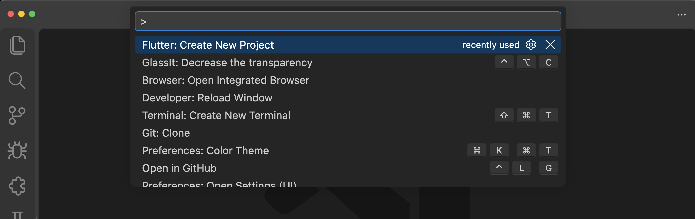

If you don't see this, make sure you have the Flutter and Dart extensions installed in VS Code. You can install them from the Extensions view by searching for "Flutter" and "Dart". When the Command Palette is open, you can type what you want to do. In this case, you should type `Flutter: New Project` to create a new Flutter project as shown below.

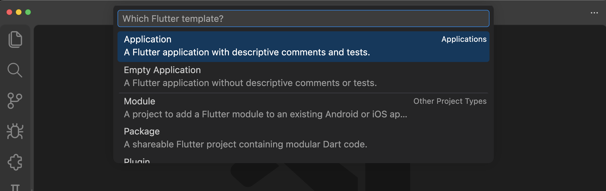

Afterwards, select `Application` as the project type and select a location on the computer that is not synced to cloud (e.g., Downloads folder) as the project location.

Once you have a new Flutter project, you should see the project's structure in the Explorer view on the left side of VS Code. The most important files for now are located in the `lib/` folder.

This folder contains your Dart application code (source code), with the main entry point in `main.dart` (this is the file that runs when you start your app).

The term "root" of a project refers to its top-level directory, which contains all the other files and folders.

In the root of all Flutter projects, there must be a file called `pubspec.yaml`. This is a configuration file for managing your project's dependencies and assets.

The screenshot below shows the `main.dart` and `pubspec.yaml` files in the starter project.

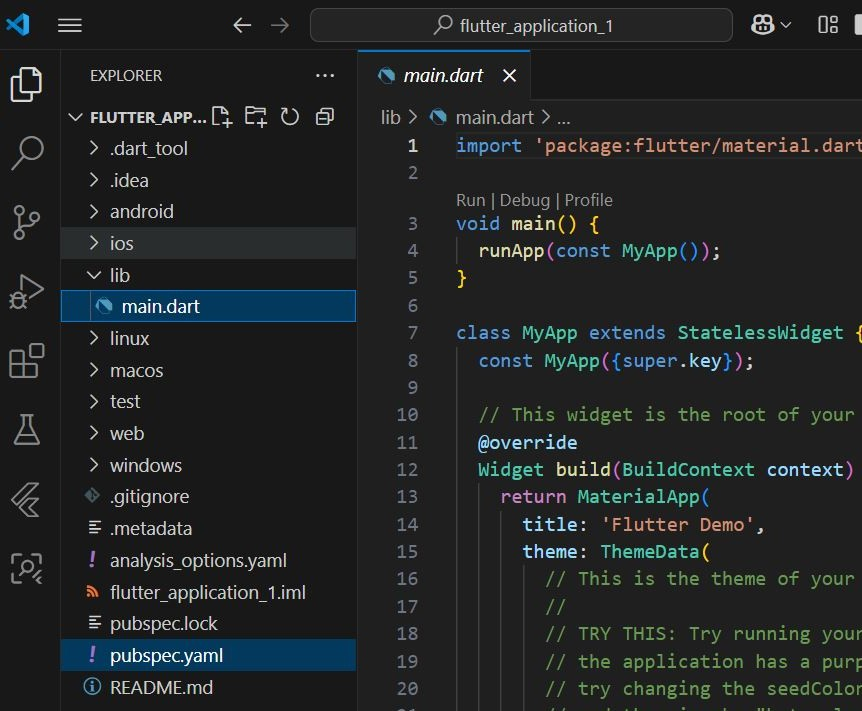

You don't need to understand the code at this moment but below is a brief overview.

The default application's `main.dart` file contains the entry point `void main() => runApp(const MyApp());`, which runs the root widget, `MyApp`. This `StatelessWidget` sets up the `MaterialApp` and defines the home screen, which is the `MyHomePage` widget. `MyHomePage` is a `StatefulWidget` because it manages the changing counter value. It contains the `_incrementCounter()` method, which uses `setState()` to rebuild the UI when the `_counter` variable changes.

### **Using AI**

One of the learning outcomes of this module is "Design and implement the user interface, database and application logic of an interactive software application". In essence, you need to understand the codebase that you will be working with. And although later in the module you will learn to use AI to speed up and branch out your development process, you must always be able to explain the code that you are submitting as part of this module.

If you have signed up for GitHub Education, you can access GitHub Copilot for free, which is an AI assistant integrated into VS Code. At this moment, you should ensure that the Copilot extension is installed and enabled in your VS Code environment. See the screenshot below.

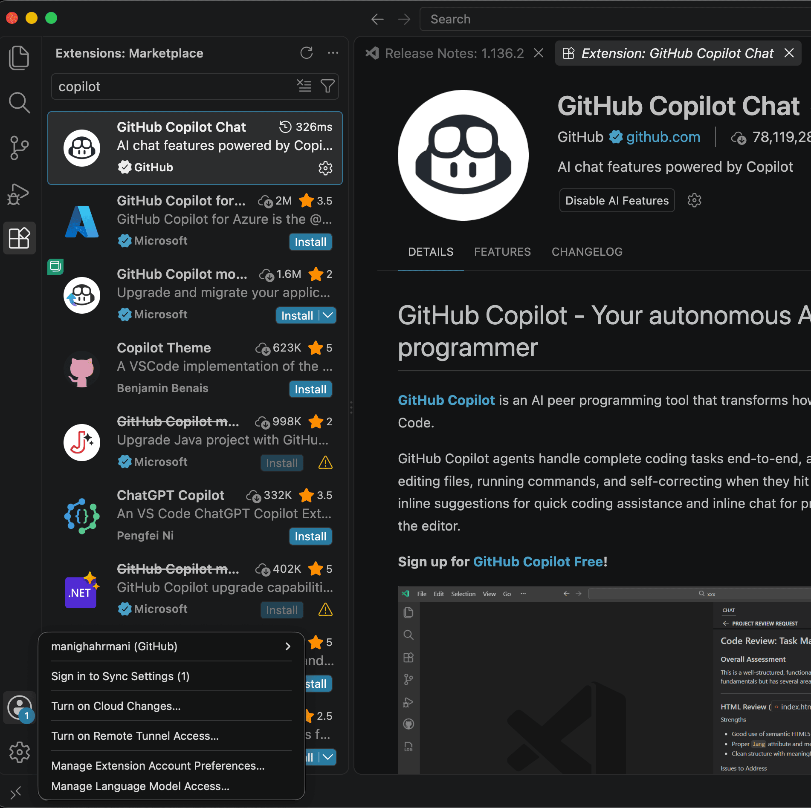

As an example, select a piece of code that you'd like to learn more about with your mouse. Then use the Copilot extension (**Ctrl + I** on Windows or **⌘ + I** on macOS) to ask the AI questions like: "I am new to Flutter, what does the selected code do? Give me a brief and simple explanation".

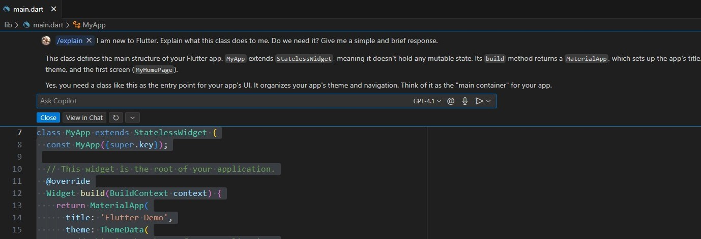

### **Selecting a target device**

In VS Code, you need to select a target device to run your app. The university computers are not configured with the Android or iOS development tools, so use a web browser as the target device.

At the bottom right of the VS Code window is the status bar. Click on the device name (it might say "No Device") to open the device selector. For now, choose a browser like Edge or Chrome. Alternatively, you can open the Command Palette (**Ctrl + Shift + P** or **⌘ + Shift + P**) and type `Flutter: Select Device`. Then select your browser from the list.

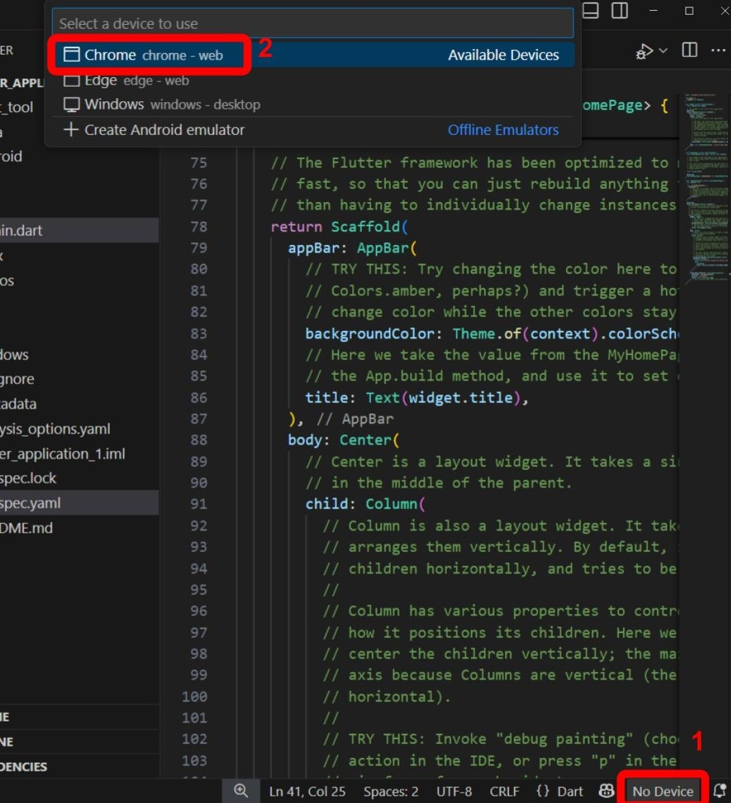

### **Installing dependencies**

Every app depends on various external packages and libraries to function correctly. The `pubspec.yaml` lists the dependencies required as mentioned before. And if your dependencies are not installed, you will most likely see red underlines in your `main.dart` file or other parts of your code.

VS Code may install the dependencies automatically when you open the project or display a popup prompting you to install them, as shown below.

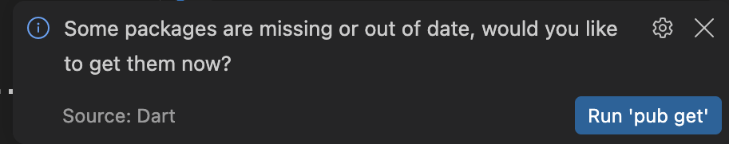

If the dependencies are not installed automatically, open the Command Palette (**Ctrl + Shift + P** or **⌘ + Shift + P**), type `Terminal: Create New Terminal` and press Enter. Then run:

```bash
flutter pub get
```

This command fetches and installs all the dependencies listed in the `pubspec.yaml` file, ensuring that your project has everything it needs to run correctly.

### **Running the app**

You can run the app in several ways, for example by pressing the F5 key, opening a new terminal and running `flutter run`, or clicking the "Run" button that appears above the `main` function in `main.dart`.

You can also open the Command Palette (**Ctrl + Shift + P** or **⌘ + Shift + P**) and type `Terminal: Create New Terminal` to open a terminal, then run the following command:

```bash
flutter run
```

VS Code will build and run your application, which should open in a browser window. Click the `+` button to see the counter increase.

### **Viewing the app as a mobile app**

For the purpose of this module, you will primarily be developing applications designed for mobile devices. To see your app in a mobile layout, you can either use your browser's developer tools or run a device emulator (more on the emulator setup is provided in later worksheets).

When your app is running in the browser (Chrome, Edge or a similar browser, but not Safari!), you can simulate a mobile view. Right-click anywhere on the page and select `Inspect` or `Developer Tools`. You could alternatively press the **F12** key. This will open the developer tools.

In the developer tools panel, look for an icon that looks like a phone and tablet, often called the `Toggle device toolbar`. Click it to switch to a mobile device view. Below is an example of how it looks in Chrome.

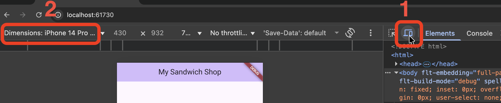

You can then use the dropdown menu at the top of the screen to select different device presets, such as an iPhone or a Pixel, to see how your app looks and behaves on various screen sizes.

### **Using hot reload**

Hot reload is a feature that lets you see code changes instantly without restarting the app. You can enable it by clicking the lightning bolt icon at the top of VS Code while the app is running. If you are using the terminal, you can type `r` to trigger it.

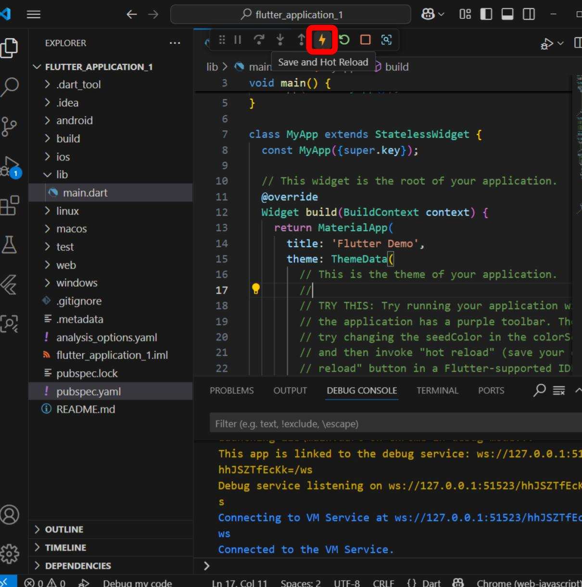

As an example, while the app is running, enable hot reload and change the `colorSchemeSeed` property inside the `ThemeData` widget in `main.dart` from `Colors.deepPurple` to `Colors.orange` and save the file. You should see the UI update in the browser instantly.

### **Initialising a GitHub repository**

Lastly, let's put our project on GitHub to track changes and back it up online.

In the Activity Bar on the left, click the Source Control icon. Click on `Initialize Repository` to set up Git for your project.

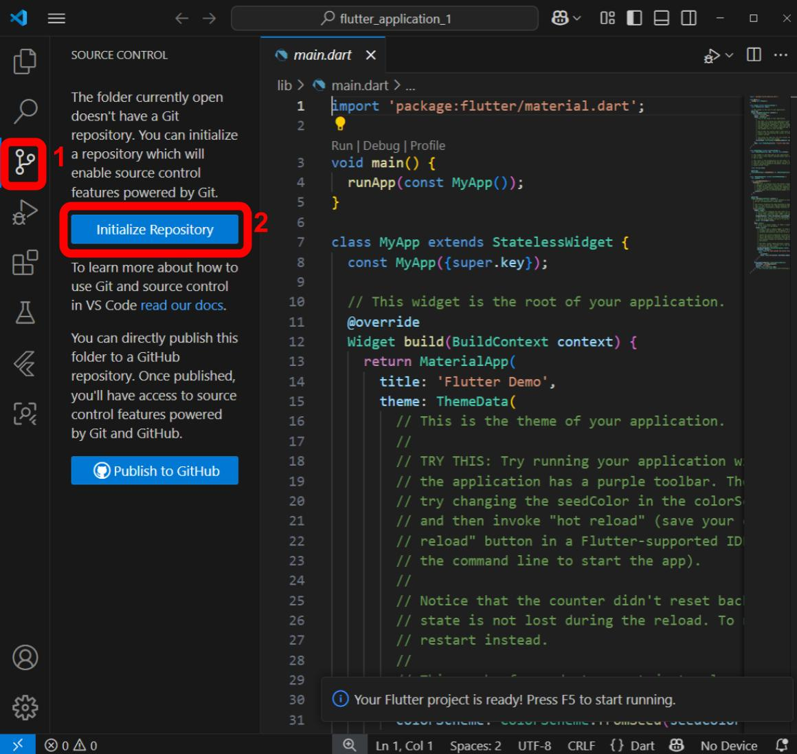

Alternatively, you can run the following command in the terminal to initialise Git:

```bash
git init
```

#### **Making the first commit**

If you used the Flutter and VS Code bundle, its launcher has already checked your Git author configuration. It displays your configured GitHub username and email address and lets you change them. You cannot continue until both values are set.

If you installed Flutter and VS Code yourself, check your Git author configuration before committing:

```bash
git config --global --get user.name
git config --global --get user.email
```

If either command does not return a value, configure your GitHub username and the email address associated with your GitHub account:

```bash
git config --global user.name "YOUR_GITHUB_USERNAME"
git config --global user.email "YOUR_GITHUB_EMAIL"
```

You should now see all your project files listed in the Source Control panel. Hover over **Changes** and click the `+` icon to stage all files. Then, enter a commit message like `Initial commit` in the text box and click the **Commit** button to commit your changes.

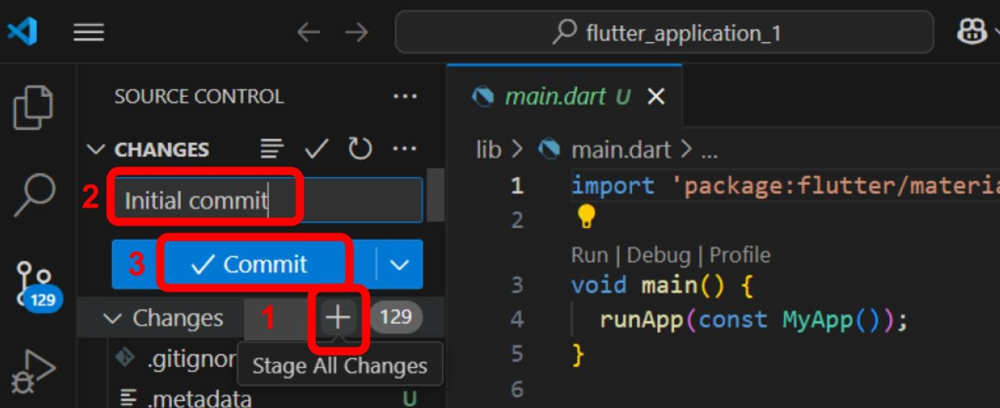

Alternatively, you can run the following commands in the terminal:

```bash
git add .
git commit -m "Initial commit"
```

You might see a pop-up asking to stage all changes and commit them directly; you can click `Always` to skip this in the future.

The `Commit` button will now say `Publish Branch`:

Or `Sync Changes`:

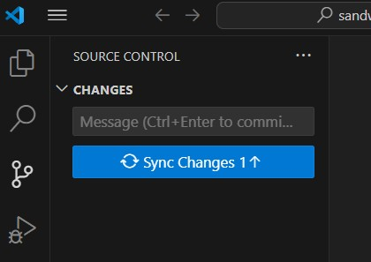

Click this to push your local repository to GitHub. You may be asked to allow VS Code to log in to your GitHub account.

Next, you will be asked to name your repository; enter `sandwich_shop`. Let this be a **public** repository and click `Publish Repository`.

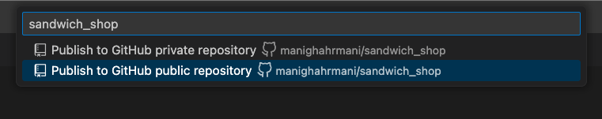

#### **Verifying the repository on GitHub**

You can verify that the project was published by navigating to your GitHub account in a web browser. You should see the newly created `sandwich_shop` repository.

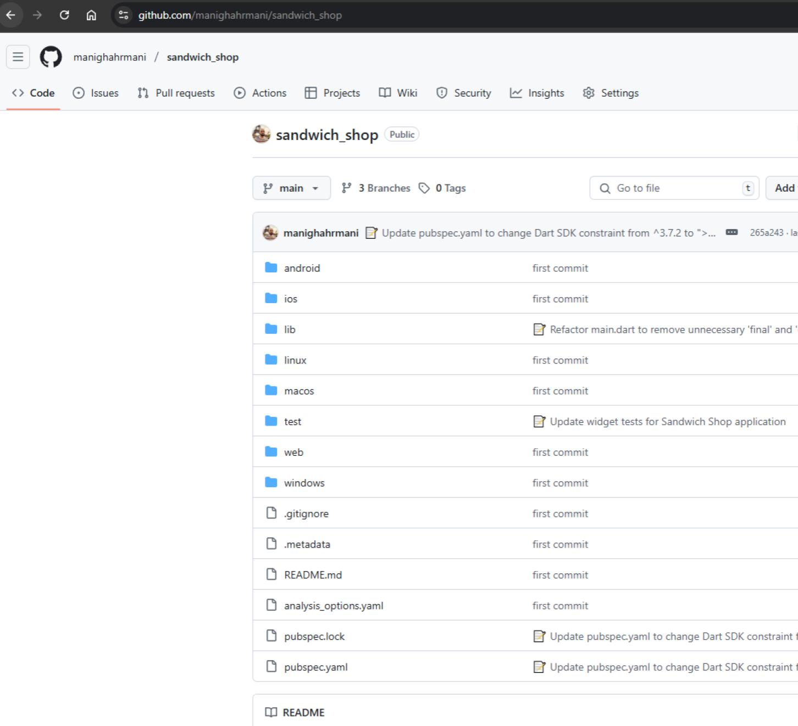

The link will look like `https://github.com/YOUR_USERNAME/sandwich_shop` where `YOUR_USERNAME` is your GitHub username.

#### **Making another commit**

Let's make another commit. In `main.dart`, change the text in the `AppBar` widget from `Flutter Demo Home Page` to `My Sandwich Shop`. Save the file (**Ctrl + S** or **⌘ + S**) or better yet, enable auto-save by opening the Command Palette (**Ctrl + Shift + P** or **⌘ + Shift + P**) and typing `Auto Save`, then press Enter to select `Toggle Auto Save`.

Go back to the Source Control panel (use the Command Palette and enter `Focus on Source Control View` if you can't see it), stage the changes, and commit them with a message like `Change AppBar title`. Remember to always write meaningful commit messages that describe what changes you made. The commit message should ideally be written in the imperative mood, like `Add new feature` or `Fix bug`.

Before you click on commit, you can also click on the changed files below the `Changes` section to see the differences (diff) between the current version and the last committed version.

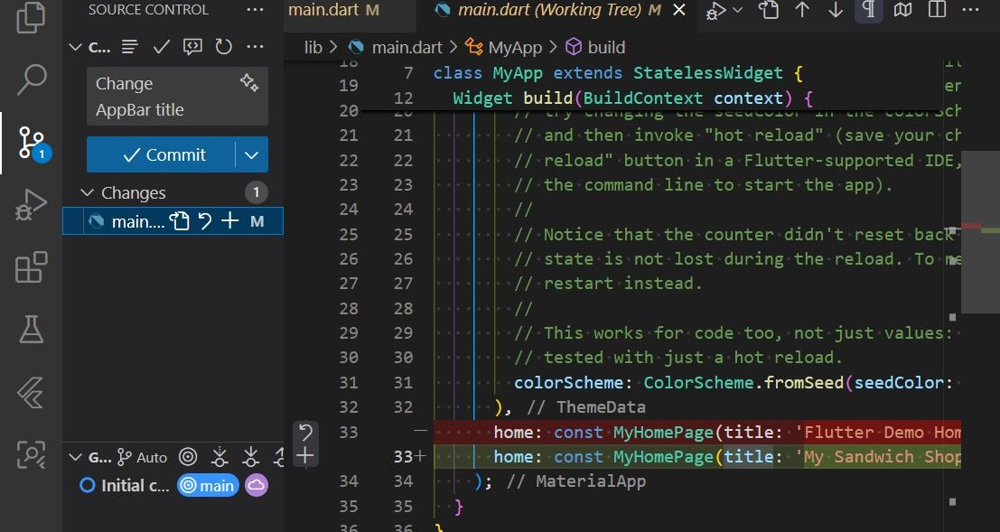

Once you have clicked on commit and then sync changes, you should be able to see the changes to the file in your GitHub repository.

## **Exercises**

From this point onwards, the exercises in each worksheet direct you to work on your Southsea Cinema coursework. The exercises in this worksheet prepare you for Demo 1, which must be completed by Friday 2 October 2026. Refer to the formal [Southsea Cinema coursework brief](https://portdotacdotuk-my.sharepoint.com/:w:/g/personal/mani_ghahremani_port_ac_uk/IQDtIJB3bM7gQ4p03eLUngyyAd7JuhjhHuNA1l0H-qCy3Jw) for the assessment requirements.

1. Open the [Southsea Cinema starter repository](https://github.com/manighahrmani/southsea_cinema#fork-the-repository) and follow its README from **Fork the Repository** onwards. Fork the repository into your own GitHub account, then clone your fork onto your computer or a university machine.

2. Follow the README instructions to install the project dependencies and run the app in Chrome or Edge. Open the browser's developer tools and use the device toolbar to display the app in a phone-sized mobile view.

3. In `main.dart`, find the `MaterialApp` widget and change its `title` to `Southsea Cinema & Arts Centre`. Save the file while the app is running, then use hot reload to see the updated title without restarting the app. Check the browser tab and confirm that the new title appears.

4. Use VS Code's Source Control view to review and stage your change. Commit it with a clear message such as `Change webpage title`, then push the commit to your fork on GitHub. Open your fork in a browser and confirm that the new commit and code change are visible.
