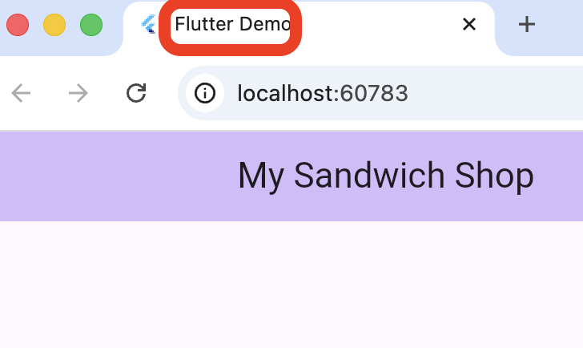
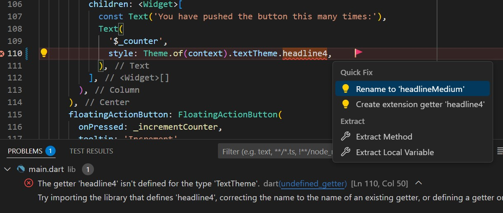

# **Worksheet 1 — Dart, Git, GitHub and Flutter**

## **What you need to know beforehand**

This worksheet combines the introductory Dart, Git, GitHub and Flutter material.
Complete it before continuing to Worksheet 2.

## **Getting help**

To get support with this worksheet, follow [discord_flutter](https://portdotacdotuk-my.sharepoint.com/:p:/g/personal/mani_ghahremani_port_ac_uk/IQCMJP6IiR_bQoYUMdXJSRDYAWnajEALZYEXFZyrJkHS1QU) and ask your questions there. Otherwise, attend your timetabled session and ask a member of staff for help.

## **Introduction to Git and GitHub**

Git is the version control system we'll use to track changes in our code. GitHub is the platform where we'll host our code online. Your coursework must be submitted via GitHub so you need a good understanding of it.

### 0 - Sign up to GitHub

Start by signing up for a GitHub account if you don't already have one: [GitHub Sign Up](https://github.com/signup)

⚠️ Use a personal email address (not your university one). Your university account will be deleted once you graduate.

If you already have a GitHub account with your university email, you need to change the primary email to a personal one.


Make sure to verify both email addresses in your GitHub account settings and enable two-factor authentication (2FA).


### 1 - Introduction to GitHub

Once you have a GitHub account, complete the following [introduction course](https://github.com/skills/introduction-to-github).

### 2 - Introduction to GitHub Copilot

GitHub's AI can assist you with tasks such as explaining code, fixing bugs, finding resources, and writing code snippets. As a student, you're eligible for a free Copilot subscription through the [GitHub Student Developer Pack](https://education.github.com/pack).

⚠️ While signing up for GitHub for education, you need your student ID and you need to be on-campus (or use the [VPN](https://myport.port.ac.uk/it-support/student-it-support/guide-to-the-virtual-private-network-vpn)) so that they can verify you are a student.

Once you have access to Copilot, complete this [getting started course](https://github.com/skills/getting-started-with-github-copilot). If you get stuck, ask for help on the Discord channel or during your practical session.

## **Introduction to the Dart language**

Dart is the programming language developed by Google. It is a statically typed language used by the Flutter framework for cross-platform app development.

If you have not used Dart before or need a refresher, use [dart_software_and_resources](https://portdotacdotuk-my.sharepoint.com/:w:/g/personal/mani_ghahremani_port_ac_uk/IQAeCWXLehKuTou1gTpjrNKRAcCHcRGxPJSinskA7x1opXg?e=lfIK0S).

## **Set up your development environment**

Developing a Flutter application is demanding on the hardware of your computer. So if you have a capable device, you can install the flutter locally on your machine. Otherwise, use the university machines. Follow the guide below depending on your choice.

### **A - On your own device**

Follow the [official Flutter installation guide](https://docs.flutter.dev/install/quick) to set up Flutter on your device.

### **B - Using the university machines on campus**

Log into GitHub on the university machine first and then open [the `flutter_vscode_package` repository](https://github.com/manighahrmani/flutter_vscode_package#setup).

Copy the PowerShell command from the repository's README, then paste it into PowerShell on the university computer and press Enter to execute it.

Pay attention to the terminal as it may ask you to select which repository you would like to use. The process takes up to 10 minutes to complete. And once it is done, you should see Visual Studio Code open where you need to log in using your GitHub account.

Once Visual Studio Code is open, follow the instructions [on the official Flutter website](https://docs.flutter.dev/install/quick#test-drive). Skip the first step as it is already handled by the launcher.

### **C - Using the university machines while not on campus**

[Guide to remote computer access](https://myport.port.ac.uk/it-support/student-it-support/guide-to-remote-computer-access) provides instructions on how to access university computers remotely. You need to install the university VPN as well as a remote desktop client.

Once you have followed the guide above, refer to [the on-campus guide above](#b---using-the-university-machines-on-campus) to set up and use the Flutter and VS Code package remotely.

## **Using the generated project**

If you left the repository prompt empty, the launcher has already created a Flutter Web starter project and opened it in VS Code.

You should see a new folder structure in the Explorer view on the left side of VS Code. The most important files for now are located in the `lib/` folder.

This folder contains your Dart application code (source code) with the main entry point being `lib/main.dart` (this is the file that runs when you start your app).

The term "root" of a project refers to the top-level directory of a project. The root contains all the other files and folders. In this case.

In the root of all Flutter projects, there must be a file called `pubspec.yaml`. This is a configuration file for managing your project's dependencies and assets.

The screenshot below shows the `main.dart` and `pubspec.yaml` files in the starter project.


You don't need to understand the code at this moment but below is a brief overview.

The default application is a simple counter app. The `lib/main.dart` file contains the entry point `void main() => runApp(const MyApp());`, which runs the root widget, `MyApp`. This `StatelessWidget` sets up the `MaterialApp` and defines the home screen, which is the `MyHomePage` widget. `MyHomePage` is a `StatefulWidget` because it manages the changing counter value. It contains the `_incrementCounter()` method, which uses `setState()` to rebuild the UI when the `_counter` variable changes.

### **Using AI**

We will learn more about stateless and stateful widgets in later worksheets. This is just a brief overview to get you started. But for now, we want you to use your AI tool of choice to explore the code.

#### **Basics good practices of using AI**

Remember that Large Language Models (LLMs) like Copilot, Gemini, ChatGPT, or Claude work best when you do all the following:

1. Start with a **specific goal** for what you want the AI to do (e.g., explain, fix an error, implement a feature)
2. Provide a **source to ground** the response so for example the AI does not make assumptions or use outdated information (for example you may need to copy and paste sections from the Flutter or Dart's documentation)
3. Add **context** to make sure the response is appropriate and relevant (e.g., project structure, code snippets, the platform you're using)
4. Set **clear expectations** for the response (e.g., level and length of the explanation, inclusion of examples)
5. Refer to **previous prompts and responses** in your questions (e.g., ask follow-up questions or request clarifications)

As an example, select a piece of code that you'd like to learn more about with your mouse. Then use the Copilot extension (**Ctrl + I** on Windows or **⌘ + I** on macOS) to ask the AI questions like: "I am new to Flutter, what does the selected code do? Give me a brief and simple explanation".


### **Selecting a target device**

On VS Code, you need to select a target device to run your app. At the bottom right of the VS Code window is the status bar. Click on the device name (it might say "No Device") to open the device selector. For now, choose a browser like Edge or Chrome. Alternatively, you can open the Command Palette (**Ctrl + Shift + P** or **⌘ + Shift + P**) and type `Flutter: Select Device`. Then select your browser from the list.


### **Running the app**

You can run the app in several ways, for example by pressing the F5 key, opening a new terminal and running `flutter run`, or clicking the "Run" button that appears above the `main` function in `lib/main.dart`.

You can also open the Command Palette (**Ctrl + Shift + P** or **⌘ + Shift + P**) and type `Terminal: Create New Terminal` to open a terminal, then run the following command:

```bash
flutter run
```

VS Code will build and run your application, which should open in a browser window. Click the `+` button to see the counter increase.

### **Viewing the app as a mobile app**

For the purpose of this module, you will primarily be developing applications designed for mobile devices. While running the app in a web browser is convenient, it's important to view it in a mobile layout. You can achieve this using your browser's developer tools or by running a device emulator.

#### **Using browser developer tools**

When your app is running in the browser (Chrome, Edge or a similar browser, but not Safari!), you can simulate a mobile view. Right-click anywhere on the page and select `Inspect` or `Developer Tools`. You could alternatively press the **F12** key. This will open the developer tools.

In the developer tools panel, look for an icon that looks like a phone and tablet, often called the `Toggle device toolbar`. Click it to switch to a mobile device view. Below is an example of how it looks in Chrome.


You can then use the dropdown menu at the top of the screen to select different device presets, such as an iPhone or a Pixel, to see how your app looks and behaves on various screen sizes.

#### **Using an emulator**

A more accurate way to test is by using an emulator, which simulates a physical device on your computer.

In VS Code, you can launch an emulator by clicking the device name in the status bar at the bottom right and selecting a configured emulator, or choosing `Start Android Emulator` (and on macOS, `Start iOS Simulator`). This requires a more detailed setup, which typically involves installing Android Studio or Xcode, for more information refer to the final exercise in this worksheet.

### **Using hot reload**

Hot reload is a powerful feature that lets you see code changes instantly without restarting the app.

You can enable it by clicking the lightning bolt icon at the top of VS Code while the app is running. If you are using the terminal, you can type `r` to trigger it.


As an example, while the app is running, enable hot reload and change the `colorSchemeSeed` property inside the `ThemeData` widget in `lib/main.dart` from `Colors.deepPurple` to `Colors.orange` and save the file. You should see the UI update in the browser instantly.

### **Setting up a GitHub repository**

Lastly, let's put our project on GitHub to track changes and back it up online.

#### **Initialising the repository**

In the Activity Bar on the left, click the Source Control icon. Click on `Initialize Repository` to set up Git for your project.


Alternatively, you can run the following command in the terminal to initialise Git:

```bash
git init
```

#### **Making the first commit**

You should now see all your project files listed in the Source Control panel. Hover over **Changes** and click the `+` icon to stage all files. Then, enter a commit message like `Initial commit` in the text box and click the **Commit** button to commit your changes.


Alternatively, you can run the following commands in the terminal:

```bash
git add .
git commit -m "Initial commit"
```

You might see a pop-up asking to stage all changes and commit them directly; you can click `Always` to skip this in the future.

The `Commit` button will now say `Publish Branch`:

Or `Sync Changes`:


Click this to push your local repository to GitHub. You may be asked to allow VS Code to log in to your GitHub account.

Next, you will be asked to name your repository; enter `sandwich_shop`. Let this be a **public** repository and click `Publish Repository`.


#### **Verifying the repository on GitHub**

You can verify that the project was published by navigating to your GitHub account in a web browser. You should see the newly created `sandwich_shop` repository.


The link will look like `https://github.com/YOUR_USERNAME/sandwich_shop` where `YOUR_USERNAME` is your GitHub username.

#### **Making another commit**

Let's make another commit. In `lib/main.dart`, change the text in the `AppBar` widget from `Flutter Demo Home Page` to `My Sandwich Shop`. Save the file (**Ctrl + S** or **⌘ + S**) or better yet, enable auto-save by opening the Command Palette (**Ctrl + Shift + P** or **⌘ + Shift + P**) and typing `Auto Save`, then press Enter to select `Toggle Auto Save`.

Go back to the Source Control panel (use the Command Palette and enter `Focus on Source Control View` if you can't see it), stage the changes, and commit them with a message like `Change AppBar title`. Remember to always write meaningful commit messages that describe what changes you made. The commit message should ideally be written in the imperative mood, like `Add new feature` or `Fix bug`.

Before you click on commit, you can also click on the changed files below the `Changes` section to see the differences (diff) between the current version and the last committed version.


Once you have clicked on commit and then sync changes, you should be able to see the changes to the file in your GitHub repository.

## **Exercises**

Complete the exercises below and show your work to a member of staff present at your next practical for **a sign-off**.

If you are new to programming and find it easier to watch a video tutorial, consider making a separate project and following [the "Your first Flutter app" Codelab](https://codelabs.developers.google.com/codelabs/flutter-codelab-first#0). It teaches you pretty much what we cover in this worksheet and the next one.

1. In [the "Setting up a GitHub repository"](#setting-up-a-github-repository) section, we walked you through creating a GitHub repository to back up the `sandwich_shop` project. Make sure you have completed this section and you are comfortable with the process of making commits and pushing them to GitHub.

   **Show your GitHub repository to a member of staff** for a sign-off.

2. You have already modified the title of the `AppBar` widget. This is different from the title of the app itself, which you can see in the browser tab. This is highlighted in the image below:

   

    As a simple exercise, find out what determines the title of the app in the code and change it to something more appropriate, like "Sandwich Shop App". Hint: VS Code has a search feature that you can access by pressing **Ctrl + Shift + F** (or **⌘ + Shift + F** on macOS). You can use this to search for the current title of the app.

   Remember to view the changes live with hot reload and to commit your changes to GitHub.

   **Show your running app with the updated browser tab title to a member of staff** for a sign-off.

3. The default app displays a counter. Your task is to change this by finding the `Column` widget inside the `_MyHomePageState` in your `lib/main.dart` file.

   First, remove the second `Text` widget inside the column. This may cause the Flutter analyser to show a warning (blue squiggly line). Hover your mouse over the highlighted code and read the message. You can use the `Quick Fix` option that appears below this message to apply the suggested fix (you can also open the Quick Fix menu by pressing **Ctrl + .** or **⌘ + .** on macOS). You may also have a separate warning message (yellow squiggly line) somewhere else in the file. Find it and fix it too.

   Next, modify the remaining `Text` widget so that it displays a static welcome message, like "Welcome to my shop!" instead of the counter variable.

   Optionally, you can give your message some style by using the `style` property on the `Text` widget, which accepts a `TextStyle`. Look at the [official documentation for the TextStyle class](https://api.flutter.dev/flutter/painting/TextStyle-class.html) to see how to change properties like `fontSize`, `color`, and `fontWeight` or use Copilot to help you with this.

   Make sure that you understand what is happening at every step. On rare occasions, AI assistants may not provide a correct solution. More often, they provide an overly optimal solution that may be hard to understand for you. If you saw a syntax you are not familiar with for example, a ternary operator (`condition ? expr1 : expr2`), ask your AI assistant to explain it to you or use a simpler approach like an `if` statement.

   **Show your running app with the new welcome message to a member of staff** for a sign-off.

4. The `pubspec.yaml` file is the heart of your project's configuration, managing dependencies, fonts, and project metadata. Open this file and take a moment to read through it, using an LLM or the [official documentation on the pubspec file](https://dart.dev/tools/pub/pubspec) to understand each section.

   Your task is to modify the file to match the cleaned-up version below. This involves changing the project name and description, updating the Dart SDK environment constraint, and removing the comments to make the file is shorter.

   ```yaml
   name: sandwich_shop
   description: "A Flutter project for a sandwich shop."
   publish_to: "none"

   version: 1.0.0+1

   environment:
     sdk: ">=2.17.0 <4.0.0"

   dependencies:
     flutter:
       sdk: flutter
     cupertino_icons: ^1.0.0

   dev_dependencies:
     flutter_test:
       sdk: flutter
     flutter_lints: ^2.0.0

   flutter:
     uses-material-design: true
   ```

    After saving your changes, run `flutter pub get` in the terminal to ensure everything is up to date.

   **Show your updated `pubspec.yaml` file to a member of staff** for a sign-off.

5. Keeping your code tidy is crucial for readability and collaboration. Dart has a standard format that can be applied automatically.

   First, deliberately mess up the formatting in your `lib/main.dart` file. For example, add extra spaces or remove newlines or indentation for a few widgets.

   Next, right-click in the editor and select `Format Document`. You can also open the command palette with **Ctrl+Shift+P** (or **⌘+Shift+P** on macOS) and type `Format Document` to find the command.
   Notice how the code snaps back to the correct style. You can also set this to happen automatically on save by enabling the `editor.formatOnSave` setting. Ask your LLM for help with this.

   For more details, refer to [the official documentation](https://docs.flutter.dev/tools/formatting) on code formatting.

   This task is **optional** and there's no need to show it to a member of staff for a sign-off.

6. The Flutter SDK can automatically fix many problems in your code. For example the LLMs that you may be using could generate deprecated code for you.

   To see how the SDK can fix your code for you, go to your `lib/main.dart` file and find the `Text` widget responsible for displaying the counter. The code for this widget looks like this:

   ```dart
   Text(
     '$_counter',
     style: Theme.of(context).textTheme.headlineMedium,
   ),
   ```

   Temporarily change the style from `headlineMedium` to the older, deprecated name `headline4`. After your change, the code should look like this:

   ```dart
   Text(
     '$_counter',
     style: Theme.of(context).textTheme.headline4,
   ),
   ```

   VS Code should highlight `headline4` as a problem. Hover over the it and use the `Quick Fix` option that appears. It will suggest replacing the deprecated style with its modern equivalent (`headlineMedium`). Apply the fix and then commit your changes.

   

   Learn more about this feature from [the official Flutter fix documentation](https://docs.flutter.dev/tools/flutter-fix).

   This task is **optional** and there's no need to show it to a member of staff for a sign-off.

7. (Advanced) Running your app in a browser is great for quick development, but the ultimate aim of learning Flutter is to build natively compiled applications for mobile, web, and desktop from a single codebase (cross-platform development).

   For this task, follow the official documentation to set up your physical phone or an emulated device for development and run the app on it. You can find instructions to [set up an Android device](https://docs.flutter.dev/platform-integration/android/setup) or an [iOS device](https://docs.flutter.dev/platform-integration/ios/setup) on the Flutter website.

   This task is **optional** and there's no need to show it to a member of staff for a sign-off.
