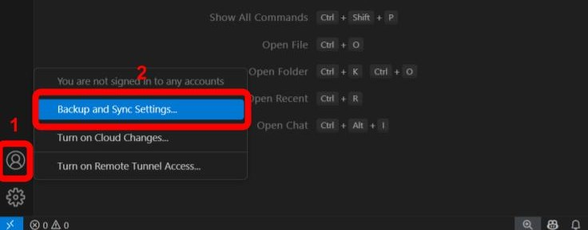
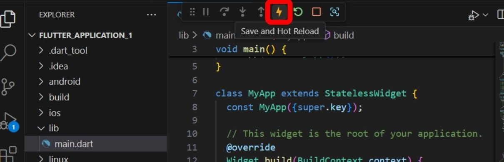
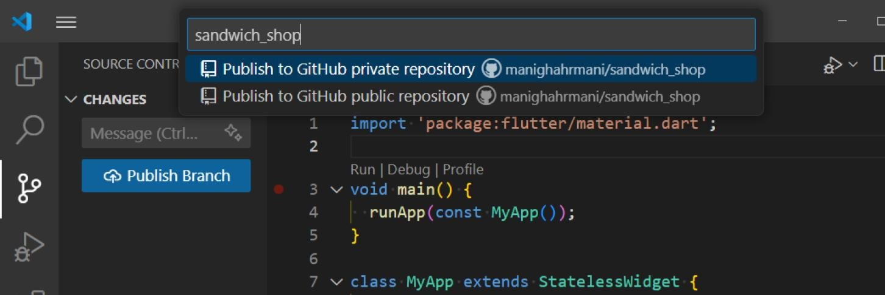

# Worksheet 1 — Introduction to Flutter

## What You Need To Know Beforehand

Ensure that you have already completed the following:

- [Worksheet 0 — Introduction to Dart, Git and GitHub](./worksheet-0.md).

## Getting Help

To get support with this worksheet, join the [Discord channel](https://portdotacdotuk-my.sharepoint.com/:b:/g/personal/mani_ghahremani_port_ac_uk/EbX583gvURRAhqsnhYqmbSEBwIFw6tXRyz_Br1GxIyE8dg) and ask your questions there. Otherwise, attend your timetabled session and ask a member of staff for help.

## Set Up Your Development Environment

We first need to ensure all the necessary tools are installed on your computer. You can use either the university computers or your personal Mac or Windows computer. Skip to the section that matches your operating system.

### University Computers

#### Logging in to AppsAnywhere

Use the shortcut on the desktop or head to AppsAnywhere using this link: [appsanywhere.port.ac.uk](https://appsanywhere.port.ac.uk/sso). Once you have logged in, you will see a dialogue shown below. First, tick the box for "Always allow appsanywhere.port.ac.uk to open links of this type in the associated app" and then click on the "Open AppsAnywhere Launcher" button.


#### Installing Git

In [AppsAnywhere](https://appsanywhere.port.ac.uk/sso), search for `Git` and click on launch. Do not select "GitHub Desktop".


To verify the installation, open the `Start Menu` by pressing the `Windows` key, type `Command Prompt` or `PowerShell`, and select it. Write the following command in the terminal and press Enter:

```bash
git --version
```

You should see a version number indicating that Git is installed successfully.

#### Installing the Flutter SDK

In [AppsAnywhere](https://appsanywhere.port.ac.uk/sso), search for `Flutter And Dart SDK` and click on launch.

To verify the installation, enter the following in `Command Prompt` or `PowerShell`:

```bash
flutter --doctor
```

This may take a while, but it should return a report of your Flutter installation status.


#### Installing Visual Studio Code

In [AppsAnywhere](https://appsanywhere.port.ac.uk/sso), search for `Visual Studio Code` and launch it. It can take a while to load, so be patient.

---

### Personal Windows Computer

#### Opening the Terminal

Open the `Start Menu` by pressing the `Windows` key, type `PowerShell`, and select `Run as Administrator`. You need administrator rights to install the package manager. If you don't have this permission, use [the university computers instead](#university-computers).

#### Installing the Chocolatey Package Manager

We will use a package manager called Chocolatey to easily install all the required tools. First, check if it's already installed by running `choco --version`. If you see a version number, you can skip to the next step.

If it's not installed, go to the [Chocolatey installation page](https://chocolatey.org/install) and follow the instructions. You should find a command similar to the one below:

```powershell
Set-ExecutionPolicy Bypass -Scope Process -Force; [System.Net.ServicePointManager]::SecurityProtocol = [System.Net.ServicePointManager]::SecurityProtocol -bor 3072; iex ((New-Object System.Net.WebClient).DownloadString('https://community.chocolatey.org/install.ps1'))
```

#### Installing Development Tools

With Chocolatey installed, you can now install Git, Visual Studio Code, and the Flutter SDK. Run the following commands one by one in your PowerShell terminal with administrator rights:

```powershell
choco install git -y
choco install vscode -y
choco install flutter -y
```

If you get an error about Dart being already installed, you can first remove it with the following command then reinstall Flutter with `choco install flutter -y`.

```
choco uninstall dart -y
```

Make sure to read any prompts carefully before closing the terminal. You may be asked to run additional commands to add Flutter to your system's PATH variable.

#### Verifying the Installation

Close your current terminal and open a new one, which doesn't need to be run as an administrator. Run the following to check your installations:

```powershell
flutter doctor
```

---

### Personal macOS Computer

#### Opening the Terminal

You can open the built-in Terminal app by pressing **⌘ + Space** to open Spotlight, typing `Terminal`, and pressing return.

#### Installing the Homebrew Package Manager

Homebrew is a package manager for macOS that simplifies installing software. To check if you have it installed, run `brew --version` in the terminal. If you see a version number, you can skip to the next step.

If it is missing, visit the [Homebrew website](https://brew.sh/) and copy the installation command provided on the homepage. Paste it into your terminal and press return to install Homebrew. The command will look similar to this:

```bash
/bin/bash -c "$(curl -fsSL https://raw.githubusercontent.com/Homebrew/install/HEAD/install.sh)"
```

#### Installing Development Tools

Once Homebrew is ready, you can install the necessary tools by running the following commands in your terminal:

```bash
brew install --cask visual-studio-code
brew install --cask flutter
```

If you get an error about Dart being already installed, you can first remove it with the following command then reinstall Flutter with `brew install --cask flutter`.

```bash
brew uninstall dart
```

Make sure to read any prompts carefully before closing the terminal. You may be asked to run additional commands to add Flutter to your system's PATH variable.

#### Verifying the Installation

Close your current terminal and open a new one. Run the following command to check your installations:

```bash
flutter doctor
```

## Your Flutter Application

Now that our environment is set up, we can create our first Flutter project.

#### Setting Up Visual Studio Code

To sync your VS Code settings, first open [GitHub](https://github.com/) in your browser and log in.

Back in VS Code, click the Account icon in the bottom left corner and select `Backup and Sync Settings`. This should automatically sync your settings with your GitHub account.



If this is your first time using VS Code, you'll need to install [the Flutter extension](https://marketplace.visualstudio.com/items?itemName=Dart-Code.flutter). Open the Extensions view by clicking the Extensions icon in the Activity Bar or by pressing **Ctrl + Shift + X** (Windows) or **⌘ + Shift + X** (macOS). In the search bar, type `Flutter` and install the official extension.


#### Creating a New Flutter Project

In VS Code, open the Command Palette using **Ctrl + Shift + P** (Windows) or **⌘ + Shift + P** (macOS). In the palette, type `Flutter: New Project` and press Enter.


Select `Application` when prompted for a template. You will then be asked to choose a project location and name. Make a note of the location you choose.

Choose a name for your project, such as `sandwich_shop`, and press Enter. VS Code will now create a new Flutter project and open it for you.

#### Understanding the Project Structure

You should see a new folder structure in the Explorer view on the left side of VS Code. You are encouraged to explore the files and folders, but the most important files for now are located in the `lib/` folder. This folder contains your Dart application code with the main entry point being `lib/main.dart`.

There is also `pubspec.yaml` in the root directory, which is a configuration file for managing your project's dependencies and assets.


You don't need to understand the code at this moment but below is a brief overview.

The default application is a simple counter app. The `lib/main.dart` file contains the entry point `void main() => runApp(const MyApp());`, which runs the root widget, `MyApp`. This `StatelessWidget` sets up the `MaterialApp` and defines the home screen, which is the `MyHomePage` widget. `MyHomePage` is a `StatefulWidget` because it manages the changing counter value. It contains the `_incrementCounter()` method, which uses `setState()` to rebuild the UI when the `_counter` variable changes.

#### Using AI

We will learn more about stateless and stateful widgets in later worksheets. This is just a brief overview to get you started. But for now, use the Copilot extension to explore the code.

Remember that Large Language Models (LLMs) like Copilot, ChatGPT, or Claude work best when you do all the following:

1. Start with a **specific goal** for what you want the AI to do (e.g., explain, fix an error, implement a feature)
2. Provide a **source to ground** the response so for example the AI does not make assumptions or use outdated information (e.g., Flutter or Dart's documentation)
3. Add **context** to make sure the response is appropriate and relevant (e.g., project structure, code snippets, the platform you're using)
4. Set **clear expectations** for the response (e.g., level and length of the explanation, inclusion of examples)
5. Refer to **previous prompts and responses** in your questions (e.g., ask follow-up questions or request clarifications)

As an example, select a piece of code that you'd like to learn more about with your mouse. Then use the Copilot extension (**Ctrl + I** on Windows or **⌘ + I** on macOS) to ask the AI questions like: "I am new to Flutter, what does the selected code do? Give me a brief and simple explanation".


Copilot should automatically add the relevant code context to your question. However if you're using an LLM on the web (e.g., ChatGPT or Claude), you may need to provide items 2 and 3 (source and context) manually.

#### Selecting a Target Device

At the bottom right of the VS Code window is the status bar. Click on the device name (it might say "No Device") to open the device selector. For now, choose a browser like Edge or Chrome.

Alternatively, you can open the Command Palette (**Ctrl + Shift + P** or **⌘ + Shift + P**) and type `Flutter: Select Device`. Then select your browser from the list.


#### Running the App

You can run the app in several ways, for example by pressing the F5 key, opening a new terminal and running `flutter run`, or clicking the "Run" button that appears above the `main` function in `lib/main.dart`.

You can also open the Command Palette (**Ctrl + Shift + P** or **⌘ + Shift + P**) and type `Terminal: Create New Terminal` to open a terminal, then run the following command:

```bash
flutter run
```

VS Code will build and run your application, which should open in a browser window. Click the `+` button to see the counter increase.

#### Using Hot Reload

Hot reload is a powerful feature that lets you see code changes instantly without restarting the app.

You can enable it by clicking the lightning bolt icon (⚡) at the top of VS Code while the app is running. If you are using the terminal, you can type `r` to trigger it.



As an example, while the app is running, enable hot reload and change the `colorSchemeSeed` property inside the `ThemeData` widget in `lib/main.dart` from `Colors.deepPurple` to `Colors.orange` and save the file. You should see the UI update in the browser instantly.

## Setting Up a GitHub Repository

Lastly, let's put our project on GitHub to track changes and back it up online.

#### Initialising the Repository

In the Activity Bar on the left, click the Source Control icon. Click on `Initialize Repository` to set up Git for your project.


Alternatively, you can run the following command in the terminal to initialize Git:

```bash
git init
```

#### Making the First Commit

You should now see all your project files listed in the Source Control panel. Hover over **Changes** and click the `+` icon to stage all files. Then, enter a commit message like `Initial commit` in the text box and click the **Commit** button to commit your changes.


Alternatively, you can run the following commands in the terminal:

```bash
git add .
git commit -m "Initial commit"
```

You might see a pop-up asking to stage all changes and commit them directly; you can click `Always` to skip this in the future.

The `Commit` button will now say `Publish Branch` or `Sync Changes`. Click this to push your local repository to GitHub. You may be asked to allow VS Code to log in to your GitHub account.


You can do this from the terminal as well by running:

```bash
git push -u origin main
```

Next, you will be asked to name your repository; enter `sandwich_shop`. You can choose to make it public, but for your coursework, you must make it **private**.



#### Verifying the Repository on GitHub

You can verify that the project was published by navigating to your GitHub account in a web browser. You should see the newly created `sandwich_shop` repository.


The link will look like `https://github.com/YOUR_USERNAME/sandwich_shop` where `YOUR_USERNAME` is your GitHub username.

#### Making Another Commit

Let's make another commit. In `lib/main.dart`, change the text in the `AppBar` widget from `Flutter Demo Home Page` to `My Sandwich Shop`. Save the file (**Ctrl + S** or **⌘ + S**) or better yet, enable auto-save by opening the Command Palette (**Ctrl + Shift + P** or **⌘ + Shift + P**) and typing `Auto Save`, then press Enter to select `Toggle Auto Save`.

Go back to the Source Control panel (use the Command Palette and enter `Focus on Source Control View` if you can't see it), stage the changes, and commit them with a message like `Change AppBar title`. Remember to always write meaningful commit messages that describe what changes you made. The commit message should ideally be written in the imperative mood, like `Add new feature` or `Fix bug`.

Before you click on commit, you can also click on the changed files below the `Changes` section to see the differences (diff) between the current version and the last committed version.


Once you have clicked on commit and then sync changes, you should be able to see the changes to the file in your GitHub repository.

## Exercises

Complete the exercises below and show your work to a member of staff present at your next practical for **a sign-off**.

1. You have already modified the title of the `AppBar` widget. This is different from the title of the app itself, which you can see in the browser tab. As a simple exercise, find out what determines the title of the app in the code and change it to something more appropriate, like "Sandwich Shop App". Remember to view the changes live with hot reload and to commit your changes to GitHub.

    ⚠️ **Show your running app with the updated browser tab title to a member of staff** for a sign-off.

2. The default app displays a counter. Your task is to change this by finding the `Column` widget inside the `_MyHomePageState` in your `lib/main.dart` file.

    First, remove one of the two `Text` widgets inside the column.

    Next, modify the remaining `Text` widget so that it displays a static welcome message, like "Welcome to my shop!" instead of the counter variable.

    Finally, you can give your message some style by using the `style` property on the `Text` widget, which accepts a `TextStyle`. Look at the [official documentation for the TextStyle class](https://api.flutter.dev/flutter/painting/TextStyle-class.html) to see how to change properties like `fontSize`, `color`, and `fontWeight` or use Copilot to help you with this. But make sure that you understand what you are doing, as this is a key part of the exercise.

    ⚠️ **Show your running app with the new welcome message to a member of staff** for a sign-off.

3. The `pubspec.yaml` file is the heart of your project's configuration, managing dependencies, fonts, and project metadata. Open this file and take a moment to read through it, using an LLM or the [official documentation on the pubspec file](https://dart.dev/tools/pub/pubspec) to understand each section.

    Your task is to modify the file to match the cleaned-up version below. This involves changing the project name and description, updating the Dart SDK environment constraint, and removing the comments to make the file more readable.

    ```yaml
    name: sandwich_shop
    description: "A Flutter project for a sandwich shop."
    publish_to: "none"

    version: 1.0.0+1

    environment:
      sdk: ">=2.17.0 <4.0.0"

    dependencies:
      flutter:
        sdk: flutter
      cupertino_icons: ^1.0.0

    dev_dependencies:
      flutter_test:
        sdk: flutter
      flutter_lints: ^2.0.0

    flutter:
      uses-material-design: true
    ```

    After saving your changes, you must synchronise the dependencies. While VS Code often does this automatically, you can run `flutter pub get` in the terminal to do it manually.

    ⚠️ **Show your updated `pubspec.yaml` file to a member of staff** for a sign-off.

4. Keeping your code tidy is crucial for readability and collaboration. Dart has a standard format that can be applied automatically.

    First, deliberately mess up the formatting in your `lib/main.dart` file. For example, add extra spaces or remove indentation for a few widgets.

    Next, right-click in the editor and select `Format Document`. You can also open the command palette with **Ctrl+Shift+P** (or **Cmd+Shift+P** on macOS) and type `Format Document` to find the command.
    Notice how the code snaps back to the correct style. You can also set this to happen automatically on save by enabling the `editor.formatOnSave` setting.

    For more details, refer to [the official documentation](https://docs.flutter.dev/tools/formatting) on code formatting.

    This task is **optional** and there's no need to show it to a member of staff for a sign-off.

5. The Flutter SDK can automatically fix many problems in your code. For example the LLMs that you may be using could generate deprecated code for you.

    To see how the SDK can fix your code for you, go to your `lib/main.dart` file and find the `Text` widget responsible for displaying the counter. The code for this widget looks like this:
  
    ```dart
    Text(
      '$_counter',
      style: Theme.of(context).textTheme.headlineMedium,
    ),
    ```

    Temporarily change the style from `headlineMedium` to the older, deprecated name `headline4`. After your change, the code should look like this:

    ```dart
    Text(
      '$_counter',
      style: Theme.of(context).textTheme.headline4,
    ),
    ```

    VS Code should highlight `headline4` as a problem. Hover over the it and use the `Quick Fix` option that appears. It will suggest replacing the deprecated style with its modern equivalent (`headlineMedium`). Apply the fix and then commit your changes.

    

    Learn more about this feature from [the official Flutter Fix documentation](https://docs.flutter.dev/tools/flutter-fix).

    This task is **optional** and there's no need to show it to a member of staff for a sign-off.

6. (Advanced) In the `MyHomePage` widget, add a new `FloatingActionButton` that resets the counter to `0`.

    As a hint, you can wrap the existing `FloatingActionButton` in a `Row` widget to add another button next to it.

    You will also need to create a new method, something like `_resetCounter()`, that sets the `_counter` to `0` inside a `setState()` call.

    This task is **optional** and there's no need to show it to a member of staff for a sign-off.

4. (Advanced) Running your app in a browser is great for quick development, but the ultimate goal is often a mobile app.

    For this task, follow the official documentation to set up your physical phone for development and run the app on it.

    You can find instructions to [set up an Android device](https://docs.flutter.dev/get-started/install/windows#android-setup) or an [iOS device](https://docs.flutter.dev/get-started/install/macos#deploy-to-ios-devices) on the Flutter website.

    This task is **optional** and there's no need to show it to a member of staff for a sign-off.