# Worksheet 2 — Stateless and Stateful Widgets

## Table of contents

- [What you need to know beforehand](#what-you-need-to-know-beforehand)
- [Getting help](#getting-help)
- [Getting started](#getting-started)
- [Import the Material Design library](#import-the-material-design-library)
  - [Clean the default code](#clean-the-default-code)
  - [Commit your changes (1)](#commit-your-changes-1)
- [Define the main app widget: App](#define-the-main-app-widget-app)
  - [Use the App widget](#use-the-app-widget)
  - [Commit your changes (2)](#commit-your-changes-2)
- [Define the UI inside App](#define-the-ui-inside-app)
  - [Redefine the build method](#redefine-the-build-method)
  - [Run the application](#run-the-application)
  - [Commit your changes (3)](#commit-your-changes-3)
- [Create the custom OrderItemDisplay widget](#create-the-custom-orderitemdisplay-widget)
  - [Define the OrderItemDisplay widget](#define-the-orderitemdisplay-widget)
  - [Commit your changes (4)](#commit-your-changes-4)
  - [Implement the build method of OrderItemDisplay](#implement-the-build-method-of-orderitemdisplay)
  - [Commit your changes (5)](#commit-your-changes-5)
- [Use OrderItemDisplay in App](#use-orderitemdisplay-in-app)
  - [Replace the placeholder in App to use OrderItemDisplay](#replace-the-placeholder-in-app-to-use-orderitemdisplay)
  - [Run the application again to see OrderItemDisplay in action](#run-the-application-again-to-see-orderitemdisplay-in-action)
  - [Commit your changes (6)](#commit-your-changes-6)
- [Inspecting the Scaffold with the Widget Inspector](#inspecting-the-scaffold-with-the-widget-inspector)
  - [Open the Widget Inspector](#open-the-widget-inspector)
  - [Read the widget tree of your app](#read-the-widget-tree-of-your-app)
  - [Experiment with the parts of the Scaffold](#experiment-with-the-parts-of-the-scaffold)
  - [Commit your changes (7)](#commit-your-changes-7)
- [Making the app interactive with Stateful widgets](#making-the-app-interactive-with-stateful-widgets)
  - [Stateless versus Stateful](#stateless-versus-stateful)
  - [Add the Add and Remove buttons](#add-the-add-and-remove-buttons)
  - [Commit your changes (8)](#commit-your-changes-8)
  - [Define the OrderScreen stateful widget](#define-the-orderscreen-stateful-widget)
  - [Commit your changes (9)](#commit-your-changes-9)
  - [Build the UI for OrderScreen](#build-the-ui-for-orderscreen)
  - [Use OrderScreen inside App](#use-orderscreen-inside-app)
  - [Commit your changes (10)](#commit-your-changes-10)
  - [Add and remove emojis with setState](#add-and-remove-emojis-with-setstate)
  - [Commit your changes (11)](#commit-your-changes-11)
- [Exercises](#exercises)

## What you need to know beforehand

Ensure that you have already completed [Worksheet 1 — Dart, Git, GitHub and Flutter](./worksheet-1.md).

## Getting help

To get support with this worksheet, follow the [Discord guide](https://portdotacdotuk-my.sharepoint.com/:p:/g/personal/mani_ghahremani_port_ac_uk/IQCMJP6IiR_bQoYUMdXJSRDYAWnajEALZYEXFZyrJkHS1QU) and ask your questions there. Otherwise, attend your timetabled session and ask a member of staff for help.

## Getting started

For this worksheet, you can start with the code from branch 1 of our [GitHub repository](https://github.com/manighahrmani/sandwich_shop/tree/1) which should be similar to what you'd have at the end of Worksheet 1. You can either clone the repository and checkout branch 1 by running the following in the terminal (the `checkout` command switches to the specified branch, in this case branch 1):

```bash
git clone https://github.com/manighahrmani/sandwich_shop.git
cd sandwich_shop
git checkout 1
```

Alternatively, you can continue with the Flutter project you created in Worksheet 1. You should already have a repository in your GitHub account for this project (e.g., `github.com/your-username/sandwich_shop`).

## Import the Material Design library

Open `lib/main.dart` and ensure that you have the correct `import` statement for Material Design components:

```dart
import 'package:flutter/material.dart';
```

The top of your file should look like this:


**Material Design** is a design system from Google. The `package:flutter/material.dart` library gives you access to its pre-built User Interface (UI) components, called **widgets**. We will use these widgets to build our user interface.

Use Copilot to explore this library further. For example, you can ask it: "What kind of widgets are available in the material.dart library? List a few examples and explain them briefly."

For completeness, below are some general categories of fundamental building blocks in Flutter:

- Structural elements like `Scaffold` (for page layout), `AppBar` (for the top application bar), and `Drawer` (for navigation menus).
- Buttons like `ElevatedButton`, `TextButton`, and `IconButton`.
- Informational widgets like `Text`, `Image`, and `Icon` (for displaying icons).
- Input widgets like `TextField` (for text entry) and `Checkbox` (for boolean input).
- Layout widgets like `Row`, `Column`, `Stack`, and `Card` that help you arrange other widgets.

### Clean the default code

Locate the `main()` function in `lib/main.dart`, which is the entry point of your app. You can do this with the "Go to Symbol" feature in VS Code by pressing **Ctrl + Shift + O** on Windows or **⌘ + Shift + O** on macOS and selecting `main`. Let's clear out the default `MyApp` class and other related classes from the app.

Comment out or remove this line for now. You can comment a line in VS Code by selecting it with your mouse and pressing **Ctrl + /** on Windows or **⌘ + /** on macOS. The (uncommented) code in your `lib/main.dart` file should now look like this:

```dart
import 'package:flutter/material.dart';

void main() {}
```

Make sure your file looks like this now:


### Commit your changes (1)

Now is a good time to commit your changes. In VS Code, go to the Source Control panel. You can open this from `View > Source Control`. Alternatively, you can open the Command Palette by pressing **Ctrl + Shift + P** on Windows or **⌘ + Shift + P** on macOS and enter `Source Control`, which will open the Source Control panel.
You should see `main.dart` listed under changes. Type a descriptive commit message, such as `Set Up the Project`, and click the `Commit` button, followed by `Sync Changes`.

Alternatively, open the terminal using **Ctrl + \`** on Windows or **⌘ + \`** on macOS and run these commands:

```bash
git add lib/main.dart
git commit -m "Set Up the Project"
git push
```

## Define the main app widget: App

We will now define the main widget for our application.

Add the following class definition to `lib/main.dart`, below the `main()` function, on a new line after the closing curly brace (`}`):

```dart
class App extends StatelessWidget {
  const App({super.key});

  @override
  Widget build(BuildContext context) {
    return Container();
  }
}
```

After you've added the `App` class, optionally fold the rest of the classes and ignore them as shown in this screenshot:


Hopefully you are familiar with the syntax (refer to the Dart worksheets in [Worksheet 1](./worksheet-1.md) for a refresher). We are defining a subclass of `StatelessWidget` class called `App`. `App` is going to be the stateless widget that serves as the main entry point for our application's UI.

If a class extends `StatelessWidget`, it means its state and properties can't change once it's built. All widgets must have a `build` method, which describes the widget's part of the user interface (what it should look like and how it should behave).

For now, the `build` method returns an empty `Container`, which is like a blank `div` tag in HTML. To understand this code better, select the entire class and ask Copilot the following questions by pressing **Ctrl + I** on Windows or **⌘ + I** on macOS:

- Explain what this `StatelessWidget` does.
- Ask it what the build does and why do we need it?
- What does the override keyword do?
- What about the super.key?

### Use the App widget

Next, update the `main()` function to run our new `App` widget:

```dart
void main() {
  runApp(const App());
}
```

Check that your `main()` function now looks like this:


The `runApp()` function takes our `App` widget and makes it the root of the widget tree, displaying it on the screen. If you run the app now, you will just see a blank screen.

### Commit your changes (2)

Commit your work with a meaningful message, such as `Define the Main App Widget: App`.

## Define the UI inside App

Let's give our `App` widget some structure and content.

### Redefine the build method

Modify the `build` method within the `App` class as follows:

```dart
@override
Widget build(BuildContext context) {
  return MaterialApp(
    title: 'Sandwich Shop App',
    home: Scaffold(
      appBar: AppBar(title: const Text('Sandwich Counter')),
      body: const Center(
        child: Text('Welcome to the Sandwich Shop!'),
      ),
    ),
  );
}
```

Your `App` widget should now look like this:


Here, we've created a "widget tree". `MaterialApp` is the root (parent), providing core app functionality. `Scaffold` provides the basic screen layout, including an `AppBar` (the top bar) and a `body`. The body contains a `Center` widget, which in turn holds our `Text` widget.

As before, for a deeper understanding of this structure, use Copilot to explain each widget's role.

### Run the application

Make sure you have a device selected (e.g., Chrome or Edge from the bottom status bar). You can also open the Command Palette by pressing **Ctrl + Shift + P** on Windows or **⌘ + Shift + P** on macOS and type "Flutter: Select Device" to choose a device.

With a device selected run the app by pressing **F5** (depending on your keyboard, you may have to press **Fn + F5**). You should see an application with an app bar titled "Sandwich Counter" and "Welcome to the Sandwich Shop\!" centred on the screen.


### Commit your changes (3)

Commit your work with a message like `Define the UI inside App`.

## Create the custom OrderItemDisplay widget

You can create your own reusable widgets by combining existing ones. We will create a custom widget to display a single sandwich order.

### Define the OrderItemDisplay widget

Add the definition for `OrderItemDisplay` in `lib/main.dart`, placing it below the `App` class:

```dart
class OrderItemDisplay extends StatelessWidget {
  final String itemType;
  final int quantity;

  OrderItemDisplay(this.quantity, this.itemType, {super.key});

  @override
  Widget build(BuildContext context) {
    return Text('This is a placeholder for OrderItemDisplay');
  }
}
```

You may need to auto-fix any warnings by hovering over the squiggly lines and clicking on the lightbulb icon or pressing **Ctrl + .** on Windows or **⌘ + .** on macOS. See the screenshot below:


This `StatelessWidget` has two `final` instance variables, `itemType` and `quantity`, which are set by its constructor (whenever an instance of `OrderItemDisplay` is created, the value for `itemType` and `quantity` must be provided but `key` is optional hence it is written in curly braces). `final` means they cannot be changed after the widget is created.

Running the app at this stage won't show any visual changes yet, as we haven't actually used the `OrderItemDisplay` widget in our `App`.

### Commit your changes (4)

Commit your new widget with the message `Define OrderItemDisplay custom widget`.

### Implement the build method of OrderItemDisplay

Now, let's update the `build` method of `OrderItemDisplay` to show the sandwich type and quantity with emojis. We want it to display something like: "5 Footlong sandwich(es): 🥪🥪🥪🥪🥪". (Hopefully you are familiar with the syntax used for string interpolation in Dart, if not, refer to the worksheet on Strings in Dart linked in [Worksheet 1](./worksheet-1.md).)

Update the `build` method inside your `OrderItemDisplay` so it looks like this:

```dart
@override
Widget build(BuildContext context) {
  return Text('$quantity $itemType sandwich(es): ${'🥪' * quantity}');
}
```

### Commit your changes (5)

Commit this update with a message like `Implement dynamic text in OrderItemDisplay`.

## Use OrderItemDisplay in App

Now we can use our new custom widget inside the main `App`.

### Replace the placeholder in App to use OrderItemDisplay

Find the `build` method of the `App` class with the shortcut (**Ctrl + Shift + F** on Windows or **⌘ + Shift + F** on macOS) as shown below:


Inside there, locate the `Center` widget within the `Scaffold`'s `body`. Select the `Center` widget's child (the `Text` widget) as shown below:


Then replace the placeholder `Text` widget in the `body` of the `Scaffold` with an instance of our new `OrderItemDisplay` widget. Your code must match the one shown below:

```dart
@override
Widget build(BuildContext context) {
  return MaterialApp(
    title: 'Sandwich Shop App',
    home: Scaffold(
      appBar: AppBar(title: const Text('Sandwich Counter')),
      body: const Center(
        child: OrderItemDisplay(5, 'Footlong'),
      ),
    ),
  );
}
```

### Run the application again to see OrderItemDisplay in action

Run the app. You should now see "5 Footlong sandwich(es): 🥪🥪🥪🥪🥪" displayed in the centre of the screen.


### Commit your changes (6)

Commit your final changes for this section with the message `Use OrderItemDisplay in App`.

At this stage, your code should look like our code as shown on [the GitHub repository](https://github.com/manighahrmani/sandwich_shop/blob/2/lib/main.dart).

## Inspecting the Scaffold with the Widget Inspector

The Widget Inspector is a tool that comes with the Flutter SDK and lets you examine the widget tree of your running app, see the properties of each widget, and understand how your UI is structured.

### Open the Widget Inspector

Make sure your app is still running (if not, press **F5** to start it). Open the Command Palette with **Ctrl + Shift + P** on Windows or **⌘ + Shift + P** on macOS, type `Flutter: Open DevTools` and press **Enter**. It will then ask you where you want to open DevTools. Choose either your web browser or inside VS Code (in its Widget Inspector page) as shown below:

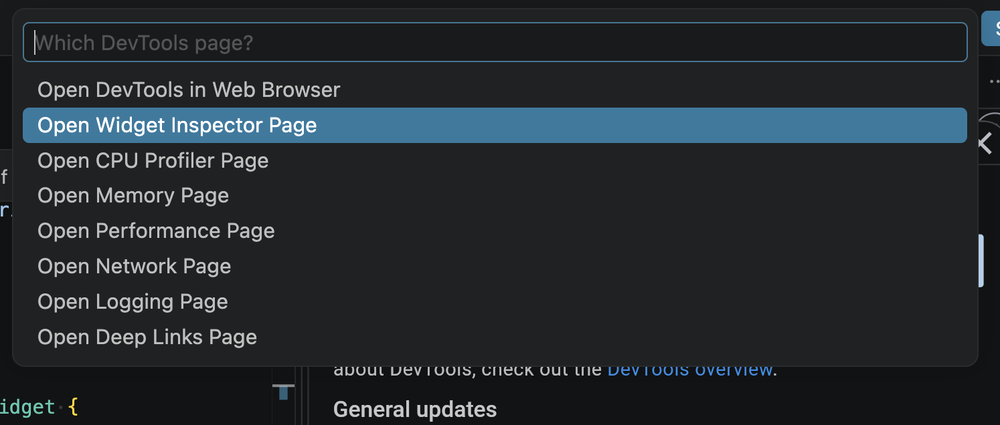

For a short walkthrough of this tool, watch this [YouTube video on the Widget Inspector](https://www.youtube.com/watch?v=_EYk-E29edo&t=172s) and skim its [official documentation](https://docs.flutter.dev/tools/devtools/inspector). Make sure you watch the whole video and try using the Widget Inspector yourself on your running app.


### Read the widget tree of your app

In the Widget Inspector, enable "Select Widget Mode" (the mouse pointer icon at the top of the inspector) and then click on the sandwich emojis in your running app. The inspector highlights that widget and expands the tree to show it. You should see something similar to this:

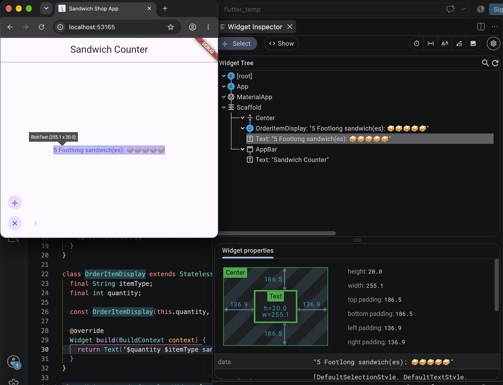

Take a moment to trace the tree from the top down. At the root you have the `MaterialApp` which provides the overall app, then the `Scaffold` which provides the page layout, then the `AppBar` holding the `Text` title "Sandwich Counter", then the `Center` which centres its child, and finally your own `OrderItemDisplay` which contains a `Text`. Click on each of these in turn and watch the browser running the app to see how each widget is placed on the screen. When a widget is selected, the panels on the right show its size, padding and constraints. Notice how the `Center` takes up the whole body but its child only takes the space it needs.

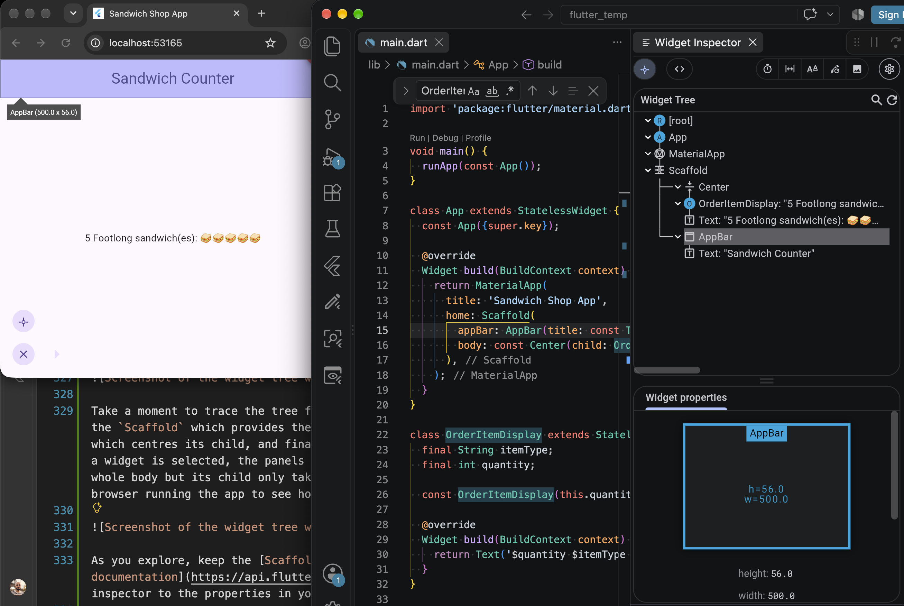

As you explore, keep the [Scaffold documentation](https://api.flutter.dev/flutter/material/Scaffold-class.html) and the [AppBar documentation](https://api.flutter.dev/flutter/material/AppBar-class.html) open so you can connect what you see in the inspector to the properties in your code.

### Experiment with the parts of the Scaffold

Now let's change a few parts of the `Scaffold` and use the inspector to see the effect. Keep hot reload enabled (the lightning bolt icon while the app runs, or press **r** in the terminal) so your changes appear instantly. Make one change at a time in your `App` widget's `build` method.

Start with the `AppBar`. Change its title from `'Sandwich Counter'` to something else, such as `'My Sandwich Shop'`, and give it a background colour at the same time:

```dart
appBar: AppBar(
  title: const Text('My Sandwich Shop'),
  backgroundColor: Colors.orange,
),
```

Save the file (**Ctrl + S** on Windows or **⌘ + S** on macOS), then select the `AppBar` in the inspector and confirm the new title and colour appear in the running app and in the tree.

Both `title` and `backgroundColor` are properties of the `AppBar` widget. You can view all the properties of a widget in VS Code by hovering your mouse over its name in the code. In the popup below, scroll down to find `Color? backgroundColor`, which shows that `backgroundColor` accepts a nullable `Color` value:

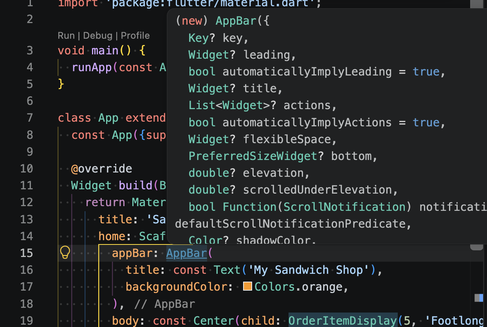

Next, add a `floatingActionButton` to the `Scaffold`. Put your cursor just after the `body` property, add a comma, then start typing `floating`. VS Code's IntelliSense (the completion dropdown that lists types, methods and properties) should suggest `floatingActionButton`. Select it and press **Enter** to add it to your code:

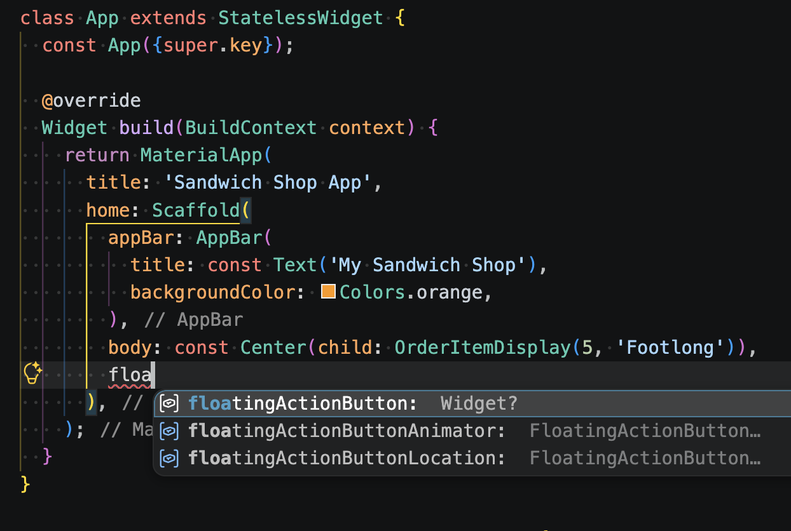

There are two kinds of suggestion in VS Code. IntelliSense is the dropdown you just used: it reads your code and offers real types, methods and properties, and it needs a language extension (the Dart and Flutter extensions provide it here). Ghost text is the greyed-out AI suggestion that predicts whole lines as you type; it comes from GitHub Copilot, which needs you signed into VS Code with a Copilot subscription (free through GitHub Education). For now, please use IntelliSense only.

As the value of the `floatingActionButton` property, start typing `Floating` and select `FloatingActionButton` from the suggestions. Leave its `onPressed` property as an empty function (`() {}`). The `onPressed` property specifies the callback function that runs when the button is pressed, and `() {}` is a function that takes no parameters (`()`) and has an empty body (`{}`), so pressing the button does nothing for now. Your code should look like this:

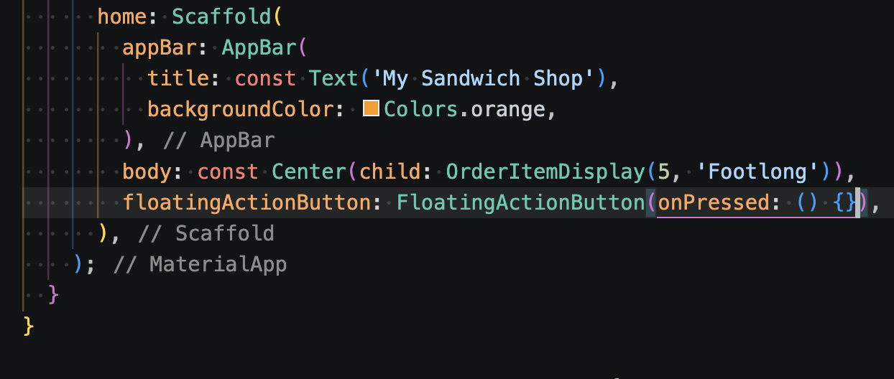

Lastly, add a `child` property inside the `FloatingActionButton`. Type `Icons` followed by a dot (`.`) to see the list of available icons, then find the `add` icon and press **Enter** to select it:

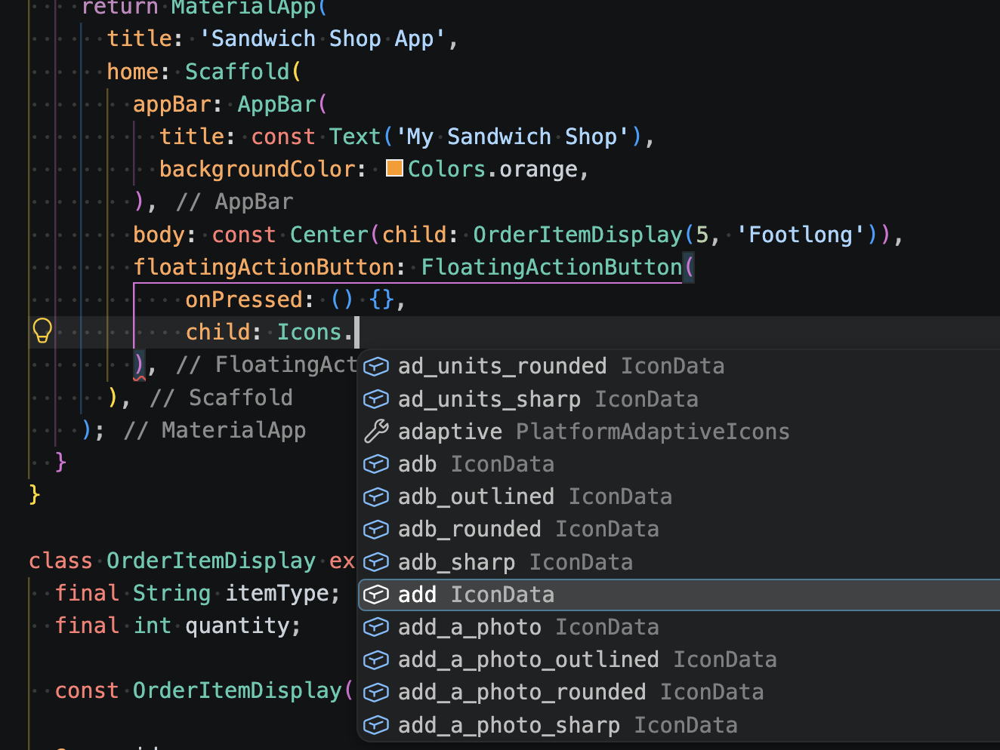

Your completed `Scaffold` should now include the `floatingActionButton`:

```dart
body: const Center(
  child: OrderItemDisplay(5, 'Footlong'),
),
floatingActionButton: FloatingActionButton(
  onPressed: () {},
  child: const Icon(Icons.add),
),
```

A round button now appears in the bottom right corner. Select it in the inspector and notice that it sits in the tree separately from the `body`.

As a final test, temporarily delete the `Center` so the `body` is just the `OrderItemDisplay`, and observe how the text jumps to the top left of the body:

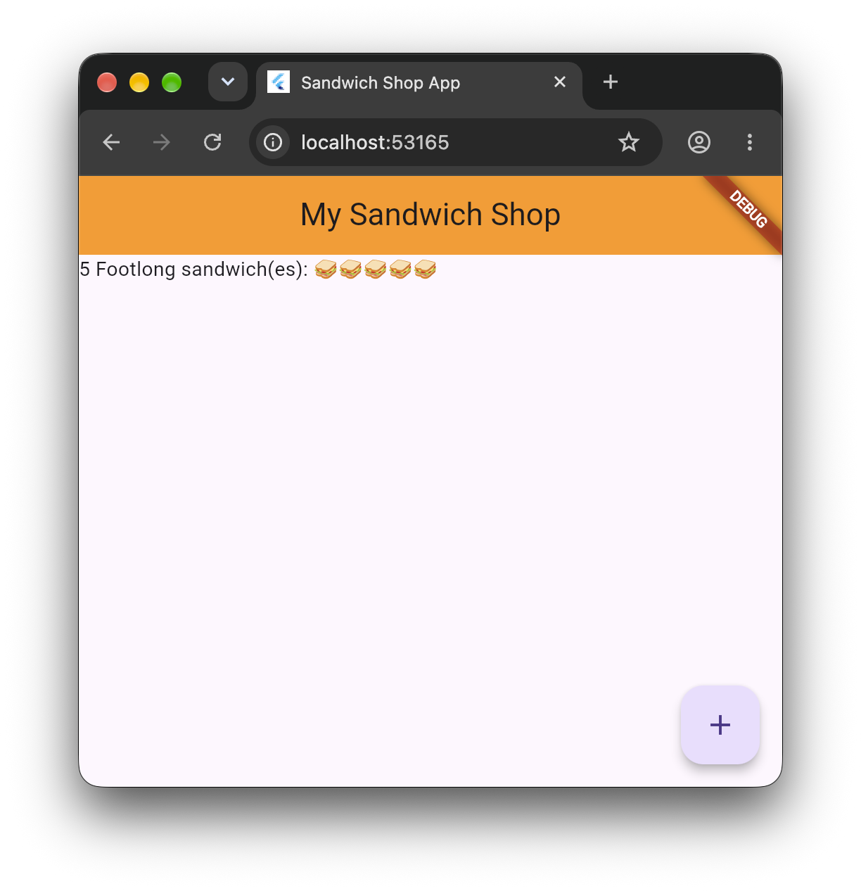

Put the `Center` back afterwards (you can undo with **Ctrl + Z** on Windows or **⌘ + Z** on macOS). Once you are done, return your `App` widget to the version at the end of [Use OrderItemDisplay in App](#use-orderitemdisplay-in-app), with a plain `AppBar`, a `Center` and no floating action button.

### Commit your changes (7)

Commit any tidy-up with a message like `Restore Center after inspecting the Scaffold`.

## Making the app interactive with Stateful widgets

So far every widget we have written has been a `StatelessWidget`. That is fine for a fixed display, but a real app needs to respond to the user. In this section we will let the user add and remove sandwiches by pressing buttons, so the number of 🥪 emojis on the screen goes up and down.

### Stateless versus Stateful

State is simply data that can change while the app is running. A `StatelessWidget` is immutable, which means that once it is built its properties cannot change. It is like a photograph: a snapshot of the user interface at one moment. Our `OrderItemDisplay` is stateless because it only ever shows the values passed into its constructor. A `StatefulWidget`, on the other hand, can hold data that changes over time and rebuilds itself to show the new data.

The kind of state we use here is called ephemeral state, which is data that lives inside a single widget, such as the current number of sandwiches in the order. In a later worksheet we will meet app state, which is shared across many widgets, such as the login information of a user.

If you would like a short explanation before coding, read the [StatelessWidget documentation](https://api.flutter.dev/flutter/widgets/StatelessWidget-class.html) and the [StatefulWidget documentation](https://api.flutter.dev/flutter/widgets/StatefulWidget-class.html), and watch the Flutter team's short videos on [StatelessWidget](https://youtu.be/wE7khGHVkYY) and [StatefulWidget](https://youtu.be/AqCMFXEmf3w). Optionally, check out Flutter's [guide to adding interactivity](https://docs.flutter.dev/ui/interactivity).

<!-- TODO done till here -->

### Add the Add and Remove buttons

Let's add two buttons below the sandwich display. Jump to your `App` widget in `main.dart` (use **Ctrl + Shift + O** on Windows or **⌘ + Shift + O** on macOS, then search for `App`). Select the current content of the `body` property of the `Scaffold` (it should be set to `Center(child: OrderItemDisplay(...))`).

Delete it and start typing `Column`, press enter to select a `Column` widget from the IntelliSense dropdown (the completion list that shows types, methods and properties). Inside the brackets, type `main` and select `mainAxisAlignment` from the dropdown, as shown in the image below:

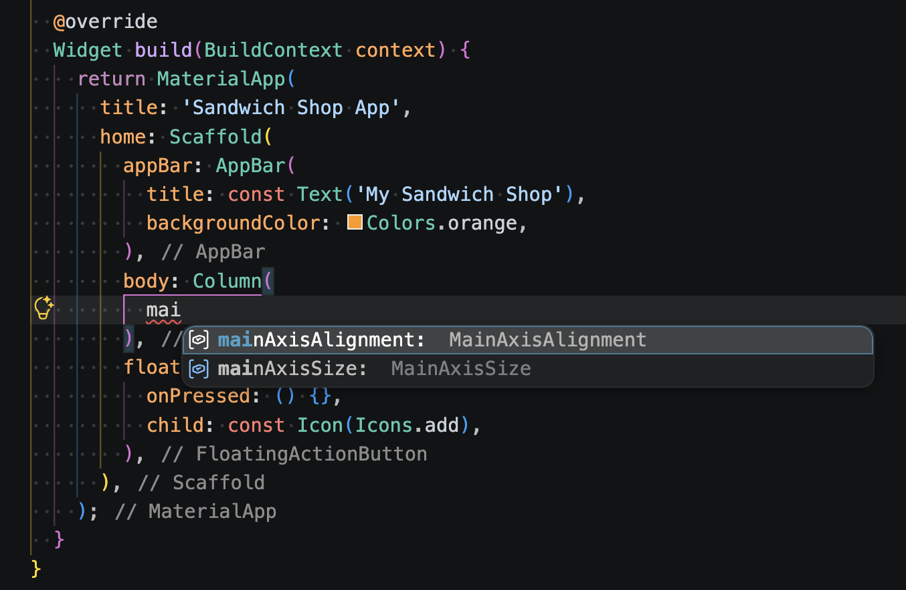

This property, used in `Row` and `Column` widgets, determines how the children are aligned along the main axis. In a `Column`, the main axis runs vertically, and in a `Row`, it runs horizontally. The values of `mainAxisAlignment` are set to `MainAxisAlignment` constants, such as `MainAxisAlignment.start`, `MainAxisAlignment.center`, and `MainAxisAlignment.end`. Set it to `MainAxisAlignment.center` as shown in the image below:

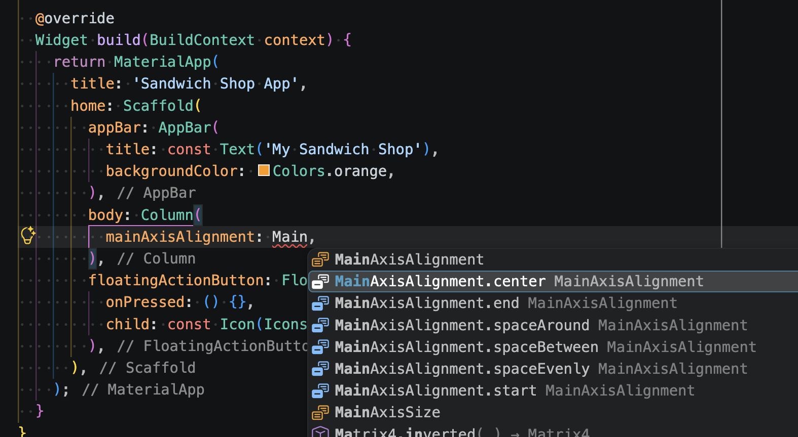

You should get comfortable with IntelliSense and always select what you need from the dropdown instead of typing it out, as it helps you write code quickly. Next, add a `children` property to the `Column`. Inside its square brackets (`[]`), place two children: an instance of `OrderItemDisplay` followed by a `Row` widget. The children are items in a list, so separate them with a comma.

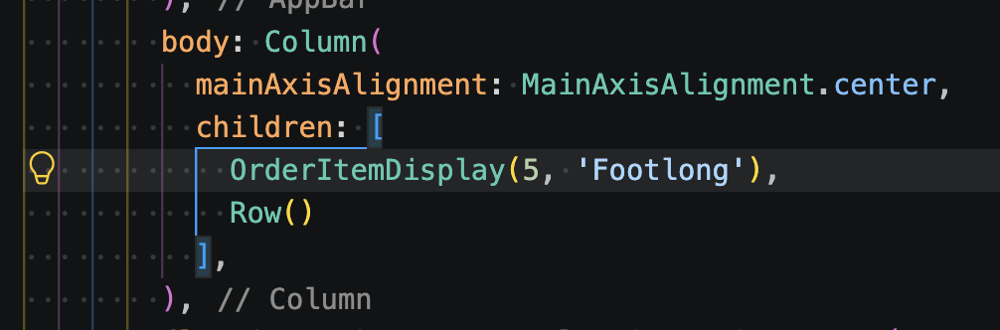

Inside the `Row`, add another list of `children` (`[]`) to hold the buttons. Each button is an instance of `ElevatedButton`, and they should be separated by a comma. Your code should look like this:

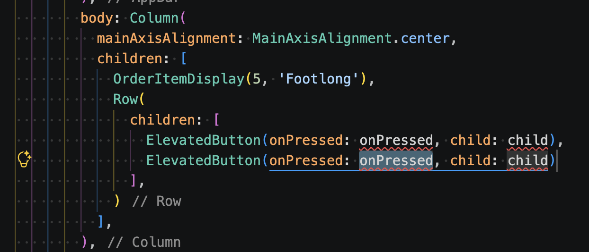

An `ElevatedButton` typically contains a `Text` widget for its label. We want two of them, "Add" and "Remove". Each also takes an `onPressed` callback that handles user interactions; for now we simply print a message to the terminal when the button is pressed. Update your code so it looks like this:

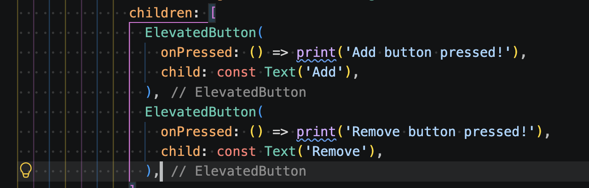

Ignore the warning about calling `print` in production code for now. Your completed `body` should look like this:

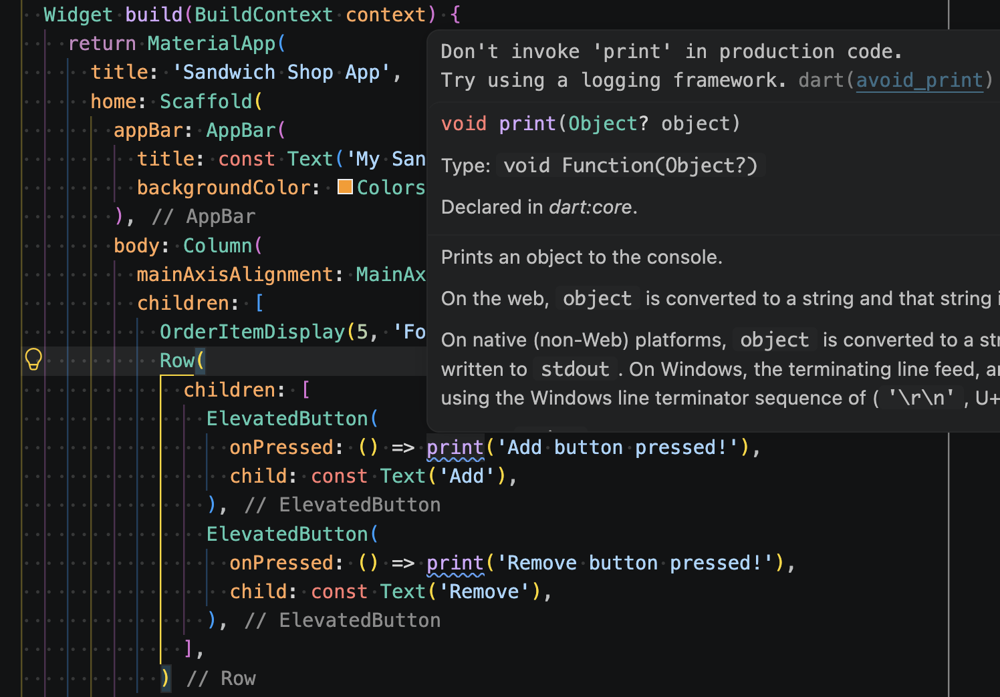

```dart
body: Center(
  child: Column(
    mainAxisAlignment: MainAxisAlignment.center,
    children: [
      const OrderItemDisplay(5, 'Footlong'),
      Row(
        mainAxisAlignment: MainAxisAlignment.center,
        children: [
          ElevatedButton(
            onPressed: () => print('Add button pressed!'),
            child: const Text('Add'),
          ),
          ElevatedButton(
            onPressed: () => print('Remove button pressed!'),
            child: const Text('Remove'),
          ),
        ],
      ),
    ],
  ),
),
```

To fix any indentation, open the Command Palette and run `Format Document`, or run `Preferences: Open Settings (UI)` and enable "format on save" so this happens automatically.

The important property of an [`ElevatedButton`](https://api.flutter.dev/flutter/material/ElevatedButton-class.html) is `onPressed`. It takes a function that runs when the button is tapped, which is called an event handler or a callback. Our callbacks are arrow functions that print a message to the terminal rather than changing the UI. Run the app with `flutter run` and click the buttons; the messages should appear in the terminal.

The two buttons currently sit right next to each other. To add a gap between them, place a `SizedBox` with a fixed width between the two `ElevatedButton` widgets in the `Row`:

```dart
ElevatedButton(
  onPressed: () => print('Add button pressed!'),
  child: const Text('Add'),
),
const SizedBox(width: 16),
ElevatedButton(
  onPressed: () => print('Remove button pressed!'),
  child: const Text('Remove'),
),
```

A `SizedBox` is an empty box of a fixed size, so it is a simple way to space widgets apart. Try changing the width to see the gap grow and shrink. You can remove this `SizedBox` again afterwards, as the rest of the worksheet does not depend on it.

### Commit your changes (8)

Commit your work with a message like `Add Add and Remove buttons`.

### Define the OrderScreen stateful widget

The quantity in `OrderItemDisplay(5, 'Footlong')` is hardcoded, so it can never change. To make it interactive we need a widget that can hold a changing value. That is what a `StatefulWidget` is for.

Use the fold buttons to fold `App` and `OrderItemDisplay`. Put your cursor between them and type `class`. Select the boilerplate for a new class and replace its name `ClassName` with `OrderScreen`.

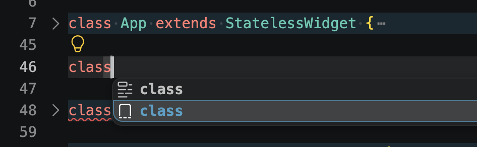

After the name of the class (`OrderScreen`), add the `extends StatefulWidget` part to indicate that this is a subclass of the `StatefulWidget` class (Simply put, we want to say that `OrderScreen` is a widget that will have mutable state).

Next, write a `maxQuantity` instance variable for the `OrderScreen` widget. This variable, which should be an int, will hold the maximum quantity of the order item that can be selected. It should be marked as `final` because it will not change after the widget is created.

Write a constructor for the `OrderScreen` widget too that takes an optional `maxQuantity` parameter (inside curly braces `{}`). Give this parameter a default value of 10 (`{this.maxQuantity = 10}`). Constructors for widgets also need an optional parameter `super.key` to pass the key to the parent class (you don't need to worry about this for now).

Your code should look like this:

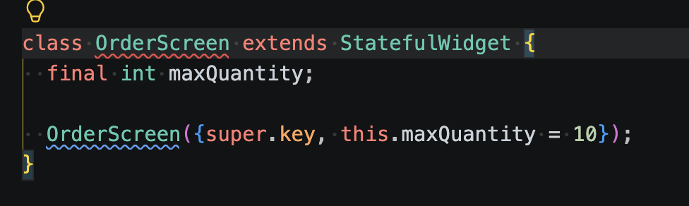

Fix the blue squiggly lines (info warnings) by adding the `const` keyword. The red squiggly lines (errors) indicate that every `StatefulWidget` must have a `createState` method. Feel free to click on the Explain button to have Copilot explain the error for you:

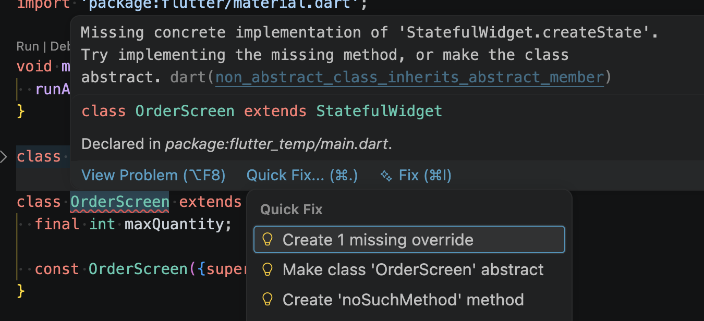

Hover your mouse over the error to see the suggested fix (or use **Ctrl + .** on Windows or **⌘ + .** on macOS to apply it). Your code should look like this now:

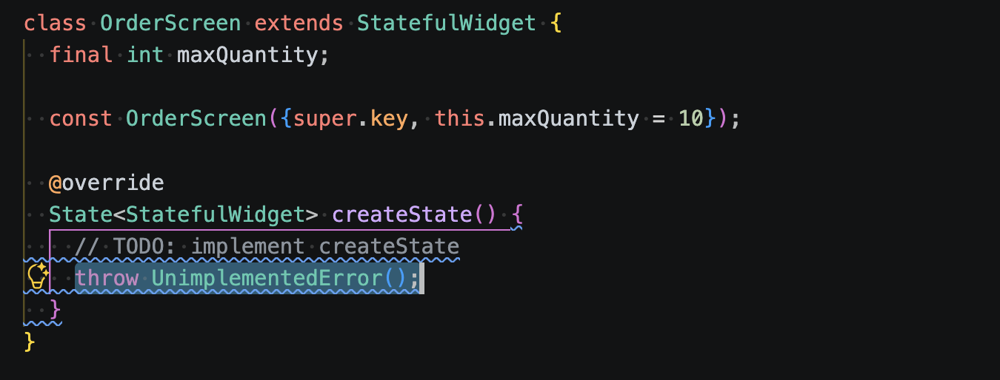

Every `StatefulWidget` must implement the `createState` method that returns a `State` object. It is basically a way to tell Flutter which state class is associated with this widget. And yes, we need a separate `State` class.

So put your mouse outside of the curly braces of the `OrderScreen` class and type `class`. Call it `_OrderScreenState` (this is a private state class, hence the `_` prefix) and make it extend `State<OrderScreen>`. Add a private integer instance variable called `_quantity` (again, the `_` indicates that it is private member and should not be accessed directly from outside the class). Our `_quantity` variable will be in there to hold the current quantity of the order item. Your code should look like this:

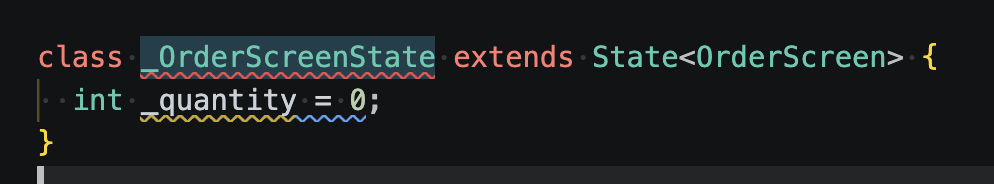

You should see an error indicating that the build method is missing in the `_OrderScreenState` class. This is expected because every `State` class must implement the `build` method to describe how to display the widget. Use the Quick Fix options to generate the `build` method, so your code should look like this:

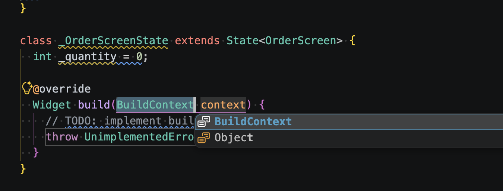

Remove the to do comment and the `throw UnimplementedError();` line from the `createState` method of `OrderScreen` and replace it with `return _OrderScreenState();` (we want to return an instance of the state class). And remove the `throw UnimplementedError();` line from the `build` method of `_OrderScreenState` as well and replace it with a `Placeholder` widget (or your actual UI later). This is what your code should look like now:

```dart
class OrderScreen extends StatefulWidget {
  final int maxQuantity;

  const OrderScreen({super.key, this.maxQuantity = 10});

  @override
  State<OrderScreen> createState() {
    return _OrderScreenState();
  }
}

class _OrderScreenState extends State<OrderScreen> {
  int _quantity = 0;

  @override
  Widget build(BuildContext context) {
    return const Placeholder();
  }
}
```

You may see a warning that `_quantity` is unused or could be `final`. Ignore it for now.

This looks unusual because we have two classes for one widget, but this is how Flutter separates the immutable configuration from the mutable state. The `OrderScreen` class is the `StatefulWidget` and holds the configuration that does not change, such as `maxQuantity`, and it has a `createState()` method. The `_OrderScreenState` class is the `State` and holds the data that does change (`_quantity`) along with the `build` method. The underscore in `_OrderScreenState` and `_quantity` makes them private to the file.

To understand this structure, select it in your editor and ask Copilot (**Ctrl + I** on Windows or **⌘ + I** on macOS) questions such as what the difference is between a `StatefulWidget` and a `State` object, why the `build` method lives inside the `State` class rather than the `StatefulWidget` class, and what the underscore prefix on `_OrderScreenState` and `_quantity` means in Dart.

### Commit your changes (9)

Commit your work with a message like `Define OrderScreen stateful widget`.

### Build the UI for OrderScreen

Now let's move the UI into `_OrderScreenState`. Replace the `Placeholder()` in its `build` method with the `Scaffold` we built earlier (copy and paste the code inside the `build` method of the `App` widget), the code is shown below for completeness. This should look familiar:

```dart
@override
Widget build(BuildContext context) {
  return Scaffold(
    appBar: AppBar(
      title: const Text('Sandwich Counter'),
    ),
    body: Center(
      child: Column(
        mainAxisAlignment: MainAxisAlignment.center,
        children: <Widget>[
          OrderItemDisplay(
            _quantity,
            'Footlong',
          ),
          Row(
            mainAxisAlignment: MainAxisAlignment.center,
            children: [
              ElevatedButton(
                onPressed: () => print('Add button pressed!'),
                child: const Text('Add'),
              ),
              ElevatedButton(
                onPressed: () => print('Remove button pressed!'),
                child: const Text('Remove'),
              ),
            ],
          ),
        ],
      ),
    ),
  );
}
```

Your code should look like this now:

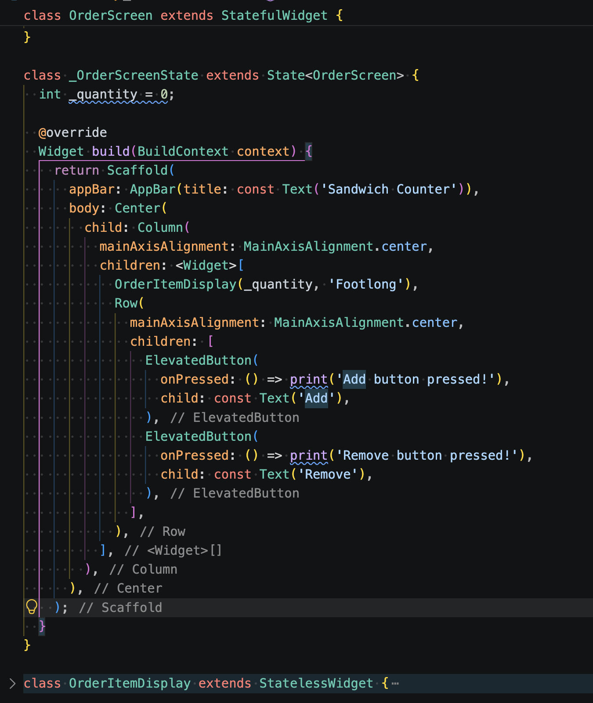

Notice that we now pass `_quantity` (which starts at `0`) into `OrderItemDisplay` instead of the hardcoded `5`. The `State` object can read its own variables directly.

### Use OrderScreen inside App

Update the `App` widget to use `OrderScreen` as its `home`. In VS Code, you can click on the opening round bracket of the `Scaffold` in the `App` widget to select the whole widget and see where it ends (see the screenshot below, all of this needs to be replaced with `OrderScreen(maxQuantity: 5)`.

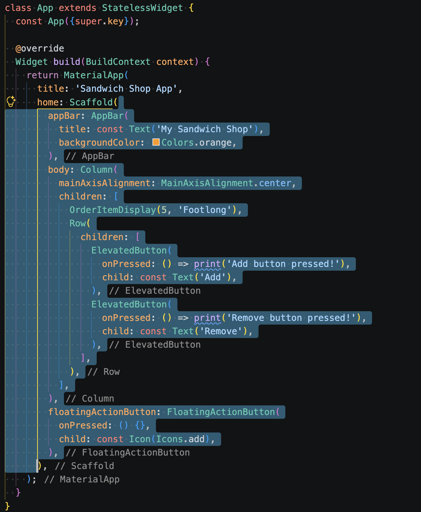

Your `App` widget should now look like this:

```dart
class App extends StatelessWidget {
  const App({super.key});

  @override
  Widget build(BuildContext context) {
    return const MaterialApp(
      title: 'Sandwich Shop App',
      home: OrderScreen(maxQuantity: 5),
    );
  }
}
```

`maxQuantity` is an optional named parameter with a default of `10`, so we could also write `OrderScreen()`. Here we set it to `5`.

Run the app. You should see "0 Footlong sandwich(es):" with no emojis yet, and two buttons that print to the terminal but do not change the display. That is the problem we fix next. This is what your app should look like now:

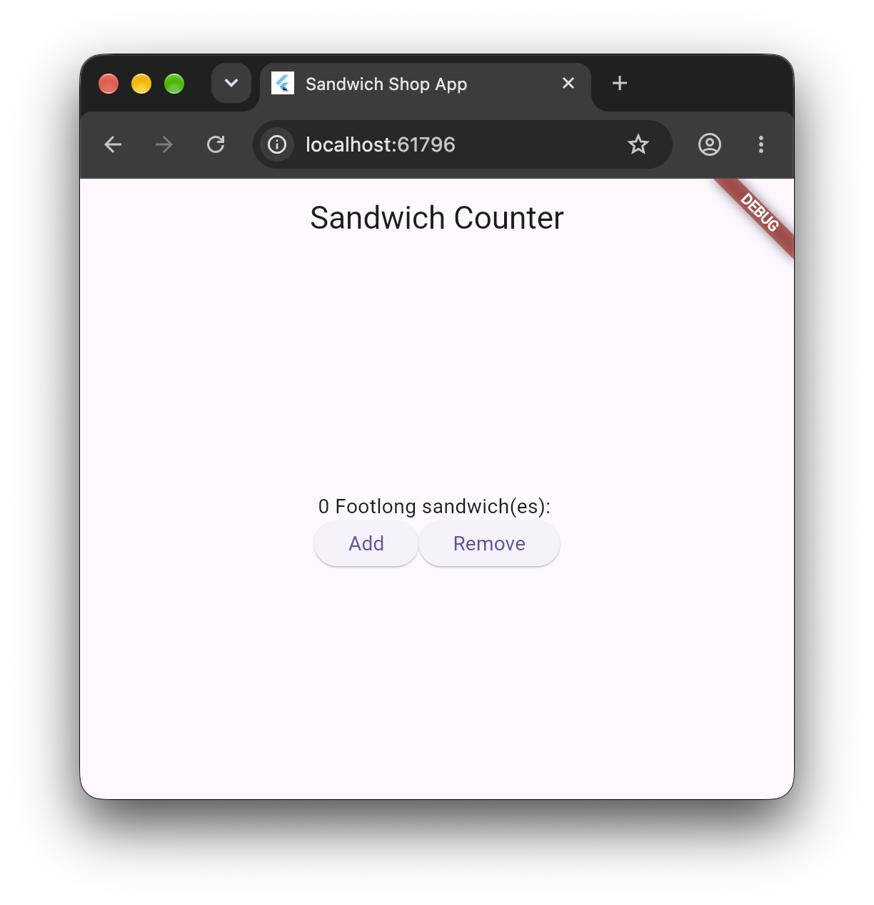

### Commit your changes (10)

Commit your work with a message like `Use OrderScreen in App`.

### Add and remove emojis with setState

The last step is to make the buttons actually change `_quantity`. Put your cursor inside the curly braces of the `_OrderScreenState` class, you may want to fold the `build` method to make it easier to see. Type in `fun` and VS Code will suggest `function` snippets and the boilerplate for a method will appear as shown below:

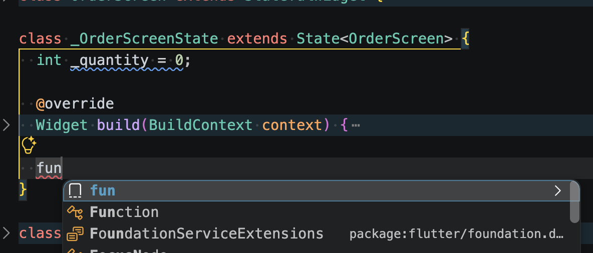

Change `name` to `_increaseQuantity` for the first method and make a second method called `_decreaseQuantity` right below it. Remove the `params` from both methods as we don't want our methods to take any arguments. Keep `void` as it is (our methods will not return any value). Then put your cursor inside the curly braces of `increaseQuantity` and write `if` to start an if-statement as show below:

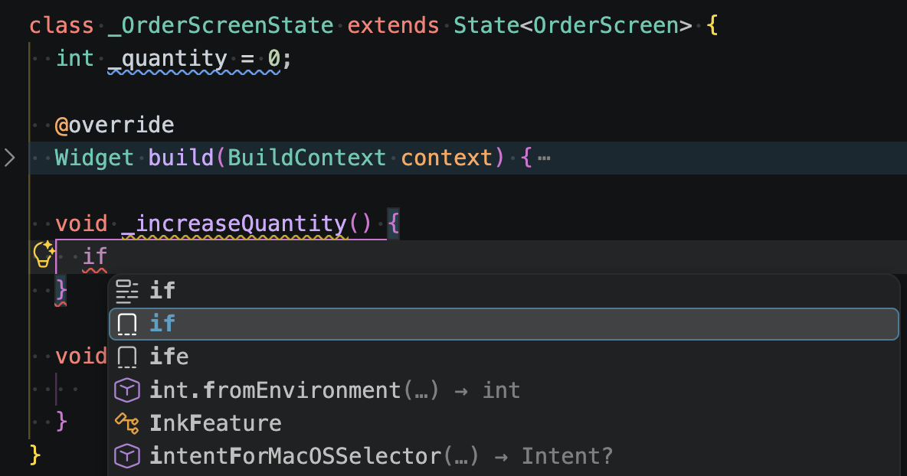

Update the code so that you check that `_quantity` is less than `widget.maxQuantity` in `_increaseQuantity` and greater than `0` in `_decreaseQuantity`. If these conditions are met, call `setState` method of the `_OrderScreenState` class to update the UI. Update the code so it matches what is shown below:

```dart
void _increaseQuantity() {
  if (_quantity < widget.maxQuantity) {
    setState(() => _quantity++);
  }
}

void _decreaseQuantity() {
  if (_quantity > 0) {
    setState(() => _quantity--);
  }
}
```

There are two things to notice here. The first is `widget.maxQuantity`, which lets the `State` read the `maxQuantity` from its `OrderScreen`. The `State` reaches its widget through the built-in `widget` property (see the [State.widget documentation](https://api.flutter.dev/flutter/widgets/State/widget.html)). To verify this, hold **Ctrl** on Windows or **⌘** on macOS and click on `maxQuantity` in the if-statement of `_increaseQuantity` to jump to its declaration in the `OrderScreen` class:

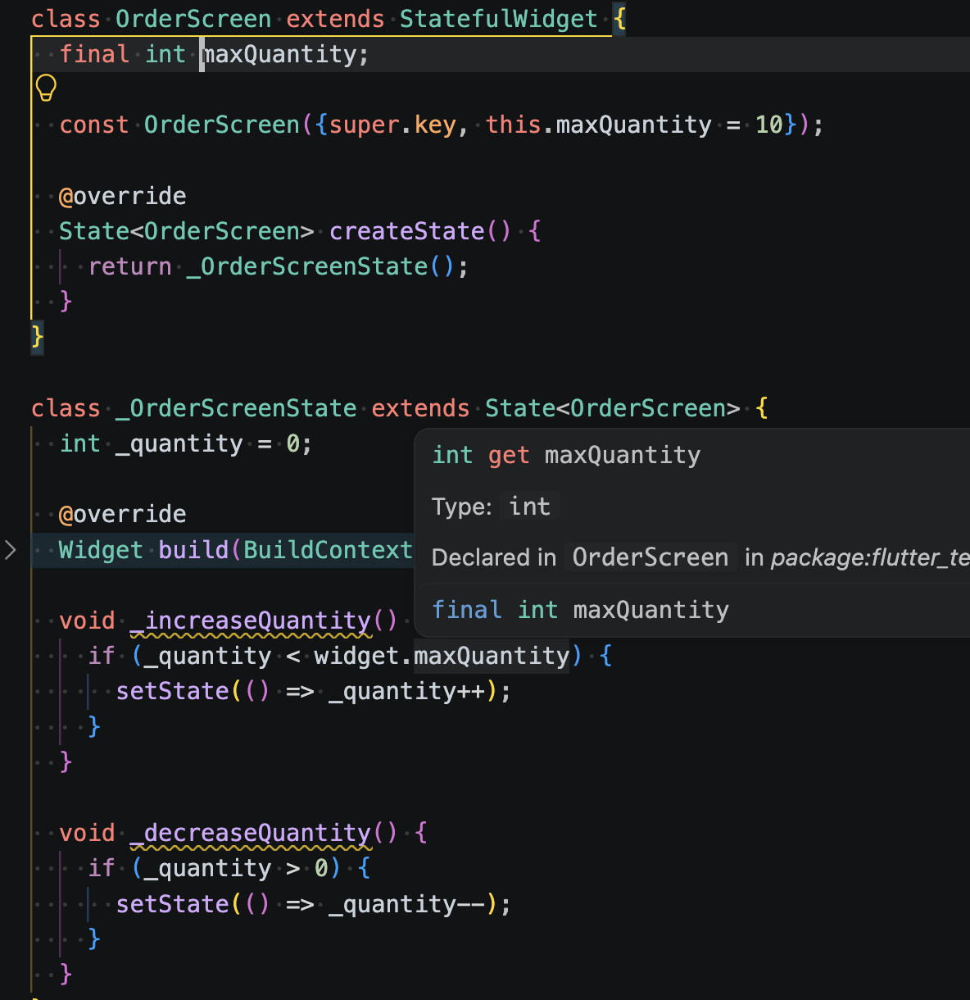

The second, and the most important, is `setState()`. You call it to tell Flutter that a value has changed, and Flutter then runs `build()` again and redraws the UI with the new `_quantity`. If you wrote `_quantity++` without wrapping it in `setState()`, the number would change in memory but the screen would not update.

Now connect the buttons to these methods. Replace the two `onPressed` callbacks in the `build` method of `_OrderScreenState` so they call the new functions instead of printing:

```dart
ElevatedButton(
  onPressed: _increaseQuantity,
  child: const Text('Add'),
),
ElevatedButton(
  onPressed: _decreaseQuantity,
  child: const Text('Remove'),
),
```

Run the app and try it. It starts at "0 Footlong sandwich(es):" with no emojis. Each time you press Add the count goes up and a 🥪 appears, and each time you press Remove the count goes down and a 🥪 disappears, stopping at 0. If you keep pressing Add past 5 nothing happens, because we set `maxQuantity` to 5.

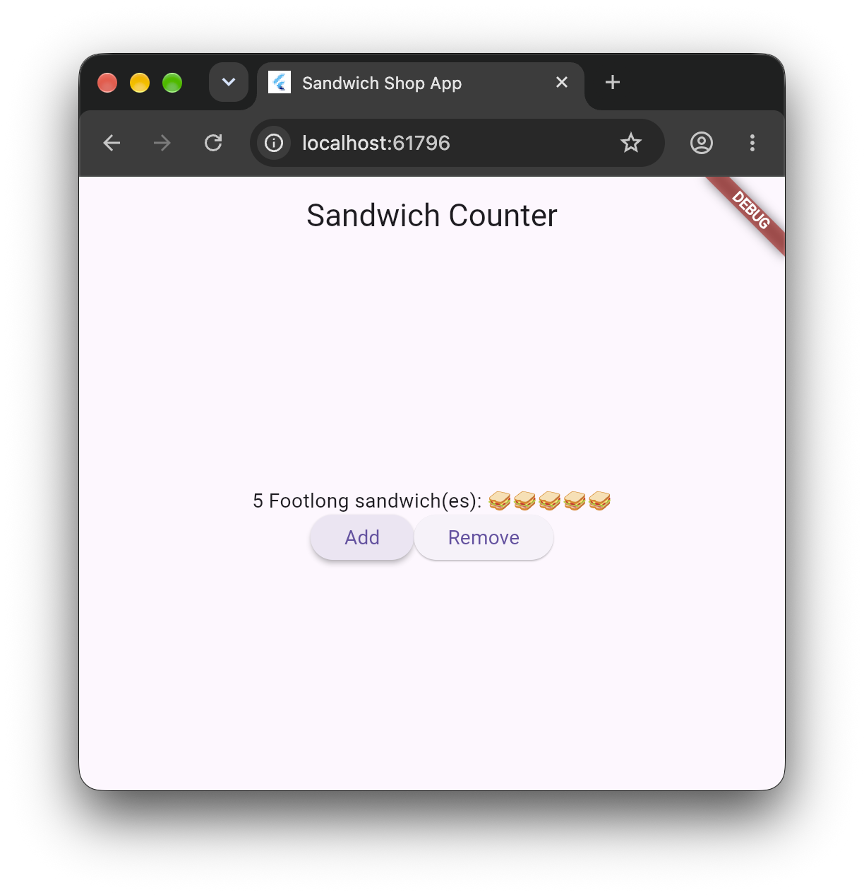

### Commit your changes (11)

Commit your final changes with a message like `Add interactivity with setState`.

## Exercises

As in Worksheet 1, these exercises apply to your Southsea Cinema coursework and, together with the Worksheet 1 exercises, prepare you for Demo 1 (by Friday 2 October 2026). See the [Southsea Cinema coursework brief](https://portdotacdotuk-my.sharepoint.com/:w:/g/personal/mani_ghahremani_port_ac_uk/IQDtIJB3bM7gQ4p03eLUngyyAd7JuhjhHuNA1l0H-qCy3Jw). Commit after each exercise. You must demonstrate your work for a sign-off during your own timetabled practical session.

The fork of the `southsea_cinema` repo that you have already made (in Worksheet 1) has a `lib/views` folder. This folder contains two pages. `home_view.dart` is the home page shown when the app starts, and `movie_listing.dart` is the movie listing page you will build.

When the app runs, you reach the listing page from the home page through the navigation drawer (the menu icon in the app bar). We will cover navigation and multiple pages properly in a later worksheet, so for now you only need to work on the listing page.

The `movie_listing.dart` page should look like this:

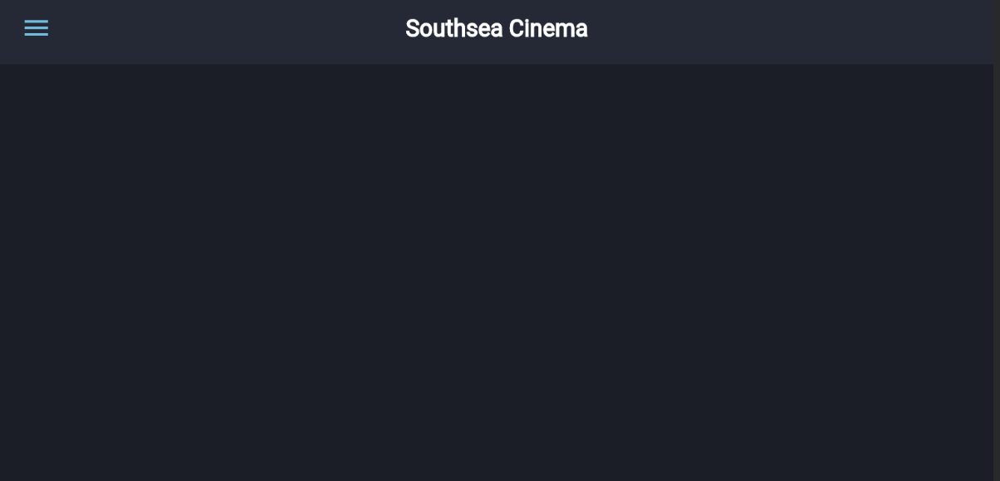

You can reach this page from the navigation drawer, by opening the menu in the app bar and choosing "Movie Listing":

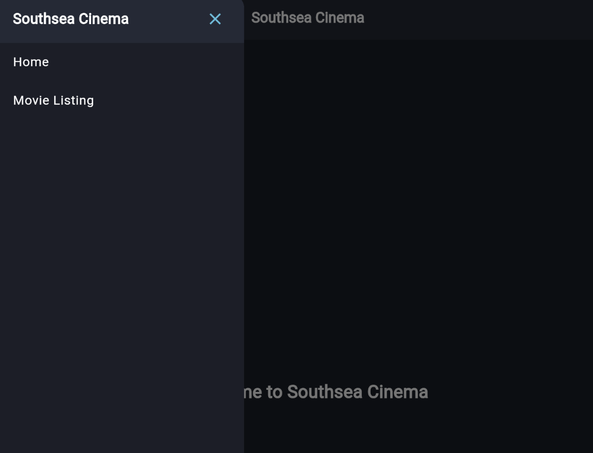

Your task is to update `movie_listing.dart` to show a single film. Use this [example listing](https://southseacinema.savoysystems.co.uk/SouthseaCinema.dll/TSelectItems.waSelectItemsPrompt.TcsWebMenuItem_687.TcsWebTab_688.TcsProgramme_26436) as a reference point:

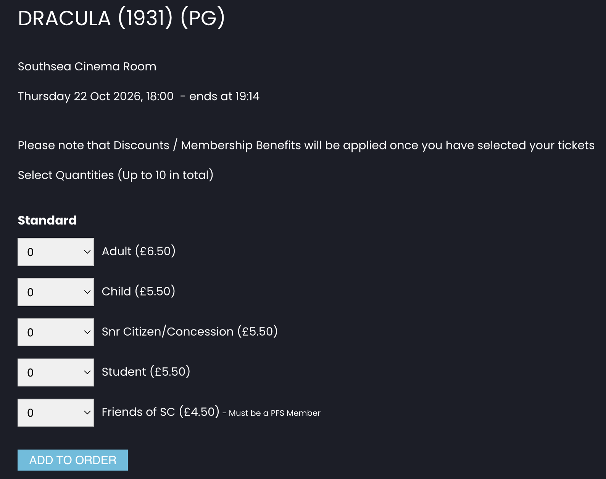

The exercises below help you prepare for Demo 1. In short, you need to build the same kind of page. Replace Dracula with your own favourite film. Give it a title, runtime, age rating, and other descriptive text. You need to also have a ticket quantity dropdown and a booking button. You need to run your app on a phone-sized view, as you did in Worksheet 1.

Be sure to make a separate commit for each exercise below, and commit more often than that if you can. Small, frequent commits with clear messages are part of the quality mark at your demo.

1. Add the film title and a short description as `Text` widgets, wrapped in a `Container` widget. A `Container` holds a single child and can give it a size, a colour, a border and more.

    As an example, in your sandwich shop app you could wrap the `Row` of buttons in a `Container` with its own colour:

    ```dart
    Container(
      color: Colors.red,
      child: Row(
        mainAxisAlignment: MainAxisAlignment.center,
        children: [
          ElevatedButton(
            onPressed: _increaseQuantity,
            child: const Text('Add'),
          ),
          ElevatedButton(
            onPressed: _decreaseQuantity,
            child: const Text('Remove'),
          ),
        ],
      ),
    ),
    ```

    The [widget fundamentals tutorial](https://docs.flutter.dev/learn/pathway/tutorial/widget-fundamentals) has a nice walkthrough on `Container`, `BoxDecoration` (for borders and background colours) and passing a `child`. Complete it before attempting this exercise. You may optionally also check out the [Container documentation](https://api.flutter.dev/flutter/widgets/Container-class.html).

2. Arrange the title, the description and the rest of the widgets you will add later in the next exercises using `Column` and `Row` widgets

    For more information, check out the [layout tutorial on the Flutter website](https://docs.flutter.dev/learn/pathway/tutorial/layout) which explains how to position children in a row and a column.

3. Let the user choose how many tickets they want with a single `DropdownMenu`, offering quantities up to 5. You should try to match the screenshot shown above.

    Store the selected value in state and update it inside `setState`, just as the sandwich counter did. To see how a `DropdownMenu` works, try this example in your sandwich shop app first. Here each entry is a sandwich type, and the value behind it is that item's price, so selecting an entry sets `_totalPrice`:

    ```dart
    DropdownMenu<int>(
      initialSelection: 10,
      onSelected: (int? value) {
        if (value != null) {
          setState(() {
            _totalPrice = value;
          });
        }
      },
      dropdownMenuEntries: [
        DropdownMenuEntry(value: 10, label: 'Footlong'),
        DropdownMenuEntry(value: 6, label: 'Six-inch'),
        DropdownMenuEntry(value: 4, label: 'Nachos'),
      ],
    ),
    ```

    The type in `onSelected: (int? value)` is `int?`, not `int`. The `?` means the value can be an integer or `null` (nothing selected yet), which is why we check `if (value != null)` before using it. If you are unsure about nullable types, see the section on data types in the [Dart software and resources guide](https://portdotacdotuk-my.sharepoint.com/:w:/g/personal/mani_ghahremani_port_ac_uk/IQAeCWXLehKuTou1gTpjrNKRAcCHcRGxPJSinskA7x1opXg?e=lfIK0S).

    The [DropdownMenu documentation](https://api.flutter.dev/flutter/material/DropdownMenu-class.html) has more details and examples on the widget.

4. Add an "Add to order" button that gives the user feedback when pressed. There is no basket yet, so it only needs to show some visual feedback (for example, state how many tickets were added to the order).

5. (Advanced) With all the pieces in place, update the `movie_listing.dart` page so that it resembles the screenshot above and the home page of the provided template. Reuse the colours and text styles from `lib/constants.dart` the same way `home_view.dart` does. The [text and typography documentation](https://docs.flutter.dev/ui/design/text) covers styling text.

6. (Advanced) Make your page adapt to the width of the window. A `LayoutBuilder` gives you the available width, so you can show a different layout on narrow and wide windows. For example, in your sandwich shop app you could show the buttons in a `Row` on wide windows and a `Column` on narrow ones:

    ```dart
    LayoutBuilder(
      builder: (context, constraints) {
        if (constraints.maxWidth > 600) {
          return Row(
            mainAxisAlignment: MainAxisAlignment.center,
            children: [
              ElevatedButton(
                onPressed: _increaseQuantity,
                child: const Text('Add'),
              ),
              ElevatedButton(
                onPressed: _decreaseQuantity,
                child: const Text('Remove'),
              ),
            ],
          );
        } else {
          return Column(
            children: [
              ElevatedButton(
                onPressed: _increaseQuantity,
                child: const Text('Add'),
              ),
              ElevatedButton(
                onPressed: _decreaseQuantity,
                child: const Text('Remove'),
              ),
            ],
          );
        }
      },
    ),
    ```

    The [adaptive layout tutorial](https://docs.flutter.dev/learn/pathway/tutorial/adaptive-layout) walks through this approach with `LayoutBuilder`. Resize the browser window to see the layout change.
