# Worksheet 2 — Stateless widgets

## Table of contents

- [What you need to know beforehand](#what-you-need-to-know-beforehand)
- [Getting help](#getting-help)
- [Getting started](#getting-started)
- [Import the Material Design library](#import-the-material-design-library)
  - [Clean the default code](#clean-the-default-code)
  - [Commit your changes (1)](#commit-your-changes-1)
- [Define the main app widget: App](#define-the-main-app-widget-app)
  - [Use the App widget](#use-the-app-widget)
  - [Commit your changes (2)](#commit-your-changes-2)
- [Define the UI inside App](#define-the-ui-inside-app)
  - [Redefine the build method](#redefine-the-build-method)
  - [Run the application](#run-the-application)
  - [Commit your changes (3)](#commit-your-changes-3)
- [Create the custom OrderItemDisplay widget](#create-the-custom-orderitemdisplay-widget)
  - [Define the OrderItemDisplay widget](#define-the-orderitemdisplay-widget)
  - [Commit your changes (4)](#commit-your-changes-4)
  - [Implement the build method of OrderItemDisplay](#implement-the-build-method-of-orderitemdisplay)
  - [Commit your changes (5)](#commit-your-changes-5)
- [Use OrderItemDisplay in App](#use-orderitemdisplay-in-app)
  - [Replace the placeholder in App](#replace-the-placeholder-in-app)
  - [Run the application again](#run-the-application-again)
  - [Commit your changes (6)](#commit-your-changes-6)
- [Exercises](#exercises)

## What you need to know beforehand

Ensure that you have already completed [Worksheet 1 — Dart, Git, GitHub and Flutter](./worksheet-1.md).

## Getting help

To get support with this worksheet, follow the [Discord guide](https://portdotacdotuk-my.sharepoint.com/:p:/g/personal/mani_ghahremani_port_ac_uk/IQCMJP6IiR_bQoYUMdXJSRDYAWnajEALZYEXFZyrJkHS1QU) and ask your questions there. Otherwise, attend your timetabled session and ask a member of staff for help.

## Getting started

For this worksheet, you can start with the code from branch 1 of our [GitHub repository](https://github.com/manighahrmani/sandwich_shop/tree/1) which should be similar to what you'd have at the end of Worksheet 1. You can either clone the repository and checkout branch 1 by running the following in the terminal (the `checkout` command switches to the specified branch, in this case branch 1):

```bash
git clone https://github.com/manighahrmani/sandwich_shop.git
cd sandwich_shop
git checkout 1
```

Alternatively, you can continue with the Flutter project you created in Worksheet 1. You should already have a repository in your GitHub account for this project (e.g., `github.com/your-username/sandwich_shop`).

## Import the Material Design library

Open `lib/main.dart` and ensure that you have the correct `import` statement for Material Design components:

```dart
import 'package:flutter/material.dart';
```

The top of your file should look like this:

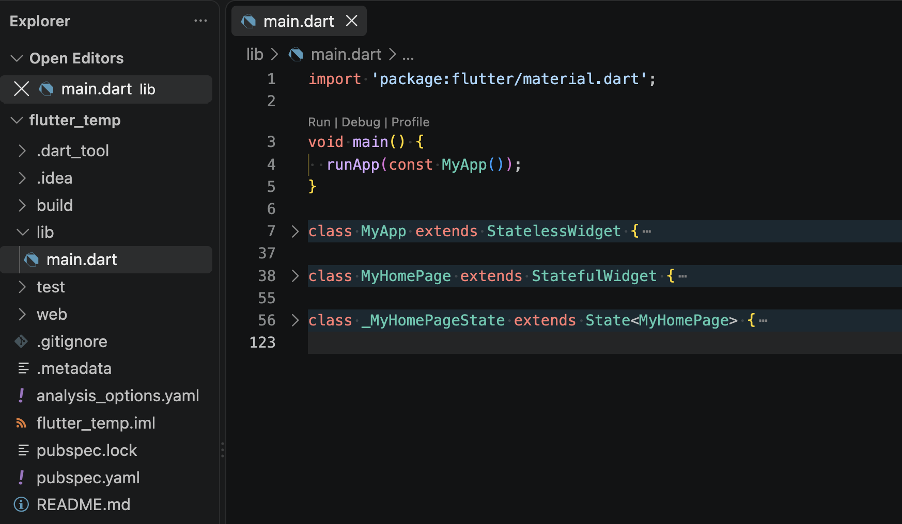

**Material Design** is a design system from Google. The `package:flutter/material.dart` library gives you access to its pre-built User Interface (UI) components, called **widgets**. We will use these widgets to build our user interface.

Use Copilot to explore this library further. For example, you can ask it: "What kind of widgets are available in the material.dart library? List a few examples and explain them briefly."

For completeness, below are some general categories of fundamental building blocks in Flutter:

- Structural elements like `Scaffold` (for page layout), `AppBar` (for the top application bar), and `Drawer` (for navigation menus).
- Buttons like `ElevatedButton`, `TextButton`, and `IconButton`.
- Informational widgets like `Text`, `Image`, and `Icon` (for displaying icons).
- Input widgets like `TextField` (for text entry) and `Checkbox` (for boolean input).
- Layout widgets like `Row`, `Column`, `Stack`, and `Card` that help you arrange other widgets.

### Clean the default code

Locate the `main()` function in `lib/main.dart`, which is the entry point of your app. You can do this with the "Go to Symbol" feature in VS Code by pressing **Ctrl + Shift + O** on Windows or **⌘ + Shift + O** on macOS and selecting `main`. Let's clear out the default `MyApp` class and other related classes from the app.

Comment out or remove this line for now. You can comment a line in VS Code by selecting it with your mouse and pressing **Ctrl + /** on Windows or **⌘ + /** on macOS. The (uncommented) code in your `lib/main.dart` file should now look like this:

```dart
import 'package:flutter/material.dart';

void main() {}
```

Make sure your file looks like this now:

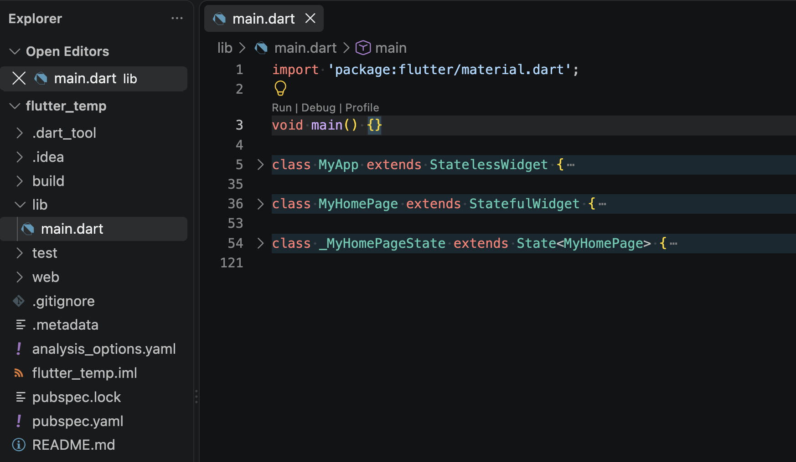

### Commit your changes (1)

Now is a good time to commit your changes. In VS Code, go to the Source Control panel. You can open this from `View > Source Control`. Alternatively, you can open the Command Palette by pressing **Ctrl + Shift + P** on Windows or **⌘ + Shift + P** on macOS and enter `Source Control`, which will open the Source Control panel.
You should see `main.dart` listed under changes. Type a descriptive commit message, such as `Set Up the Project`, and click the `Commit` button, followed by `Sync Changes`.

Alternatively, open the terminal using **Ctrl + \`** on Windows or **⌘ + \`** on macOS and run these commands:

```bash
git add lib/main.dart
git commit -m "Set Up the Project"
git push
```

## Define the main app widget: App

We will now define the main widget for our application.

Add the following class definition to `lib/main.dart`, below the `main()` function, on a new line after the closing curly brace (`}`):

```dart
class App extends StatelessWidget {
  const App({super.key});

  @override
  Widget build(BuildContext context) {
    return Container();
  }
}
```

After you've added the `App` class, optionally fold the rest of the classes and ignore them as shown in this screenshot:

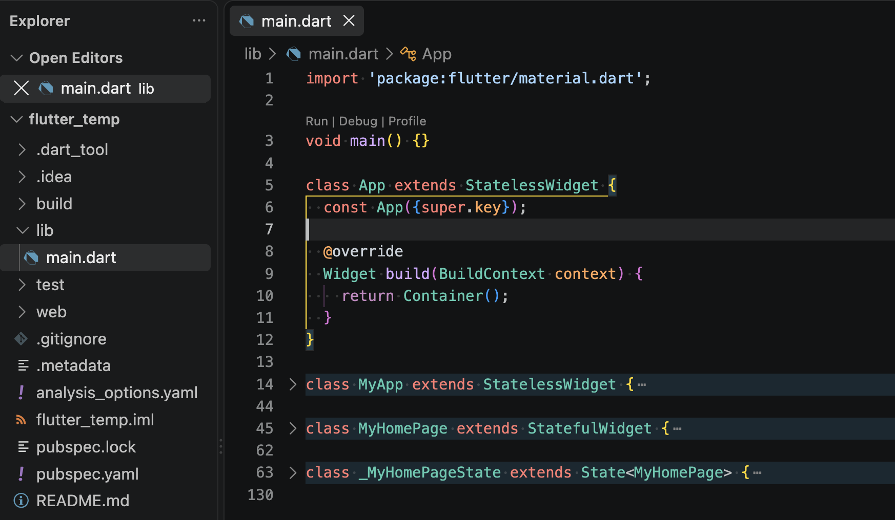

Hopefully you are familiar with the syntax (refer to the Dart worksheets in [Worksheet 1](./worksheet-1.md) for a refresher). We are defining a subclass of `StatelessWidget` class called `App`. `App` is going to be the stateless widget that serves as the main entry point for our application's UI.

If a class extends `StatelessWidget`, it means its state and properties can't change once it's built. All widgets must have a `build` method, which describes the widget's part of the user interface (what it should look like and how it should behave).

For now, the `build` method returns an empty `Container`, which is like a blank `div` tag in HTML. To understand this code better, select the entire class and ask Copilot the following questions by pressing **Ctrl + I** on Windows or **⌘ + I** on macOS:

- Explain what this `StatelessWidget` does.
- Ask it what the build does and why do we need it?
- What does the override keyword do?
- What about the super.key?

### Use the App widget

Next, update the `main()` function to run our new `App` widget:

```dart
void main() {
  runApp(const App());
}
```

Check that your `main()` function now looks like this:

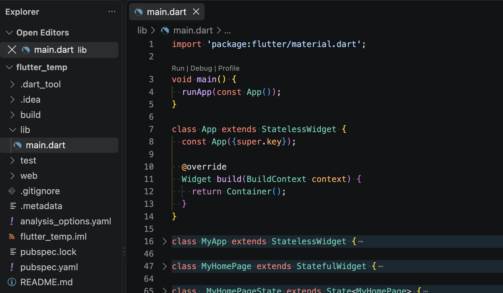

The `runApp()` function takes our `App` widget and makes it the root of the widget tree, displaying it on the screen. If you run the app now, you will just see a blank screen.

### Commit your changes (2)

Commit your work with a meaningful message, such as `Define the Main App Widget: App`.

## Define the UI inside App

Let's give our `App` widget some structure and content.

### Redefine the build method

Modify the `build` method within the `App` class as follows:

```dart
@override
Widget build(BuildContext context) {
  return MaterialApp(
    title: 'Sandwich Shop App',
    home: Scaffold(
      appBar: AppBar(title: const Text('Sandwich Counter')),
      body: const Center(
        child: Text('Welcome to the Sandwich Shop!'),
      ),
    ),
  );
}
```

Your `App` widget should now look like this:

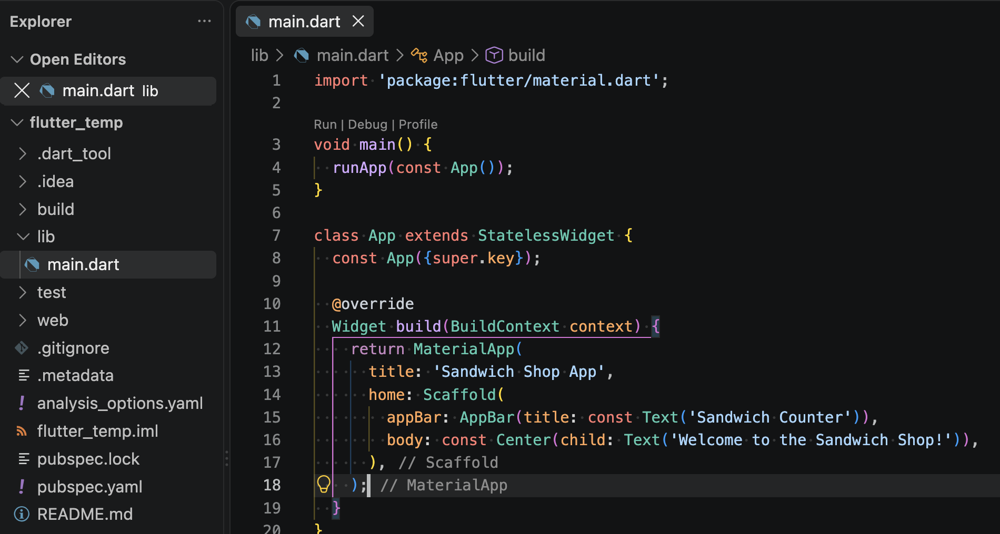

Here, we've created a "widget tree". `MaterialApp` is the root (parent), providing core app functionality. `Scaffold` provides the basic screen layout, including an `AppBar` (the top bar) and a `body`. The body contains a `Center` widget, which in turn holds our `Text` widget.

As before, for a deeper understanding of this structure, use Copilot to explain each widget's role.

### Run the application

Make sure you have a device selected (e.g., Chrome or Edge from the bottom status bar). You can also open the Command Palette by pressing **Ctrl + Shift + P** on Windows or **⌘ + Shift + P** on macOS and type "Flutter: Select Device" to choose a device.

With a device selected run the app by pressing **F5** (depending on your keyboard, you may have to press **Fn + F5**). You should see an application with an app bar titled "Sandwich Counter" and "Welcome to the Sandwich Shop\!" centred on the screen.

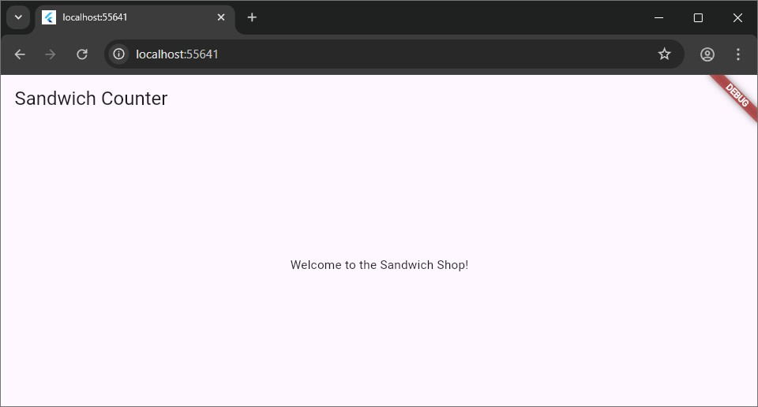

### Commit your changes (3)

Commit your work with a message like `Define the UI inside App`.

## Create the custom OrderItemDisplay widget

You can create your own reusable widgets by combining existing ones. We will create a custom widget to display a single sandwich order.

### Define the OrderItemDisplay widget

Add the definition for `OrderItemDisplay` in `lib/main.dart`, placing it below the `App` class:

```dart
class OrderItemDisplay extends StatelessWidget {
  final String itemType;
  final int quantity;

  OrderItemDisplay(this.quantity, this.itemType, {super.key});

  @override
  Widget build(BuildContext context) {
    return Text('This is a placeholder for OrderItemDisplay');
  }
}
```

You may need to auto-fix any warnings by hovering over the squiggly lines and clicking on the lightbulb icon or pressing **Ctrl + .** on Windows or **⌘ + .** on macOS. See the screenshot below:

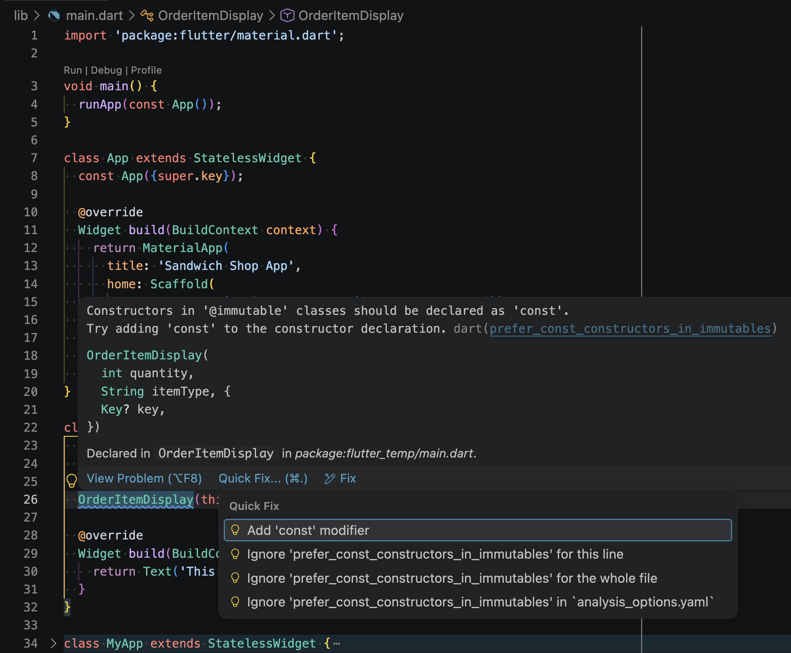

This `StatelessWidget` has two `final` instance variables, `itemType` and `quantity`, which are set by its constructor (whenever an instance of `OrderItemDisplay` is created, the value for `itemType` and `quantity` must be provided but `key` is optional hence it is written in curly braces). `final` means they cannot be changed after the widget is created.

Running the app at this stage won't show any visual changes yet, as we haven't actually used the `OrderItemDisplay` widget in our `App`.

### Commit your changes (4)

Commit your new widget with the message `Define OrderItemDisplay custom widget`.

### Implement the build method of OrderItemDisplay

Now, let's update the `build` method of `OrderItemDisplay` to show the sandwich type and quantity with emojis. We want it to display something like: "5 Footlong sandwich(es): 🥪🥪🥪🥪🥪". (Hopefully you are familiar with the syntax used for string interpolation in Dart, if not, refer to the worksheet on Strings in Dart linked in [Worksheet 1](./worksheet-1.md).)

Update the `build` method inside your `OrderItemDisplay` so it looks like this:

```dart
@override
Widget build(BuildContext context) {
  return Text('$quantity $itemType sandwich(es): ${'🥪' * quantity}');
}
```

### Commit your changes (5)

Commit this update with a message like `Implement dynamic text in OrderItemDisplay`.

## Use OrderItemDisplay in App

Now we can use our new custom widget inside the main `App`.

### Replace the placeholder in App

Find the `build` method of the `App` class with the shortcut (**Ctrl + Shift + F** on Windows or **⌘ + Shift + F** on macOS) as shown below:

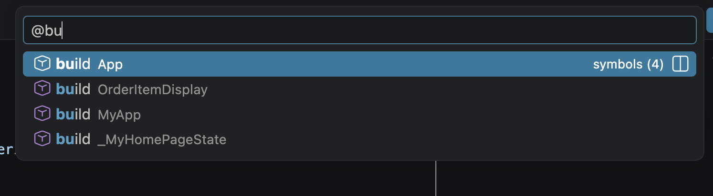

Inside there, locate the `Center` widget within the `Scaffold`'s `body`. Select the `Center` widget's child (the `Text` widget) as shown below:

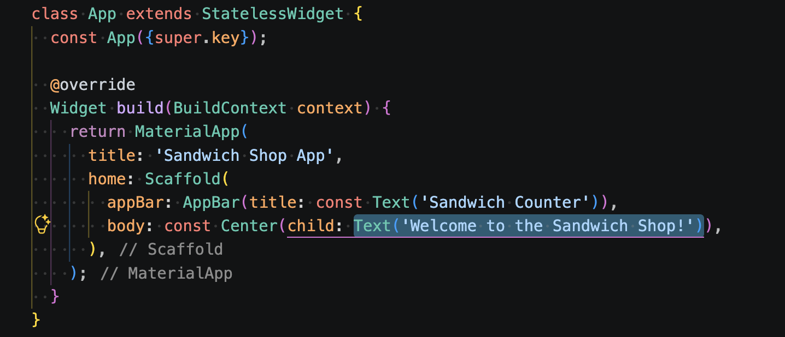

Then replace the placeholder `Text` widget in the `body` of the `Scaffold` with an instance of our new `OrderItemDisplay` widget. Your code must match the one shown below:

```dart
@override
Widget build(BuildContext context) {
  return MaterialApp(
    title: 'Sandwich Shop App',
    home: Scaffold(
      appBar: AppBar(title: const Text('Sandwich Counter')),
      body: const Center(
        child: OrderItemDisplay(5, 'Footlong'),
      ),
    ),
  );
}
```

### Run the application again

Run the app. You should now see "5 Footlong sandwich(es): 🥪🥪🥪🥪🥪" displayed in the centre of the screen.

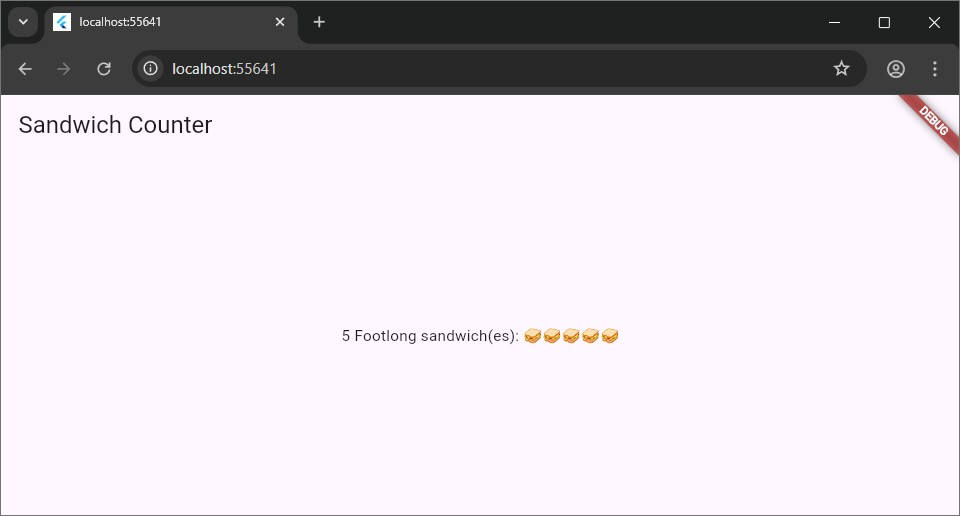

### Commit your changes (6)

Commit your final changes for this section with the message `Use OrderItemDisplay in App`.

At this stage, your code should look like our code as shown on [the GitHub repository](https://github.com/manighahrmani/sandwich_shop/blob/2/lib/main.dart).

<!-- TODO: Done till here -->

## **Exercises**

Complete the exercises below and show your work to a member of staff present at your next practical for **a sign-off**.
Your main guide for the rest of the exercises is the [Flutter layout documentation](https://docs.flutter.dev/get-started/fundamentals/layout). Remember to commit your changes after each exercise.

1. The `Flutter Inspector` is a tool for visualising the widget tree and debugging layout issues. Access it from the VS Code Command Palette (**Ctrl + Shift + P** or **⌘ + Shift + P**) by typing `Flutter: Open Flutter DevTools` and selecting the "Widget Inspector" option.

    Familiarise yourself with this tool by watching this [YouTube video on the Widget Inspector](https://www.youtube.com/watch?v=_EYk-E29edo&t=172s) and reviewing its [official documentation](https://docs.flutter.dev/tools/devtools/inspector). Use it to observe the relationship between the widgets in your app.

    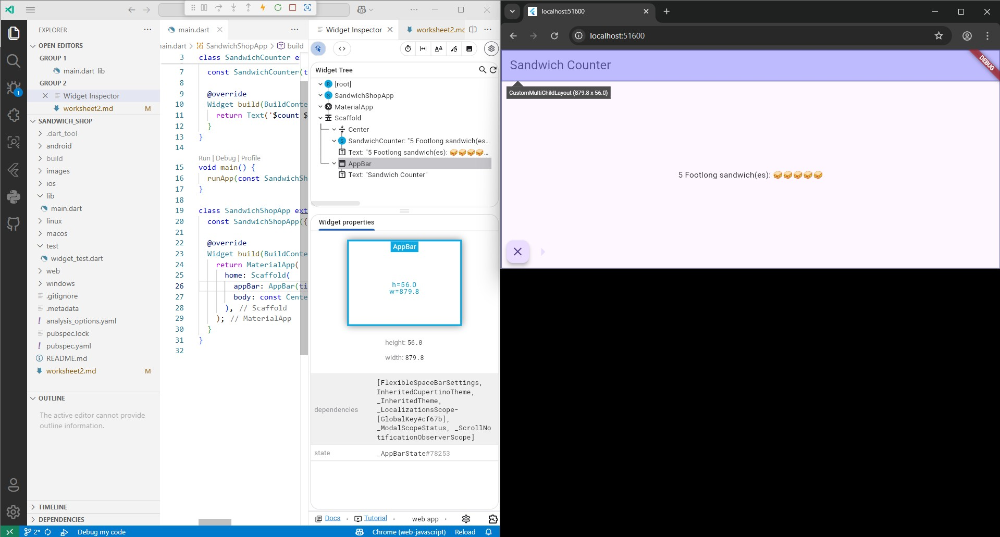

    **Show your running app and the widget inspector to a member of staff** for a sign-off. We need to make sure you can work your way around the widget inspector.

2. Wrap your `OrderItemDisplay` widget inside a `Container` widget. Use the documentation for the [Container widget](https://api.flutter.dev/flutter/widgets/Container-class.html) to learn how to use it.

    Give the `Container` a fixed `width` and `height` and a `color` (e.g., `Colors.blue`) to make it visible. See what happens when the `OrderItemDisplay`'s text is too big for the `Container`.

    This is what it should look like:

    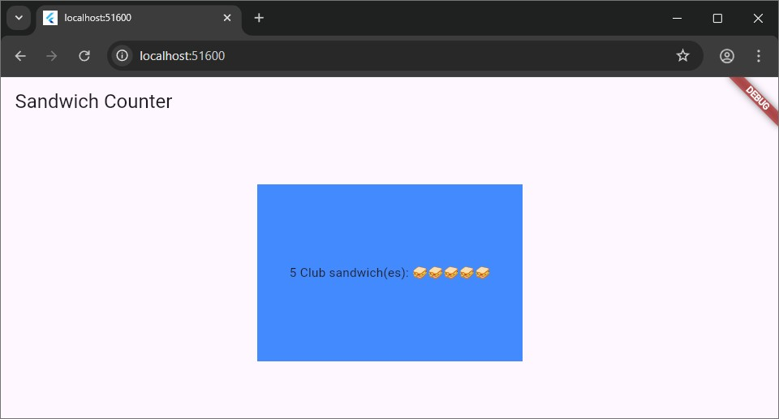

    Update the `width` and `height` properties to see what happens if the `OrderItemDisplay`'s text is too big for the `Container`.

    **Show your running app with the coloured container to a member of staff** for a sign-off.

3. Read about [layout widgets](https://docs.flutter.dev/get-started/fundamentals/layout#layout-widgets) in the documentation pages.

    Your task is to use a `Column` or a `Row` to display three `OrderItemDisplay` widgets in instead of one in the `Container` where the current `OrderItemDisplay` is. Experiment with the `mainAxisAlignment` and `crossAxisAlignment` properties to align them.

    The image below shows an example of a `Row` with three `OrderItemDisplay` widgets. (Note that we have skipped the previous exercise, your implementation should still have the coloured container from the last exercise.)

    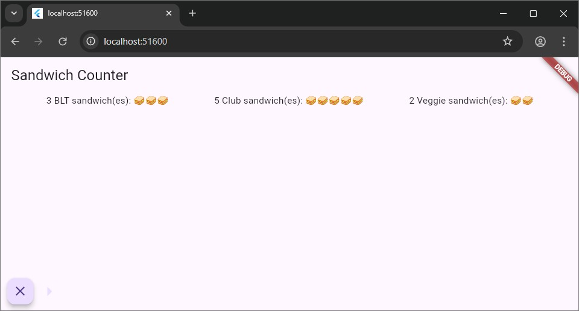

    Resize the browser window. What happens if the `Row` is too wide for the screen? Use an LLM or the documentation to learn about layout "Constraints".

    **Show your running app with the three widgets in a row or column to a member of staff** for a sign-off.

4. We've already seen some of the Flutter styling options in the last worksheet. Go back to your `OrderItemDisplay` widget and apply a style to the `Text` widget.

    Inside the `build` method of `OrderItemDisplay`, use the `style` property of the `Text` widget, which accepts a `TextStyle`. Use this to make the text green, bold and larger.

    At any moment, you can hover your mouse over the `TextStyle` class to see what properties it accepts. Once you have found the properties you want to change, write them inside the `TextStyle` constructor (e.g., `TextStyle(property: value)`).

    If you get stuck, try the shortcut **Ctrl + Space** on Windows or **⌘ + Space** on macOS to see suggestions for properties you can use. Below, we have for example found out that `color` is a property of `TextStyle` that accepts an instance of the `Color` class. Try not to use an AI assistant to complete this task.

    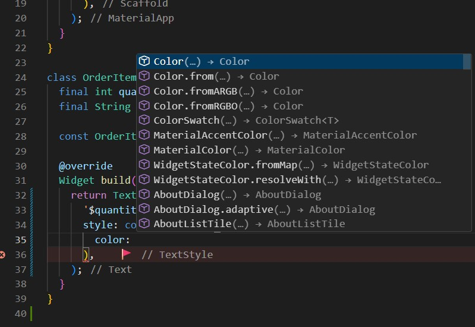

    This task is **optional** and there's no need to show it to a member of staff for a sign-off.

    Refer to the [official documentation on text and typography](https://docs.flutter.dev/ui/design/text) to learn more about external (Google) fonts.

5. (Advanced) Use a `Column` to display 20 `OrderItemDisplay` widgets this time. You will likely see an overflow error because the content is taller than the screen.

    To fix this, wrap the `Column` in a `SingleChildScrollView` widget, or replace the `Column` with a `ListView` widget. Use the documentation for [SingleChildScrollView](https://api.flutter.dev/flutter/widgets/SingleChildScrollView-class.html) and [ListView](https://api.flutter.dev/flutter/widgets/ListView-class.html) to understand how they work.

    Refer to the [debugging layout](https://docs.flutter.dev/get-started/fundamentals/layout#devtools-and-debugging-layout) documentation if needed.

    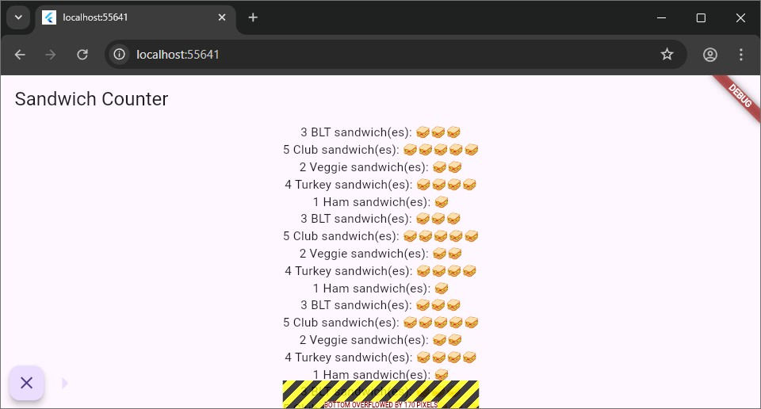

    This task is **optional** and there's no need to show it to a member of staff for a sign-off.

6. (Advanced) Read the documentation on creating [adaptive layouts](https://docs.flutter.dev/get-started/fundamentals/layout#adaptive-layouts). Wrap your UI in a `LayoutBuilder`. Inside its `builder` function, check the `constraints.maxWidth`.

    If the width is less than or equal to 600 pixels, display your `OrderItemDisplay` widgets in a `Column`. Otherwise, display them in a `Row`. Observe the changes by resizing your browser window.

    This task is **optional** and there's no need to show it to a member of staff for a sign-off.

7. (Advanced) You may have already thought about a way not to create a separate `OrderItemDisplay` class. This could equally be achieved by defining a helper method in the `App` class, like this:

    ```dart
    Widget _buildOrderItemDisplay(int quantity, String itemType) {
      return Text('$quantity $itemType sandwich(es): ${'🥪' * quantity}')
    }
    ```

    You would then call this method in the `body` of the `Scaffold` of the `App` widget like this:

    ```dart
    body: const Center(
      child: _buildOrderItemDisplay(5, 'Footlong'),
    ),
    ```

    Watch this [YouTube video](https://youtu.be/IOyq-eTRhvo) to learn more about this approach and why it is not recommended albeit sounding like a simpler solution.

    This task is **optional** and there's no need to show it to a member of staff for a sign-off.
