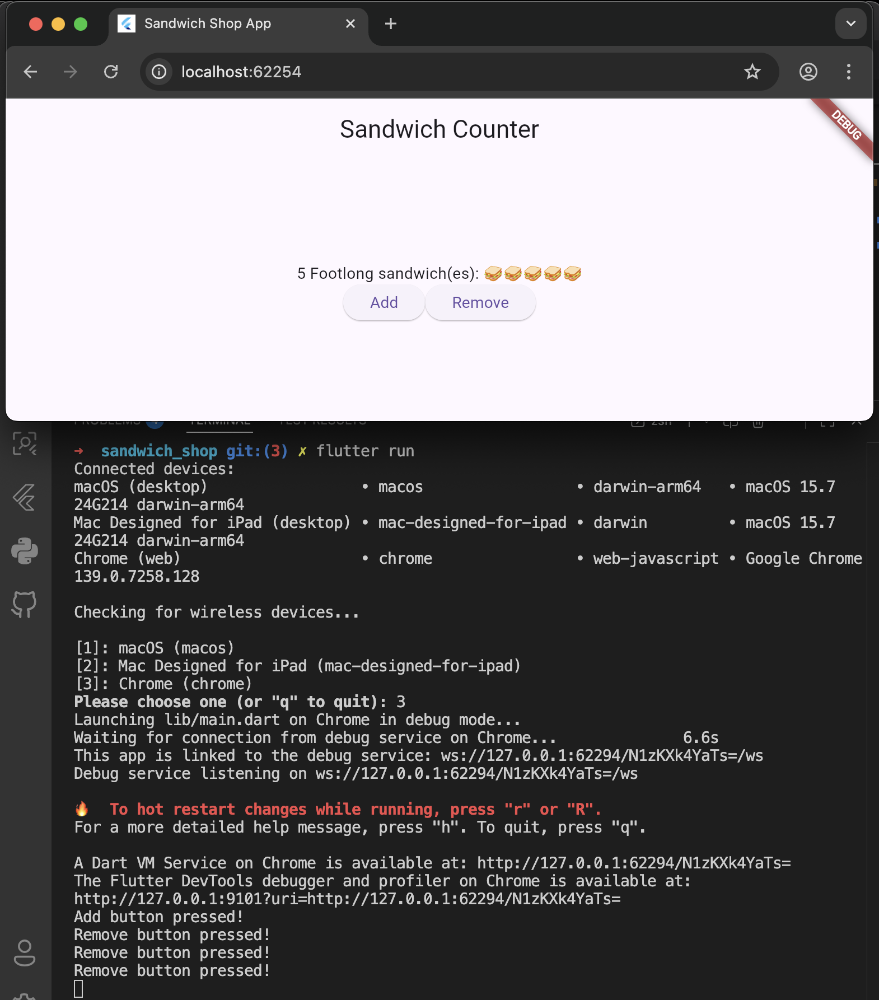
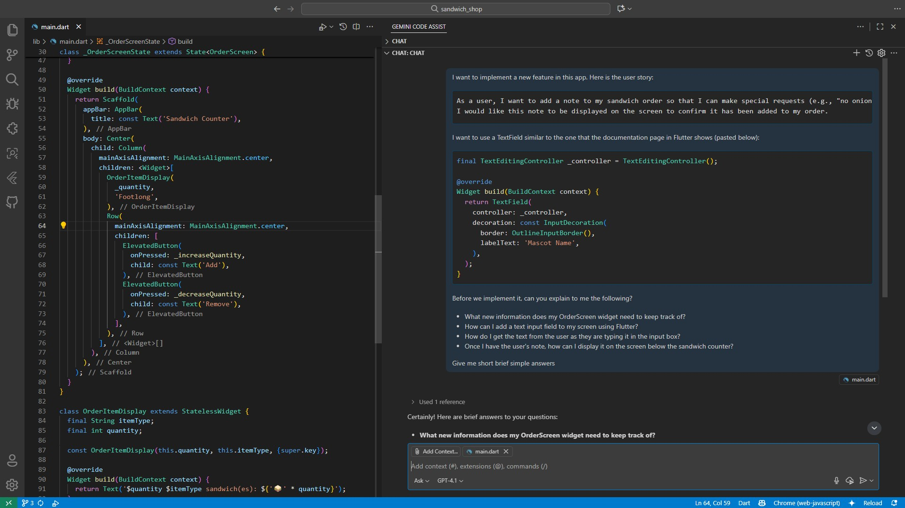
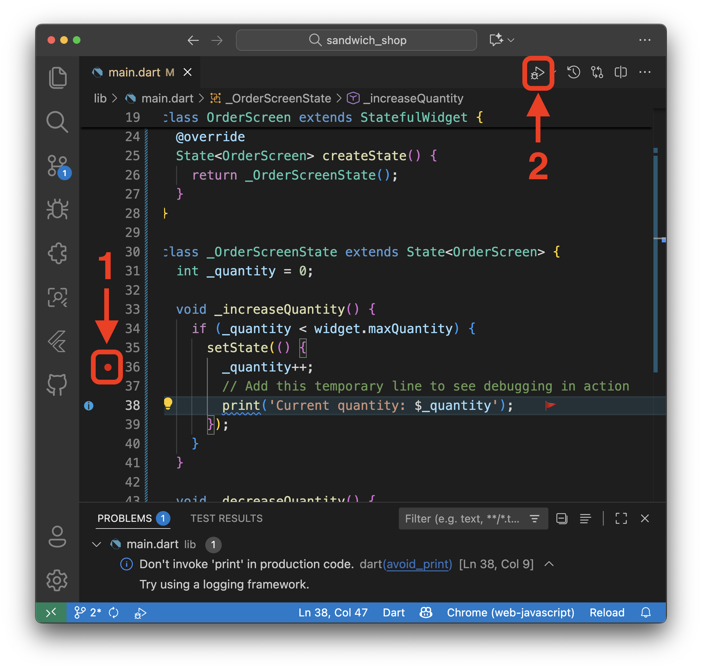
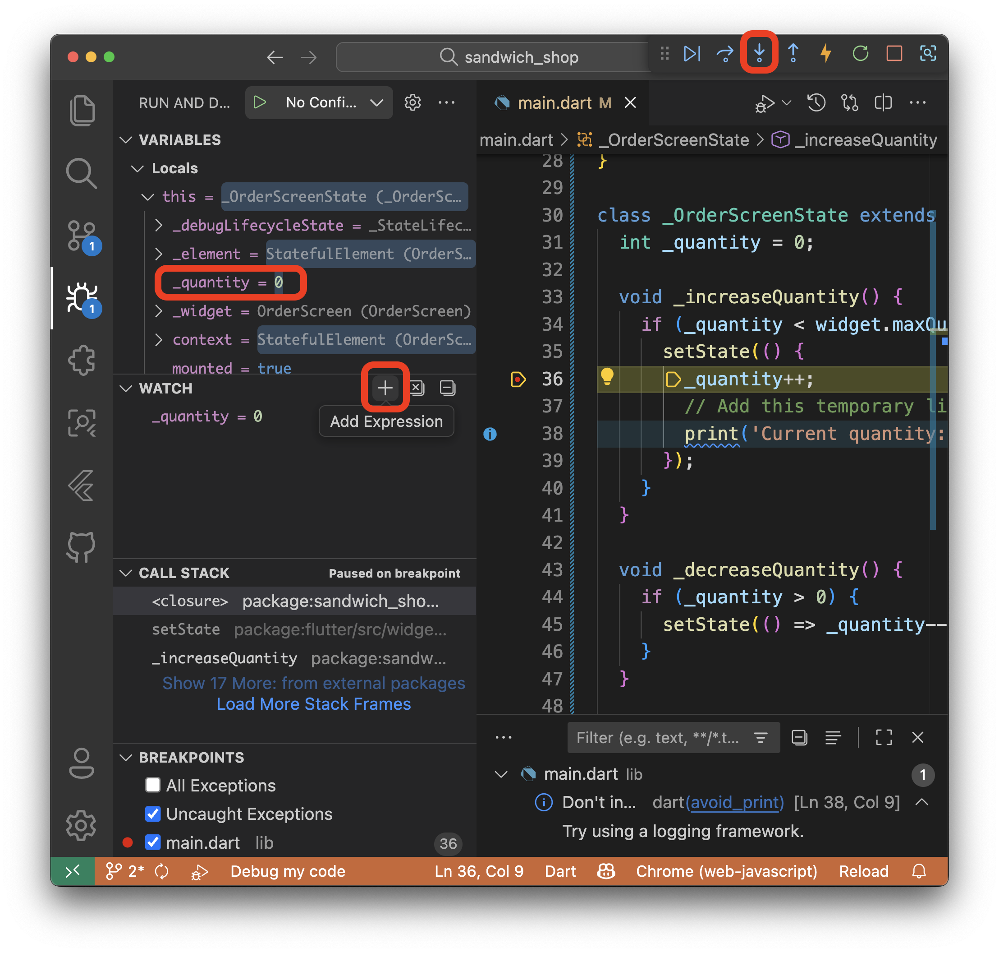
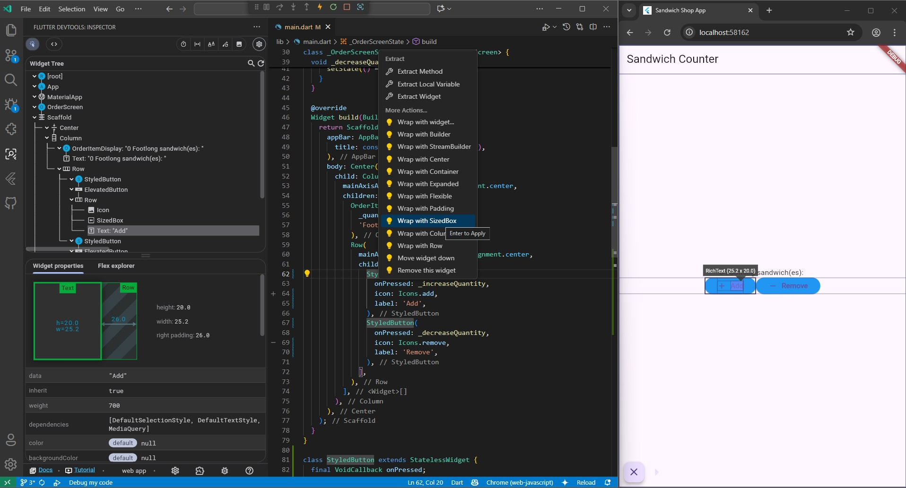
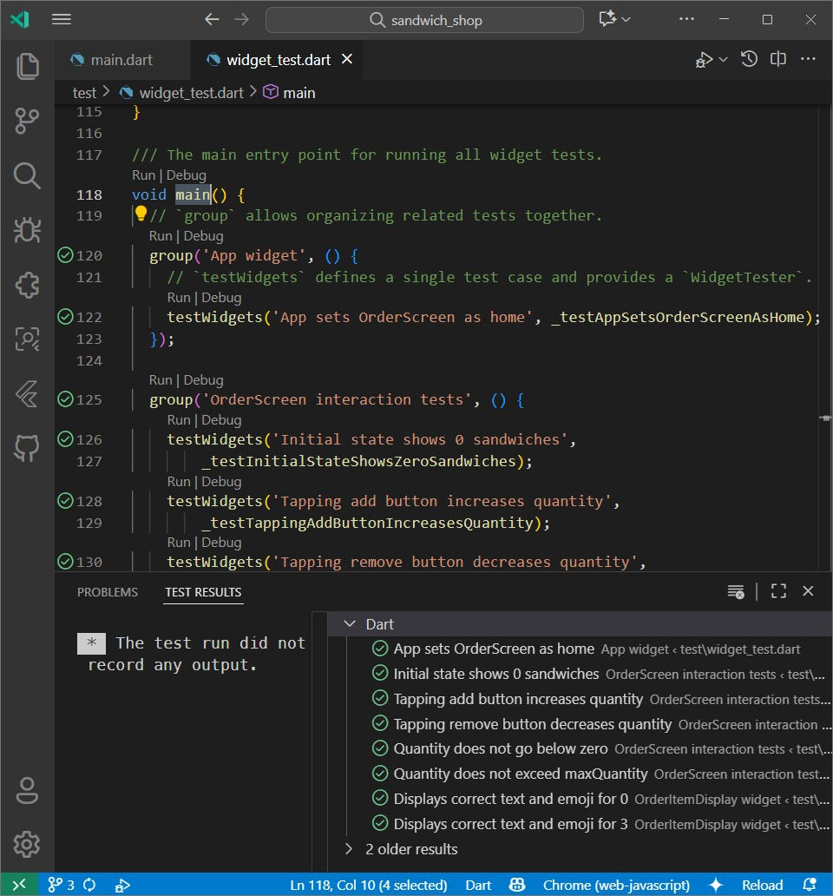

# **Worksheet 3 — Stateful widgets**

## **What you need to know beforehand**

Ensure that you have already completed the following:

- [Worksheet 0 — Introduction to Dart, Git and GitHub](./worksheet-0.md).
- [Worksheet 1 — Introduction to Flutter](./worksheet-1.md).
- [Worksheet 2 — Stateless Widgets](./worksheet-2.md).

## **Getting help**

To get support with this worksheet, join the [Discord channel](https://portdotacdotuk-my.sharepoint.com/:b:/g/personal/mani_ghahremani_port_ac_uk/EbX583gvURRAhqsnhYqmbSEBwIFw6tXRyz_Br1GxIyE8dg) and ask your questions there. Otherwise, attend your timetabled session and ask a member of staff for help.

### **Introduction to state**

In the last worksheet, our widgets were `Stateless`, meaning their properties couldn't change. To make our app interactive, for example, to change the number of sandwiches with a button press, we need to manage state.

State is just data that can change over time. For this worksheet, we will focus on **ephemeral state**. This is a state (or data) that is local to a single widget, for example the content of a cart which is only relevant to that cart widget. (In a later worksheet we will learn about **app state**, which is shared across multiple widgets, for example login information of a user.)

The number of sandwiches in our order is a perfect example of this. To manage this kind of state, Flutter provides the `StatefulWidget`.

## **Getting started**

For this worksheet, you need to start with the code from branch 2 of our [GitHub repository](https://github.com/manighahrmani/sandwich_shop/tree/2). You can either clone the repository and checkout branch 2:

```bash
git clone https://github.com/manighahrmani/sandwich_shop.git
cd sandwich_shop
git checkout 2
```

Or ensure your code matches [the code that we ended Worksheet 2 with](https://github.com/manighahrmani/sandwich_shop/blob/2/lib/main.dart). Run the app to make sure everything works as expected before proceeding.

## **A reminder on stateless widgets**

If you have completed some of the exercises and your code looks slightly different, that's okay. Just make sure you understand the changes we're making from this point onward.

So far, all of our widgets were stateless. These widgets are immutable. They are like a photograph: a snapshot of the User Interface (UI) at a particular point in time. If you want to find out more about them, **watch this [YouTube video on StatelessWidgets](https://youtu.be/wE7khGHVkYY).**

### **Adding interactive buttons**

To make our sandwich counter interactive, we first need to add some buttons. Let's add "Add" and "Remove" buttons below our sandwich display. Update the `body` of the `Scaffold` in your `App` widget to use a `Column` and a `Row`. Hopefully you have already learnt about these from [the exercises in worksheet 2](https://manighahrmani.github.io/sandwich_shop/worksheet-2.html#exercises). Remember these are all `StatelessWidget`s as for example the text of the buttons themselves does not change over time.

```dart
home: Scaffold(
  appBar: AppBar(title: const Text('Sandwich Counter')),
  // The bit that you need to update starts from here
  body: Center(
    child: Column(
      mainAxisAlignment: MainAxisAlignment.center,
      children: [
        const OrderItemDisplay(5, 'Footlong'),
        Row(
          mainAxisAlignment: MainAxisAlignment.center,
          children: [
            ElevatedButton(
              onPressed: () => print('Add button pressed!'),
              child: const Text('Add'),
            ),
            ElevatedButton(
              onPressed: () => print('Remove button pressed!'),
              child: const Text('Remove'),
            ),
          ],
        ),
      ],
    ),
  ),
  // The bit that you need to update ends here
),
```

You may get some warning asking you not to invoke `print` in production code but ignore it for now. Also, to format your code and fix any potential indentation issues, open the Command Palette and enter `Format Document`.

Here, we've also used two `ElevatedButton` widgets. The most important property of them is `onPressed`. It takes a function that gets executed when the user taps the button. This is called an event handler or a **callback**. Some of you may remember event handlers from last year, they are functions that are invoked in response to an event, in this case, a button press.

For now, our callback is an arrow function that just prints a message in the terminal (not on the UI) when they are pressed. (For more information on the arrow function syntax, check out the Dart worksheets on functions linked in [worksheets 0](https://manighahrmani.github.io/sandwich_shop/worksheet-0.html#introduction-to-the-dart-language)).

To run the app, open the Command Palette in VS Code with **Ctrl + Shift + P** on Windows or **⌘ + Shift + P** on macOS. In there, type `Terminal: Create New Terminal` and hit enter. In the terminal, run the command `flutter run`. You will see the buttons, and when you click them, messages will appear in the Terminal as shown below.



### **Commit your changes (1)**

First reopen the Command Palette. In there, type `Source Control: Focus on Changes View`. After reviewing your changes, commit them with a message like `Add add and remove buttons`.

## **Creating a `StatefulWidget`**

The hardcoded quantity in `OrderItemDisplay(5, 'Footlong')` is a problem because it's static. To make the quantity interactive, we need to replace our static UI with a widget that can manage a changing value. This is where `StatefulWidget` comes in.

We will create a new `StatefulWidget` called `OrderScreen` to manage the state of our sandwich order.

### **Define the `OrderScreen` stateful widget**

Add the following two classes to your `lib/main.dart` file. You can place them above the `OrderItemDisplay` class and below the `App` class.

```dart
class OrderScreen extends StatefulWidget {
  final int maxQuantity;

  const OrderScreen({super.key, this.maxQuantity = 10});

  @override
  State<OrderScreen> createState() {
    return _OrderScreenState();
  }
}

class _OrderScreenState extends State<OrderScreen> {
  int _quantity = 0;

  @override
  Widget build(BuildContext context) {
    return const Placeholder();
  }
}
```

You may get a warning stating that the value of the `_quantity` isn't used or that it can be `final`. Ignore it for now.

This might look a bit strange. We have two classes to manage one widget. This is a fundamental concept in Flutter state management.

Take a moment to read this structure. Use your AI assistant to find out the answers to these questions:

- "What is the difference between a `StatefulWidget` and a `State` object in Flutter?"
- "In Flutter, why is the `build` method inside the `State` class and not the `StatefulWidget` class?"
- "What does the underscore prefix on `_OrderScreenState` and `_quantity` mean in Dart?"
- "Why does the `<OrderScreen>` mean after the `State` class?"

Remember if you are using a Large Language Model (LLM) on the browser, like ChatGPT, you need to provide the code snippets as well as your questions. Alternatively use Copilot which you can open in VS Code by selecting the code snippet and pressing **Ctrl + I** in Windows or **⌘ + I** in macOS.

### **Commit your changes (2)**

Remember to commit your changes with a message like `Define OrderScreen stateful widget` before moving on.

## **Building the UI for `OrderScreen`**

Now, let's build the UI inside the `_OrderScreenState` class. We want to display the `OrderItemDisplay` and the two buttons we created earlier.

### **Implement the `build` method**

Replace the returned `Placeholder()` in the `_OrderScreenState`'s `build` method with a `Scaffold` containing our UI components. This structure should look very familiar.

```dart
@override
Widget build(BuildContext context) {
  return Scaffold(
    appBar: AppBar(
      title: const Text('Sandwich Counter'),
    ),
    body: Center(
      child: Column(
        mainAxisAlignment: MainAxisAlignment.center,
        children: <Widget>[
          OrderItemDisplay(
            _quantity,
            'Footlong',
          ),
          Row(
            mainAxisAlignment: MainAxisAlignment.center,
            children: [
              ElevatedButton(
                onPressed: () => print('Add button pressed!'),
                child: const Text('Add'),
              ),
              ElevatedButton(
                onPressed: () => print('Remove button pressed!'),
                child: const Text('Remove'),
              ),
            ],
          ),
        ],
      ),
    ),
  );
}
```

Notice how we use `_quantity` when creating the `OrderItemDisplay`. The `State` object can access its own private variables directly.

### **Commit your changes (3)**

Commit your changes with a message like `Build UI for OrderScreen`.

### **Update the `App` widget**

Finally, let's update our main `App` widget to use the new `OrderScreen` as its `home`. The `App` widget no longer needs its own `Scaffold`.

```dart
class App extends StatelessWidget {
  const App({super.key});

  @override
  Widget build(BuildContext context) {
    return const MaterialApp(
      title: 'Sandwich Shop App',
      home: OrderScreen(maxQuantity: 5),
    );
  }
}
```

Recall that `maxQuantity` is a named parameter in the `OrderScreen` constructor. It also has a default value of `10`, so we could omit it here and just use `OrderScreen()`.

Run the app now. You should see the counter displaying "0 Footlong sandwich(es):" and two disabled buttons.

### **Commit your changes (4)**

Commit your changes with a message like `Use OrderScreen in App`.

## **Adding interactivity with `setState()`**

The final step is to make the buttons work. We need to create methods that change the `_quantity` and then tell Flutter to rebuild the widget to reflect that change.

### **Create helper methods**

We want to handle increasing and decreasing the quantity. To do so, we need additional methods in our `_OrderScreenState` class. These will be the callbacks (event handlers) for the buttons.

Add the following methods inside the `_OrderScreenState` class above the `build` method and below the definition of `_quantity`:

```dart
void _increaseQuantity() {
  if (_quantity < widget.maxQuantity) {
    setState(() => _quantity++);
  }
}

void _decreaseQuantity() {
  if (_quantity > 0) {
    setState(() => _quantity--);
  }
}
```

The `State` object has a property called `widget`, which gives it access to the associated `StatefulWidget` (`OrderScreen` in this case). This is how we access the immutable `maxQuantity` property using `widget.maxQuantity`.

The most important part is `setState()`. You must call `setState()` to notify Flutter that a state variable has changed. Between the brackets of `setState()`, you should pass a function that updates the state variable. In our case we have passed an arrow function that increments or decrements `_quantity`.

Calling `setState()` tells the framework that this widget (`OrderScreen`) is "dirty" and needs to be rebuilt. Flutter then calls the `build()` method again, and the UI updates with the new `_quantity` value. Simply writing `_quantity++` without wrapping it in a `setState()` call will not cause the UI to update.

### **Commit your changes (5)**

Commit your changes with a message like `Add helper methods for quantity adjustment`.

### **Link the buttons to their event handlers**

Now, update the `ElevatedButton`s in your `build` method to call these new functions when they are pressed:

```dart
ElevatedButton(
  onPressed: _increaseQuantity,
  child: const Text('Add'),
),
ElevatedButton(
  onPressed: _decreaseQuantity,
  child: const Text('Remove'),
),
```

Run the app one last time. The buttons should now be enabled, and clicking them will update the sandwich count on the screen.

As a small task, can you figure out why the buttons only work within a certain range of quantities? If you are confused by this, try to trace the logic in the `_increaseQuantity` and `_decreaseQuantity` methods. Note that in VS Code you can jump to the method definitions by holding down the `Ctrl` key on Windows or `⌘` on macOS and clicking on the method name. Feel free to ask Copilot or your LLM of choice for help.

To learn more about `StatefulWidget`s, **watch this [YouTube video from the Flutter team](https://youtu.be/AqCMFXEmf3w).**

### **Commit your changes (6)**

Commit your final changes with a message like `Implement counter functionality with setState`.

## **Adding Custom Notes to an Order**

Let's add some more interactivity to our app. We would like to allow users to add custom notes to their sandwich orders. This could be special requests like "no onions" or "extra pickles".

In software development, we often start with a user story to define a new feature. Here is an example, feel free to modify it to suit your needs.

```txt
As a user, I want to add a note to my sandwich order so that I can make special requests (e.g., "no onions", "extra pickles"). The user would add the notes before pressing the "Add" and "Remove" buttons.
```

As a small introduction to AI-Driven Development, we will implement this feature using Copilot or the LLM of your choice. In a later worksheet we will cover this in more details. If you cannot complete this feature, don't worry, just move on to the next section as we will show you a solution in next week's worksheet.

### **Implementing the Feature**

Start by consulting [the Flutter documentation on user input](https://docs.flutter.dev/get-started/fundamentals/user-input) to understand its basic use. Browse through the features and scroll down until you find the [TextField widget](https://docs.flutter.dev/get-started/fundamentals/user-input#textfield). Read this part to understand its basic use.

You don't have to update the UI based on the notes. This can be slightly challenging as it requires you to implement event listeners for the text field. (Just focus on getting the input from the user.) But if you are interested, visit the "4-part cookbook series" linked below the `TextField` documentation.

With the user story and documentation in hand, it's time to collaborate with your AI assistant. Instead of asking for the final code, guide the AI to help you think through the problem. Start by providing the user story and asking questions like the ones below.

- "I want to implement this user story, what new information does my `OrderScreen` widget need to keep track of?"
- "How can I add a text input field to my screen using Flutter?"
- "How can I modify the style of the text input field for example to add a border and a hint text?"

See below an example of how we have provided a rich prompt to Copilot. You can open your current file in the chat and open the Copilot panel (yours may be in a different location) by entering `Chat: Add File to Chat` in the Command Palette.

This way, `main.dart` is already included in the context of Copilot. Remember that while Copilot can access your codebase, LLMs like ChatGPT require you to provide the code snippet (in this case the `OrderScreen` and `_OrderScreenState` classes) for context.



The `Add Context` button can be used to include additional files, screenshots, instructions or other resources. We encourage you to explore other models and modes (e.g., Agent and Edit).

### **Refining Your Code with VS Code**

As you add new widgets, your code can become messy. First, ensure your code is well-formatted (open Command Palette and enter `Format Document`).

Next, look for any blue or yellow squiggly lines. These are hints from the Flutter analyser. For example, if you added an `InputDecoration` to your `TextField`, you might see a blue squiggly line underneath it. Hover over it with your mouse, and a message will likely suggest adding a `const` modifier. You can click **Quick Fix...** or press **Ctrl + .** on Windows or **⌘ + .** on macOS to apply the suggestion automatically.

### **Commit Your Changes (7)**

Make sure to have hot reload enabled by hitting the thunder (⚡️) icon in the toolbar or by typing `r` in the terminal if you are running the app there.

After verifying that the feature works as described in the user story, commit your work to source control. A good commit message would be `Add order notes field`.

## **Debugging your Flutter app**

As your app becomes more complex, you'll inevitably encounter bugs or unexpected behaviour. Let's take a look at the debugging tools in VS Code that help you identify and fix issues.

### **Using the VS Code debugger**

The VS Code debugger is your primary tool for stepping through code and inspecting variables. To start debugging, click the bug icon (🪲) in the Activity Bar on the left side of VS Code. This opens the Debug panel with several useful sections.

You can also access debugging tools through the Command Palette by pressing **Ctrl + Shift + P** on Windows or **⌘ + Shift + P** on macOS and typing `Flutter: Open Flutter DevTools`.

For comprehensive information about debugging Flutter apps, visit the [official Flutter debugging documentation](https://docs.flutter.dev/testing/native-debugging)..

### **Setting breakpoints and inspecting state**

Let's practice debugging with your current sandwich counter app. First, make a small change that will help us see debugging in action. In your `_increaseQuantity` method, temporarily add the following `print` statement inside the `setState` call:

```dart
void _increaseQuantity() {
  if (_quantity < widget.maxQuantity) {
    setState(() {
      _quantity++;
      // Add this temporary line to see debugging in action
      print('Current quantity: $_quantity');
    });
  }
}
```

Now, let's set a breakpoint. Click in the left margin next to the line `_quantity++;` in your `_increaseQuantity` method. You should see a red dot appear, indicating a breakpoint.



Start your app in debug mode by pressing **F5** or clicking the play button with a bug icon in the top toolbar. When you click the "Add" button in your running app, the debugger will pause execution at your breakpoint.

When the debugger pauses, you'll see several useful panels:

- **Variables**: Shows the current values of all variables in scope, including `_quantity` and `widget.maxQuantity`
- **Call Stack**: Shows the sequence of method calls that led to this point
- **Debug Console**: Displays output from your `print` statements and allows you to evaluate expressions

You can use the debugging toolbar to step through your code line by line, continue execution, or stop debugging entirely. For a definition of what these buttons do, visit [this section of the documentation page](https://docs.flutter.dev/testing/native-debugging#vs-code-flutter-debugging-toolbar).

Next, try this simple debugging exercise: temporarily change your `maxQuantity` in the `App` widget from `5` to `3`, then run your app and use the debugger to step through the `_increaseQuantity` method. Watch how the variables change as you add sandwiches and observe what happens when you try to exceed the limit.

After clicking the add button, may need to use the "Step Into" button (the down arrow, **F11**) to enter the `setState` method and see how `_quantity` is updated. In the Variables panel, you should see `_quantity` listed under the "Local" section, as one of the instance variables of the `_OrderScreenState` class. There may be a lot more variables listed as well, so a handy tip is to add the variable's name (e.g., `_quantity`) in the "Watch" section to track it more easily.



Remember to remove the temporary `print` statement and reset your `maxQuantity` to `5` when you're done experimenting.

### **Common Flutter errors**

Flutter has excellent error messages, but they can sometimes be overwhelming. For a comprehensive list of common Flutter errors and their explanations, bookmark this page: [Flutter Common Errors](https://docs.flutter.dev/testing/common-errors). When you encounter an error, you can use **Ctrl + F** on Windows or **⌘ + F** on macOS to search for keywords from your error message.

## **Exercises**

Complete the exercises below and show your work to a member of staff at your next practical session for a **sign-off**.

Remember to commit your changes and use VS Code's tools as describing in [this section](#refining-your-code-with-vs-code) while working on these exercises.

1. The `ElevatedButton` widgets look a bit plain. Add a background colour of your choice to them and update the text style. You could also try adding an icon to each of them.

   You can find the relevant properties in [the ElevatedButton documentation](https://api.flutter.dev/flutter/material/ElevatedButton-class.html). You will need to use the `style` property which takes a `ButtonStyle` object. You can create one using the `ElevatedButton.styleFrom` method. For example the following code snippet creates a red button with white text.

   ```dart
   ElevatedButton(
     onPressed: VoidCallback _increaseQuantity,
     style: ElevatedButton.styleFrom(
       backgroundColor: Colors.red,
       foregroundColor: Colors.white,
     ),
     child: const Text('Add'),
   ),
   ```

   Doing this for both buttons creates a lot of duplication. As an extra challenge, reduce the repetition by defining a custom `StatelessWidget` called `StyledButton`. Recall that we did this back in [worksheet 2](https://manighahrmani.github.io/sandwich_shop/worksheet-2.html#create-the-custom-orderitemdisplay-widget).

   Your newly defined `StyledButton` class needs to have multiple instance variables and it should accept several parameters in its constructor. These include the text to be displayed on the button and the callback function to be called when the button is clicked.

   As a small extra step, try to add a gap between the buttons and align them at the opposing sides of the screen.

   VS Code has a useful feature called Refactor. You can use it by right-clicking on the name of the widgets (for example the `ElevatedButton`) and selecting `Refactor...`. You can do the same thing with the shortcut **Ctrl + Shift + R** on Windows or **⌘ + Shift + R** on macOS. This will open a menu where you can select `Wrap with Expanded` or `Wrap with SizeBox` as shown below.

   

   Keep hot reload active, use the widget inspector, refer to [the documentation page on layout widgets](https://docs.flutter.dev/ui/widgets/layout) to figure out how and where the extra space should be added.

   ⚠️ **Show your running app with the newly styled buttons to a member of staff** for a sign-off.

2. Currently, the user can press the "Add" button even when the maximum quantity is reached, and the "Remove" button when the quantity is zero. While our logic prevents the state from updating, the buttons themselves should appear disabled to provide better user feedback.

   Consult the [ElevatedButton documentation](https://api.flutter.dev/flutter/material/ElevatedButton-class.html) to see how you can disable a button.

   There are different ways to do this. You are required to explore all options and pick the one you find the easiest to understand. Feel free to think outside the box (you can even update other parts of the `_OrderScreenState` class if you find it necessary).

   ⚠️ **Show your running app, demonstrating the disabled buttons at the quantity limits, to a member of staff** for a sign-off.

3. Let's add another piece of state. The user should be able to switch between a 'Footlong' and a 'Six-inch' sandwich.

   Similar to how we implemented [the order notes feature](#adding-custom-notes-to-an-order), write a user story for this feature. Picture in your mind how this should work and describe it in details.

   Before you use an AI, refer to [the documentation page for handling user input](https://docs.flutter.dev/get-started/fundamentals/user-input), browse it to find the simplest solution for such an input. For example, would a `SegmentedButton` be appropriate here or can we use a `Slider`? Is there anything else that might be easier to implement? Make sure to state your preferences to your AI assistant.

   Note that you will need to update the `OrderItemDisplay` widget to display the selected sandwich type.

   ⚠️ **Show your running app the ability to switch between sandwich types to a member of staff** for a sign-off.

4. For another piece of state, let the user choose the bread type for their sandwich. You need to show the selected bread type in the UI.

   To manage the different options in a clean and "safe" way, you would use an `enum`. An `enum` (short for "enumeration") is a special type that represents a fixed number of constant values. A `String` would not be suitable here as the user could type anything.

   You need to use AI assistant to guide you on how you might implement this feature.

   First, refer to **[the documentation page on user input](https://docs.flutter.dev/get-started/fundamentals/user-input)** to find widgets that use enums (use **Ctrl + F** or **⌘ + F** in your browser to search for "enum" on that page).

   After you have picked a widget type, formulate questions to solve this task. For example, you could ask:

   - "How do I define and use an enum in my file to represent the bread type options?" Give the AI assistant some examples of the bread types you would like your enum to have.
   - "How can I use the enum in this widget?" Specify the widget you picked from the documentation and provide the necessary code snippets for context.

   This task is **optional** and there's no need to show it to a member of staff for a sign-off.

5. (Advanced) Writing automated tests is a fundamental skill in software development. We will cover it in more details next week but let's take a sneak peak at Flutter's widget testing which allows you to test your UI components.

   A widget test involves three main steps:

   1. Use a `WidgetTester` to **build** the widget on a test screen with `tester.pumpWidget()`.
   2. Simulate user **interaction** (e.g., tapping can be simulated with `tester.tap()`). For `Stateful` widgets, you need to call `tester.pump()` to rebuild the UI after state changes.
   3. Use `find` to locate widgets (e.g., `find.text('Add')`) and `expect` to **verify** that they appear as expected (`expect(finder, findsOneWidget)`).

   AI assistants like GitHub Copilot are exceptionally good at writing tests. Try asking Copilot to "write widget tests for this file" or "generate a test case for adding an item" for example.

   Start by finding the `test/widget_test.dart` file and read the comments we have left there. The tests did not take into account the changes that you made in the exercises (e.g., we are testing for `ElevatedButton` widgets as opposed to the custom `StyledButton` from exercise 1). The existing tests are hence broken and will fail.

   Your task is to fix them. You can run the tests by clicking on the `Run` link above the `main()` function in `test/widget_test.dart` and you should get output similar to the shown below.

   

   This task is **optional** and there's no need to show it to a member of staff for a sign-off.
