# Worksheet 3 — Data Models, Repositories, Assets and In-Page Navigation

## Table of contents

- [What you need to know beforehand](#what-you-need-to-know-beforehand)
- [Getting help](#getting-help)
- [Getting started](#getting-started)
  - [Continue from Worksheet 2](#continue-from-worksheet-2)
  - [Clone the Sandwich Shop repository](#clone-the-sandwich-shop-repository)
  - [Clean your working tree](#clean-your-working-tree)
  - [Switch to branch 2](#switch-to-branch-2)
- [The need for structured data](#the-need-for-structured-data)
- [Define the Sandwich data model](#define-the-sandwich-data-model)
  - [Create the model class](#create-the-model-class)
  - [Add the fields](#add-the-fields)
  - [Add the constructor](#add-the-constructor)
  - [Commit your changes (1)](#commit-your-changes-1)
- [Add asset images to the project](#add-asset-images-to-the-project)
  - [Create the assets folder](#create-the-assets-folder)
  - [Register assets in pubspec](#register-assets-in-pubspec)
  - [Commit your changes (2)](#commit-your-changes-2)
- [Abstract data access with a repository](#abstract-data-access-with-a-repository)
  - [Understand the repository pattern](#understand-the-repository-pattern)
  - [Create the SandwichRepository class](#create-the-sandwichrepository-class)
  - [Return mock sandwich items](#return-mock-sandwich-items)
  - [Commit your changes (3)](#commit-your-changes-3)
- [Build the menu interface](#build-the-menu-interface)
  - [Create the SandwichCard widget](#create-the-sandwichcard-widget)
  - [Lay out the image and text](#lay-out-the-image-and-text)
  - [Add the price and order button](#add-the-price-and-order-button)
  - [Commit your changes (4)](#commit-your-changes-4)
  - [Build the MenuScreen widget](#build-the-menuscreen-widget)
  - [Set MenuScreen as the home screen](#set-menuscreen-as-the-home-screen)
  - [Commit your changes (5)](#commit-your-changes-5)
- [Navigate between screens and pass data](#navigate-between-screens-and-pass-data)
  - [Understand stack-based navigation](#understand-stack-based-navigation)
  - [Move OrderScreen into its own file](#move-orderscreen-into-its-own-file)
  - [Accept a Sandwich in OrderScreen](#accept-a-sandwich-in-orderscreen)
  - [Commit your changes (6)](#commit-your-changes-6)
  - [Connect SandwichCard to OrderScreen](#connect-sandwichcard-to-orderscreen)
  - [Test the complete navigation flow](#test-the-complete-navigation-flow)
  - [Commit your changes (7)](#commit-your-changes-7)
- [Exercises](#exercises)

## What you need to know beforehand

Ensure that you have completed [Worksheet 1 — Dart, Git, GitHub and Flutter](./worksheet-1.md) and [Worksheet 2 — Stateless and Stateful Widgets](./worksheet-2.md). You should be comfortable creating `StatelessWidget` and `StatefulWidget` classes, calling `setState()` to update the user interface (UI), and arranging widgets with `Row`, `Column`, and `Scaffold`. You met `Image.asset` briefly in the Worksheet 2 exercises; we use it properly here.

## Getting help

To get support with this worksheet, follow the [Discord guide](https://portdotacdotuk-my.sharepoint.com/:p:/g/personal/mani_ghahremani_port_ac_uk/IQCMJP6IiR_bQoYUMdXJSRDYAWnajEALZYEXFZyrJkHS1QU) and post your questions there. You can also attend your timetabled practical sessions and ask a member of teaching staff for guidance.

## Getting started

### Continue from Worksheet 2

You can continue directly with the Sandwich Shop project you made in Worksheet 2. Open the project folder in VS Code with **File > Open Folder**. You do not need to clone the repository again.

### Clone the Sandwich Shop repository

If you do not have the project from Worksheet 2, clone the [Sandwich Shop repository](https://github.com/manighahrmani/sandwich_shop). Open a terminal and move to a folder that is not synchronised to cloud storage, such as your `Downloads` folder:

```bash
cd ~/Downloads
git clone https://github.com/manighahrmani/sandwich_shop
cd sandwich_shop
```

The `cd` command changes the current folder in the terminal. The first command moves to `Downloads`, and the final command moves into the cloned `sandwich_shop` folder. Open that folder in VS Code with **File > Open Folder**.

You can also clone the repository without typing terminal commands. Open the Source Control panel, select **Clone Repository**, enter `https://github.com/manighahrmani/sandwich_shop`, choose where to save it, then open the cloned folder, as shown below:

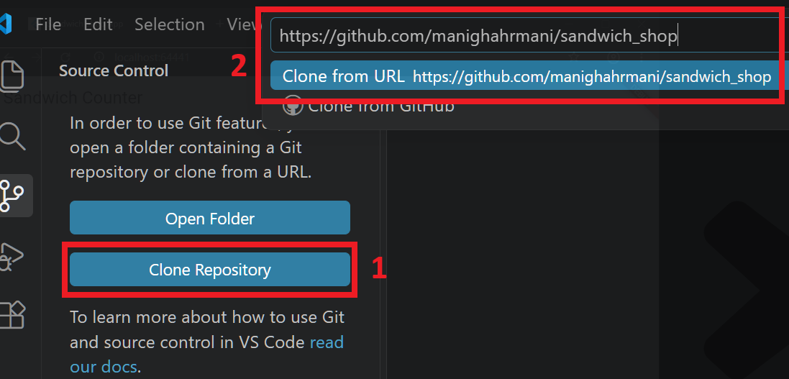

### Clean your working tree

This repository opens on the `main` branch, which contains the worksheets rather than the Flutter application. For this worksheet, you need branch `2`, which contains the Sandwich Shop app as it should look after Worksheet 2.

Before switching branches, open the Source Control panel with **Ctrl + Shift + G** on Windows or **⌃ + Shift + G** on macOS and check that there are no uncommitted changes. Commit any work that you want to keep. If you do not want to keep a change, discard it from the Source Control panel, as shown below:

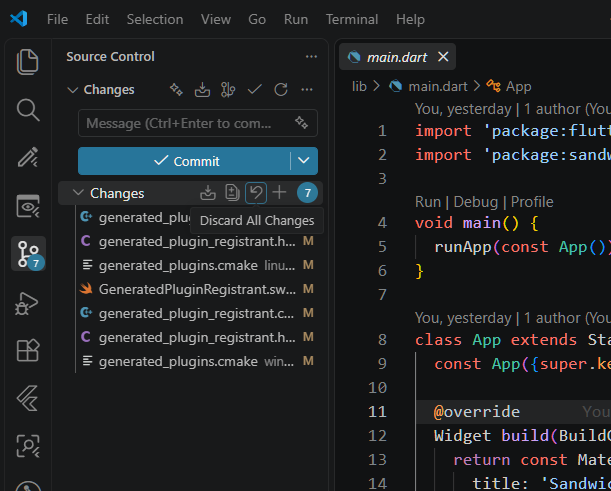

### Switch to branch 2

You can switch branches from the status bar at the bottom of VS Code. Click the current branch name, then select branch `2`, as shown below:

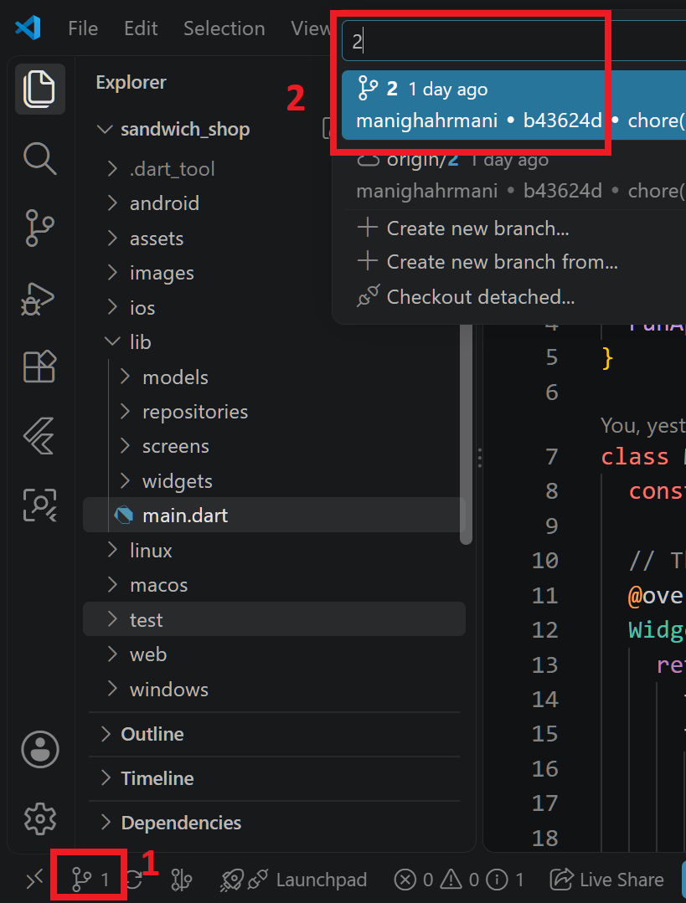

Alternatively, open the integrated terminal from the Command Palette with **Ctrl + Shift + P** on Windows or **⌘ + Shift + P** on macOS, run **Terminal: Create New Integrated Terminal**, then run:

```bash
git checkout 2
```

The `checkout` command replaces the files in your working folder with the files from branch `2`. Check the status bar now says `2` before continuing. If Git refuses to switch branches, return to the Source Control panel and commit or discard your uncommitted changes first.

This is what you should see when you run your app now:

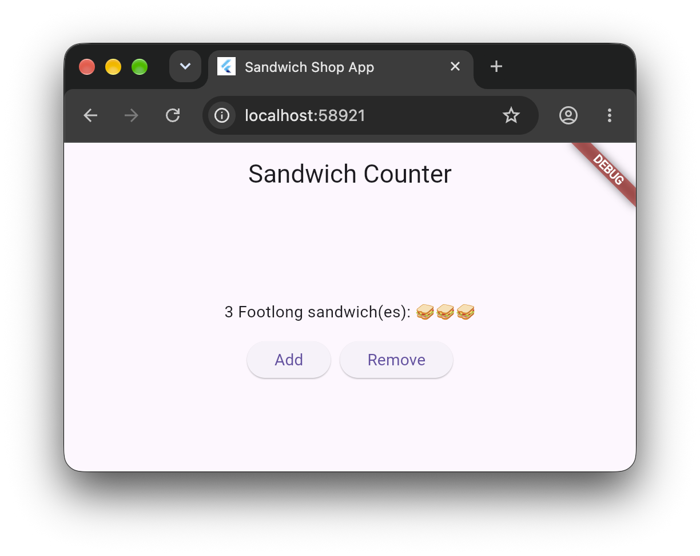

## The need for structured data

At the end of Worksheet 2, the Sandwich Shop app displayed a single counter on a single screen. The word "Footlong" and the maximum order quantity were written directly into the widgets. A real shop offers several items, each with its own name, description, price, and photograph.

Putting all of that information inside widget `build` methods makes the code hard to read and maintain. This is what we refer to as "hard-coded data" (i.e., data that is written directly in the code).

There are multiple issues with hard-coded data. For a start, if you change a price or add a new sandwich, you should not have to rewrite your UI widgets. To avoid this, we separate the app into layers:

- Models: plain Dart classes that define the shape of our data.
- Repositories: classes responsible for fetching and providing that data.
- Views: the pages or generally the UI that displays the data and responds to the user.

So far we have `lib/main.dart` which is the only view in our app. In the southsea cinema repository, we have `views` folder containing the different screens of the app (e.g., `movie_listing.dart`, `home_view.dart`) as well as a `widgets` containing reusable UI components (`nav_drawer.dart`, the navigation drawer). We don't have any models or repositories in either of these projects yet.

This idea is called separation of concerns. In this worksheet we refactor the app to follow it, and we add navigation between two screens. For a better understanding of app architecture in Flutter, visit [the Flutter app architecture guide](https://docs.flutter.dev/app-architecture/guide). They recommend the Model-View-ViewModel (MVVM) pattern. Find below a illustration of the MVVM pattern in Flutter:

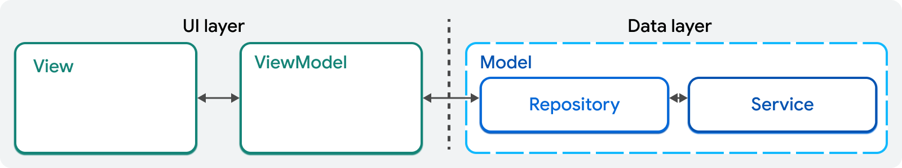

## Define the Sandwich data model

A data model is a class that represents a real-world concept in your app. For the sandwich shop, we need a model that holds the details of one sandwich. We will build it up field by field rather than pasting the whole class at once.

### Create the model class

In the VS Code Explorer, create a new folder `lib/models/` as shown below:

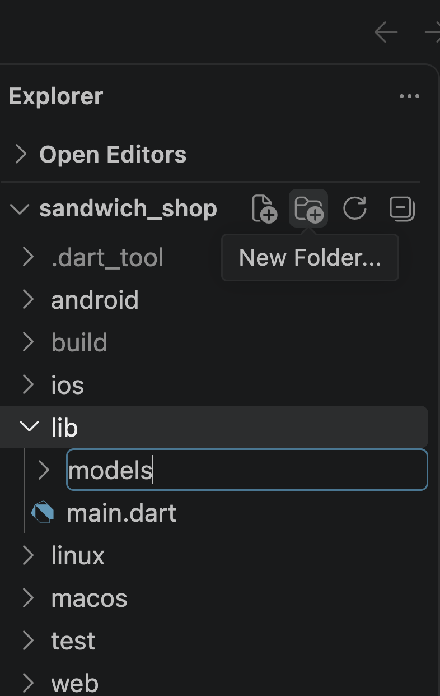

Then inside this folder, create a new file named `sandwich.dart`. See below:

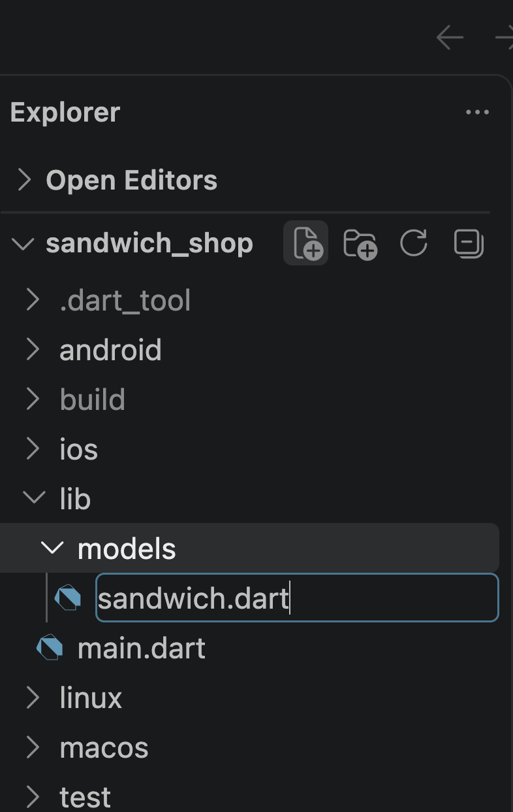

Paste the following inside `lib/models/sandwich.dart`:

```dart
class Sandwich {}
```

### Add the fields

Every sandwich on our menu needs an identifier, a display name, a description, a price, and a path to an image file. Add five `final` fields inside the class. String fields for `id`, `name`, `description`, and `imagePath`, and a double field for `price`. Your code should look like this now:

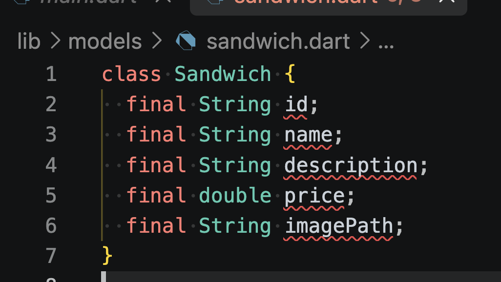

Marking each field `final` means that once a `Sandwich` is created, its values cannot change. This immutability prevents accidental edits elsewhere in the app. Note that `price` is a `double` because it holds pennies as well as pounds.

### Add the constructor

VS Code will show a red squiggly line because the `final` fields are never assigned. Add a constructor to set them. If you need a reminder on how to do constructors in Dart, refer to the last Dart worksheet in [worksheet 1](worksheet-1.md) or [the official Dart classes documentation](https://dart.dev/language/classes)

You should add a parameter for each field in the `Sandwich` class using the `this` keyword inside the constructor's parameter list (for example `this.id` asks for a value for `id` and sets it to the `id` field of the constructed instance). This is what it should look like now:

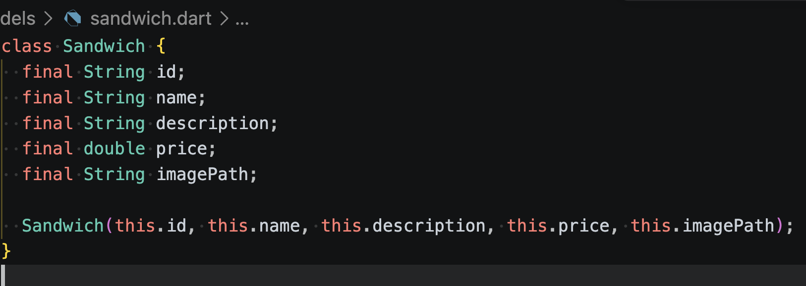

Update the constructor to use named parameters (inside curly braces). And mark them all as `required`, so that whoever creates a `Sandwich` must supply every value. This is what your code should look like now:

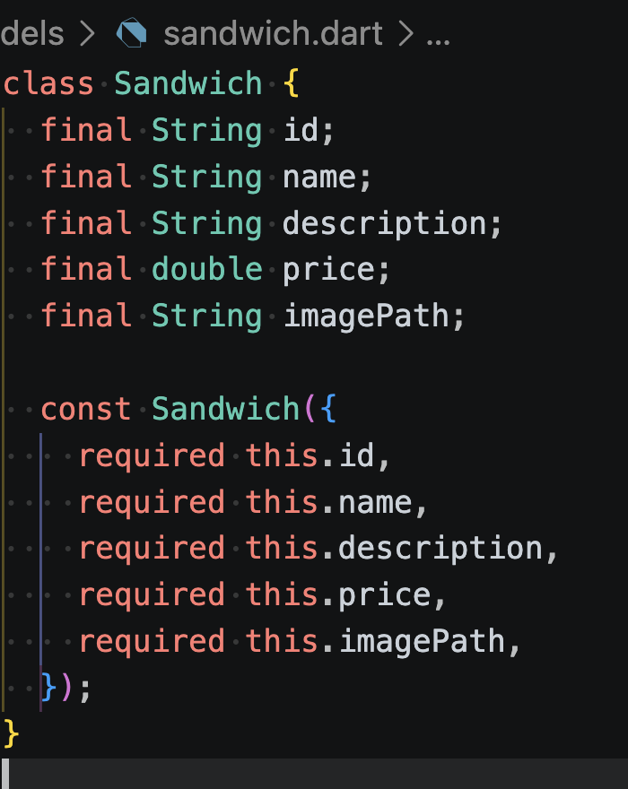

The `const` constructor is optional. It lets Flutter treat fixed sandwiches as compile-time constants, which is efficient.

### Commit your changes (1)

Save the file (**Ctrl + S** on Windows or **⌘ + S** on macOS). In the Source Control panel, stage `lib/models/sandwich.dart` and commit with the message `Add Sandwich data model`.

## Add asset images to the project

Apps often bundle images alongside their code, such as product photos and icons. In Flutter, these static files are called assets. They must live in your project directory and be declared in `pubspec.yaml`.

### Create the assets folder

Create a new folder `assets/images/` in the root of your project (at the same level as `lib` and `test`, not inside `lib`) as shown below:

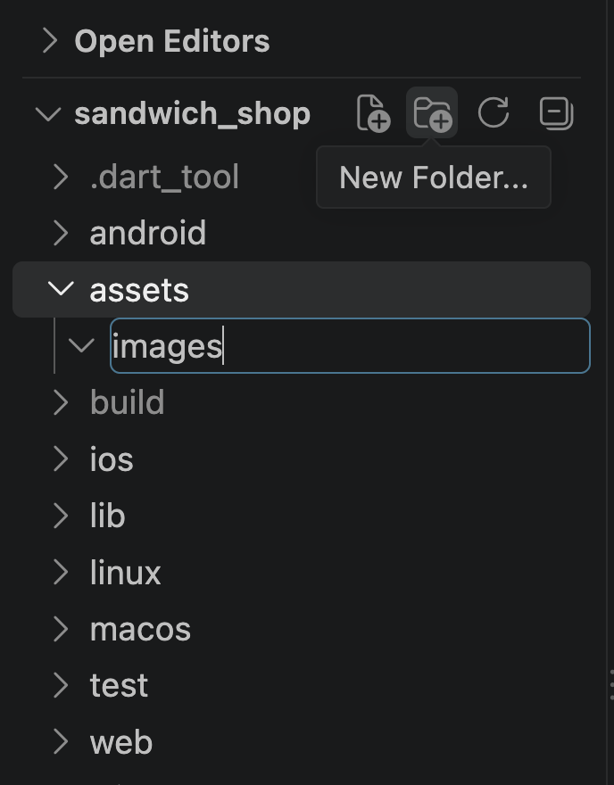

Use your AI of choice to generate or obtain two images of sandwiches: one footlong and one six-inch. We have done so and placed `footlong.jpeg` and `six_inch.jpeg` in the `assets/images/` folder. Here are our "fun" and very "original" little images. Feel free to use them.

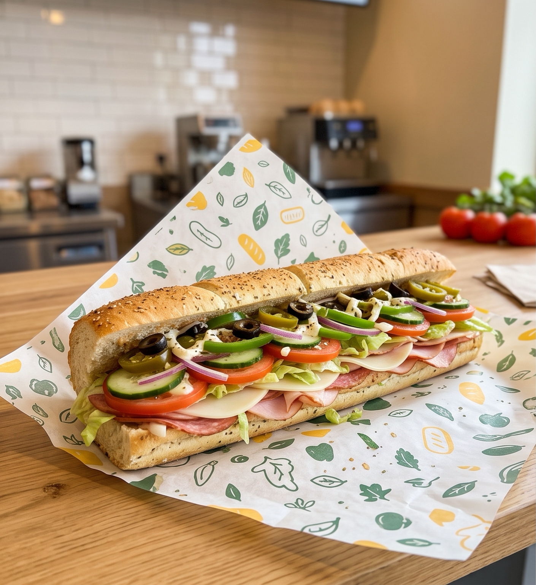
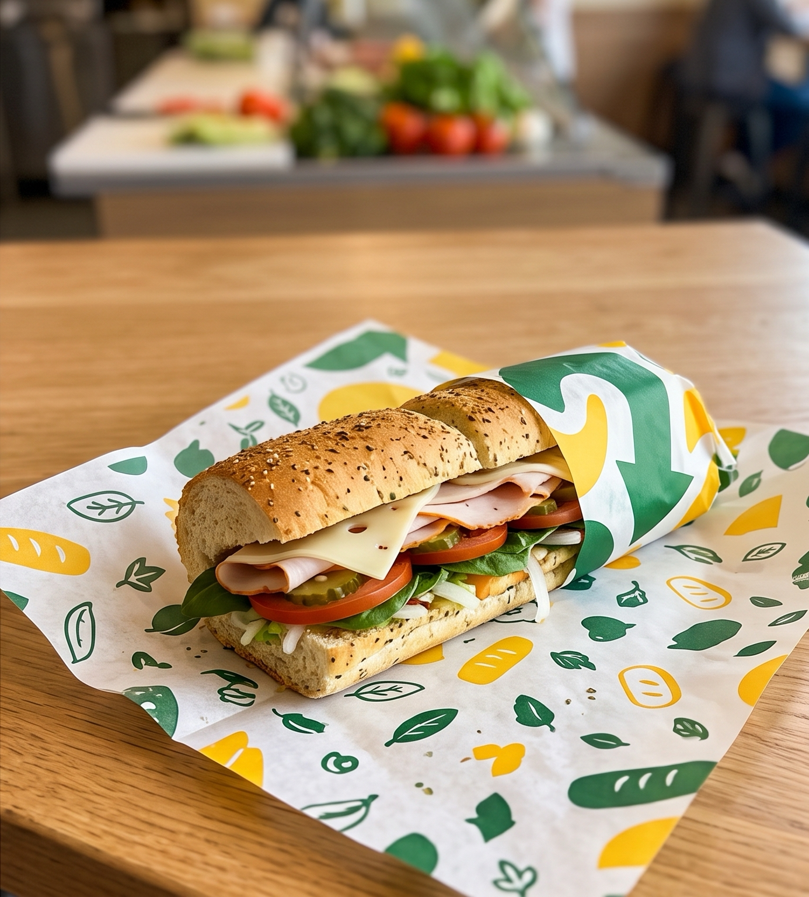

Your project structure should look like this:

```text
sandwich_shop/
├── assets/
│   └── images/
│       ├── footlong.jpeg
│       └── six_inch.jpeg
├── lib/
│   ├── models/
│   │   └── sandwich.dart
│   └── main.dart
└── pubspec.yaml
```

### Register assets in pubspec

Flutter does not bundle files automatically; you must register the folder in `pubspec.yaml`. This file uses YAML, a text format that is sensitive to indentation, so take care with spaces.

Open `pubspec.yaml`, find the `flutter:` section near the bottom, and add an `assets:` entry beneath it:

```yaml
flutter:
  uses-material-design: true
  assets:
    - assets/images/
```

Note that the `assets:` key is indented by two spaces under `flutter:`, and the list item by four spaces. Listing the folder with a trailing slash includes every file inside it. The result should look like this:


Save the file, or better yet enable auto-save (open Command Palette with **Ctrl + Shift + P** on Windows or **⌘ + Shift + P** on macOS, then search for "Auto Save"). Then open a terminal (in Command Palette search for "Terminal: Create New Terminal") and run `flutter pub get` so Flutter picks up the change:

```bash
flutter pub get
```

You need to make sure you are in the root directory of your Flutter project when you run this command. The result of the command should look like this:


Read the [official guide to adding assets and images](https://docs.flutter.dev/ui/assets/assets-and-images) if you would like more detail.

### Commit your changes (2)

Stage your two image files and the modified `pubspec.yaml`, then commit with the message `Register sandwich image assets in pubspec`.

## Abstract data access with a repository

Now that we have a model and images, we need somewhere to store and hand out the menu items.

### Understand the repository pattern

A repository is a class that sits between your data and your UI. It exposes simple methods to read and write data, and hides where that data actually comes from.

For now our repository returns a fixed list of sandwiches written into the code (mock data). Later, you will swap that for a local database and cloud requests. Because the widgets only ever talk to the repository, none of the UI has to change when the data source does.

### Create the SandwichRepository class

Create a new folder `lib/repositories/`, and inside it a file named `sandwich_repository.dart`. See below:


Import your `Sandwich` model with the following line:

```dart
import 'package:sandwich_shop/models/sandwich.dart';
```

Then declare a class called `SandwichRepository`. Inside this class, create a method `getSandwiches()` that returns a list of `Sandwich` objects. For now, this list can be empty as shown in the image below:

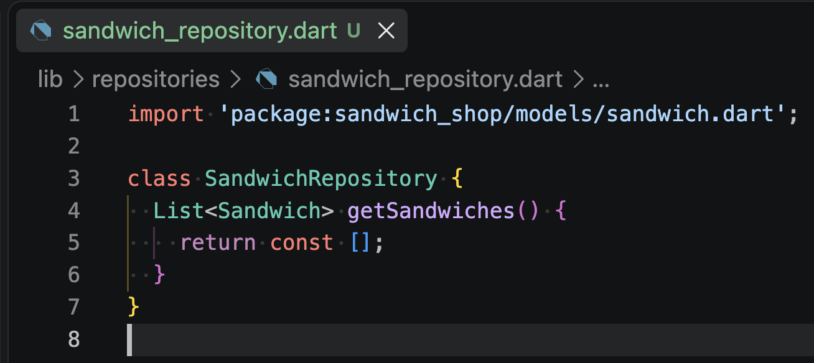

### Return mock sandwich items

Now fill `getSandwiches()` with two (`const`) instances of the `Sandwich` class that you made in `lib/models/sandwich.dart`. Create an ID for them, give them a name, a description, a price, and an image path. Note that the image paths must match the files you placed in `assets/images/`, for example `assets/images/footlong.jpeg`.

This is what our repository looks like after adding the mock data:

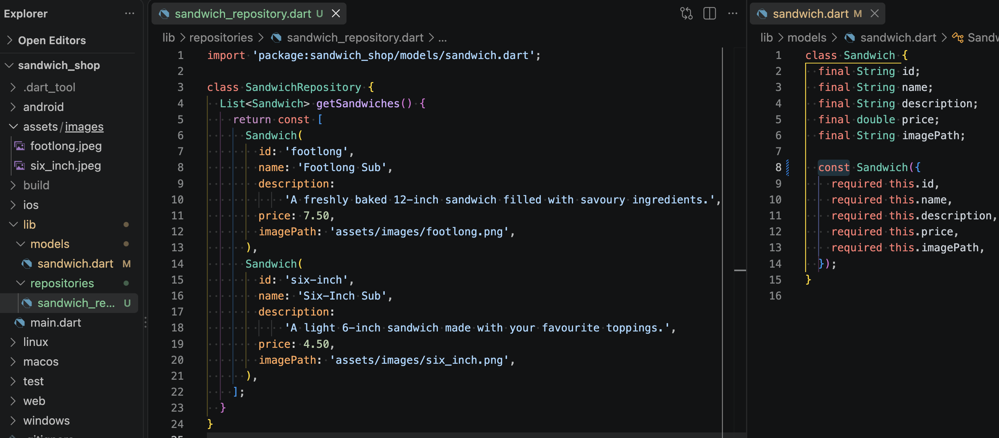

This repository is now the single source of truth for menu data. We will use it soon when building the menu interface.

### Commit your changes (3)

Stage `lib/repositories/sandwich_repository.dart` and commit with the message `Create SandwichRepository with mock menu data`.

## Build the menu interface

With data and images ready, we can build a card to show one sandwich, then a screen that lists them.

### Create the SandwichCard widget

Create a new folder `lib/widgets/`, and inside it a file named `sandwich_card.dart`. This widget presents a single sandwich: its image, name, description, price, and an order button, all inside a Card widget (a Material surface with rounded corners and a shadow).

Take a look at the documentation for the [`Card`](https://api.flutter.dev/flutter/material/Card-class.html) widget to understand its properties and how it works.

Start by importing `package:flutter/material.dart` and your `Sandwich` model (`package:sandwich_shop/models/sandwich.dart`) in your `sandwich_card.dart` file.

Then make a `StatelessWidget` called `SandwichCard` (similar to `OrderItemDisplay` in `main.dart`). It should have a `final` field for the `Sandwich` object that it will display. It also needs a constructor that takes this `Sandwich` as a required parameter (in addition to `super.key`).

This is what your `SandwichCard` class should look like at this point:

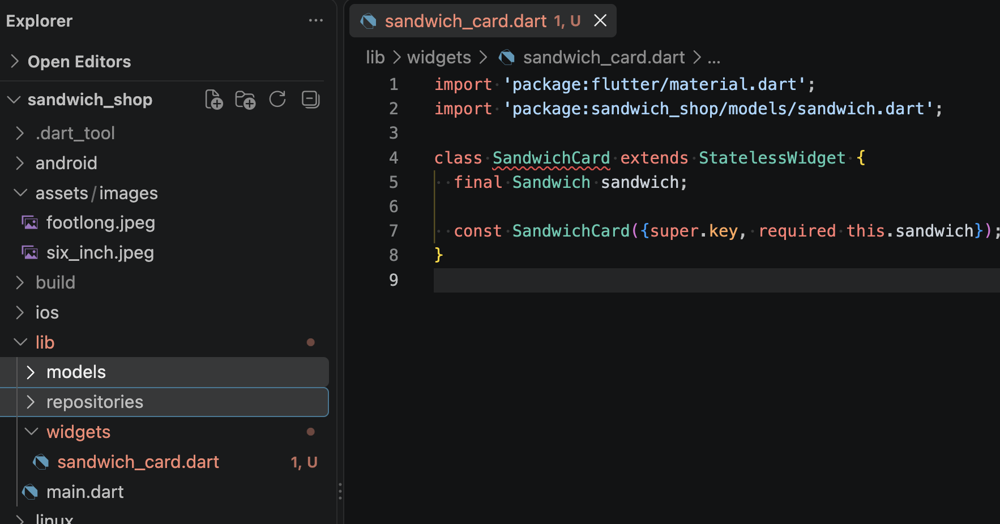

You should expect a "Missing concrete implementation of 'StatelessWidget.build'." error at this point because we haven't added the `build` method yet. So make one (similar to `OrderItemDisplay` in `main.dart`). For now, have the build method take a `BuildContext` and return a `Widget`. The widget for now can be a `Card` with a single child `Column`. Your `build` method should look like this:

```dart
  @override
  Widget build(BuildContext context) {
    return Card(
      child: Column(
        crossAxisAlignment: CrossAxisAlignment.start,
        children: [],
      ),
    );
  }
```

Use the Quick Fix feature to fix the blue warnings (and add the `const` keyword where appropriate).

Another nice feature of VS Code allows you to quickly wrap a widget with another widget. Hover your mouse over the `Column` widget, click the lightbulb icon, and select "Wrap with Padding" (or any other widget you want to wrap it with). It should look like this:

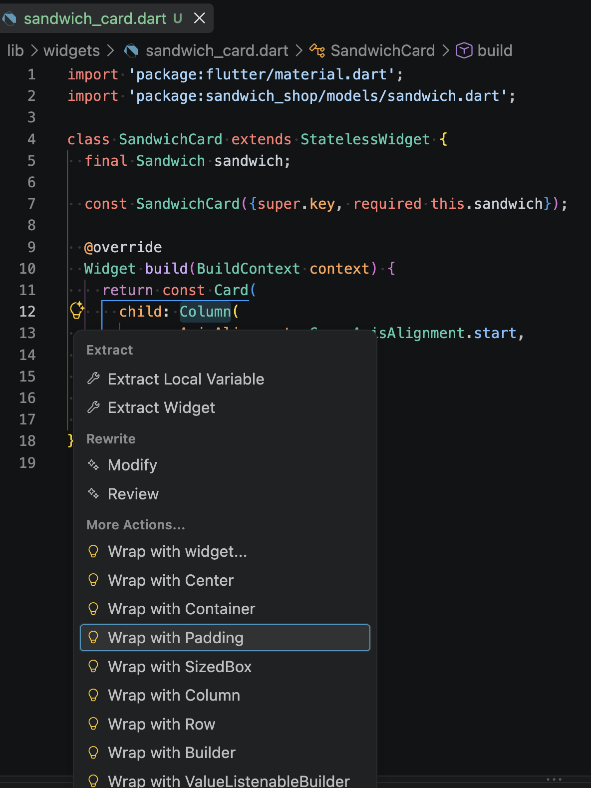

`EdgeInsets` is used to define the padding and margin for widgets. You can go with the default value that Flutter provides, or customise it later if needed.

Next check the `margin` property of the `Card` widget. The `margin` defines the space outside the card, separating it from other widgets. You can see this property when you hover your mouse over the `Card` widget in VS Code:

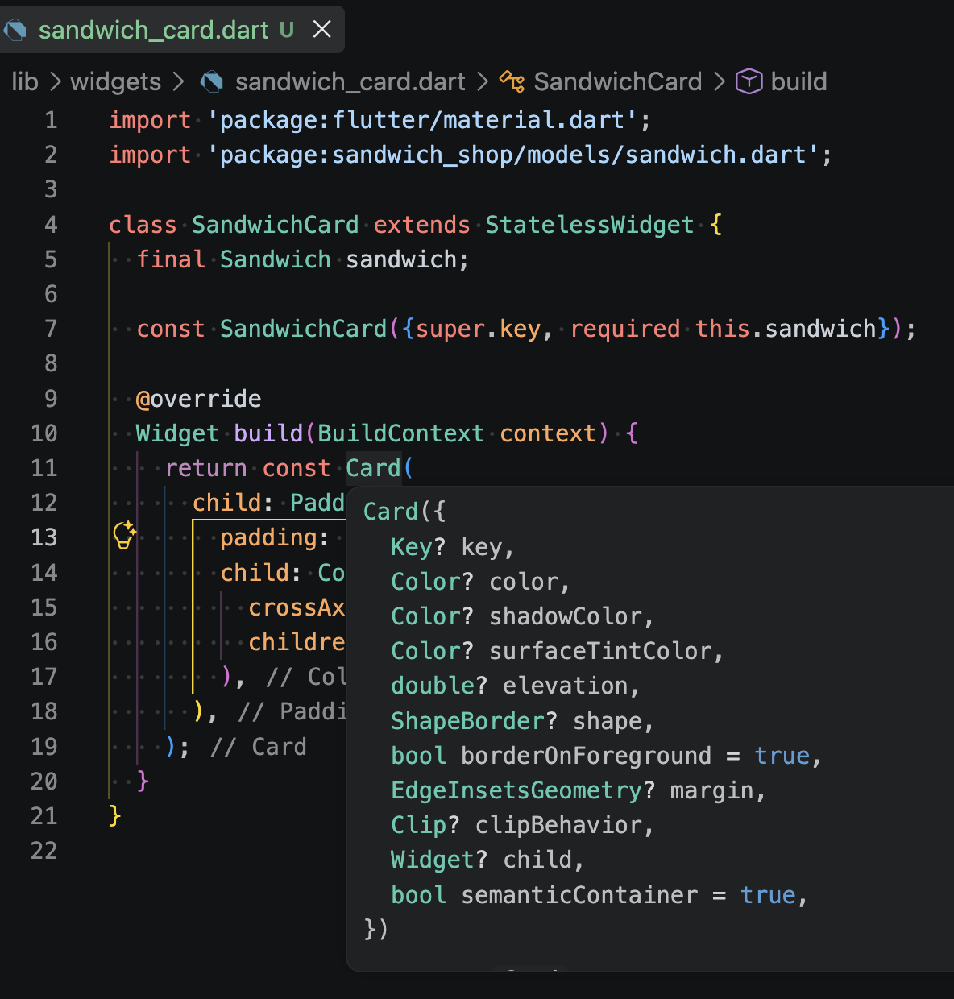

Add a `margin` to the `Card` above the `child` property containing the `Padding`. Use the value `EdgeInsets.symmetric` to provide horizontal and vertical spacing. This is what our code looks like now, yours may look slightly different but that's fine:

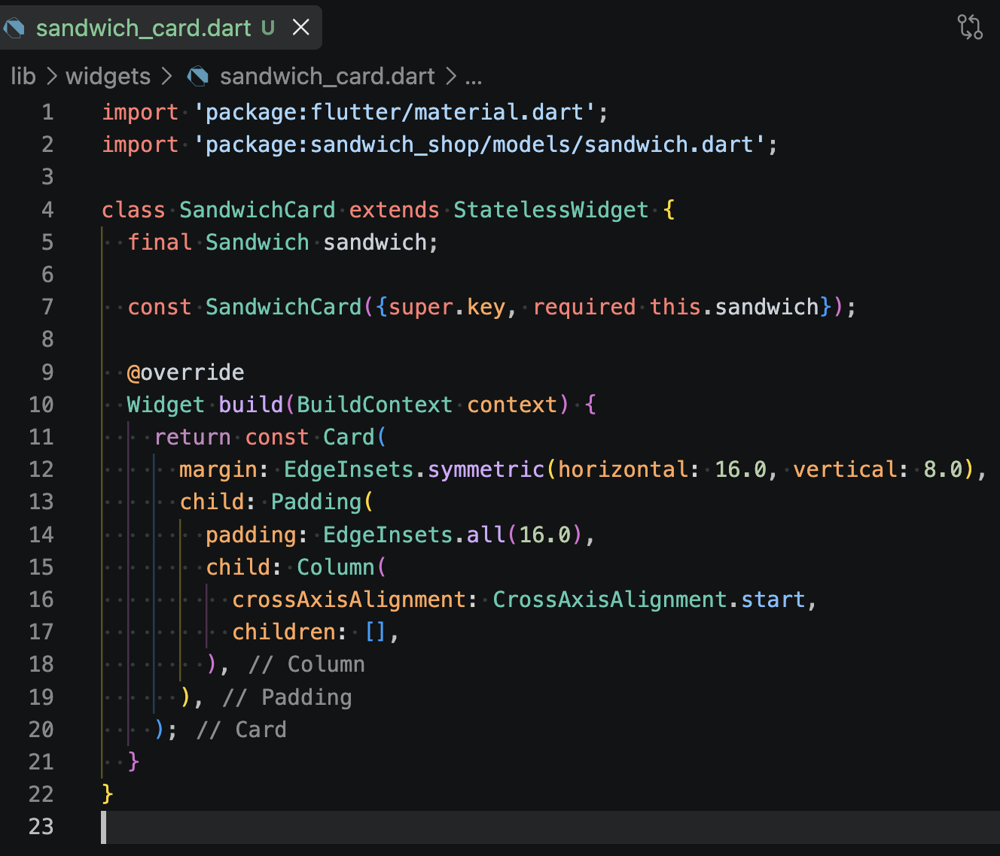

### Lay out the image and text

In `lib/widgets/sandwich_card.dart`, our `Column` currently has an empty `children: []` list. We want the top section of the card to display the sandwich photo on the left, and its title and description on the right.

To arrange widgets side by side horizontally, add a `Row` to the `Column`'s `children`:

```dart
Row(
  crossAxisAlignment: CrossAxisAlignment.start,
  children: [],
),
```

Setting `crossAxisAlignment` to `CrossAxisAlignment.start` aligns the image and text at the top of the row.

Now add the image inside the `Row`'s `children`:

```dart
Image.asset(
  sandwich.imagePath,
  width: 80,
  height: 80,
  fit: BoxFit.cover,
),
```

Since `sandwich.imagePath` is a dynamic reference to the image path stored in our model, it allows each `SandwichCard` to display the correct image for the sandwich it represents. Note that this also causes an error and clashes with the `const` keyword (if you have one for the `Card`).

Make the changes, use the Quick Fix to remove or add the `const` keyword where necessary. This is what your `Card` should look like:

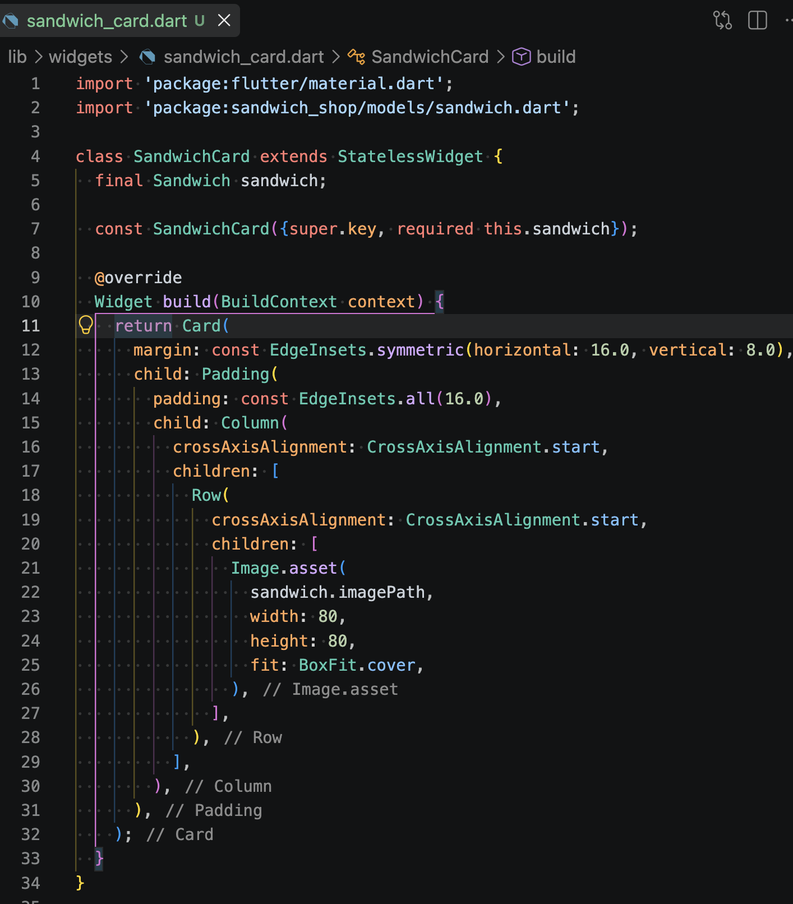

Setting both `width` and `height` to `80` constrains the picture to a neat square. If your images are not square, set `fit: BoxFit.cover` to ensure they fill the square without distorting its aspect ratio, cropping any excess.

Next, add horizontal spacing after the image with a `SizedBox`:

```dart
const SizedBox(width: 16),
```

To display the sandwich name above its description, we need a vertical stack of text next to the image. Try this code for a start. We have placed a `Column` widget inside the `Row`'s `children`.

```dart
Column(
  crossAxisAlignment: CrossAxisAlignment.start,
  children: [
    Text(
      sandwich.name,
      style: const TextStyle(
        fontSize: 18,
        fontWeight: FontWeight.bold,
      ),
    ),
    const SizedBox(height: 8),
    Text(
      sandwich.description,
      style: const TextStyle(color: Colors.black54),
    ),
  ],
),
```

But this can cause an overflow error (a yellow-and-black striped banner) because the text tries to take infinite width.

To prevent overflow, wrap the `Column` in an [`Expanded`](https://api.flutter.dev/flutter/widgets/Expanded-class.html) widget. An `Expanded` widget tells Flutter to take all remaining horizontal space in the row and constrain the text to wrap within it. Remove the plain `Column` and replace it with the `Expanded` widget as shown below (add it as a child of the `Row` in `SandwichCard`).

```dart
Expanded(
  child: Column(
    crossAxisAlignment: CrossAxisAlignment.start,
    children: [
      Text(
        sandwich.name,
        style: const TextStyle(
          fontSize: 18,
          fontWeight: FontWeight.bold,
        ),
      ),
      const SizedBox(height: 8),
      Text(
        sandwich.description,
        style: const TextStyle(color: Colors.black54),
      ),
    ],
  ),
),
```

We make the sandwich title bold with `fontSize: 18`, and use `Colors.black54` on the description to give secondary text a softer, muted appearance (feel free to remove `black54` and after the dot, see other available colours in the `Colors` class).

### Add the price and order button

Below the image and text `Row`, add vertical space inside the outer `Column`:

```dart
const SizedBox(height: 16),
```

Remember to use the fold feature of VS Code to fold the `Row` containing the image and text, so you can focus on the children of the outer `Column` as shown in the image below:

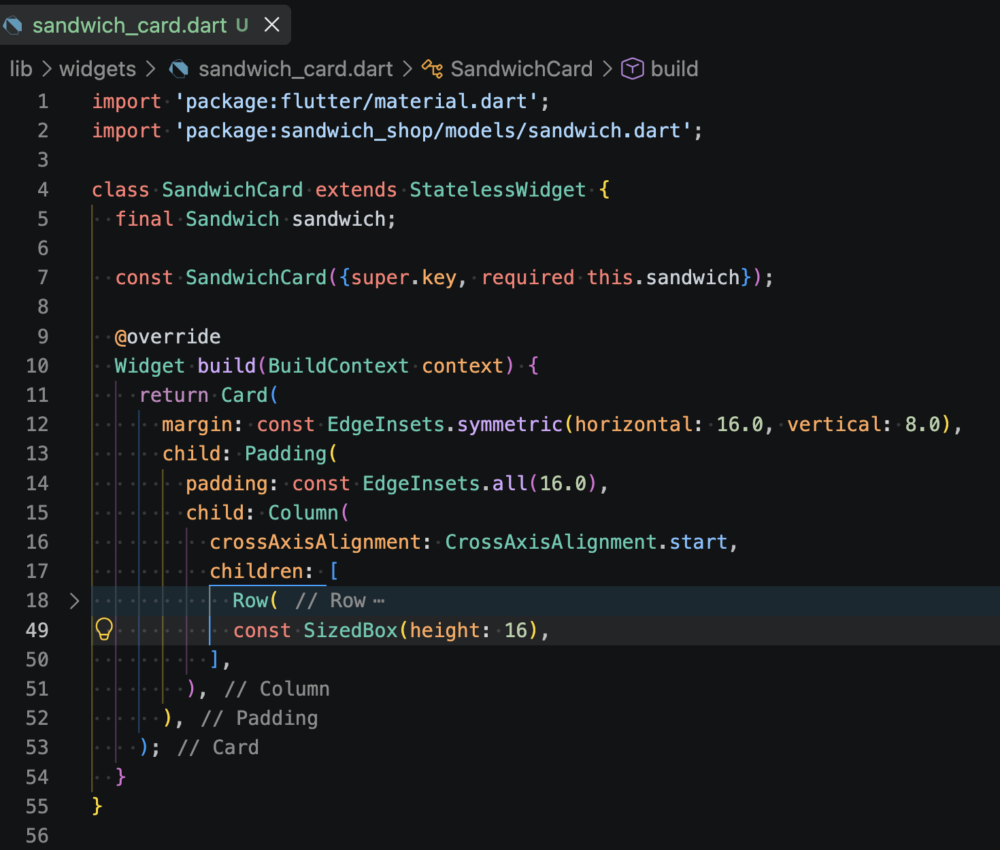

Now add a second `Row` (inside the children of the outer `Column`) to hold the price on the left and an Order button on the right:

```dart
Row(
  mainAxisAlignment: MainAxisAlignment.spaceBetween,
  children: [
    Text(
      '£${sandwich.price.toStringAsFixed(2)}',
      style: const TextStyle(
        fontSize: 16,
        fontWeight: FontWeight.bold,
      ),
    ),
    ElevatedButton(
      onPressed: () {},
      child: const Text('Order'),
    ),
  ],
),
```

Setting `mainAxisAlignment: MainAxisAlignment.spaceBetween` distributes free horizontal space between the children, pushing the price to the far left and the button to the far right.

`sandwich.price` is a `double`. In Dart, calling `toStringAsFixed(2)` formats the number to exactly two decimal places (for example `7.5` becomes `'7.50'`), ensuring currency is formatted properly.

The `onPressed` callback is empty for now; we will connect it to navigate to the order screen shortly.

Make sure your `SandwichCard` widget in `lib/widgets/sandwich_card.dart` looks like this now (notice that we have folded the innermost widgets):


### Commit your changes (4)

Save your file. In the Source Control panel, stage `lib/widgets/sandwich_card.dart` and commit with the message `Create SandwichCard widget`.

### Build the MenuScreen widget

Now that we have a reusable `SandwichCard` widget, we need a screen that retrieves all menu items from `SandwichRepository` and presents them in a scrollable list.

Create a new folder named `lib/screens/`, and inside it create a new file named `menu_screen.dart`.

Open `lib/screens/menu_screen.dart` and add the necessary imports at the top:

```dart
import 'package:flutter/material.dart';
import 'package:sandwich_shop/models/sandwich.dart';
import 'package:sandwich_shop/repositories/sandwich_repository.dart';
import 'package:sandwich_shop/widgets/sandwich_card.dart';
```

Now declare a `StatelessWidget` named `MenuScreen`. It should have a const constructor that only takes the optional `super.key` parameter.

In its build method, define a `final` instance of `SandwichRepository`. Also define a `final` list of `Sandwich` objects (`final List<Sandwich> sandwiches`). Call the `getSandwiches` method of the repository to populate the list. You will use this list to populate a `ListView` widget. You can read about it on the [Flutter documentation](https://api.flutter.dev/flutter/widgets/ListView-class.html).

This is what our screen should ideally look like. Yours may differ slightly based on your variable names.

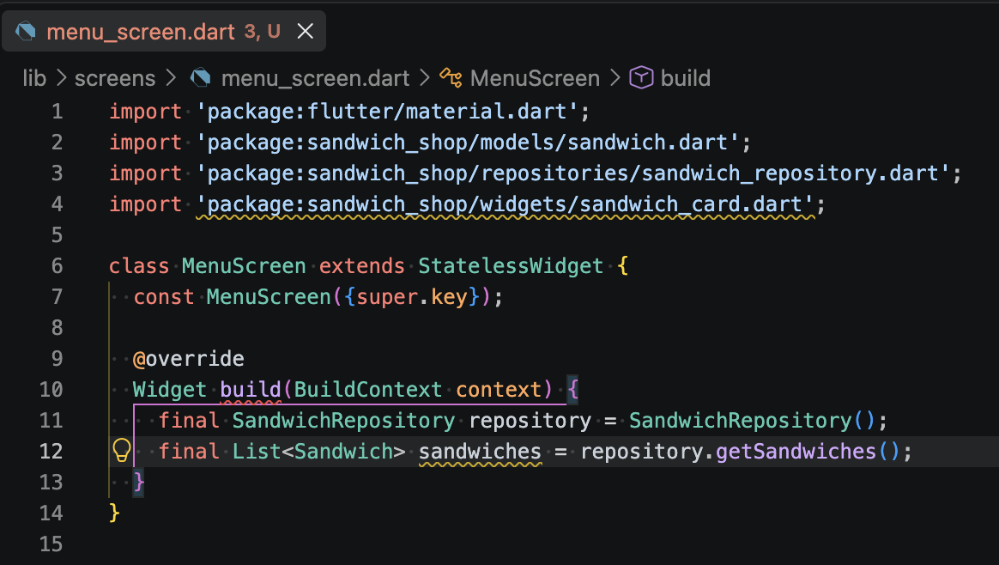

Return a `Scaffold` widget with an `AppBar` set to a `Text` widget (e.g., set to "Sandwich Shop Menu") and a `ListView.builder` as the body. `ListView.builder` must have a `itemBuilder` set to a function that takes `context` and `index` and returns what each row should display. In our case, the `itemBuilder` should return a `SandwichCard` configured with `sandwiches[index]`.

`ListView.builder` also needs an `itemCount` property to specify the total number of items in the list. This helps Flutter determine how many times to call the `itemBuilder` function. In our case, let's set it to `sandwiches.length`.

This is what our `MenuScreen` should ideally look like:

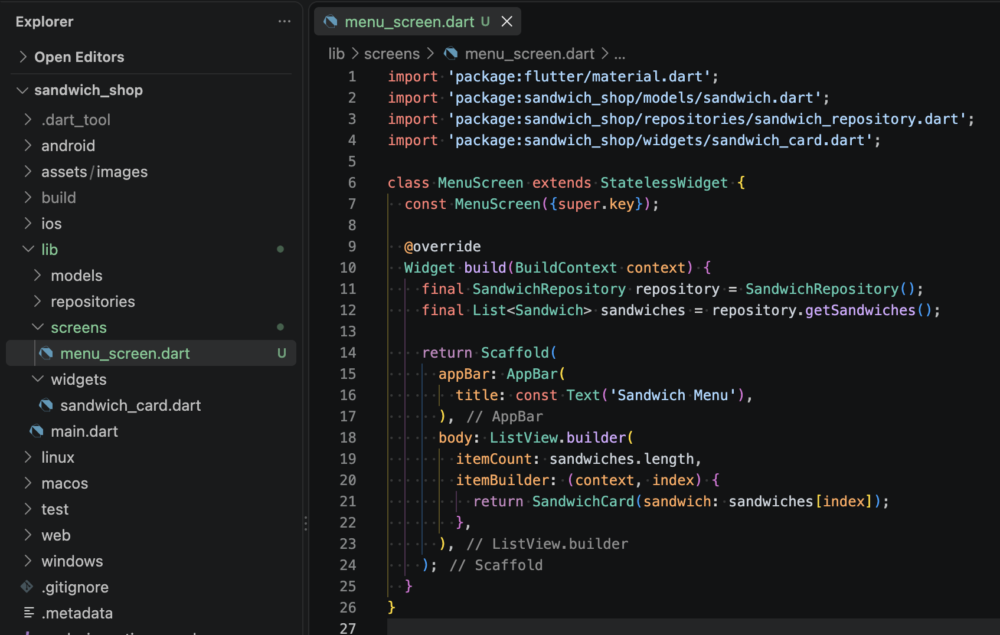

Notice how we use [`ListView.builder`](https://api.flutter.dev/flutter/widgets/ListView/ListView.builder.html):

- A standard `Column` does not scroll when cards exceed screen height.
- A standard `ListView(children: [...])` builds every child in memory all at once.
- `ListView.builder` builds each row on demand (lazily) as it scrolls into view, recycling items that move out of view to preserve memory.
- `itemCount: sandwiches.length` tells Flutter how many items exist in total.
- `itemBuilder: (context, index)` is a function called for each row position `index` (0, 1, 2, ...), returning a `SandwichCard` configured with `sandwiches[index]`.

To explore scrolling lists further, watch [Widget of the Week: ListView](https://www.youtube.com/watch?v=KJpkjHGiI5A).

### Set MenuScreen as the home screen

Now that we have the `MenuScreen`, we need to update the application to load it on launch.

Open `lib/main.dart`. At the top of the file, import `menu_screen.dart`:

```dart
import 'package:sandwich_shop/screens/menu_screen.dart';
```

In the `App` widget, change the `home` property from `OrderScreen` to `const MenuScreen()`:

```dart
class App extends StatelessWidget {
  const App({super.key});

  @override
  Widget build(BuildContext context) {
    return const MaterialApp(
      title: 'Sandwich Shop App',
      home: MenuScreen(),
    );
  }
}
```

Save the file and run the application. Your app should now display the menu screen with cards for each sandwich, as shown below:


### Commit your changes (5)

In the Source Control panel, stage `lib/screens/menu_screen.dart` and `lib/main.dart`, then commit with the message `Display menu items using MenuScreen and ListView.builder`.

## Navigate between screens and pass data

Tapping the Order button currently does nothing. We now connect the menu to an order screen and pass the chosen sandwich details across.

### Understand stack-based navigation

Flutter manages navigation using a stack data structure handled by the `Navigator`.

Think of screens like a stack of plates:

- When the application starts, `MenuScreen` sits at the bottom of the stack.
- When you navigate to a new screen, `Navigator.push()` places that new route on top of the stack. The top route is what the user sees.
- When the user presses the back button, `Navigator.pop()` removes the top screen from the stack, uncovering the screen underneath.

`MaterialPageRoute` is a modal route that provides platform-appropriate transitions (such as sliding across from the right) and automatically adds a back button to the `AppBar`.

To read more about navigation, see the [stack-based navigation tutorial](https://docs.flutter.dev/learn/pathway/tutorial/navigation) and the [send data to a new screen recipe](https://docs.flutter.dev/cookbook/navigation/passing-data).

### Move OrderScreen into its own file

Refactoring is a process of restructuring existing code without changing its external behaviour. It helps improve code organization, readability, and maintainability. Usually, we refactor code by moving related classes and widgets into separate files, reducing the size of individual files and making the project easier to navigate.

At the end of Worksheet 2, `OrderScreen`, `_OrderScreenState`, and `OrderItemDisplay` were located in `lib/main.dart`. Each screen belongs in its own file under `lib/screens/`.

Create a new file named `lib/screens/order_screen.dart`.

Cut `OrderScreen`, `_OrderScreenState`, and `OrderItemDisplay` out of `lib/main.dart` (**Ctrl + X** on Windows or **⌘ + X** on macOS) and paste them into `lib/screens/order_screen.dart`. Add the imports at the top:

```dart
import 'package:flutter/material.dart';
import 'package:sandwich_shop/models/sandwich.dart';
```

This is what `order_screen.dart` and `main.dart` should look like after the refactor:

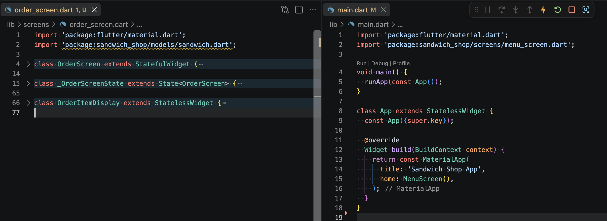

### Accept a Sandwich in OrderScreen

In Worksheet 2, `OrderScreen` hardcoded the word "Footlong". Because each card represents a different sandwich, `OrderScreen` should receive the selected `Sandwich` model when opened.

Open `lib/screens/order_screen.dart`. Add a `final Sandwich sandwich;` field and make it a `required` parameter in the `OrderScreen` constructor:

```dart
class OrderScreen extends StatefulWidget {
  final Sandwich sandwich;
  final int maxQuantity;

  const OrderScreen({
    super.key,
    required this.sandwich,
    this.maxQuantity = 10,
  });

  @override
  State<OrderScreen> createState() {
    return _OrderScreenState();
  }
}
```

Now let's update `_OrderScreenState` to use the passed sandwich. Recall that a `State` class accesses the configuration fields of its parent `StatefulWidget` using the `widget` property.

Update the `AppBar` title to display the sandwich name:

```dart
appBar: AppBar(
  title: Text('Order ${widget.sandwich.name}'),
),
```

Then update `OrderItemDisplay` inside `_OrderScreenState` to use `widget.sandwich.name` instead of the hardcoded `'Footlong'`:

```dart
OrderItemDisplay(
  _quantity,
  widget.sandwich.name,
),
```

Your `lib/screens/order_screen.dart` file should now look like this:


### Commit your changes (6)

In the Source Control panel, stage `lib/screens/order_screen.dart` and `lib/main.dart`, then commit with the message `Refactor OrderScreen to receive a Sandwich model`.

### Connect SandwichCard to OrderScreen

Now we connect the Order button in `SandwichCard` to open `OrderScreen` for the chosen sandwich.

Open `lib/widgets/sandwich_card.dart` and import `order_screen.dart` at the top:

```dart
import 'package:sandwich_shop/screens/order_screen.dart';
```

Find the `ElevatedButton` and replace its empty `onPressed: () {}` callback with `Navigator.push()`:

```dart
ElevatedButton(
  onPressed: () {
    Navigator.push(
      context,
      MaterialPageRoute(
        builder: (context) {
          return OrderScreen(sandwich: sandwich);
        },
      ),
    );
  },
  child: const Text('Order'),
),
```

This is what your `SandwichCard` should look like after adding the navigation logic:

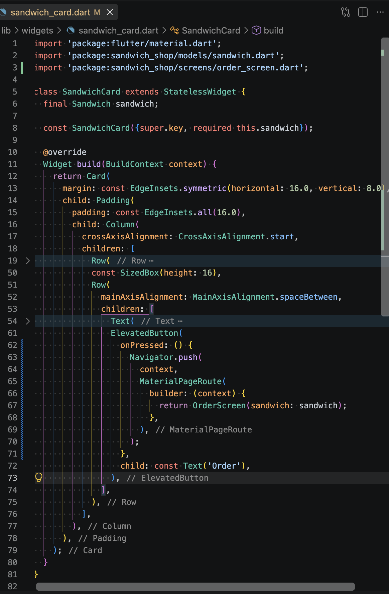

Make sure you have hot reload enabled so that your changes are reflected immediately in the running application. When the Order button is tapped, `Navigator.push()` pushes a `MaterialPageRoute` onto the navigation stack using the current `BuildContext`. The `builder` function constructs an `OrderScreen`, passing this card's `sandwich` into it.

### Test the complete navigation flow

Try the following steps on your app:

1. Tap Order on the Footlong Sub card. The app transitions to an order screen titled "Order Footlong Sub".
2. Tap Add several times to increase the quantity and watch the sandwich emojis appear.
3. Tap the back arrow in the app bar. The order screen pops off the stack and returns to the menu.
4. Tap Order on the Six-Inch Sub card. You reach an order screen titled "Order Six-Inch Sub" with its own counter starting at zero.

### Commit your changes (7)

In the Source Control panel, stage `lib/widgets/sandwich_card.dart` and commit with the message `Implement in-page navigation from SandwichCard to OrderScreen`.

## Exercises

As in Worksheet 1 and Worksheet 2, these exercises apply to your Southsea Cinema coursework and, together with the Worksheet 4 exercises, prepare you for Demo 2 (during Demo Window 2). See the [Southsea Cinema coursework brief](https://portdotacdotuk-my.sharepoint.com/:w:/g/personal/mani_ghahremani_port_ac_uk/IQDtIJB3bM7gQ4p03eLUngyyAd7JuhjhHuNA1l0H-qCy3Jw). Be sure to commit your changes regularly as you work through each exercise; small, frequent commits with clear messages are assessed as part of your demo quality mark. You must demonstrate your work for a sign-off during your own timetabled practical session.

In Worksheet 2 you built a hardcoded movie listing page for Dracula. For Demo 2, your cinema app must show a browseable home page with cards for films that are screening, and a booking button on each card must open the listing page for that film.

1. Create a `Movie` data model in `lib/models/movie.dart` inside your `southsea_cinema` fork. Refer to the [example listing page on the Southsea Cinema website](https://southseacinema.savoysystems.co.uk/SouthseaCinema.dll/TSelectItems.waSelectItemsPrompt.TcsWebMenuItem_687.TcsWebTab_688.TcsProgramme_26436) (or the movie listing page you built in Worksheet 2) to see what properties a movie needs (such as its title, age rating, synopsis, image, screening time, and price). Define these as `final` fields and provide a constructor with named, `required` parameters.

2. Create an `assets/images/` folder in your `southsea_cinema` project if you have not already done so. Obtain poster images for the movies you wish to showcase (such as from the Southsea Cinema website or your own favourite films) and place them in this folder. Register `assets/images/` under the `flutter:` section of your `pubspec.yaml`, then run `flutter pub get`.

3. Create a `MovieRepository` class in `lib/repositories/movie_repository.dart`. Add a method that returns a list of mock `Movie` instances populated with sample details and image paths matching the assets you added.

4. Create a reusable `MovieCard` widget in `lib/widgets/movie_card.dart`. Display the movie title with age rating, poster image, synopsis, and screening time. Add a booking button and style the card to match the Southsea Cinema website, using the colours and text styles from `lib/constants.dart`.

5. Update `lib/views/home_view.dart` to fetch movies from `MovieRepository` and display them in a scrollable list with `ListView.builder`. Your home page should display film cards with poster images and booking buttons as shown below:

    

6. Refactor `lib/views/movie_listing.dart` to accept a `Movie` object in its constructor and display that movie's details. Connect the booking button in `MovieCard` to navigate to `MovieListing` using `Navigator.push()` with a `MaterialPageRoute`, passing the selected `movie`.
