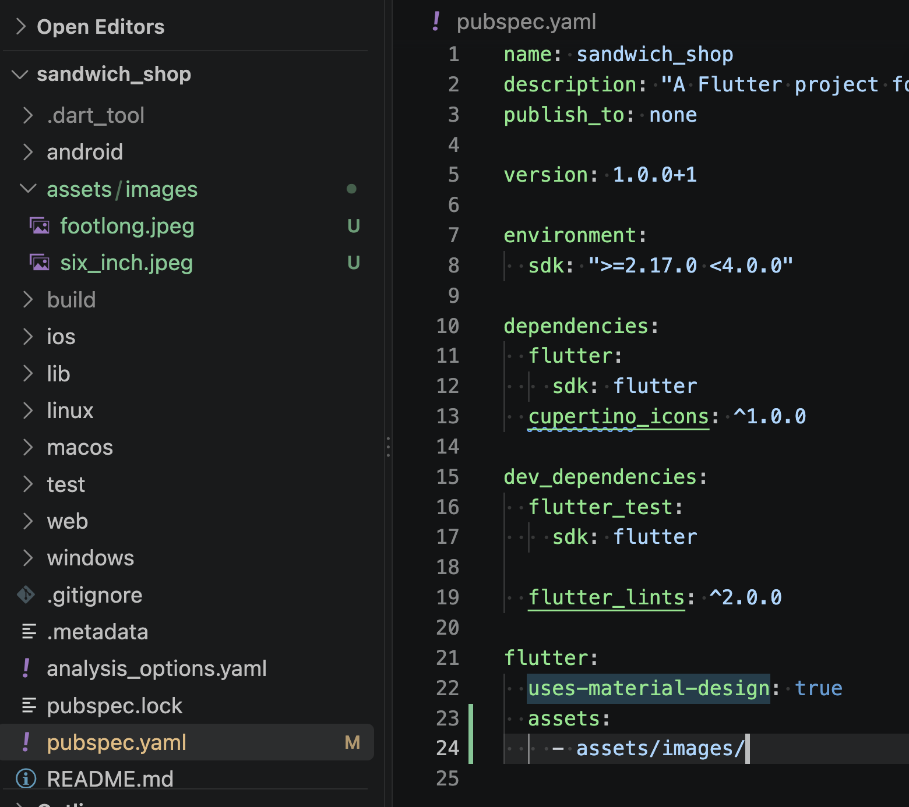
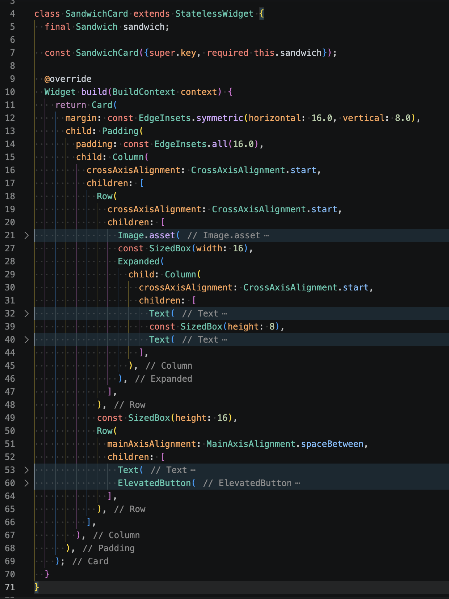
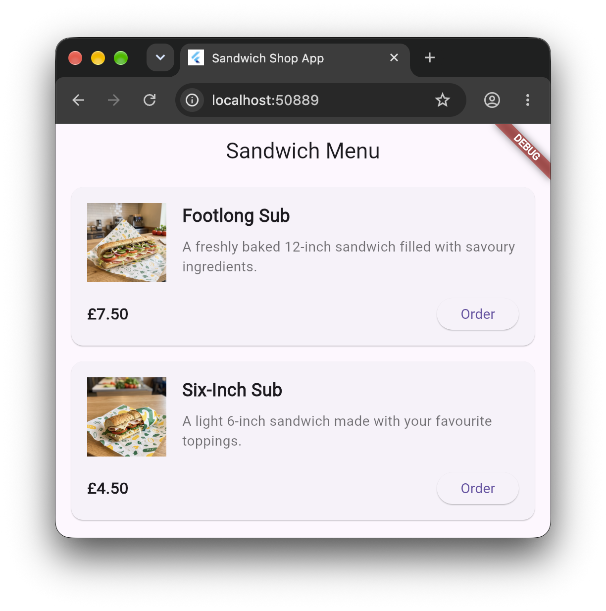
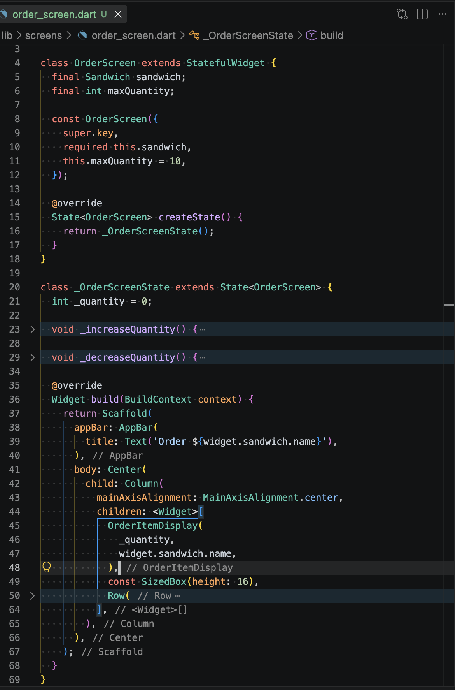
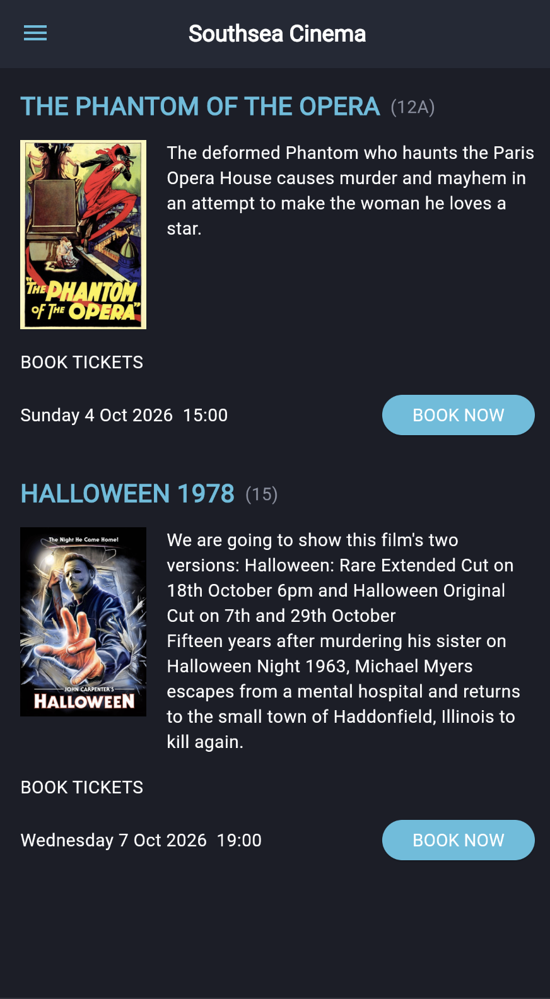

# Worksheet 3 — Data Models, Repositories, Assets and In-Page Navigation

## Table of contents

- [What you need to know beforehand](#what-you-need-to-know-beforehand)
- [Getting help](#getting-help)
- [Getting started](#getting-started)
- [The need for structured data](#the-need-for-structured-data)
- [Define the Sandwich data model](#define-the-sandwich-data-model)
  - [Create the model class](#create-the-model-class)
  - [Add the fields](#add-the-fields)
  - [Add the constructor](#add-the-constructor)
  - [Commit your changes (1)](#commit-your-changes-1)
- [Add asset images to the project](#add-asset-images-to-the-project)
  - [Create the assets folder](#create-the-assets-folder)
  - [Register assets in pubspec](#register-assets-in-pubspec)
  - [Commit your changes (2)](#commit-your-changes-2)
- [Abstract data access with a repository](#abstract-data-access-with-a-repository)
  - [Understand the repository pattern](#understand-the-repository-pattern)
  - [Create the SandwichRepository class](#create-the-sandwichrepository-class)
  - [Return mock sandwich items](#return-mock-sandwich-items)
  - [Commit your changes (3)](#commit-your-changes-3)
- [Build the menu interface](#build-the-menu-interface)
  - [Create the SandwichCard widget](#create-the-sandwichcard-widget)
  - [Lay out the image and text](#lay-out-the-image-and-text)
  - [Add the price and order button](#add-the-price-and-order-button)
  - [Commit your changes (4)](#commit-your-changes-4)
  - [Build the MenuScreen widget](#build-the-menuscreen-widget)
  - [Set MenuScreen as the home screen](#set-menuscreen-as-the-home-screen)
  - [Commit your changes (5)](#commit-your-changes-5)
- [Navigate between screens and pass data](#navigate-between-screens-and-pass-data)
  - [Understand stack-based navigation](#understand-stack-based-navigation)
  - [Move OrderScreen into its own file](#move-orderscreen-into-its-own-file)
  - [Accept a Sandwich in OrderScreen](#accept-a-sandwich-in-orderscreen)
  - [Commit your changes (6)](#commit-your-changes-6)
  - [Connect SandwichCard to OrderScreen](#connect-sandwichcard-to-orderscreen)
  - [Test the complete navigation flow](#test-the-complete-navigation-flow)
  - [Commit your changes (7)](#commit-your-changes-7)
- [Exercises](#exercises)

## What you need to know beforehand

Ensure that you have completed [Worksheet 1 — Dart, Git, GitHub and Flutter](./worksheet-1.md) and [Worksheet 2 — Stateless and Stateful Widgets](./worksheet-2.md). You should be comfortable creating `StatelessWidget` and `StatefulWidget` classes, calling `setState()` to update the user interface (UI), and arranging widgets with `Row`, `Column`, and `Scaffold`. You met `Image.asset` briefly in the Worksheet 2 exercises; we use it properly here.

## Getting help

To get support with this worksheet, follow the [Discord guide](https://portdotacdotuk-my.sharepoint.com/:p:/g/personal/mani_ghahremani_port_ac_uk/IQCMJP6IiR_bQoYUMdXJSRDYAWnajEALZYEXFZyrJkHS1QU) and post your questions there. You can also attend your timetabled practical sessions and ask a member of teaching staff for guidance.

## Getting started

You can continue directly with the repository you updated in Worksheet 2. Alternatively, switch to branch `2` of the [Sandwich Shop repository](https://github.com/manighahrmani/sandwich_shop/tree/2), which holds the complete solution from Worksheet 2:

```bash
git checkout 2
```

Ensure that your working tree is clean before starting. If you have uncommitted changes from earlier exercises, commit or stash them first. You can open the Source Control panel at any time with **Ctrl + Shift + G** on Windows or **⌃ + Shift + G** on macOS to review your changes.

## The need for structured data

At the end of Worksheet 2, the Sandwich Shop app displayed a single counter on a single screen. The word "Footlong" and the maximum order quantity were written directly into the widgets. A real shop offers several items, each with its own name, description, price, and photograph.

Putting all of that information inside widget `build` methods makes the code hard to read and maintain. If you change a price or add a new sandwich, you should not have to rewrite your UI widgets. To avoid this, we separate the app into layers:

- Models: plain Dart classes that define the shape of our data.
- Repositories: classes responsible for fetching and providing that data.
- Views and widgets: the UI that displays the data and responds to the user.

This idea is called separation of concerns. In this worksheet we refactor the app to follow it, and we add navigation between two screens. For a wider tour of the concepts used here, keep the [Flutter learning pathway](https://docs.flutter.dev/learn/pathway) open as you work.

## Define the Sandwich data model

A data model is a class that represents a real-world concept in your app. For the sandwich shop, we need a model that holds the details of one sandwich. We will build it up field by field rather than pasting the whole class at once.

### Create the model class

In the VS Code Explorer, create a new folder `lib/models/`, and inside it a new file named `sandwich.dart`. You can create a folder by right-clicking the `lib` folder and choosing **New Folder**, then right-clicking the new folder and choosing **New File**.

Start with an empty class:

```dart
class Sandwich {}
```

### Add the fields

Every sandwich on our menu needs an identifier, a display name, a description, a price, and a path to an image file. Add five `final` fields inside the class:

```dart
class Sandwich {
  final String id;
  final String name;
  final String description;
  final double price;
  final String imagePath;
}
```

Marking each field `final` means that once a `Sandwich` is created, its values cannot change. This immutability prevents accidental edits elsewhere in the app. Note that `price` is a `double` because it holds pennies as well as pounds.

### Add the constructor

VS Code will show a red squiggly line because the `final` fields are never assigned. Add a constructor to set them. We use named parameters (inside curly braces) marked `required`, so that whoever creates a `Sandwich` must supply every value:

```dart
class Sandwich {
  final String id;
  final String name;
  final String description;
  final double price;
  final String imagePath;

  const Sandwich({
    required this.id,
    required this.name,
    required this.description,
    required this.price,
    required this.imagePath,
  });
}
```

The `const` constructor lets Flutter treat fixed sandwiches as compile-time constants, which is efficient. For a refresher on Dart classes and constructors, see the [official Dart classes documentation](https://dart.dev/language/classes) and the module [Dart software and resources guide](https://portdotacdotuk-my.sharepoint.com/:w:/g/personal/mani_ghahremani_port_ac_uk/IQAeCWXLehKuTou1gTpjrNKRAcCHcRGxPJSinskA7x1opXg?e=lfIK0S).

Your `lib/models/sandwich.dart` file should now look like this:


### Commit your changes (1)

Save the file (**Ctrl + S** on Windows or **⌘ + S** on macOS). In the Source Control panel, stage `lib/models/sandwich.dart` and commit with the message `Add Sandwich data model`.

## Add asset images to the project

Apps often bundle images alongside their code, such as product photos and icons. In Flutter, these static files are called assets. They must live in your project directory and be declared in `pubspec.yaml`.

### Create the assets folder

Create a new folder `assets/images/` in the root of your project (at the same level as `lib` and `test`, not inside `lib`).

Place two image files inside it: `footlong.png` and `six_inch.png`. You can use your own illustrations or download sample sandwich images. Your project structure should look like this:

```text
sandwich_shop/
├── assets/
│   └── images/
│       ├── footlong.png
│       └── six_inch.png
├── lib/
│   ├── models/
│   │   └── sandwich.dart
│   └── main.dart
└── pubspec.yaml
```

### Register assets in pubspec

Flutter does not bundle files automatically; you must register the folder in `pubspec.yaml`. This file uses YAML, a text format that is sensitive to indentation, so take care with spaces.

Open `pubspec.yaml`, find the `flutter:` section near the bottom, and add an `assets:` entry beneath it:

```yaml
flutter:
  uses-material-design: true
  assets:
    - assets/images/
```

The `assets:` key is indented by two spaces under `flutter:`, and the list item by four spaces. Listing the folder with a trailing slash includes every file inside it. The result should look like this:



Save the file, then open a terminal (**Ctrl + backtick** on Windows or **⌘ + backtick** on macOS) and run `flutter pub get` so Flutter picks up the change:

```bash
flutter pub get
```

Read the [official guide to adding assets and images](https://docs.flutter.dev/ui/assets/assets-and-images) if you would like more detail.

### Commit your changes (2)

Stage your two image files and the modified `pubspec.yaml`, then commit with the message `Register sandwich image assets in pubspec`.

## Abstract data access with a repository

Now that we have a model and images, we need somewhere to store and hand out the menu items.

### Understand the repository pattern

A repository is a class that sits between your data and your UI. It exposes simple methods to read and write data, and hides where that data actually comes from.

For now our repository returns a fixed list of sandwiches written into the code (mock data). Later in the module you will swap that for a local database and cloud requests. Because the widgets only ever talk to the repository, none of the UI has to change when the data source does.

### Create the SandwichRepository class

Create a new folder `lib/repositories/`, and inside it a file named `sandwich_repository.dart`.

Import your `Sandwich` model and declare the class with a method that returns an empty list for now:

```dart
import 'package:sandwich_shop/models/sandwich.dart';

class SandwichRepository {
  List<Sandwich> getSandwiches() {
    return const [];
  }
}
```

### Return mock sandwich items

Now fill `getSandwiches()` with two sandwiches, using the asset paths you registered earlier:

```dart
import 'package:sandwich_shop/models/sandwich.dart';

class SandwichRepository {
  List<Sandwich> getSandwiches() {
    return const [
      Sandwich(
        id: 'footlong',
        name: 'Footlong Sub',
        description:
            'A freshly baked 12-inch sandwich filled with savoury ingredients and fresh salad.',
        price: 7.50,
        imagePath: 'assets/images/footlong.png',
      ),
      Sandwich(
        id: 'six-inch',
        name: 'Six-Inch Sub',
        description:
            'A lighter 6-inch sandwich made to order with your favourite toppings.',
        price: 4.50,
        imagePath: 'assets/images/six_inch.png',
      ),
    ];
  }
}
```

Each sandwich carries its own `name`, `price`, and `imagePath`. This repository is now the single source of truth for menu data. Your file should look like this:


### Commit your changes (3)

Stage `lib/repositories/sandwich_repository.dart` and commit with the message `Create SandwichRepository with mock menu data`.

## Build the menu interface

With data and images ready, we can build a card to show one sandwich, then a screen that lists them.

### Create the SandwichCard widget

Create a new folder `lib/widgets/`, and inside it a file named `sandwich_card.dart`. This widget presents a single sandwich: its image, name, description, price, and an **Order** button, all inside a [`Card`](https://api.flutter.dev/flutter/material/Card-class.html) (a Material surface with rounded corners and a shadow).

Start with the outer `Card` and `Padding`, taking a `Sandwich` through the constructor:

```dart
import 'package:flutter/material.dart';
import 'package:sandwich_shop/models/sandwich.dart';

class SandwichCard extends StatelessWidget {
  final Sandwich sandwich;

  const SandwichCard({super.key, required this.sandwich});

  @override
  Widget build(BuildContext context) {
    return Card(
      margin: const EdgeInsets.symmetric(horizontal: 16.0, vertical: 8.0),
      child: Padding(
        padding: const EdgeInsets.all(16.0),
        child: Column(
          crossAxisAlignment: CrossAxisAlignment.start,
          children: [],
        ),
      ),
    );
  }
}
```

### Lay out the image and text

The first child of the `Column` is a `Row` holding the image on the left and the name and description on the right. Add this `Row` to the `children` list:

```dart
Row(
  crossAxisAlignment: CrossAxisAlignment.start,
  children: [
    Image.asset(
      sandwich.imagePath,
      width: 80,
      height: 80,
      fit: BoxFit.cover,
    ),
    const SizedBox(width: 16),
    Expanded(
      child: Column(
        crossAxisAlignment: CrossAxisAlignment.start,
        children: [
          Text(
            sandwich.name,
            style: const TextStyle(
              fontSize: 18,
              fontWeight: FontWeight.bold,
            ),
          ),
          const SizedBox(height: 8),
          Text(
            sandwich.description,
            style: const TextStyle(color: Colors.black54),
          ),
        ],
      ),
    ),
  ],
),
```

`Image.asset(sandwich.imagePath)` loads the bundled image from the path in the model. The [`Expanded`](https://api.flutter.dev/flutter/widgets/Expanded-class.html) widget makes the text column take the remaining width of the row, so a long description wraps instead of overflowing.

### Add the price and order button

Below the `Row`, add a spacer and a second `Row` that puts the price and an **Order** button at opposite ends. Add these two items to the outer `Column`'s `children`, after the first `Row`:

```dart
const SizedBox(height: 16),
Row(
  mainAxisAlignment: MainAxisAlignment.spaceBetween,
  children: [
    Text(
      '£${sandwich.price.toStringAsFixed(2)}',
      style: const TextStyle(
        fontSize: 16,
        fontWeight: FontWeight.bold,
      ),
    ),
    ElevatedButton(
      onPressed: () {},
      child: const Text('Order'),
    ),
  ],
),
```

`toStringAsFixed(2)` formats the price with exactly two decimal places, so `7.5` shows as `7.50`. The **Order** button does nothing yet; we wire it up later. Your completed widget should look like this:



### Commit your changes (4)

Stage `lib/widgets/sandwich_card.dart` and commit with the message `Create SandwichCard widget`.

### Build the MenuScreen widget

Create a new folder `lib/screens/`, and inside it a file named `menu_screen.dart`. `MenuScreen` creates a `SandwichRepository`, fetches the list, and shows a `SandwichCard` for each item using [`ListView.builder`](https://api.flutter.dev/flutter/widgets/ListView/ListView.builder.html):

```dart
import 'package:flutter/material.dart';
import 'package:sandwich_shop/models/sandwich.dart';
import 'package:sandwich_shop/repositories/sandwich_repository.dart';
import 'package:sandwich_shop/widgets/sandwich_card.dart';

class MenuScreen extends StatelessWidget {
  const MenuScreen({super.key});

  @override
  Widget build(BuildContext context) {
    final SandwichRepository repository = SandwichRepository();
    final List<Sandwich> sandwiches = repository.getSandwiches();

    return Scaffold(
      appBar: AppBar(
        title: const Text('Sandwich Menu'),
      ),
      body: ListView.builder(
        itemCount: sandwiches.length,
        itemBuilder: (context, index) {
          return SandwichCard(sandwich: sandwiches[index]);
        },
      ),
    );
  }
}
```

`ListView.builder` is an efficient scrolling list: it builds each row only as it scrolls into view, rather than all at once. To see how lists work in more depth, watch [Widget of the Week: ListView](https://www.youtube.com/watch?v=KJpkjHGiI5A).

### Set MenuScreen as the home screen

Open `lib/main.dart`. Import `menu_screen.dart` and point the `App` widget's `home:` at `MenuScreen()`:

```dart
import 'package:flutter/material.dart';
import 'package:sandwich_shop/screens/menu_screen.dart';

void main() {
  runApp(const App());
}

class App extends StatelessWidget {
  const App({super.key});

  @override
  Widget build(BuildContext context) {
    return const MaterialApp(
      title: 'Sandwich Shop App',
      home: MenuScreen(),
    );
  }
}
```

Run the app with `flutter run -d chrome`. You should see the Sandwich Menu with a card for each sub, complete with images and formatted prices:



### Commit your changes (5)

Stage `lib/screens/menu_screen.dart` and `lib/main.dart`, then commit with the message `Display menu items using MenuScreen and ListView.builder`.

## Navigate between screens and pass data

Tapping **Order** does nothing so far. We now navigate from `MenuScreen` to an order screen, carrying the chosen sandwich with us.

### Understand stack-based navigation

Flutter manages multiple screens with a stack, handled by the `Navigator`. Moving to a new screen pushes a route onto the top of the stack; pressing the back button pops the top route off, revealing the screen underneath.

We move to a new screen by calling `Navigator.push()` with the current `BuildContext` and a `MaterialPageRoute`, which provides the standard platform transition animation. Read the [stack-based navigation tutorial](https://docs.flutter.dev/learn/pathway/tutorial/navigation) in the learning pathway and the [send data to a new screen recipe](https://docs.flutter.dev/cookbook/navigation/passing-data) in the Flutter cookbook.

### Move OrderScreen into its own file

At the end of Worksheet 2, `OrderScreen` and `OrderItemDisplay` lived in `lib/main.dart`. Each screen belongs in its own file, so create `lib/screens/order_screen.dart` and move both classes into it. Cut them from `main.dart` and paste them into the new file, then add the import at the top:

```dart
import 'package:flutter/material.dart';
import 'package:sandwich_shop/models/sandwich.dart';
```

VS Code shows errors wherever the moved classes were used; we fix them as we go. You already wrote the counter logic in Worksheet 2, so the `setState` methods below should be familiar.

### Accept a Sandwich in OrderScreen

Rather than a hardcoded name, `OrderScreen` should know which sandwich the customer chose. Add a `final Sandwich sandwich;` field and require it in the constructor, then use it in the app bar title and the display. Your `order_screen.dart` should read:

```dart
import 'package:flutter/material.dart';
import 'package:sandwich_shop/models/sandwich.dart';

class OrderScreen extends StatefulWidget {
  final Sandwich sandwich;
  final int maxQuantity;

  const OrderScreen({
    super.key,
    required this.sandwich,
    this.maxQuantity = 10,
  });

  @override
  State<OrderScreen> createState() {
    return _OrderScreenState();
  }
}

class _OrderScreenState extends State<OrderScreen> {
  int _quantity = 0;

  void _increaseQuantity() {
    if (_quantity < widget.maxQuantity) {
      setState(() {
        _quantity++;
      });
    }
  }

  void _decreaseQuantity() {
    if (_quantity > 0) {
      setState(() {
        _quantity--;
      });
    }
  }

  @override
  Widget build(BuildContext context) {
    return Scaffold(
      appBar: AppBar(
        title: Text('Order ${widget.sandwich.name}'),
      ),
      body: Center(
        child: Column(
          mainAxisAlignment: MainAxisAlignment.center,
          children: <Widget>[
            OrderItemDisplay(
              _quantity,
              widget.sandwich.name,
            ),
            const SizedBox(height: 16),
            Row(
              mainAxisAlignment: MainAxisAlignment.center,
              children: [
                ElevatedButton(
                  onPressed: _increaseQuantity,
                  child: const Text('Add'),
                ),
                const SizedBox(width: 8),
                ElevatedButton(
                  onPressed: _decreaseQuantity,
                  child: const Text('Remove'),
                ),
              ],
            ),
          ],
        ),
      ),
    );
  }
}

class OrderItemDisplay extends StatelessWidget {
  final int quantity;
  final String itemType;

  const OrderItemDisplay(this.quantity, this.itemType, {super.key});

  @override
  Widget build(BuildContext context) {
    return Text('$quantity $itemType sandwich(es): ${'🥪' * quantity}');
  }
}
```

The app bar title and `OrderItemDisplay` now read from `widget.sandwich.name`. Your file should look like this:



### Commit your changes (6)

Stage `lib/screens/order_screen.dart` and `lib/main.dart`, then commit with the message `Refactor OrderScreen to receive a Sandwich model`.

### Connect SandwichCard to OrderScreen

Now make the **Order** button open `OrderScreen` for the chosen sandwich. Open `lib/widgets/sandwich_card.dart` and add the import at the top:

```dart
import 'package:sandwich_shop/screens/order_screen.dart';
```

Then replace the empty `onPressed: () {}` on the **Order** button with a call to `Navigator.push()`:

```dart
ElevatedButton(
  onPressed: () {
    Navigator.push(
      context,
      MaterialPageRoute(
        builder: (context) {
          return OrderScreen(sandwich: sandwich);
        },
      ),
    );
  },
  child: const Text('Order'),
),
```

Tapping **Order** pushes an `OrderScreen` onto the stack, passing that card's specific `sandwich`.

### Test the complete navigation flow

Run the app in Chrome and try the full flow:

1. Tap **Order** on the Footlong Sub card. The app slides to an order screen titled "Order Footlong Sub".
2. Tap **Add** a few times to increase the count and watch the emojis appear.
3. Tap the back arrow in the app bar. The order screen pops off and you return to the menu.
4. Tap **Order** on the Six-Inch Sub card. You reach an order screen for the six-inch sub, with its own counter starting at zero.


### Commit your changes (7)

Stage `lib/widgets/sandwich_card.dart` and commit with the message `Implement in-page navigation from SandwichCard to OrderScreen`.

## Exercises

As in Worksheet 1 and Worksheet 2, these exercises apply to your Southsea Cinema coursework and, together with the Worksheet 4 exercises, prepare you for Demo 2 (by Friday 16 October 2026). See the [Southsea Cinema coursework brief](https://portdotacdotuk-my.sharepoint.com/:w:/g/personal/mani_ghahremani_port_ac_uk/IQDtIJB3bM7gQ4p03eLUngyyAd7JuhjhHuNA1l0H-qCy3Jw). Commit after each exercise. You must demonstrate your work for a sign-off during your own timetabled practical session.

In Worksheet 2 you built a hardcoded movie listing page for Dracula. For Demo 2, your cinema app must show a browseable home page with cards for films that are screening, and a booking button on each card must open the listing page for that film.

1. Create a `Movie` data model in `lib/models/movie.dart` inside your `southsea_cinema` fork. Include `id`, `title`, `ageRating`, `synopsis`, `imagePath`, `screeningTime`, and `ticketPrice` as `final` fields, with a `const` constructor. Commit your changes with the message `Add Movie data model`.

2. Create an `assets/images/` folder in your `southsea_cinema` project. Download the poster images for *The Phantom of the Opera* and *Halloween 1978* from the Southsea Cinema website and place them in this folder. Register `assets/images/` under the `flutter:` section of your `pubspec.yaml`, then run `flutter pub get`. Commit your changes with the message `Add movie poster assets`.

3. Create a `MovieRepository` in `lib/repositories/movie_repository.dart`. Give it a `getMovies()` method that returns mock `Movie` instances for *The Phantom of the Opera* (12A) and *Halloween 1978* (15), with their screening times, descriptions, and poster paths. Commit your changes with the message `Create MovieRepository with mock screening data`.

4. Create a reusable `MovieCard` widget in `lib/widgets/movie_card.dart`. Display the title with age rating, the poster image with `Image.asset`, the synopsis, and the screening time. Add a **BOOK NOW** button styled with the `cinemaBrand` background and white text from `lib/constants.dart`. Commit your changes with the message `Create MovieCard widget`.

5. Update `lib/views/home_view.dart` to fetch movies from `MovieRepository` and show them in a scrollable list with `ListView.builder`. Your home page should display film cards with poster images and booking buttons as shown below:

    

    Commit your changes with the message `Display movie cards on HomeView`.

6. Refactor `lib/views/movie_listing.dart` so its constructor requires a `Movie` (`final Movie movie;`). Replace the hardcoded Dracula details with the fields from `widget.movie`. Connect the **BOOK NOW** button in `MovieCard` to call `Navigator.push()` with a `MaterialPageRoute`, passing the selected `movie` into `MovieListing`. Tapping **BOOK NOW** on a card should open the dynamic listing page as shown below:

    

    Commit your changes with the message `Enable in-page navigation from HomeView to MovieListing`.
