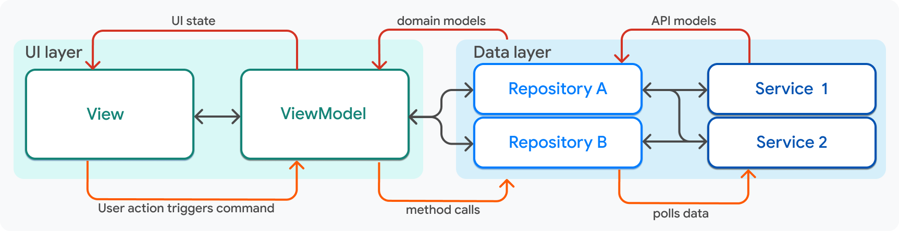
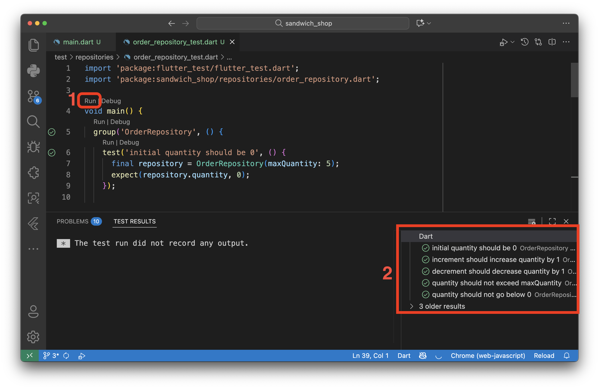

# **Worksheet 4 — App Architecture and Testing**

## **What you need to know beforehand**

Ensure that you have already completed the following:

  - [Worksheet 0 — Introduction to Dart, Git and GitHub](./worksheet-0.md).
  - [Worksheet 1 — Introduction to Flutter](./worksheet-1.md).
  - [Worksheet 2 — Stateless Widgets](./worksheet-2.md).
  - [Worksheet 3 — Stateful widgets](./worksheet-3.md).

## **Getting help**

To get support with this worksheet, join the [Discord channel](https://portdotacdotuk-my.sharepoint.com/:b:/g/personal/mani_ghahremani_port_ac_uk/EbX583gvURRAhqsnhYqmbSEBwIFw6tXRyz_Br1GxIyE8dg) and ask your questions there. Otherwise, attend your timetabled session and ask a member of staff for help.

## **Introduction to App Architecture**

As your app grows, it's important to have a clear and organised structure. Generally speaking, we need to organise our code into different layers, each with its own responsibility.

For this worksheet, we will be following the simple Model-View-ViewModel (MVVM) architecture. It recommends separating your app into the following layers which roughly translate to folders in your `lib` directory:

  - **Views**: These are the widgets that make up your app's user interface (UI).
  - **View Models**: These are the classes that sit between the views and the repositories (not to be confused with GitHub repositories). They are responsible for retrieving data from the repositories and transforming it into a format that can be easily displayed by the views. They also include things like the callbacks that allow the view to interact with the data.
  - **Repositories**: These are the classes that are responsible for providing data to the view models. They typically interact with services to fetch data.
  - **Services**: These are the classes that are responsible for fetching data from external sources, such as cloud services or a database.

Here is a diagram that shows how these layers interact with each other:


If you would like to learn more about app architecture, you can read the [official Flutter documentation](https://docs.flutter.dev/app-architecture/guide).

In this worksheet we will focus on the first three layers: views, view models, and repositories. Services wrap API endpoints and are typically used for fetching data asynchronously from external sources. We will learn more about services in a later worksheet.

### **Refactoring our code**

Refactoring is the process of restructuring existing code to improve its readability, maintainability, or performance, without changing its behaviour.

For this worksheet, you need to start with the code that we have provided in the branch 4 of our [GitHub repository](https://github.com/manighahrmani/sandwich_shop/tree/4). You can either clone the repository and checkout the branch 4 with the following commands:

```bash
git clone https://github.com/manighahrmani/sandwich_shop.git
cd sandwich_shop
git checkout 4
```

Or you can manually make sure your `main.dart` file matches [our `main.dart`](https://github.com/manighahrmani/sandwich_shop/blob/4/lib/main.dart). And create a new file called `app_styles.dart` in the `lib` folder and copy the contents from [here](https://github.com/manighahrmani/sandwich_shop/blob/4/lib/app_styles.dart). Run the app to make sure everything is working as expected and note that we have already completed the exercises from the previous worksheets.

Take a moment to familiarise yourself with the code and feel free to ask your AI assistant if you have any questions about the new widgets.

#### **Styles**

The new `app_styles.dart` file is a simple example of refactoring styles out of the main UI code. This file contains the styles used in our app much like a CSS file in web development. Note that this is not a mandatory way of managing styles in Flutter, you as the developer can choose to manage the architecture of your app in any way you see fit.

Also note that you can add more styles to this file as needed and use it across multiple files. Open your `main.dart`, observer how `app_styles.dart` is imported, and check to see where these styles are used (use the search functionality in VS Code **Shift + Ctrl + F** on Windows or **Shift + ⌘ + F** on macOS and search for variables like `normalText`).

#### **Folder structure**

Next, open the Explorer view in VS Code with **Ctrl + Shift + E** on Windows or **⌘ + Shift + E** on macOS. Right-click on the `lib` folder and select **New Folder**. Name this folder `views`. Similarly, create the following folders in the `lib` folder: `view_models`, and `repositories`.

Drag and drop the `app_styles.dart` file into the `views` subfolder of the `lib` folder. **Keep `main.dart` in the `lib` folder** as Flutter needs it there to find your app's entry point. Make sure that after this move, the import statement in `main.dart` is updated to:

```dart
import 'package:sandwich_shop/views/app_styles.dart';
```

Your folder structure should now look like this:

```
lib/
  ├── main.dart
  ├── views/
  │   └── app_styles.dart
  ├── view_models/
  └── repositories/
```

#### **Commit your changes**

Before moving on, commit this restructuring of the folder with a commit message like `Restructure folder into views, view_models, and repositories` and sync your changes to GitHub.

### **Creating a repository class**

Now, let's create a more meaningful separation by moving the business logic out of our UI code. Business logic refers to custom rules for managing the business, in our case, this is the limit on sandwich quantity. The logic for managing the sandwich quantity (incrementing, decrementing, and checking limits) doesn't need to be inside the `_OrderScreenState` of `main.dart`. We can move it to a dedicated class in the `repositories` folder.

Right-click on the `repositories` folder and select **New File**. Name this file `order_repository.dart`. Open this file and add the following code to it. This class will now be the single source of truth for our order's quantity. Notice the new boolean getter methods `canIncrement` and `canDecrement` which encapsulate the logic for checking the quantity limits.

```dart
class OrderRepository {
  int _quantity = 0;
  final int maxQuantity;

  OrderRepository({required this.maxQuantity});

  int get quantity => _quantity;

  bool get canIncrement => _quantity < maxQuantity;
  bool get canDecrement => _quantity > 0;

  void increment() {
    if (canIncrement) {
      _quantity++;
    }
  }

  void decrement() {
    if (canDecrement) {
      _quantity--;
    }
  }
}
```

With the logic moved, we can now simplify our `_OrderScreenState` class in `main.dart`. 

First, update the imports at the top of your `main.dart` file. Since we moved `app_styles.dart` to the views folder, you'll need to update that import and add the `OrderRepository` import:

```dart
import 'package:sandwich_shop/views/app_styles.dart';
import 'package:sandwich_shop/repositories/order_repository.dart';
```

Next, replace the entire `_OrderScreenState` class in your `main.dart` file with the following updated code.

```dart
class _OrderScreenState extends State<OrderScreen> {
  late final OrderRepository _orderRepository;
  final TextEditingController _notesController = TextEditingController();
  bool _isFootlong = true;
  BreadType _selectedBreadType = BreadType.white;

  @override
  void initState() {
    super.initState();
    _orderRepository = OrderRepository(maxQuantity: widget.maxQuantity);
    _notesController.addListener(() {
      setState(() {});
    });
  }

  @override
  void dispose() {
    _notesController.dispose();
    super.dispose();
  }

  VoidCallback? _getIncreaseCallback() {
    if (_orderRepository.canIncrement) {
      return () => setState(_orderRepository.increment);
    }
    return null;
  }

  VoidCallback? _getDecreaseCallback() {
    if (_orderRepository.canDecrement) {
      return () => setState(_orderRepository.decrement);
    }
    return null;
  }

  void _onSandwichTypeChanged(bool value) {
    setState(() => _isFootlong = value);
  }

  void _onBreadTypeSelected(BreadType? value) {
    if (value != null) {
      setState(() => _selectedBreadType = value);
    }
  }

  List<DropdownMenuEntry<BreadType>> _buildDropdownEntries() {
    List<DropdownMenuEntry<BreadType>> entries = [];
    for (BreadType bread in BreadType.values) {
      DropdownMenuEntry<BreadType> newEntry = DropdownMenuEntry<BreadType>(
        value: bread,
        label: bread.name,
      );
      entries.add(newEntry);
    }
    return entries;
  }

  @override
  Widget build(BuildContext context) {
    String sandwichType = 'footlong';
    if (!_isFootlong) {
      sandwichType = 'six-inch';
    }

    String noteForDisplay;
    if (_notesController.text.isEmpty) {
      noteForDisplay = 'No notes added.';
    } else {
      noteForDisplay = _notesController.text;
    }

    return Scaffold(
      appBar: AppBar(
        title: const Text(
          'Sandwich Counter',
          style: heading1,
        ),
      ),
      body: Center(
        child: Column(
          mainAxisAlignment: MainAxisAlignment.center,
          children: <Widget>[
            OrderItemDisplay(
              quantity: _orderRepository.quantity,
              itemType: sandwichType,
              breadType: _selectedBreadType,
              orderNote: noteForDisplay,
            ),
            const SizedBox(height: 20),
            Row(
              mainAxisAlignment: MainAxisAlignment.center,
              children: [
                const Text('six-inch', style: normalText),
                Switch(
                  value: _isFootlong,
                  onChanged: _onSandwichTypeChanged,
                ),
                const Text('footlong', style: normalText),
              ],
            ),
            const SizedBox(height: 10),
            DropdownMenu<BreadType>(
              textStyle: normalText,
              initialSelection: _selectedBreadType,
              onSelected: _onBreadTypeSelected,
              dropdownMenuEntries: _buildDropdownEntries(),
            ),
            const SizedBox(height: 20),
            Padding(
              padding: const EdgeInsets.all(40.0),
              child: TextField(
                key: const Key('notes_textfield'),
                controller: _notesController,
                decoration: const InputDecoration(
                  labelText: 'Add a note (e.g., no onions)',
                ),
              ),
            ),
            const SizedBox(height: 20),
            Row(
              mainAxisAlignment: MainAxisAlignment.center,
              children: [
                StyledButton(
                  onPressed: _getIncreaseCallback(),
                  icon: Icons.add,
                  label: 'Add',
                  backgroundColor: Colors.green,
                ),
                const SizedBox(width: 8),
                StyledButton(
                  onPressed: _getDecreaseCallback(),
                  icon: Icons.remove,
                  label: 'Remove',
                  backgroundColor: Colors.red,
                ),
              ],
            ),
          ],
        ),
      ),
    );
  }
}
```

Open the Source Control view in VS Code with **Ctrl + Shift + G** on Windows or **⌃ + Shift + G** on macOS. You should see a list of changes that you have made to your project. Click on `main.dart` to see a side-by-side comparison of the old and new code. Pay attention to the changes that have been made.

Can you get Copilot to explain why we no longer need the `_quantity` variable in this class? How has the logic for incrementing and decrementing changed?

Notice that the `_getIncreaseCallback` and `_getDecreaseCallback` methods use the `canIncrement` and `canDecrement` getters from the repository to decide whether the button should be enabled. This way, if we change the logic for incrementing or decrementing, we only need to update it in the repository.

#### **Commit your changes**

Remember to commit your changes at each stage with a meaningful commit message before moving on.

## **Unit testing**

Writing tests help you ensure that your code works as expected and helps prevent bugs from creeping in as you make changes and add new features. There are three main types of tests in Flutter:

  - **Unit tests**: These tests verify the smallest testable parts of an application, called "units", in isolation. In our case, the `OrderRepository` class is a perfect example of a unit.
  - **Widget tests**: These tests verify the UI and interactions of individual widgets. They can simulate user interactions and verify that the widget behaves as expected.
  - **Integration tests**: These tests verify the integration of multiple components (how they work together). They can simulate user interactions and verify that the app behaves as expected.

For more information, you can read the official Flutter documentation on [testing](https://docs.flutter.dev/cookbook/testing). In this worksheet, we will focus on unit tests and widget tests.

You should already have a `test` folder in your project (this is created automatically when you create a new Flutter project) and inside this folder there should be a `widget_test.dart` file which we have maintained so far.

Add subfolders to the `test` folder for unit testing and widget testing. For our new repository, create a `repositories` folder inside the `test` folder.

### **Unit testing example**

Now that we have moved our business logic into a pure Dart class (`OrderRepository`), we can write a unit test for it without needing to build any widgets.

Create a new file called `order_repository_test.dart` in the `test/repositories` folder.

This is what your folder structure should look like:

```
lib/
  ├── main.dart
  ├── views/
  │   └── app_styles.dart
  ├── view_models/
  └── repositories/
      └── order_repository.dart
test/
  ├── repositories/
  │   └── order_repository_test.dart
  └── widget_test.dart
```

Add the following code to `order_repository_test.dart`. We are importing the `flutter_test` package which comes pre-installed with Flutter and provides the necessary tools for writing tests. We are also importing the `OrderRepository` class that we want to test.

```dart
import 'package:flutter_test/flutter_test.dart';
import 'package:sandwich_shop/repositories/order_repository.dart';

void main() {
  group('OrderRepository', () {
    test('initial quantity should be 0', () {
      final repository = OrderRepository(maxQuantity: 5);
      expect(repository.quantity, 0);
    });

    test('increment should increase quantity by 1', () {
      final repository = OrderRepository(maxQuantity: 5);
      repository.increment();
      expect(repository.quantity, 1);
    });

    test('decrement should decrease quantity by 1', () {
      final repository = OrderRepository(maxQuantity: 5);
      repository.increment(); // quantity is now 1
      repository.decrement(); // quantity is now 0
      expect(repository.quantity, 0);
    });

    test('quantity should not exceed maxQuantity', () {
      final repository = OrderRepository(maxQuantity: 2);
      repository.increment(); // quantity is 1
      repository.increment(); // quantity is 2
      repository.increment(); // should not change
      expect(repository.quantity, 2);
    });

    test('quantity should not go below 0', () {
      final repository = OrderRepository(maxQuantity: 5);
      repository.decrement(); // should not change
      expect(repository.quantity, 0);
    });
  });
}
```

The tests in this file are grouped using the `group` function, which helps organise related tests together. Each individual test is defined using the `test` function. The general format of a unit test is:

```dart
test('description of the test', () {
  // Arrange: set up any necessary objects or conditions
  final object = /* create object */;
  // Act: perform the action you want to test
  object.someMethod();
  // Assert: check that the expected outcome occurred
  expect(object.someProperty, expectedValue);
});
```

As you can see, the `test` function takes a description of the test (as a `String`) and a callback function. In the callback, we typically follow the Arrange-Act-Assert pattern described in the code snippet above. Notice how the `expect` function is used to verify that the actual value matches the expected value (this is a built-in function provided by `flutter_test`). Feel free to ask your AI assistant if you have any questions.

#### **Commit your changes**

Once again, make sure that you have committed your changes.

### **What to expect when you run tests**

Run these tests while the `order_repository_test.dart` is open in VS Code and click on the `Run` link above the `main` function. You should see the test results in the terminal panel at the bottom of VS Code as shown below:



Each green tick means that the test passed. On the other hand, a red cross (❌) would mean the test failed, and you will see a detailed error message explaining what went wrong—for example, `Expected: <1>, Actual: <0>`. This feedback is crucial for understanding what has gone wrong in your code.

You can also run all tests at once by opening a terminal and running `flutter test`. This command will execute all tests in your `test` folder, including both unit tests and widget tests. As you create more tests throughout this course, this becomes a convenient way to verify that all your code is working correctly.

#### **Commit your changes**

Before we move to widget testing, ensure that you have committed and synced all your changes to GitHub.

## **Widget testing**

We have already provided you with an example of widget testing in the `widget_test.dart` file. It is currently in the `test` folder. Create a new folder called `views` inside the `test` folder and move the `widget_test.dart` file into this new folder.

This is what your folder structure should look like now:

```
lib/
  ├── main.dart
  ├── views/
  │   └── app_styles.dart
  ├── view_models/
  └── repositories/
      └── order_repository.dart
test/
  ├── repositories/
  │   └── order_repository_test.dart
  └── views/
      └── widget_test.dart
```

Next, open `widget_test.dart`. Before making any changes, try running the tests by clicking the `Run` link above the `main` function. The tests should run successfully.

You'll notice each test is defined with `testWidgets` instead of `test`. This function takes a `WidgetTester` object in its callback parameter, which is conventionally named `tester`. The `tester` is our main tool for building and interacting with our UI in the test environment.

The general format of a widget test is:

```dart
testWidgets('description of the test', (WidgetTester tester) async {
  const widgetToBeTested = /* widget code here */;
  // Construct the widget
  await tester.pumpWidget(widgetToBeTested);
  // If it is an interactive widget, simulate user interaction
  await tester.tap(find.byType(SomeWidget));
  // If the interaction causes a state change, rebuild the widget
  await tester.pump();
  // Find the widget you want (by text, type, key, etc.) and verify it
  expect(find.text('expected text'), findsOneWidget);
});
```

The callback function passed to `testWidgets` are marked as `async`, and you will see the `await` keyword used frequently inside the callbacks. Can you ask your AI assistant why this is necessary or what it even means?

The first step in most tests is pumping the widget into the test environment using `await tester.pumpWidget()`. This method takes a widget and builds it in the test environment. As mentioned in the code snippet above, when it comes to interactive widgets, after simulating a user interaction like a tap, we often need to call `await tester.pump()` again to rebuild the widget and reflect any changes resulting from the interaction. For animations, like the opening of the `DropdownMenu`, we use `await tester.pumpAndSettle()`, which repeatedly pumps frames until all animations have finished.

To check the results, just like unit tests, we use the `expect` function. It takes a `Finder` and a `Matcher`. A `Finder` is a way to locate a widget. For example, `find.text('Sandwich Counter')` looks for a widget displaying that exact text, while `find.textContaining('footlong')` looks for a widget that includes "footlong" as part of its text. There are other ways of finding widgets which you can read about in the [official documentation](https://docs.flutter.dev/cookbook/testing/widget/finders).

The `Matcher`, such as `findsOneWidget`, then verifies that the `Finder` located the correct number of widgets on the screen. Other examples of matchers include `findsNothing` (ensures no widgets were found) and `findsNWidgets(n)` (ensures exactly `n` widgets were found) but you'll most commonly use `findsOneWidget`.

As a small note, observe that in the test for the dropdown menu, the finder `find.text('wheat').last` is used to select the 'wheat' option. We use `.last` because the word 'wheat' might appear in multiple places. Can you guess where else it might appear in the widget tree? Try removing `.last` and running the test again to see what happens.

Finally, the tests for `StyledButton` and `OrderItemDisplay` show how you can test a single widget, making sure it is rendered as expected, without building the entire app. We still need to wrap the widget in a `MaterialApp` so that it has the necessary context to render correctly.

#### **Commit your changes**

Before moving to the exercises, check that you have committed and synced all your changes to GitHub.

## **Exercises**

Complete the exercises below. Remember to commit your changes after each exercise and use your AI assistant to help you think through the problems rather than just asking for the solution.

1.  Our widget tests currently cover tapping buttons and entering text. Let's expand our test coverage to other types of user interaction.

    Write a new widget test in `test/views/widget_test.dart` to verify the functionality of the `Switch` widget that toggles between 'six-inch' and 'footlong'.

    Hint: `Switch` widgets are toggled by tapping on them like buttons.

    ⚠️ **Show your new passing widget test to a member of staff** for a sign-off.

2.  Let's add an option for the user to have their sandwich toasted. First, in `lib/main.dart`, add a new state variable to your `_OrderScreenState` class: `bool _isToasted = false;`.

    Next, in the `build` method, add the following `Row` inside the `Column`'s `children` list, just below the `Row` for the existing sandwich type `Switch` (search for `Switch` to find it quickly and add this after the closing bracket of that `Row`):

    ```dart
    Row(
      mainAxisAlignment: MainAxisAlignment.center,
      children: [
        const Text('untoasted', style: normalText),
        Switch(
          value: _isToasted,
          onChanged: (value) {
            setState(() => _isToasted = value);
          },
        ),
        const Text('toasted', style: normalText),
      ],
    ),
    ```

    Feel free to fully implement this feature by updating the `OrderItemDisplay` widget to show whether the sandwich is toasted or not but this is not required for the purpose of this exercise.

    The addition of the new switch creates a problem for our widget tests. More specifically, if you have a test that uses `find.byType(Switch)`, it will now fail because the finder will locate two widgets.

    To solve this, refer to the [Finders documentation](https://docs.flutter.dev/cookbook/testing/widget/finders) and find a way to uniquely identify each `Switch` widget. (Hint: This is similar to giving an HTML element an `id` attribute.)

    ⚠️ **Show your running app with the two switches and the updated, passing widget tests to a member of staff** for a sign-off.

3.  Our app does not yet have a concept of price. Let's add a repository to manage the pricing logic. Suppose that a six-inch sandwich costs £7 and a footlong costs £11.

    Create a new `PricingRepository` class in the `repositories` folder similar to `lib/repositories/order_repository.dart`. This class should calculate the total price of a sandwich order based on the quantity and sandwich size. This should give you an idea what the constructor of the class should look like and what method(s) it should have.

    Next, similar to `test/repositories/order_repository_test.dart`, create a new unit test file in `test/repositories` to verify your pricing logic is correct for various quantities and for both sandwich sizes.

    Finally, use your new repository in the `OrderScreen` to calculate and display the total price of the order. The price should be formatted to two decimal places (e.g., `£11.00`). You have the example of `OrderRepository` to refer to, but free to use your AI assistant to help you with how the `_OrderScreenState` class should be updated to use this new repository.

    ⚠️ **Show your new pricing repository and its unit tests to a member of staff** for a sign-off.

4.  (Advanced) Let's add functionality to save an order to a local file. This feature is only available on mobile and desktop platforms, so you will need to run your app on a compatible device.

    First, add the `path_provider` package to your project by running the following command in your terminal:

    ```bash
    flutter pub add path_provider
    ```

    This package helps find the correct directory to save files. Operations like writing to a device's storage are **asynchronous** because they might take some time to complete. In Dart, asynchronous methods return a `Future`, which is like a promise that the work will be done.

    Create a `services` folder inside the `lib` folder. Then, create a new `file_service.dart` file and add create a `FileService` class in it. This service will handle the external operation of writing to the device's storage. Follow the `CounterStorage` class on the documentation page for [reading and writing files](https://docs.flutter.dev/cookbook/persistence/reading-writing-files) when writing this service.

    Next, we'll use a simple **ViewModel**. For this exercise, it's just a plain Dart class that acts as a bridge between our UI and the `FileService`. Create the `OrderViewModel` class below in the `lib/view_models` folder.

    ```dart
    import 'package:sandwich_shop/services/file_service.dart';

    class OrderViewModel {
      final FileService fileService = FileService();

      Future<void> saveOrderToFile({
        required int quantity,
        required bool isFootlong,
      }) async {
        String sandwichType = '';
        if (isFootlong) {
          sandwichType = 'footlong';
        } else {
          sandwichType = 'six-inch';
        }
        final String orderDetails = '$quantity $sandwichType sandwich(es)';
        await fileService.writeOrder(orderDetails); // This should be a method in FileService
      }
    }
    ```

    Finally, update `_OrderScreenState` to use this ViewModel when the user clicks on a newly added "Save Order" button. The button should call the `saveOrderToFile` method of `OrderViewModel`, passing the current order details from the state.

    Remember to write unit tests for both `FileService` and `OrderViewModel` to verify that the file writing logic works as expected. Additionally, feel free to implement a feature to read and display the previous order from the file when the app starts. Can you find out where the file is located on your device? Try adding a print statement to display the file path.

    This task is **optional** and there's no need to show it to a member of staff for a sign-off.

5.  (Advanced) Let's add some images to our app like a company logo in the `AppBar`.

    First, create an `assets/images` folder at the root of your project and add a simple logo image to it (e.g., `logo.png`). To make assets available to your app, you must declare the folder in your `pubspec.yaml` file. Open it and add an `assets` section at the bottom of the `flutter` section like this:

    ```yaml
    flutter:
      uses-material-design: true

      assets:
        - assets/images/
    ```

    Update your `OrderScreen`'s `AppBar` to display the logo. (Hint: Visit [this documentation page on `AppBar` widget](https://api.flutter.dev/flutter/material/AppBar-class.html) and check out the `leading` or `actions` properties.) You can find examples of how to load an asset in the [Image class documentation](https://api.flutter.dev/flutter/widgets/Image-class.html).

    Finally, write a new widget test that verifies the logo is being displayed. A test for an image widget looks for the widget by its type and can even verify that the correct asset path is being used, as shown in the example below.

    ```dart
    testWidgets('displays logo in AppBar', (WidgetTester tester) async {
      await tester.pumpWidget(const App());

      // Find the widget by its type
      final imageFinder = find.byType(Image);
      expect(imageFinder, findsOneWidget);

      // For a more robust test, you can check the asset source
      final imageWidget = tester.widget<Image>(imageFinder);
      expect((imageWidget.image as AssetImage).assetName, 'assets/images/logo.png');
    });
    ```

    This task is **optional** and there's no need to show it to a member of staff for a sign-off.
