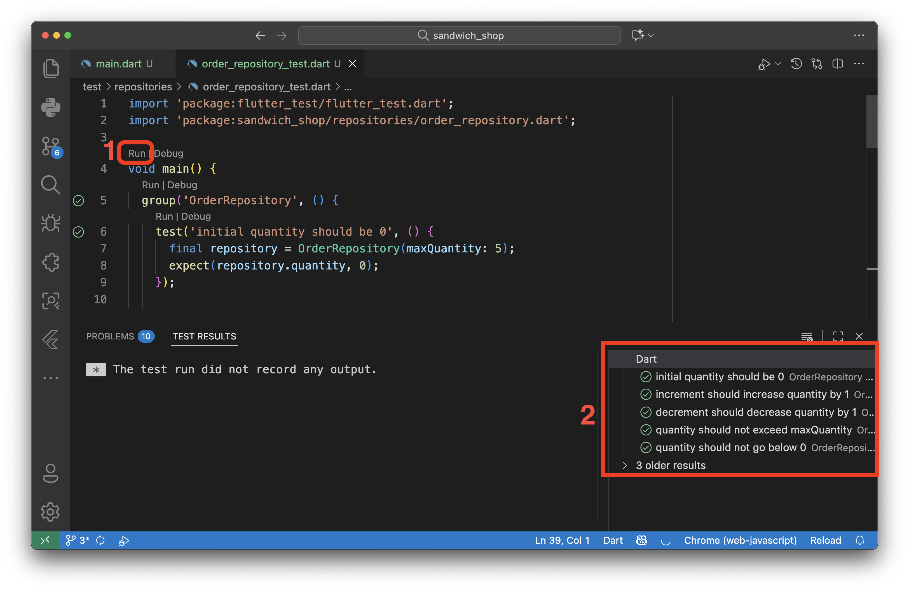

# Worksheet 4 — Unit and Widget Testing

## Table of contents

- [What you need to know beforehand](#what-you-need-to-know-beforehand)
- [Getting help](#getting-help)
- [Getting started](#getting-started)
- [Why automated testing matters](#why-automated-testing-matters)
- [Unit testing with flutter test](#unit-testing-with-flutter-test)
  - [Understand unit tests](#understand-unit-tests)
  - [Create the repository test file](#create-the-repository-test-file)
  - [Write your first assertion](#write-your-first-assertion)
  - [Add a second test for the sandwich data](#add-a-second-test-for-the-sandwich-data)
  - [Run unit tests without leaving the editor](#run-unit-tests-without-leaving-the-editor)
  - [Commit your changes (1)](#commit-your-changes-1)
- [Widget testing in Flutter](#widget-testing-in-flutter)
  - [Understand widget tests](#understand-widget-tests)
  - [Prepare the widget test file](#prepare-the-widget-test-file)
  - [Test initial UI rendering](#test-initial-ui-rendering)
  - [Commit your changes (2)](#commit-your-changes-2)
- [Simulating user interaction in tests](#simulating-user-interaction-in-tests)
  - [Tap buttons with tester tap](#tap-buttons-with-tester-tap)
  - [Verify state updates and navigation](#verify-state-updates-and-navigation)
  - [Commit your changes (3)](#commit-your-changes-3)
- [Testing boundary conditions and isolation](#testing-boundary-conditions-and-isolation)
  - [Test widgets in isolation](#test-widgets-in-isolation)
  - [Test the minimum and maximum limits](#test-the-minimum-and-maximum-limits)
  - [Run the whole suite from the Test Explorer](#run-the-whole-suite-from-the-test-explorer)
  - [Commit your changes (4)](#commit-your-changes-4)
- [Code formatting and static analysis](#code-formatting-and-static-analysis)
  - [Format your code with dart format](#format-your-code-with-dart-format)
  - [Analyse your code with the Dart analyser](#analyse-your-code-with-the-dart-analyser)
  - [Commit your changes (5)](#commit-your-changes-5)
- [Exercises](#exercises)

## What you need to know beforehand

Ensure that you have completed [Worksheet 1 — Dart, Git, GitHub and Flutter](./worksheet-1.md), [Worksheet 2 — Stateless and Stateful Widgets](./worksheet-2.md), and [Worksheet 3 — Data Models, Repositories, Assets and In-Page Navigation](./worksheet-3.md). You should have an application separated into models, repositories, and widgets, with stack-based navigation using `Navigator.push` (introduced in the [Navigate between screens and pass data](./worksheet-3.md#navigate-between-screens-and-pass-data) section of Worksheet 3).

## Getting help

To get support with this worksheet, follow the [Discord guide](https://portdotacdotuk-my.sharepoint.com/:p:/g/personal/mani_ghahremani_port_ac_uk/IQCMJP6IiR_bQoYUMdXJSRDYAWnajEALZYEXFZyrJkHS1QU) and post your questions there. You can also attend your timetabled practical sessions and ask a member of teaching staff for guidance.

## Getting started

You can continue directly with the repository you updated in Worksheet 3. Alternatively, switch to branch `3` of the [Sandwich Shop repository](https://github.com/manighahrmani/sandwich_shop/tree/3), which holds the complete solution from Worksheet 3:

```bash
git checkout 3
```

Ensure that your working tree is clean before starting. If you have uncommitted changes from earlier exercises, commit or stash them first. As a reminder, you can open the Source Control panel with **Ctrl + Shift + G** on Windows or **⌃ + Shift + G** on macOS, and open a terminal with **Ctrl + backtick** on either platform.

## Why automated testing matters

As your application grows, manually checking every button and screen after every edit becomes slow and error-prone. A small change to a model or repository can quietly break a screen you forgot to inspect.

Automated tests let you describe your expectations in code once. Whenever you run the tests, the machine verifies every expectation in seconds. Flutter divides tests into three tiers:

1. **Unit tests:** fast tests that verify individual functions, methods, or classes in isolation, without starting the Flutter engine.
2. **Widget tests:** medium-speed tests that render widgets in a simulated environment to verify layout, text, and gestures.
3. **Integration tests:** comprehensive tests that run the whole application on a device or in a browser.

In this worksheet we focus on the first two tiers. For the wider picture, skim the [testing overview in the Flutter documentation](https://docs.flutter.dev/testing/overview) and, if you prefer video, the [How to write tests](https://www.youtube.com/watch?v=bjynsttFF2I) episode from the official [Flutter YouTube channel](https://www.youtube.com/@flutterdev).

## Unit testing with flutter test

Unit tests verify that non-UI classes behave correctly. In our application, `SandwichRepository` supplies the menu data, so we should confirm it returns valid data before any widget tries to display it.

### Understand unit tests

Flutter re-exports the Dart `test()` function from `package:flutter_test/flutter_test.dart`. Each test makes one or more assertions with `expect(actual, matcher)`. If the actual value matches the expectation, the test passes; if not, it fails with a diagnostic that names the difference.

To learn more about test structure and matchers, read the [unit testing guide](https://docs.flutter.dev/cookbook/testing/unit/introduction) in the Flutter cookbook.

### Create the repository test file

Test files live in the `test/` directory at the root of your project, and their names end with `_test.dart`. The Flutter test runner discovers them automatically by that suffix.

Create a new file named `test/sandwich_repository_test.dart`. Start with the imports and an empty `main()`:

```dart
import 'package:flutter_test/flutter_test.dart';
import 'package:sandwich_shop/models/sandwich.dart';
import 'package:sandwich_shop/repositories/sandwich_repository.dart';

void main() {}
```

The `main()` function is the entry point the test runner executes.

### Write your first assertion

Inside `main()`, use `group()` to bundle related tests under one heading, then add a single `test()` that checks the repository returns two sandwiches:

```dart
void main() {
  group('SandwichRepository unit tests', () {
    test('getSandwiches returns two sandwiches', () {
      final SandwichRepository repository = SandwichRepository();
      final List<Sandwich> sandwiches = repository.getSandwiches();

      expect(sandwiches.length, 2);
    });
  });
}
```

Here `2` is used as a matcher directly. When you pass a plain value to `expect`, it is treated as an equality check, so this asserts that the list length equals two.

### Add a second test for the sandwich data

A count on its own does not prove the data is correct. Add a second `test()` inside the same group that inspects the two sandwiches and verifies their identifiers, names, and prices:

```dart
import 'package:flutter_test/flutter_test.dart';
import 'package:sandwich_shop/models/sandwich.dart';
import 'package:sandwich_shop/repositories/sandwich_repository.dart';

void main() {
  group('SandwichRepository unit tests', () {
    test('getSandwiches returns two sandwiches', () {
      final SandwichRepository repository = SandwichRepository();
      final List<Sandwich> sandwiches = repository.getSandwiches();

      expect(sandwiches.length, 2);
    });

    test('getSandwiches contains valid Footlong and Six-Inch subs', () {
      final SandwichRepository repository = SandwichRepository();
      final List<Sandwich> sandwiches = repository.getSandwiches();

      final Sandwich footlong = sandwiches[0];
      expect(footlong.id, 'footlong');
      expect(footlong.name, 'Footlong Sub');
      expect(footlong.price, 7.50);
      expect(footlong.imagePath, isNotEmpty);

      final Sandwich sixInch = sandwiches[1];
      expect(sixInch.id, 'six-inch');
      expect(sixInch.name, 'Six-Inch Sub');
      expect(sixInch.price, 4.50);
      expect(sixInch.imagePath, isNotEmpty);
    });
  });
}
```

The `isNotEmpty` matcher is one of many named matchers Flutter provides; it passes when the string has at least one character. These tests run pure Dart, so they never build a widget.

Your `test/sandwich_repository_test.dart` file should look like this in VS Code:


### Run unit tests without leaving the editor

You can run tests from the terminal, but VS Code gives you faster feedback. When the Dart and Flutter extensions are installed, a small **Run** and **Debug** pair of links (a CodeLens) appears directly above every `main()`, `group()`, and `test()`. Click **Run** above the group to run just that group, or above a single `test()` to run only that case. The results appear in the **Test Results** panel with a green tick beside each passing test:



For the equivalent in the terminal, execute `flutter test` targeting your new file (open a terminal with **Ctrl + backtick**):

```bash
flutter test test/sandwich_repository_test.dart
```

You should see output confirming that both tests passed:

```text
00:00 +0: SandwichRepository unit tests getSandwiches returns two sandwiches
00:00 +1: SandwichRepository unit tests getSandwiches contains valid Footlong and Six-Inch subs
00:00 +2: All tests passed!
```

Your terminal output should look like this:


### Commit your changes (1)

Stage `test/sandwich_repository_test.dart` and commit your changes with the message `Add unit tests for SandwichRepository`.

## Widget testing in Flutter

While unit tests check data and logic, widget tests verify that widgets look and behave as expected.

### Understand widget tests

Widget tests use `testWidgets()` instead of `test()`. The test callback receives a `WidgetTester` object that can render widgets, search the widget tree for elements, simulate taps, and advance time frame by frame.

For an overview of the concepts, read the [widget testing guide](https://docs.flutter.dev/cookbook/testing/widget/introduction) in the Flutter cookbook.

### Prepare the widget test file

Open the existing `test/widget_test.dart`. It still contains the counter test generated when the project was created. Replace its entire contents with the imports we need and an empty `main()`:

```dart
import 'package:flutter/material.dart';
import 'package:flutter_test/flutter_test.dart';
import 'package:sandwich_shop/main.dart';
import 'package:sandwich_shop/models/sandwich.dart';
import 'package:sandwich_shop/screens/menu_screen.dart';
import 'package:sandwich_shop/screens/order_screen.dart';

void main() {}
```

We import `package:flutter/material.dart` because a later test wraps a screen in a `MaterialApp`, and we import the model and both screens because the tests reference them by type. Adding every import now means we do not have to interrupt the flow later.

### Test initial UI rendering

The `tester.pumpWidget()` method tells Flutter to build and render a widget into the test environment. Because rendering is asynchronous, you must `await` it. Add a `group()` with two tests that confirm the app opens on `MenuScreen` and shows both sandwich cards:

```dart
void main() {
  group('App smoke tests', () {
    testWidgets('App displays MenuScreen as home', (WidgetTester tester) async {
      await tester.pumpWidget(const App());

      expect(find.byType(MenuScreen), findsOneWidget);
      expect(find.text('Sandwich Menu'), findsOneWidget);
    });

    testWidgets('Displays sandwich cards with names and prices',
        (WidgetTester tester) async {
      await tester.pumpWidget(const App());

      expect(find.text('Footlong Sub'), findsOneWidget);
      expect(find.text('£7.50'), findsOneWidget);
      expect(find.text('Six-Inch Sub'), findsOneWidget);
      expect(find.text('£4.50'), findsOneWidget);
      expect(find.text('Order'), findsNWidgets(2));
    });
  });
}
```

The `find.text()` finder searches the rendered tree for a string, while `find.byType()` searches for a widget class. The matchers `findsOneWidget` and `findsNWidgets(2)` assert how many matches are expected.

Run the file with the **Run** CodeLens above the group, or from the terminal with `flutter test test/widget_test.dart`. Both tests should pass. Your test file should look like this:


### Commit your changes (2)

Stage `test/widget_test.dart` and commit your changes with the message `Add widget tests for MenuScreen and sandwich cards`.

## Simulating user interaction in tests

Widget testing is at its most useful when you simulate user actions such as tapping buttons and then verify what changed on the screen.

### Tap buttons with tester tap

The `tester.tap()` method simulates a touch on any widget matched by a finder. After a tap that changes state or navigates, you must pump at least one new frame so the change is rendered.

Two methods pump frames. `tester.pump()` renders a single frame, which is enough after a `setState()` call. `tester.pumpAndSettle()` keeps rendering frames until all animations, transitions, and timers finish; you need it after `Navigator.push()` because the route transition animates over several frames.

### Verify state updates and navigation

Add a third `testWidgets()` inside the same group. It taps the first **Order** button, confirms the order screen opens with the chosen sandwich, and exercises the **Add** and **Remove** buttons:

```dart
testWidgets('Tapping Order navigates to OrderScreen with selected sandwich',
    (WidgetTester tester) async {
  await tester.pumpWidget(const App());

  // Tap the Order button on the first card, then let the route settle.
  await tester.tap(find.text('Order').first);
  await tester.pumpAndSettle();

  // The OrderScreen opened with the Footlong Sub details.
  expect(find.byType(OrderScreen), findsOneWidget);
  expect(find.text('Order Footlong Sub'), findsOneWidget);
  expect(find.text('0 Footlong Sub sandwich(es): '), findsOneWidget);

  // Add increments the counter; a single pump is enough after setState.
  await tester.tap(find.text('Add'));
  await tester.pump();
  expect(find.text('1 Footlong Sub sandwich(es): 🥪'), findsOneWidget);

  // Remove decrements it again.
  await tester.tap(find.text('Remove'));
  await tester.pump();
  expect(find.text('0 Footlong Sub sandwich(es): '), findsOneWidget);
});
```

Because you imported `OrderScreen` when you prepared the file, this test needs no new imports. Run the file again and notice the runner verifies navigation, argument passing, and state updates in under a second.

Your test file should look like this:


### Commit your changes (3)

Stage `test/widget_test.dart` and commit your work with the message `Test navigation and order counter interactions`.

## Testing boundary conditions and isolation

Good tests verify not only the normal path but also the edges: the smallest and largest values a feature must handle.

### Test widgets in isolation

You do not have to launch the whole app to test one screen. You can pump any widget on its own inside a `MaterialApp`, which is why we imported `package:flutter/material.dart` earlier. Isolating the screen also lets you pass in specific configuration, such as a small `maxQuantity`, to reach a boundary quickly.

### Test the minimum and maximum limits

Add two more `testWidgets()` cases inside the group. The first confirms the quantity never drops below zero; the second supplies `maxQuantity: 3` and taps **Add** five times to confirm it never climbs past the ceiling:

```dart
testWidgets('OrderScreen quantity does not drop below zero',
    (WidgetTester tester) async {
  const sandwich = Sandwich(
    id: 'test',
    name: 'Test Sub',
    description: 'Test description',
    price: 5.0,
    imagePath: 'assets/images/footlong.png',
  );

  await tester.pumpWidget(
    const MaterialApp(
      home: OrderScreen(sandwich: sandwich),
    ),
  );

  await tester.tap(find.text('Remove'));
  await tester.pump();
  expect(find.text('0 Test Sub sandwich(es): '), findsOneWidget);
});

testWidgets('OrderScreen quantity does not exceed maxQuantity',
    (WidgetTester tester) async {
  const sandwich = Sandwich(
    id: 'test',
    name: 'Test Sub',
    description: 'Test description',
    price: 5.0,
    imagePath: 'assets/images/footlong.png',
  );

  await tester.pumpWidget(
    const MaterialApp(
      home: OrderScreen(sandwich: sandwich, maxQuantity: 3),
    ),
  );

  for (int i = 0; i < 5; i++) {
    await tester.tap(find.text('Add'));
    await tester.pump();
  }

  expect(find.text('3 Test Sub sandwich(es): 🥪🥪🥪'), findsOneWidget);
});
```

Constructing a `Sandwich` here uses the `Sandwich` model you imported when you prepared the file, so again no new import is needed.

### Run the whole suite from the Test Explorer

VS Code collects every test in the project into the **Testing** view. Open it from the flask icon in the Activity Bar on the left, or with the Command Palette (**Ctrl + Shift + P** on Windows or **⌘ + Shift + P** on macOS) by running **Test: Focus on Test Explorer View**. From there you can run or debug the entire tree with one click and see green ticks or red crosses beside each test, just like the **Test Results** panel you saw earlier.

For the terminal equivalent, run every test in the project by calling `flutter test` with no arguments:

```bash
flutter test
```

All unit and widget tests across both files should pass, as shown below:


### Commit your changes (4)

Stage `test/widget_test.dart` and commit your changes with the message `Add isolated boundary tests for OrderScreen`.

## Code formatting and static analysis

Before you commit your work or present it for a sign-off, always check formatting and static analysis. The continuous integration (CI) pipeline that runs on GitHub checks both, so fixing them locally first saves a failed build.

### Format your code with dart format

Dart ships an official formatter that enforces consistent spacing, indentation, and trailing commas. Run it across your source and test folders to reformat the files in place:

```bash
dart format lib/ test/
```

If the formatter changed any files, stage and commit them. The CI pipeline runs the same formatter in a check-only mode, `dart format --output=none --set-exit-if-changed .`, which changes nothing but fails if any file is not already formatted. You will use that check form in the exercises.

### Analyse your code with the Dart analyser

The Dart analyser flags likely bugs, dead code, missing imports, and violations of the rules in `analysis_options.yaml`. Run it across your source and test folders:

```bash
dart analyze lib/ test/
```

You should see:

```text
Analyzing lib, test...
No issues found!
```

Your terminal output should look like this:


If any warnings or lints appear, resolve them before demonstrating your coursework. To read more about the analyser and how to configure it, see [Customising static analysis](https://dart.dev/tools/analysis) on dart.dev.

### Commit your changes (5)

If you made any formatting fixes, stage the updated files and commit them with the message `Format code with dart format`.

## Exercises

As in Worksheet 1 and Worksheet 2, these exercises apply to your Southsea Cinema coursework and, together with the Worksheet 3 exercises, prepare you for Demo 2 (by Friday 16 October 2026). See the [Southsea Cinema coursework brief](https://portdotacdotuk-my.sharepoint.com/:w:/g/personal/mani_ghahremani_port_ac_uk/IQDtIJB3bM7gQ4p03eLUngyyAd7JuhjhHuNA1l0H-qCy3Jw). Commit after each exercise. You must demonstrate your work for a sign-off during your own timetabled practical session.

In Worksheet 3 you refactored the Southsea Cinema application to show movie cards on the home page and navigate to the movie listing page. For Demo 2 you must demonstrate that your codebase is backed by passing automated tests and clean static analysis.

1. Create a unit test file named `test/movie_repository_test.dart` inside your `southsea_cinema` fork. Using `group()`, `test()`, and `expect()`, verify that `MovieRepository.getMovies()` returns a list containing the two expected movies (*The Phantom of the Opera* and *Halloween 1978*), that their titles match, and that their ticket prices are positive numbers. Commit your changes with the message `Add unit tests for MovieRepository`.

2. Open `test/widget_test.dart` in your `southsea_cinema` fork and replace its contents. Write a widget test named `Home page displays movie cards and navigates to listing page` using `testWidgets()`. Pump `SouthseaCinemaApp`, verify that the app title and both movie titles appear, find the **BOOK NOW** buttons, tap the first with `tester.tap()`, and call `tester.pumpAndSettle()`. Assert that the movie listing page opened showing the chosen film title and its ticket price. Commit your changes with the message `Add widget tests for HomeView and navigation`.

3. Run the whole suite from the Test Explorer, or `flutter test` from the root of your `southsea_cinema` project. Ensure that all unit and widget tests pass without failures, as shown below:

    

4. Run `dart analyze` and the CI check form of the formatter, `dart format --output=none --set-exit-if-changed .`, across your project. Ensure there are zero analyser issues and that the formatter reports no changes. If the formatter does report changes, run `dart format lib/ test/` to fix them, then commit with the message `Format coursework code`.

5. Run your application with `flutter run -d chrome`. Check that the movie cards display their poster images and that tapping **BOOK NOW** opens the dynamic listing page. Show the running application and your passing test suite to a member of staff at your practical session for your Demo 2 sign-off.
