# Worksheet 4 — Unit and Widget Testing

## Table of contents

- [What you need to know beforehand](#what-you-need-to-know-beforehand)
- [Getting help](#getting-help)
- [Getting started](#getting-started)
  - [Continue from Worksheet 3](#continue-from-worksheet-3)
  - [Clone the Sandwich Shop repository](#clone-the-sandwich-shop-repository)
  - [Clean your working tree](#clean-your-working-tree)
  - [Switch to branch 3](#switch-to-branch-3)
- [Why automated testing matters](#why-automated-testing-matters)
- [Unit testing data models](#unit-testing-data-models)
  - [Understand unit tests](#understand-unit-tests)
  - [Add a formatted price getter to the sandwich model](#add-a-formatted-price-getter-to-the-sandwich-model)
  - [Create the model test file](#create-the-model-test-file)
  - [Test model property assignment](#test-model-property-assignment)
  - [Test the formatted price getter](#test-the-formatted-price-getter)
  - [Commit your changes (1)](#commit-your-changes-1)
- [Unit testing repositories](#unit-testing-repositories)
  - [Create the repository test file](#create-the-repository-test-file)
  - [Verify sandwich list length](#verify-sandwich-list-length)
  - [Verify sandwich items and attributes](#verify-sandwich-items-and-attributes)
  - [Add getSandwichById to SandwichRepository](#add-getsandwichbyid-to-sandwichrepository)
  - [Test getSandwichById with existing and missing identifiers](#test-getsandwichbyid-with-existing-and-missing-identifiers)
  - [Commit your changes (2)](#commit-your-changes-2)
- [Widget testing in Flutter](#widget-testing-in-flutter)
  - [Understand widget tests](#understand-widget-tests)
  - [Prepare the widget test file](#prepare-the-widget-test-file)
  - [Test OrderItemDisplay in isolation](#test-orderitemdisplay-in-isolation)
  - [Commit your changes (3)](#commit-your-changes-3)
  - [Test initial menu screen rendering](#test-initial-menu-screen-rendering)
  - [Update SandwichCard to use formattedPrice](#update-sandwichcard-to-use-formattedprice)
  - [Commit your changes (4)](#commit-your-changes-4)
- [Simulating user interaction and navigation](#simulating-user-interaction-and-navigation)
  - [Test navigating to the order screen](#test-navigating-to-the-order-screen)
  - [Test adding and removing sandwich items](#test-adding-and-removing-sandwich-items)
  - [Commit your changes (5)](#commit-your-changes-5)
- [Testing boundary conditions and isolated screens](#testing-boundary-conditions-and-isolated-screens)
  - [Test minimum boundary on OrderScreen](#test-minimum-boundary-on-orderscreen)
  - [Test maximum boundary with maxQuantity](#test-maximum-boundary-with-maxquantity)
  - [Commit your changes (6)](#commit-your-changes-6)
- [Running test suites and static analysis](#running-test-suites-and-static-analysis)
  - [Run the whole suite from the Test Explorer](#run-the-whole-suite-from-the-test-explorer)
  - [Format your code with dart format](#format-your-code-with-dart-format)
  - [Analyse your code with the Dart analyser](#analyse-your-code-with-the-dart-analyser)
  - [Commit your changes (7)](#commit-your-changes-7)
- [Exercises](#exercises)

## What you need to know beforehand

Ensure that you have completed [Worksheet 1 — Dart, Git, GitHub and Flutter](./worksheet-1.md), [Worksheet 2 — Stateless and Stateful Widgets](./worksheet-2.md), and [Worksheet 3 — Data Models, Repositories, Assets and In-Page Navigation](./worksheet-3.md). You should have an application separated into models, repositories, and widgets, with stack-based navigation using `Navigator.push` (introduced in the [Navigate between screens and pass data](./worksheet-3.md#navigate-between-screens-and-pass-data) section of Worksheet 3).

## Getting help

To get support with this worksheet, follow the [Discord guide](https://portdotacdotuk-my.sharepoint.com/:p:/g/personal/mani_ghahremani_port_ac_uk/IQCMJP6IiR_bQoYUMdXJSRDYAWnajEALZYEXFZyrJkHS1QU) and post your questions there. You can also attend your timetabled practical sessions and ask a member of teaching staff for guidance.

## Getting started

### Continue from Worksheet 3

You can continue directly with the Sandwich Shop project you updated in Worksheet 3. Open the project folder in VS Code with **File > Open Folder**. You do not need to clone the repository again.

### Clone the Sandwich Shop repository

If you do not have the project from Worksheet 3, clone the [Sandwich Shop repository](https://github.com/manighahrmani/sandwich_shop). Open a terminal and move to a folder that is not synchronised to cloud storage, such as your `Downloads` folder:

```bash
cd ~/Downloads
git clone https://github.com/manighahrmani/sandwich_shop
cd sandwich_shop
```

The `cd` command changes the current folder in the terminal. The first command moves to `Downloads`, and the final command moves into the cloned `sandwich_shop` folder. Open that folder in VS Code with **File > Open Folder**.

You can also clone the repository without typing terminal commands. Open the Source Control panel, select **Clone Repository**, enter `https://github.com/manighahrmani/sandwich_shop`, choose where to save it, then open the cloned folder, as shown below:

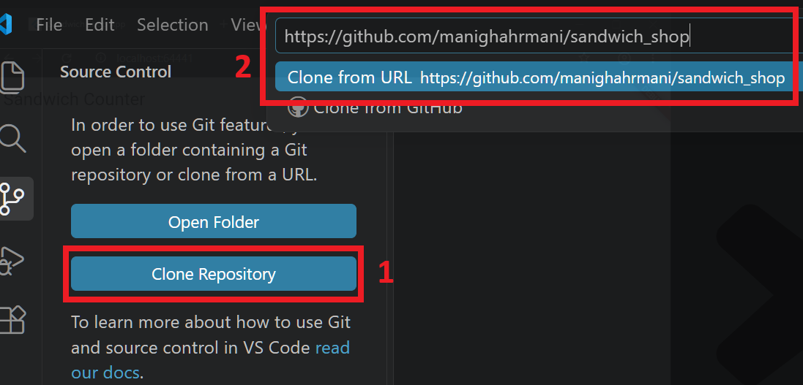

### Clean your working tree

This repository opens on the `main` branch, which contains the worksheets rather than the Flutter application. For this worksheet, you need branch `3`, which contains the Sandwich Shop app as it should look after Worksheet 3.

Before switching branches, open the Source Control panel with **Ctrl + Shift + G** on Windows or **⌃ + Shift + G** on macOS and check that there are no uncommitted changes. Commit any work that you want to keep. If you do not want to keep a change, discard it from the Source Control panel, as shown below:

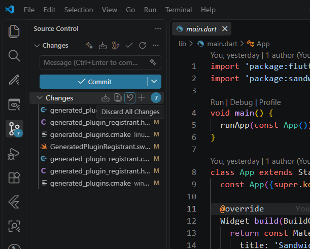

### Switch to branch 3

You can switch branches from the status bar at the bottom of VS Code. Click the current branch name, then select branch `3`, as shown below:

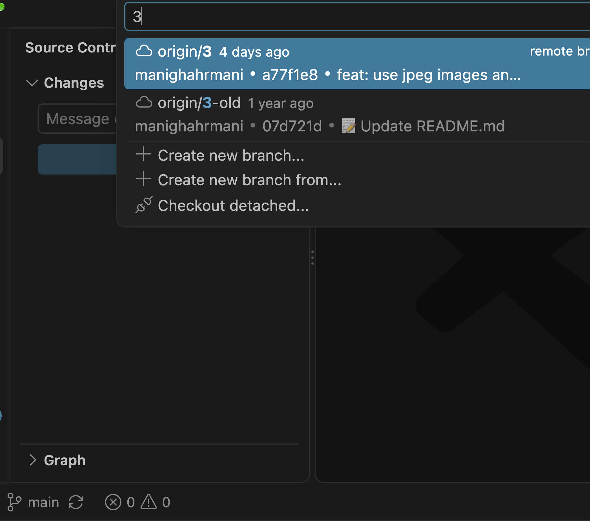

Alternatively, open the integrated terminal from the Command Palette with **Ctrl + Shift + P** on Windows or **⌘ + Shift + P** on macOS, run **Terminal: Create New Integrated Terminal**, then run:

```bash
git checkout 3
```

The `checkout` command replaces the files in your working folder with the files from branch `3`. Check the status bar now says `3` before continuing. If Git refuses to switch branches, return to the Source Control panel and commit or discard your uncommitted changes first.

This is what you should see when you run your app now (note that the images can be different to ours):

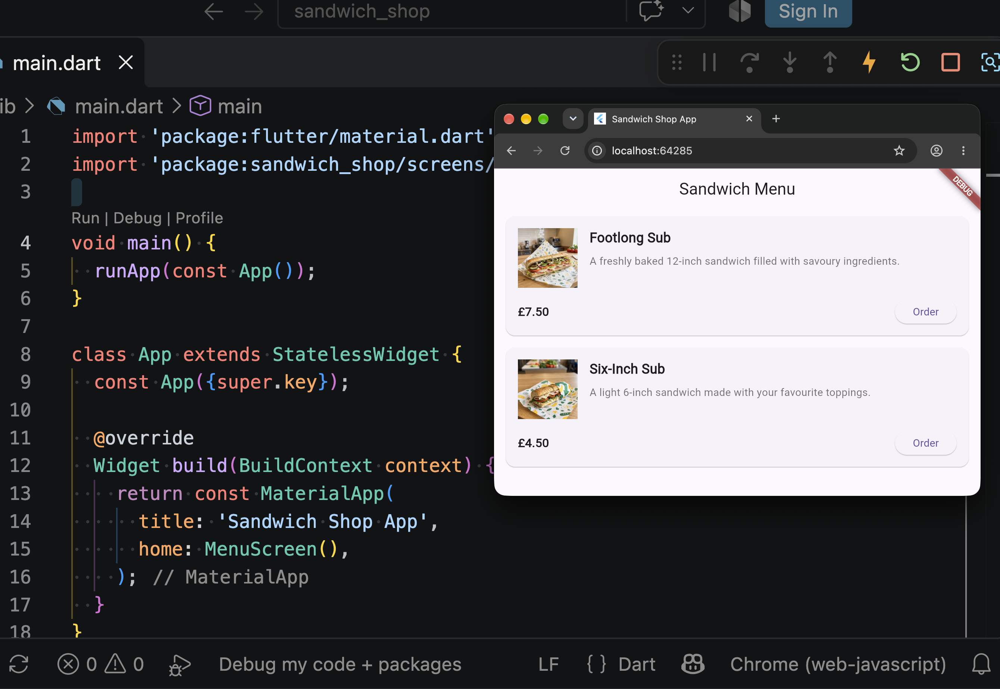

The order buttons should also take you to the screen that displays the selected sandwich and allows you to add or remove items. See below the order screen for the 6-inch sub:

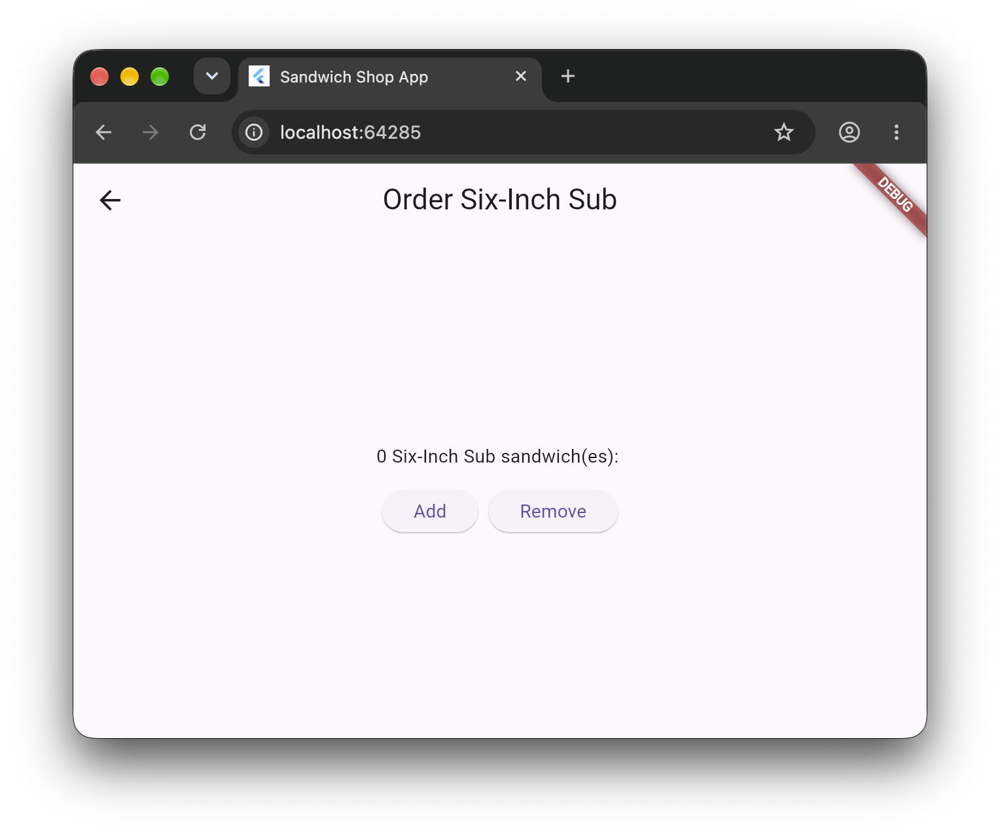

## Why automated testing matters

As your application grows, manually checking every button and screen after every edit becomes slow and error-prone (you may also forget to check some). Even a small change to a model or repository can break a screen you forgot to inspect.

Automated tests let you describe your expectations from your code. Whenever you run the tests, you can verify your code's behaviour in seconds. Flutter divides tests into three tiers:

1. Unit tests: fast tests that verify individual functions, methods, or classes on their own.
2. Widget tests: medium-speed tests that render widgets in a simulated environment to verify layout, text, and gestures.
3. Integration tests: comprehensive tests that run the whole application and simulate user flows across multiple screens.

In this worksheet we focus on unit and widget tests. For a broader overview of testing concepts and recipes, read the [testing overview in the Flutter documentation](https://docs.flutter.dev/testing/overview) and browse the [Flutter testing cookbook](https://docs.flutter.dev/cookbook/testing).

## Unit testing data models

Unit tests verify that non-UI classes behave correctly. This includes the data models and repositories you created in Worksheet 3.

### Understand unit tests

A unit test runs a small piece of code and checks that it produces the result you expect.

```dart
test('two plus two is four', () {
  final int result = 2 + 2;
  expect(result, 4);
});
```

In the above code snippet, we have defined a test called "two plus two is four". Inside the test, we calculate `2 + 2` and store the result in a variable `result`. We then use `expect()` to verify that the result equals `4`.

Every test uses the `test()` function. The first argument is a description of what the test checks. The second argument is a function containing the code you want to run.

Inside the test, you use `expect()` to verify a value. The first argument is the actual value your code calculated, and the second argument is the expected value:

```dart
expect(actual, expected);
```

If both values match, the test passes. If they do not match, the test fails and reports the difference:

```text
Expected: 4
  Actual: 5
```

Flutter provides `test()` and `expect()` through the `package:flutter_test/flutter_test.dart` library (you need to import it). To learn more about test structure and matchers, read the [unit testing guide](https://docs.flutter.dev/cookbook/testing/unit/introduction) in the Flutter cookbook.

### Add a formatted price getter to the sandwich model

In Worksheet 3 we created the `Sandwich` model in `lib/models/sandwich.dart`. At the moment, widgets format the price manually by calling `toStringAsFixed(2)`. Moving that formatting logic into the model itself avoids duplicating code across multiple screens and widgets.

Open `lib/models/sandwich.dart` and add a `formattedPrice` getter to the `Sandwich` class:

```dart
String get formattedPrice => '£${price.toStringAsFixed(2)}';
```

In Dart, a getter is a special method that retrieves the value of a property. You declare a getter using the `get` keyword followed by the property name, without parameter parentheses.

The `=>` symbol (known as arrow syntax or fat arrow) is shorthand for a function or getter whose body contains only a single return expression. Writing `=> '£${price.toStringAsFixed(2)}';` is equivalent to writing the verbose block syntax:

```dart
String get formattedPrice {
  final String formattedValue = price.toStringAsFixed(2);
  return '£$formattedValue';
}
```

In the verbose version, you define an intermediate variable `formattedValue` of type `String` and explicitly return the result. In the shorthand arrow syntax shown in the screenshot, the body is condensed into a single return expression directly following `=>`.

Callers access getters using standard property notation without parentheses (for example, `sandwich.formattedPrice` rather than `sandwich.formattedPrice()`). To learn more, read the [getters and setters](https://dart.dev/language/methods#getters-and-setters) and [arrow syntax](https://dart.dev/language/functions#arrow-syntax) sections in the Dart language guide.

Your `lib/models/sandwich.dart` file should now look like this:

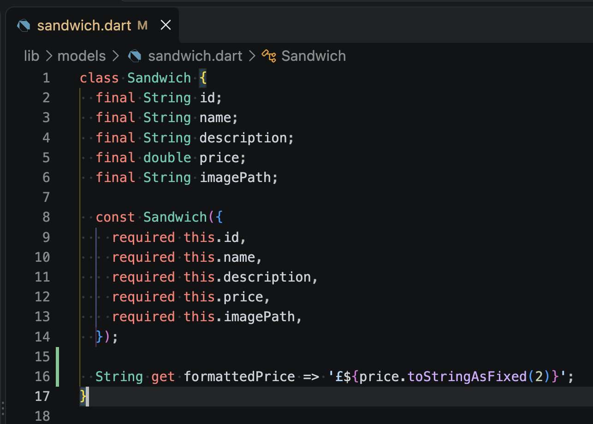

### Create the model test file

Test files live in the `test/` directory at the root of your project, and their names end with `_test.dart`. The Flutter test runner discovers them automatically by that suffix.

Create a new file named `test/sandwich_model_test.dart`. Start with the imports and an empty `main()`:

```dart
import 'package:flutter_test/flutter_test.dart';
import 'package:sandwich_shop/models/sandwich.dart';

void main() {}
```

Your test file should look like this (pay attention to where it is located in the project tree, it must not be inside the `lib/` folder):

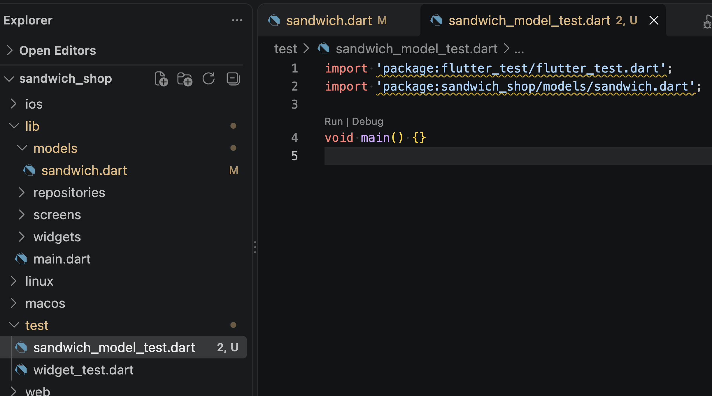

The `main()` function is the entry point the test runner executes.

### Test model property assignment

Inside `main()`, use `group()` to bundle related tests under one heading:

```dart
void main() {
  group('Sandwich model tests', () {});
}
```

Open the curly braces of the group and add a single `test()` that creates a `Sandwich` instance:

```dart
void main() {
  group('Sandwich model tests', () {
    test('creates Sandwich instance with given properties', () {
      const sandwich = Sandwich(
        id: 'veggie',
        name: 'Veggie Sub',
        description: 'Loaded with fresh vegetables.',
        price: 5.25,
        imagePath: 'assets/images/six_inch.jpeg',
      );
    });
  });
}
```

Now below the `Sandwich` constructor, add the following `expect()` statements to verify that each property was assigned correctly:

```dart
expect(sandwich.id, 'veggie');
expect(sandwich.name, 'Veggie Sub');
expect(sandwich.description, 'Loaded with fresh vegetables.');
expect(sandwich.price, 5.25);
expect(sandwich.imagePath, 'assets/images/six_inch.jpeg');
```

This is what your test file should look like now:

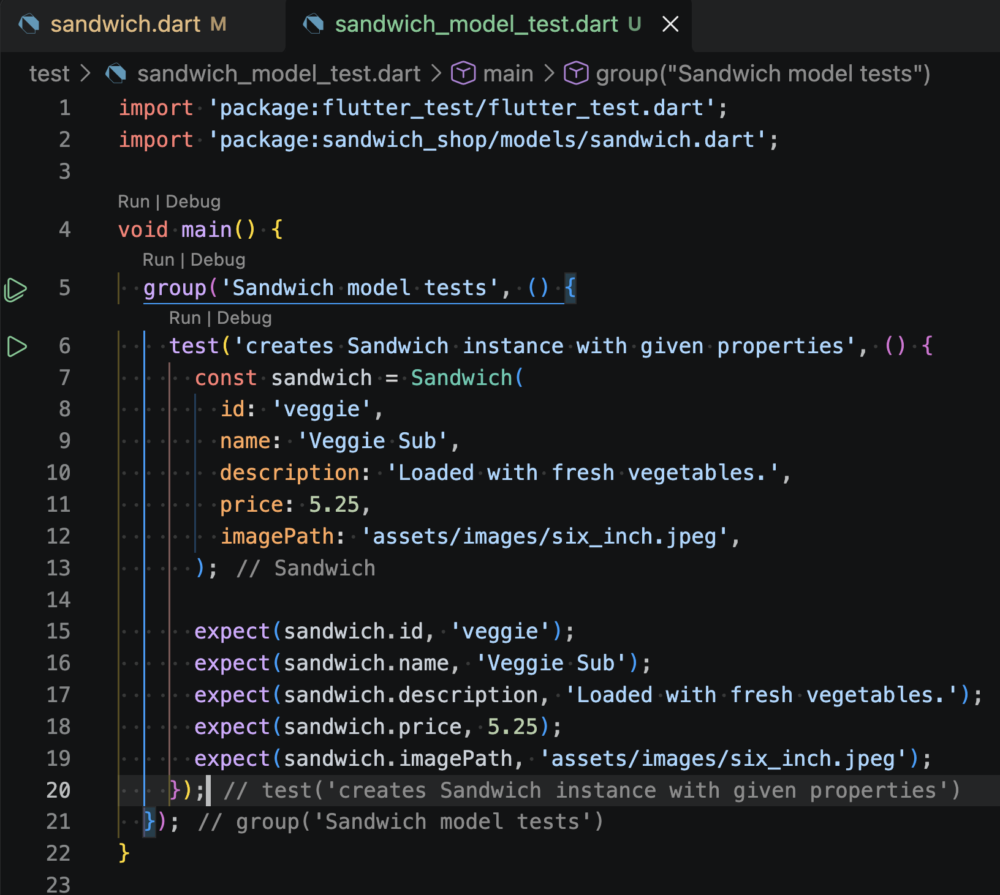

Click on the play button next to the `group()` to run the test. The results will appear in the **Test Results** panel at the bottom of the editor. If the test passes, you will see a green tick next to the test name. If it fails, you will see a red cross and an error message indicating what went wrong. You can also inspect all your tests in the **Testing** view by clicking the flask icon in the Activity Bar on the left.

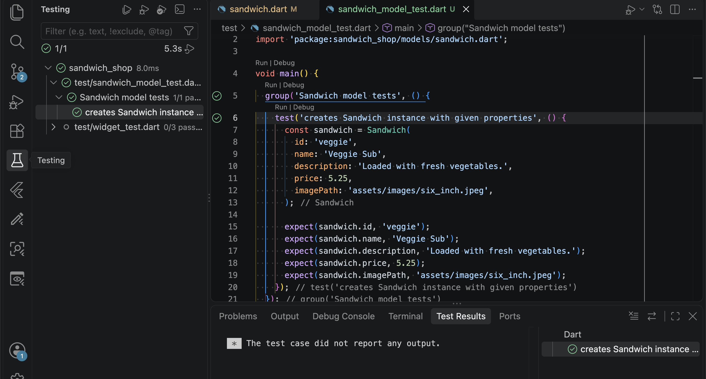

When you pass a literal value such as `'veggie'` or `5.25` to `expect()`, it performs an equality check against the actual value.

### Test the formatted price getter

Now add a second `test()` inside the same group to verify that `formattedPrice` correctly prefixes the price with a pound sign and formats the number to two decimal places. Remember that callers access getters without parentheses (`sandwich.formattedPrice`).

Your test should look like this now:

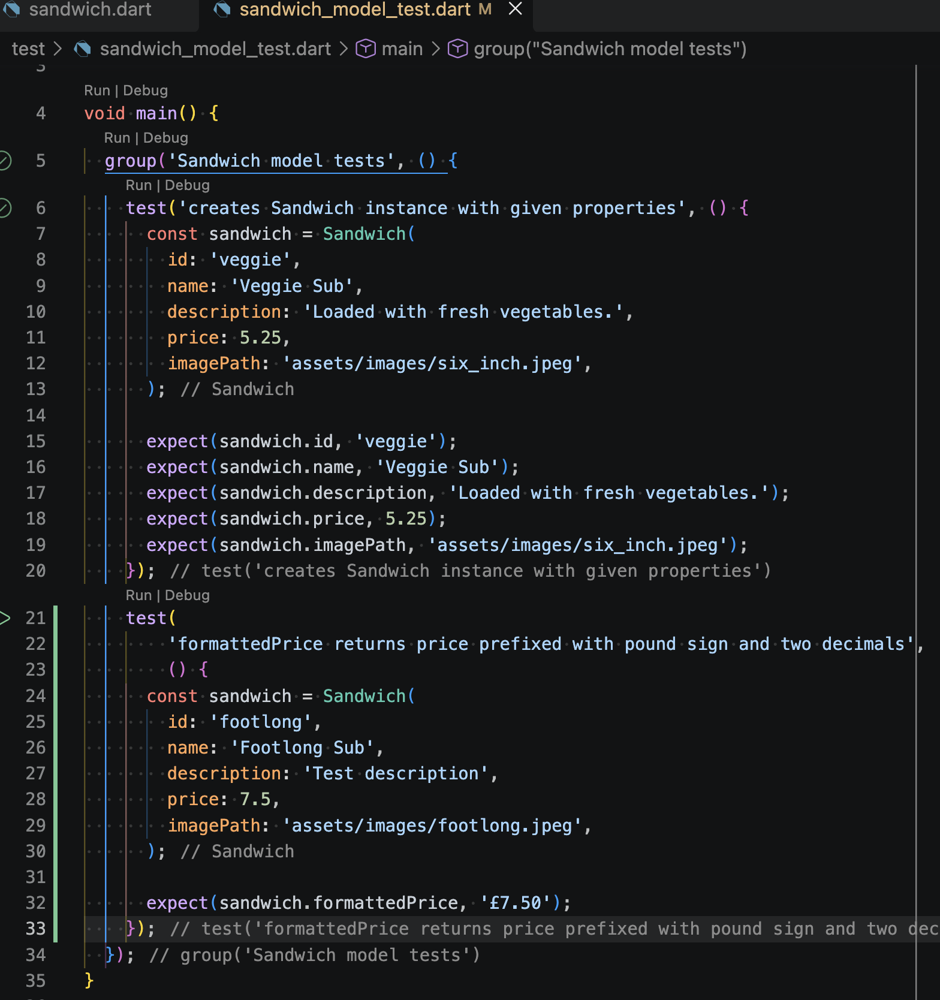

Once again, run the test file and confirm that both tests pass. The **Test Results** panel should show two green ticks:

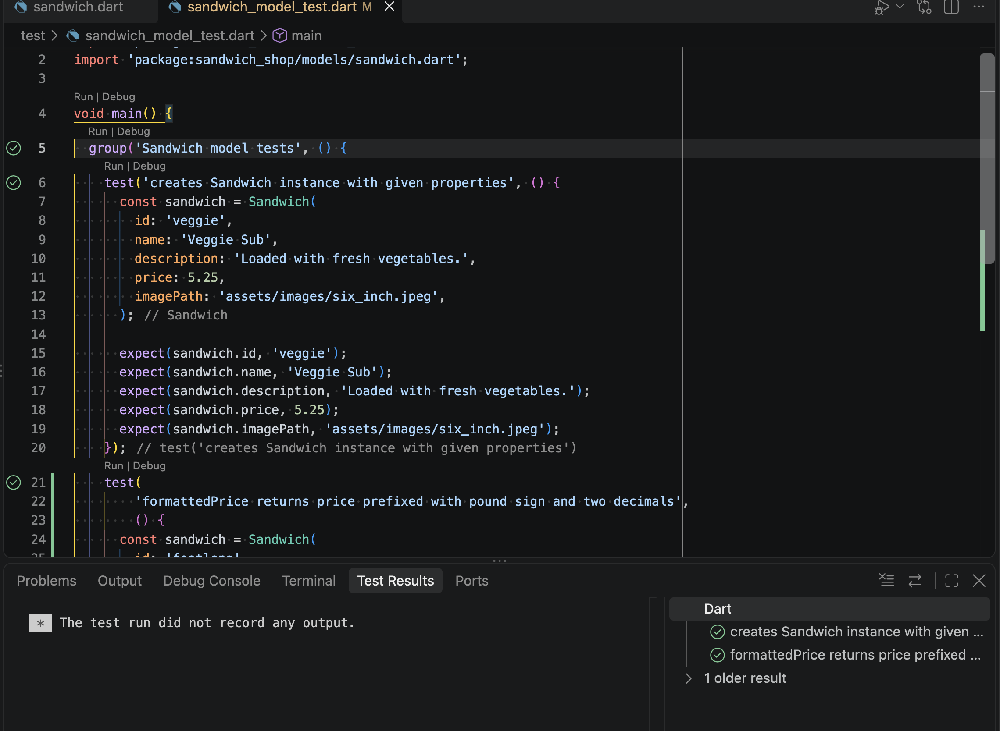

Note that you can click **Run** above the group to run all tests in the file. Or you can click **Run** above an individual test to run just that test.

You can also run the test file directly from the integrated terminal:

```bash
flutter test test/sandwich_model_test.dart
```

Your terminal output should look like this:

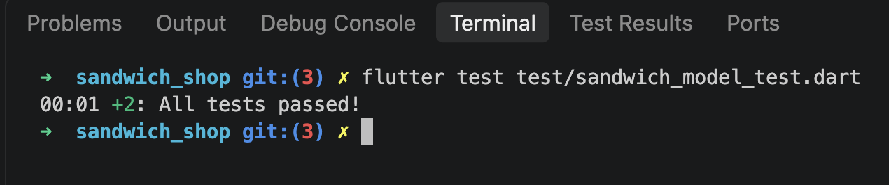

### Commit your changes (1)

In the Source Control panel, stage `lib/models/sandwich.dart` and `test/sandwich_model_test.dart`, then commit with the message `Add formattedPrice getter to Sandwich model and unit tests`.

## Unit testing repositories

Repositories supply data to the rest of the application. In our project, `SandwichRepository` provides the sandwich menu, so we should confirm it returns valid items and supports querying items by identifier before any widget displays the data.

### Create the repository test file

Create a new file named `test/sandwich_repository_test.dart`. Start with the imports and an empty `main()`:

```dart
import 'package:flutter_test/flutter_test.dart';
import 'package:sandwich_shop/models/sandwich.dart';
import 'package:sandwich_shop/repositories/sandwich_repository.dart';

void main() {}
```

### Verify sandwich list length

Inside `main()`, declare a test group and write a test checking that `getSandwiches()` returns a list with two items:

```dart
void main() {
  group('SandwichRepository unit tests', () {
    test('getSandwiches returns two sandwiches', () {
      final SandwichRepository repository = SandwichRepository();
      final List<Sandwich> sandwiches = repository.getSandwiches();

      expect(sandwiches.length, 2);
    });
  });
}
```

This verifies that the repository returns the expected number of items.

### Verify sandwich items and attributes

A count on its own does not confirm the data is correct. Add a second `test()` inside the group that inspects the two sandwiches and verifies their identifiers, names, prices, and image paths:

```dart
    test('getSandwiches contains valid Footlong and Six-Inch subs', () {
      final SandwichRepository repository = SandwichRepository();
      final List<Sandwich> sandwiches = repository.getSandwiches();

      final Sandwich footlong = sandwiches[0];
      expect(footlong.id, 'footlong');
      expect(footlong.name, 'Footlong Sub');
      expect(footlong.price, 7.50);
      expect(footlong.imagePath, isNotEmpty);

      final Sandwich sixInch = sandwiches[1];
      expect(sixInch.id, 'six-inch');
      expect(sixInch.name, 'Six-Inch Sub');
      expect(sixInch.price, 4.50);
      expect(sixInch.imagePath, isNotEmpty);
    });
```

The `isNotEmpty` matcher is provided by `package:flutter_test/flutter_test.dart`. A matcher is a helper function passed to `expect()` that tests whether a value satisfies a specific condition. Here, `isNotEmpty` passes when the string contains at least one character (it does not check whether the file exists on disk). To explore other available matchers, see the [Matcher class documentation](https://api.flutter.dev/flutter/package-matcher_matcher/Matcher-class.html).

Run the repository unit tests using the **Run** button above the group or from the terminal with:

```bash
flutter test test/sandwich_repository_test.dart
```

You should see this:

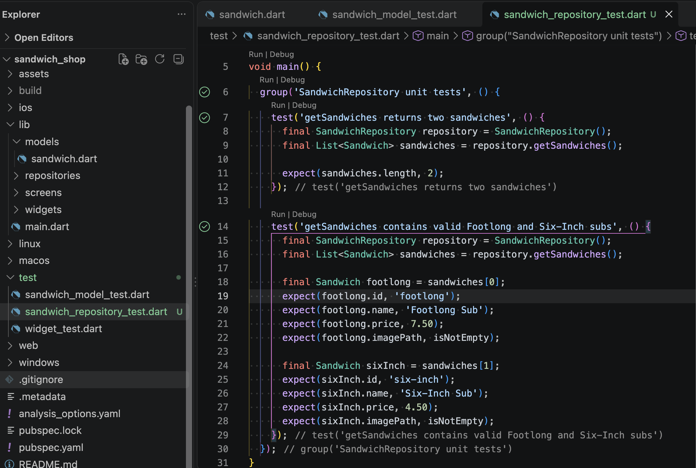

### Add getSandwichById to SandwichRepository

Applications often need to look up a specific item by its identifier. An identifier (ID) is a unique text key (such as `'footlong'` or `'phantom-of-the-opera'`) that distinguishes one record from all others in a collection. By using an ID instead of a display name or title, queries remain stable even if names contain spaces, special characters, or change over time. Every model entity needs a unique ID so repositories, widgets, and navigation routes can reference and pass items without ambiguity. Let's add a `getSandwichById()` method to `SandwichRepository`.

Open `lib/repositories/sandwich_repository.dart`. Inside the `SandwichRepository` class, add the following method below `getSandwiches()`:

```dart
  Sandwich? getSandwichById(String id) {
    for (final sandwich in getSandwiches()) {
      if (sandwich.id == id) {
        return sandwich;
      }
    }
    return null;
  }
```

The return type `Sandwich?` indicates that the method may return `null` if no sandwich matches the provided identifier. Dart uses sound null safety, which means variables cannot contain `null` unless explicitly declared as nullable. Adding a question mark (`?`) after the type name creates a nullable type that can hold either a `Sandwich` instance or `null`. The keyword `null` represents the absence of a value. For more details, consult the [Dart null safety guide](https://dart.dev/null-safety).

The `for-in` loop iterates sequentially through each item in the list returned by `getSandwiches()`. On each iteration, Dart assigns the current item to the variable `sandwich`. When `sandwich.id == id`, the method immediately returns that sandwich. If the loop completes without finding a matching identifier, execution reaches the final line and returns `null`. Read more about iteration in the [Dart loop documentation](https://dart.dev/language/loops#for-loops).

You can also write this method using explicit variables and types for each step:

```dart
  Sandwich? getSandwichById(String id) {
    final List<Sandwich> allSandwiches = getSandwiches();
    for (final Sandwich sandwich in allSandwiches) {
      if (sandwich.id == id) {
        return sandwich;
      }
    }
    return null;
  }
```

In this verbose form, `final List<Sandwich> allSandwiches = getSandwiches();` explicitly stores the list in a typed variable, and `final Sandwich sandwich` defines the type of the iteration variable on each step.

This is what the `lib/repositories/sandwich_repository.dart` file should look like now (note that we have folded the `getSandwiches()` method in VS Code to show only the new method):

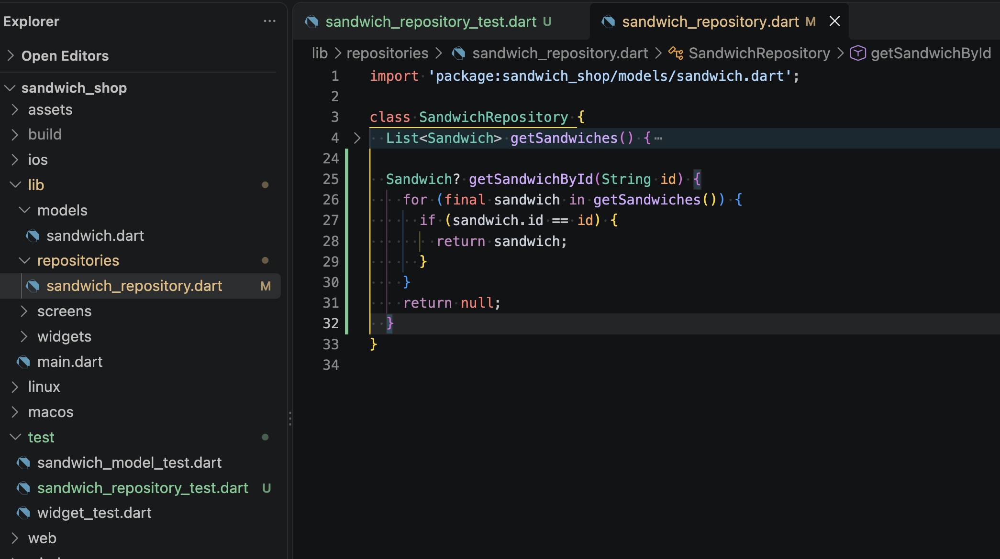

### Test getSandwichById with existing and missing identifiers

Now return to `test/sandwich_repository_test.dart` and add two new tests to verify both the successful search and the missing item cases:

```dart
    test('getSandwichById returns matching sandwich when id exists', () {
      final SandwichRepository repository = SandwichRepository();
      final Sandwich? sandwich = repository.getSandwichById('footlong');

      expect(sandwich, isNotNull);
      expect(sandwich?.name, 'Footlong Sub');
      expect(sandwich?.price, 7.50);
    });

    test('getSandwichById returns null when id does not exist', () {
      final SandwichRepository repository = SandwichRepository();
      final Sandwich? sandwich = repository.getSandwichById('non-existent');

      expect(sandwich, isNull);
    });
```

Because `sandwich` has the nullable type `Sandwich?`, Dart prevents calling properties directly on it in case it is `null`. The null-aware access operator (`?.`) conditionally reads a property only when the object is not `null`. If `sandwich` is `null`, `sandwich?.name` evaluates safely to `null` without throwing an error. See the [Dart operators documentation](https://dart.dev/language/operators#other-operators).

The `isNotNull` and `isNull` matchers confirm that optional return values match the expected presence or absence of data.

Run the repository unit tests from the terminal:

```bash
flutter test test/sandwich_repository_test.dart
```

Your test file should now look like this (see the green ticks next to each test):

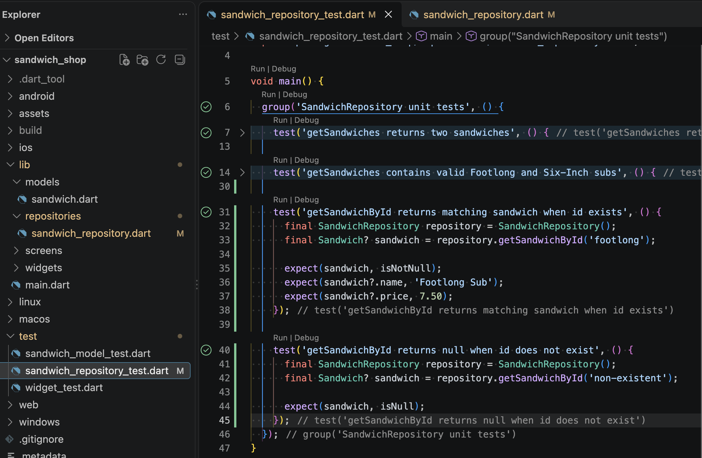

### Commit your changes (2)

In the Source Control panel, stage `lib/repositories/sandwich_repository.dart` and `test/sandwich_repository_test.dart`, then commit with the message `Add getSandwichById method and unit tests for SandwichRepository`.

## Widget testing in Flutter

While unit tests check data models and repository methods, widget tests verify that widgets look and behave as expected.

### Understand widget tests

Widget tests use `testWidgets()` instead of `test()`. The test callback receives a `WidgetTester` object that can render widgets, search the widget tree for elements, simulate taps, and advance time frame by frame. To learn about all tester capabilities, see the [WidgetTester documentation](https://api.flutter.dev/flutter/flutter_test/WidgetTester-class.html).

For a detailed introduction, read the [widget testing guide](https://docs.flutter.dev/cookbook/testing/widget/introduction) in the Flutter documentation.

### Prepare the widget test file

Open the existing `test/widget_test.dart`. Replace its entire contents with the imports we need and an empty `main()`:

```dart
import 'package:flutter/material.dart';
import 'package:flutter_test/flutter_test.dart';
import 'package:sandwich_shop/main.dart';
import 'package:sandwich_shop/models/sandwich.dart';
import 'package:sandwich_shop/screens/menu_screen.dart';
import 'package:sandwich_shop/screens/order_screen.dart';

void main() {}
```

We import `package:flutter/material.dart` so we can wrap individual widgets in a `MaterialApp`, and we import our screens and models so tests can reference them by type.

### Test OrderItemDisplay in isolation

A key advantage of widget testing is that you do not need to launch the entire application to test an individual widget. You can pump any widget directly inside a `MaterialApp` and `Scaffold`.

Let's test `OrderItemDisplay` from `lib/screens/order_screen.dart` in isolation. Add a test group with a widget test verifying that zero sandwiches display no emojis:

```dart
void main() {
  group('OrderItemDisplay widget tests', () {
    testWidgets('displays zero sandwiches with no emoji',
        (WidgetTester tester) async {
      await tester.pumpWidget(
        const MaterialApp(
          home: Scaffold(
            body: OrderItemDisplay(0, 'Footlong Sub'),
          ),
        ),
      );

      expect(find.text('0 Footlong Sub sandwich(es): '), findsOneWidget);
    });
  });
}
```

There are several new concepts in the code above:

In Dart, operations that take time to complete—such as building widget trees, animating transitions, or reading files—are asynchronous. An asynchronous operation returns a `Future`, which represents a value or action that will complete later.

The `await` keyword pauses execution within the function until that `Future` completes. Any function containing the `await` keyword must include the `async` modifier before the function body. Because `tester.pumpWidget()` renders the widget hierarchy asynchronously, you must `await` it before performing assertions. For a complete tutorial, read the [asynchronous programming guide](https://dart.dev/libraries/async/async-await) on dart.dev.

Once `pumpWidget` completes, it has rendered `OrderItemDisplay` with a quantity of zero sandwiches. The `find.text()` finder searches the rendered widget tree for matching text, while the matcher `findsOneWidget` asserts that exactly one matching widget exists. For more finder patterns, read the [finding widgets recipe](https://docs.flutter.dev/cookbook/testing/widget/finders) in the Flutter documentation.

Run your test using the play button above the group or from the terminal with:

```bash
flutter test test/widget_test.dart
```

You should see something like this:

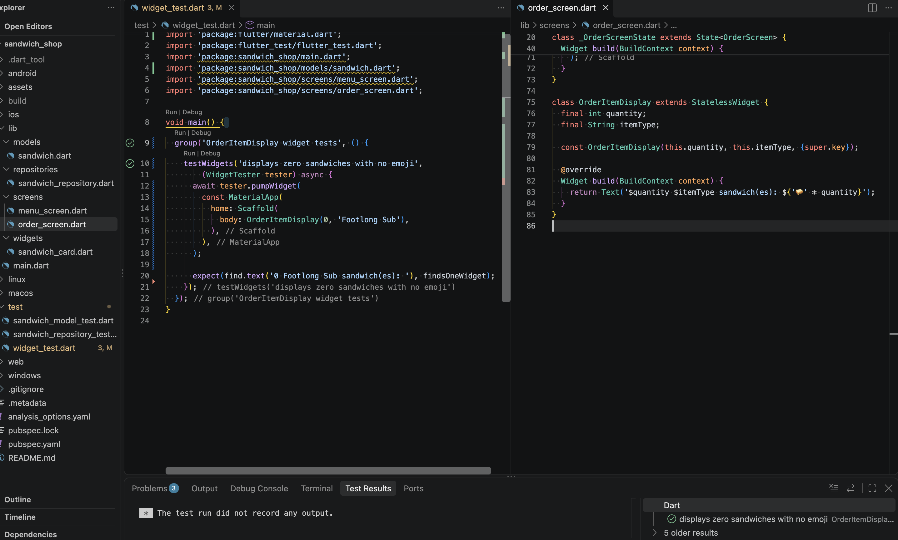

Next, add a second test verifying that three sandwiches display three emojis. Add this below the first test inside the same group:

```dart
    testWidgets('displays three sandwiches with three emojis',
        (WidgetTester tester) async {
      await tester.pumpWidget(
        const MaterialApp(
          home: Scaffold(
            body: OrderItemDisplay(3, 'Footlong Sub'),
          ),
        ),
      );

      expect(find.text('3 Footlong Sub sandwich(es): 🥪🥪🥪'), findsOneWidget);
    });
```

Both tests should pass, as shown below:

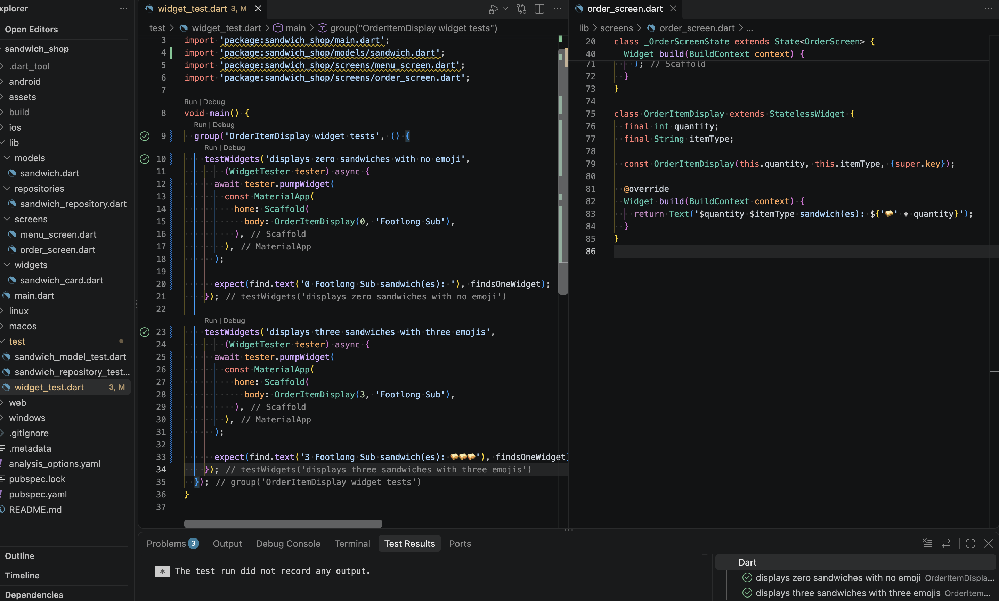

### Commit your changes (3)

In the Source Control panel, stage `test/widget_test.dart` and commit your changes with the message `Add isolated widget tests for OrderItemDisplay`.

### Test initial menu screen rendering

Now let's test the main menu screen when the entire application launches. Add a second test group named `App smoke tests` inside `main()` function of `test/widget_test.dart`. Inside that group, add a test that pumps the entire `App()` and verifies that the `MenuScreen` is displayed with the expected title and two sandwich cards. Smoke tests are a quick way to verify that the application launches and displays the expected initial screen.

```dart
  group('App smoke tests', () {
    testWidgets('App displays MenuScreen as home', (WidgetTester tester) async {
      await tester.pumpWidget(const App());
      expect(find.byType(MenuScreen), findsOneWidget);
      expect(find.text('Sandwich Menu'), findsOneWidget);
    });

    testWidgets('Displays sandwich cards with names and prices',
        (WidgetTester tester) async {
      await tester.pumpWidget(const App());
      expect(find.text('Footlong Sub'), findsOneWidget);
      expect(find.text('£7.50'), findsOneWidget);
      expect(find.text('Six-Inch Sub'), findsOneWidget);
      expect(find.text('£4.50'), findsOneWidget);
      expect(find.text('Order'), findsNWidgets(2));
    });
  });
```

The `find.text()` finder searches the rendered tree for specific text, while `find.byType()` searches for a widget by its class. The matchers `findsOneWidget` and `findsNWidgets(2)` assert the exact number of matching elements.

Run the widget tests using the play button above the group or from the terminal with:

```bash
flutter test test/widget_test.dart
```

Here is a screenshot of our tests passing in VS Code:

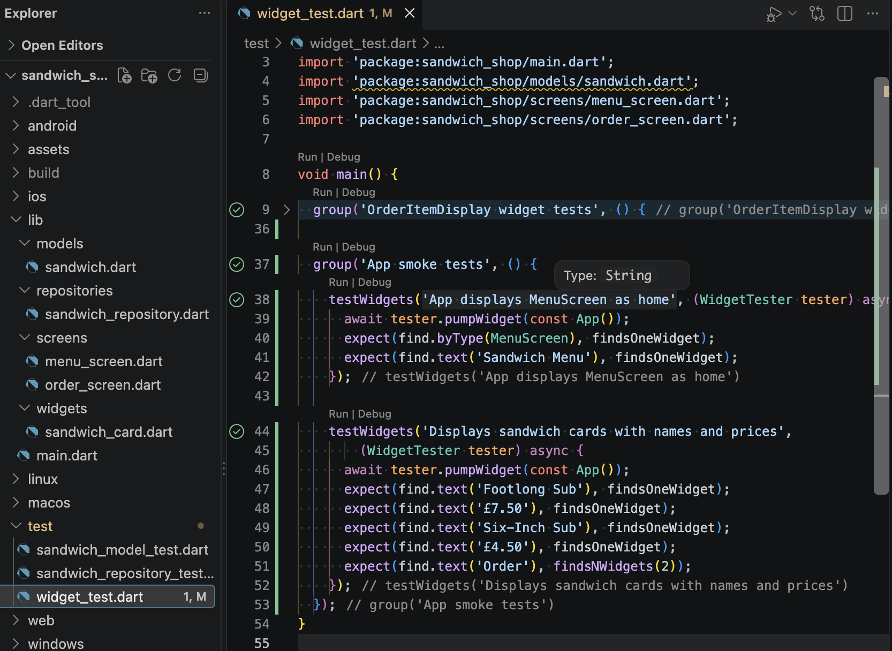

### Update SandwichCard to use formattedPrice

Earlier we added `formattedPrice` to `Sandwich`. Open `lib/widgets/sandwich_card.dart` and replace `Text('£${sandwich.price.toStringAsFixed(2)}')` with `sandwich.formattedPrice`:

```dart
Text(
  sandwich.formattedPrice,
  style: const TextStyle(
    fontSize: 16,
    fontWeight: FontWeight.bold,
  ),
),
```

This is what `lib/widgets/sandwich_card.dart` should look like now:

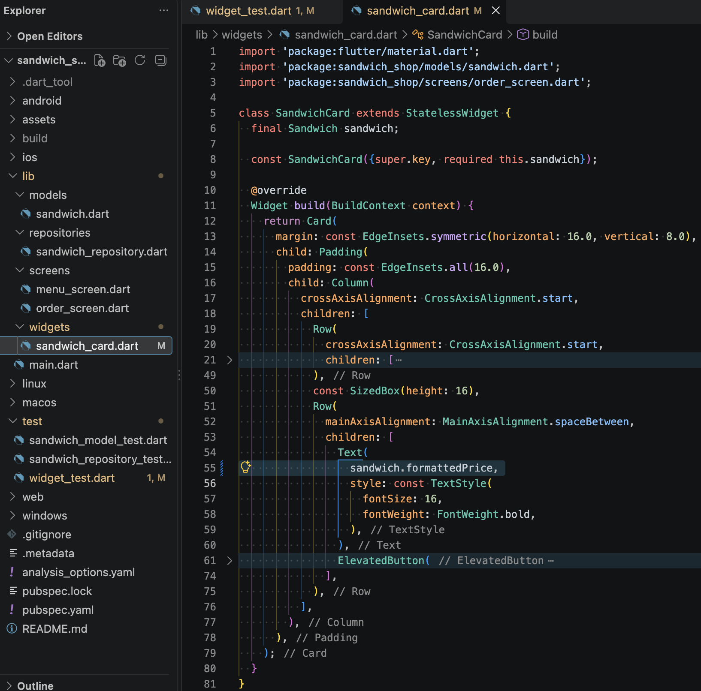

Run `flutter test test/widget_test.dart` again to verify that both tests still pass.

### Commit your changes (4)

In the Source Control panel, stage `lib/widgets/sandwich_card.dart` and `test/widget_test.dart`, then commit with the message `Add widget tests for MenuScreen and sandwich cards`.

## Simulating user interaction and navigation

Widget testing is particularly valuable when you simulate user actions such as tapping buttons and verify how the interface responds.

The `tester.tap()` method simulates a touch on any widget located by a finder. After triggering an interaction that calls `setState()` or initiates navigation, you must pump a new frame so the changes render.

Two methods pump frames:

- `tester.pump()`: renders a single frame, which is sufficient after calling `setState()`.
- `tester.pumpAndSettle()`: repeatedly renders frames until all animations, route transitions, and timers finish. You must use `pumpAndSettle()` after calling `Navigator.push()` because route transitions animate over multiple frames.

For more details on gesture simulation, review the [handling taps and gestures](https://docs.flutter.dev/cookbook/testing/widget/tap-drag) recipe in the Flutter documentation.

### Test navigating to the order screen

Add a third test inside the `App smoke tests` group that taps the **Order** button on the first sandwich card and confirms navigation:

```dart
    testWidgets('Tapping Order navigates to OrderScreen with selected sandwich',
        (WidgetTester tester) async {
      await tester.pumpWidget(const App());

      await tester.tap(find.text('Order').first);
      await tester.pumpAndSettle();

      expect(find.byType(OrderScreen), findsOneWidget);
      expect(find.text('Order Footlong Sub'), findsOneWidget);
      expect(find.text('0 Footlong Sub sandwich(es): '), findsOneWidget);
    });
```

Because `find.text('Order')` matches two buttons (one on each sandwich card), calling `tester.tap()` on the finder directly would throw an error because Flutter cannot determine which widget you intended to tap. Adding `.first` instructs the test runner to select the first matching widget.

Calling `await tester.pumpAndSettle()` repeatedly renders frames until all animations and transitions finish, ensuring the route transition completes before assertions run. Read more about settling frames in the [pumpAndSettle documentation](https://api.flutter.dev/flutter/flutter_test/WidgetTester/pumpAndSettle.html).

### Test adding and removing sandwich items

Now expand that same test to tap the **Add** and **Remove** buttons on `OrderScreen`, verifying that the quantity and emojis update accordingly:

```dart
    testWidgets('Tapping Order navigates to OrderScreen with selected sandwich',
        (WidgetTester tester) async {
      await tester.pumpWidget(const App());

      await tester.tap(find.text('Order').first);
      await tester.pumpAndSettle();

      expect(find.byType(OrderScreen), findsOneWidget);
      expect(find.text('Order Footlong Sub'), findsOneWidget);
      expect(find.text('0 Footlong Sub sandwich(es): '), findsOneWidget);

      await tester.tap(find.text('Add'));
      await tester.pump();
      expect(find.text('1 Footlong Sub sandwich(es): 🥪'), findsOneWidget);

      await tester.tap(find.text('Remove'));
      await tester.pump();
      expect(find.text('0 Footlong Sub sandwich(es): '), findsOneWidget);
    });
```

Here `tester.pump()` renders the frame immediately following each button tap.

Your test file should look like this in VS Code:


### Commit your changes (5)

In the Source Control panel, stage `test/widget_test.dart` and commit your changes with the message `Test navigation and order counter interactions`.

## Testing boundary conditions and isolated screens

Reliable test suites verify edge cases as well as standard flows. In our app, sandwich quantities must never drop below zero and must never exceed `maxQuantity`.

### Test minimum boundary on OrderScreen

We can test `OrderScreen` in isolation by supplying a sample `Sandwich` directly without loading the full menu. Add a test inside `App smoke tests` confirming that tapping **Remove** when the counter is zero does not drop the quantity into negative numbers:

```dart
    testWidgets('OrderScreen quantity does not drop below zero',
        (WidgetTester tester) async {
      const sandwich = Sandwich(
        id: 'test',
        name: 'Test Sub',
        description: 'Test description',
        price: 5.0,
        imagePath: 'assets/images/footlong.jpeg',
      );

      await tester.pumpWidget(
        const MaterialApp(
          home: OrderScreen(sandwich: sandwich),
        ),
      );

      await tester.tap(find.text('Remove'));
      await tester.pump();
      expect(find.text('0 Test Sub sandwich(es): '), findsOneWidget);
    });
```

### Test maximum boundary with maxQuantity

Next, add a test that sets `maxQuantity: 3` and taps **Add** five times to verify that the counter caps at three items:

```dart
    testWidgets('OrderScreen quantity does not exceed maxQuantity',
        (WidgetTester tester) async {
      const sandwich = Sandwich(
        id: 'test',
        name: 'Test Sub',
        description: 'Test description',
        price: 5.0,
        imagePath: 'assets/images/footlong.jpeg',
      );

      await tester.pumpWidget(
        const MaterialApp(
          home: OrderScreen(sandwich: sandwich, maxQuantity: 3),
        ),
      );

      for (int i = 0; i < 5; i++) {
        await tester.tap(find.text('Add'));
        await tester.pump();
      }

      expect(find.text('3 Test Sub sandwich(es): 🥪🥪🥪'), findsOneWidget);
    });
```

The standard `for` loop repeats a code block a specific number of times. Inside the parentheses, `int i = 0` initialises a counter variable, `i < 5` defines the condition that keeps the loop running, and `i++` increments the counter after each iteration. Read more in the [Dart loop documentation](https://dart.dev/language/loops#for-loops).

Your test file should look like this in VS Code. Make sure to run the tests again to confirm that all tests pass:

```bash
flutter test test/widget_test.dart
```

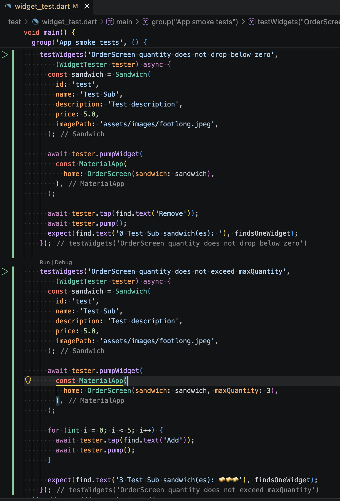

### Commit your changes (6)

In the Source Control panel, stage `test/widget_test.dart` and commit your changes with the message `Add isolated boundary tests for OrderScreen`.

## Running test suites and static analysis

Before committing your work or presenting it for a demo, always check the entire test suite, code formatting, and static analysis.

### Run the whole suite from the Test Explorer

VS Code collects every test in the project into the **Testing** view. Open it from the flask icon in the Activity Bar on the left, or with the Command Palette (**Ctrl + Shift + P** on Windows or **⌘ + Shift + P** on macOS) by running **Test: Focus on Test Explorer View**. From there you can run or debug the entire tree with one click and see green ticks beside each test.

To run every test in the project from the terminal, execute `flutter test` with no arguments:

```bash
flutter test
```

All unit and widget tests across all test files should pass, as shown below:

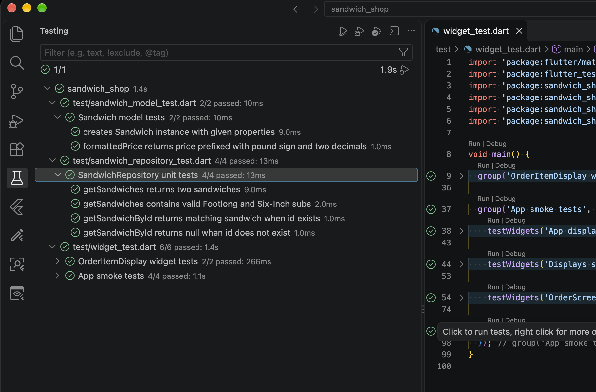

### Format your code with dart format

Dart includes an official formatter that enforces consistent spacing, indentation, and line breaks. Run it across your source and test folders:

```bash
dart format lib/ test/
```

You can also check whether your files conform to the style guide without changing them by adding `--output=none --set-exit-if-changed`:

```bash
dart format --output=none --set-exit-if-changed lib/ test/
```

This returns exit code 0 when all files are properly formatted, or prints unformatted file names and exits with code 1 if formatting changes are required.

If the formatter changed any files, stage and commit them.

As a pro tip, you can enable auto save in VS Code by opening the Command Palette (**Ctrl + Shift + P** on Windows or **⌘ + Shift + P** on macOS) and running **File: Auto Save**. This automatically saves files after a short delay, which triggers the formatter if you have it enabled in your settings.

Next enable the Dart extension's **Format on Save** feature in VS Code. Open the Command Palette and run **Preferences: Open Settings (UI)**. Search for `dart format` and check **Dart: Format On Save**. This way, every time you save a file, the Dart formatter will automatically run and ensure your code adheres to the style guide.

### Analyse your code with the Dart analyser

The Dart analyser checks your project for syntax errors, type mismatches, unused imports, and style violations configured in `analysis_options.yaml`. Run it across your source and test folders:

```bash
dart analyze lib/ test/
```

You should see something like this:

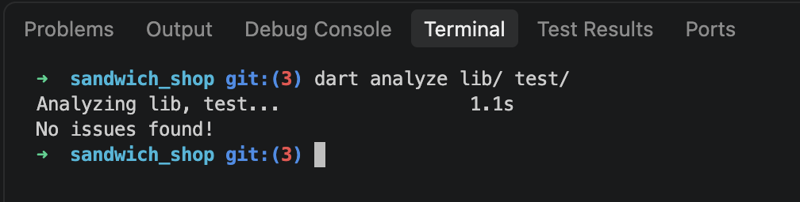

If any warnings or lints appear, resolve them before demonstrating your coursework. To read more about configuring rules, see [customising static analysis](https://dart.dev/tools/analysis) on dart.dev.

### Commit your changes (7)

If you made any formatting fixes, stage the updated files and commit them with the message `Format code and verify static analysis`.

## Exercises

As in Worksheet 1 and Worksheet 2, these exercises apply to your Southsea Cinema coursework and, together with the Worksheet 3 exercises, prepare you for Demo 2. See the [Southsea Cinema coursework brief](https://portdotacdotuk-my.sharepoint.com/:w:/g/personal/mani_ghahremani_port_ac_uk/IQDtIJB3bM7gQ4p03eLUngyyAd7JuhjhHuNA1l0H-qCy3Jw). Remember to commit your changes regularly as you work through each exercise; small, frequent commits are assessed as part of your demo quality mark. You must demonstrate your work for a sign-off during your own timetabled practical session.

In Worksheet 3 you refactored the Southsea Cinema application to show movie cards on the home page and navigate to the dynamic listing page. For Demo 2 you must demonstrate that your codebase is backed by passing automated tests and clean static analysis.

1. Open `lib/models/movie.dart` in your `southsea_cinema` fork. Following the pattern from [Add a formatted price getter to the sandwich model](#add-a-formatted-price-getter-to-the-sandwich-model), add a `formattedPrice` getter that returns the ticket price prefixed with `£` and formatted to two decimal places (for example `'£6.00'`). In addition, add helper getters to check age rating suitability: an `isChildFriendly` getter that returns `true` if `ageRating` is `'U'` or `'PG'` and `false` otherwise, and an `isAdultOnly` getter that returns `true` if `ageRating` is `'18'` and `false` otherwise. Update your movie listing page to display `movie.formattedPrice`.

2. Create a unit test file named `test/movie_model_test.dart`, following the steps in [Unit testing data models](#unit-testing-data-models). Write unit tests using `group()`, `test()`, and `expect()` that verify constructor property assignment, the `formattedPrice` getter, and your age rating suitability methods (`isChildFriendly` and `isAdultOnly`) across different age ratings.

3. In `lib/repositories/movie_repository.dart`, add a `getMovieById(String id)` method that searches the list of films and returns the matching `Movie`, or `null` if no film matches the identifier, following the pattern from [Add getSandwichById to SandwichRepository](#add-getsandwichbyid-to-sandwichrepository). In addition, add helper query methods such as `getMoviesByAgeRating(String rating)` and `getMoviesUnderPrice(double maxPrice)` to filter the film collection. Then create a unit test file named `test/movie_repository_test.dart`, following [Unit testing repositories](#unit-testing-repositories). Write tests with `group()`, `test()`, and `expect()` that verify your movie repository returns a list containing at least two movies, that each movie has a non-empty unique `id`, a non-empty title, an age rating, and a ticket price greater than zero, and that `getMovieById()` returns the correct movie when given an existing identifier and returns `null` for a missing identifier. Add test cases verifying that `getMoviesByAgeRating()` and `getMoviesUnderPrice()` return only the films matching the filter criteria.

4. In `test/widget_test.dart`, write a widget test that pumps `SouthseaCinemaApp` and waits for the widget tree to settle with `tester.pumpAndSettle()`, as in [Test initial menu screen rendering](#test-initial-menu-screen-rendering). Verify that the home page displays the app title, the movie titles, and the booking buttons.

5. Run `dart format` and `dart analyze` across your project, as described in [Running test suites and static analysis](#running-test-suites-and-static-analysis). Confirm that your codebase has zero analyser issues and follows formatting conventions.

6. (Advanced) Expand `test/widget_test.dart` to test the full navigation flow from the home page to the movie listing page, following the steps in [Test navigating to the order screen](#test-navigating-to-the-order-screen). Simulate tapping a booking button with `tester.tap()`, call `tester.pumpAndSettle()`, and assert that the movie listing page opened with the selected film's details. If your listing page contains a booking feedback button, simulate tapping the button and assert that the confirmation message appears. **Show your passing test suite and running application to a member of staff** for your Demo 2 sign-off.
