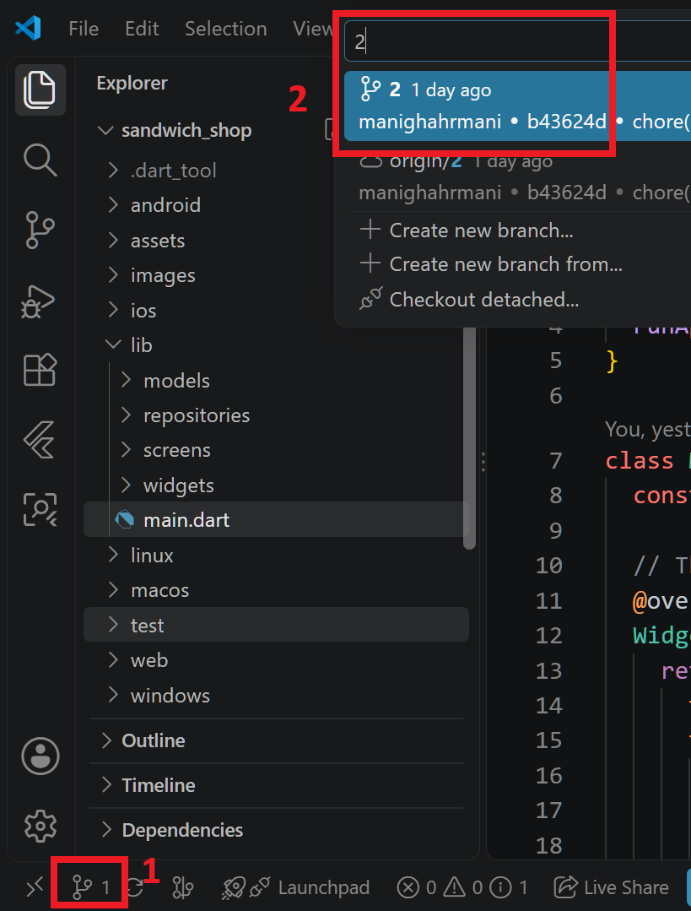
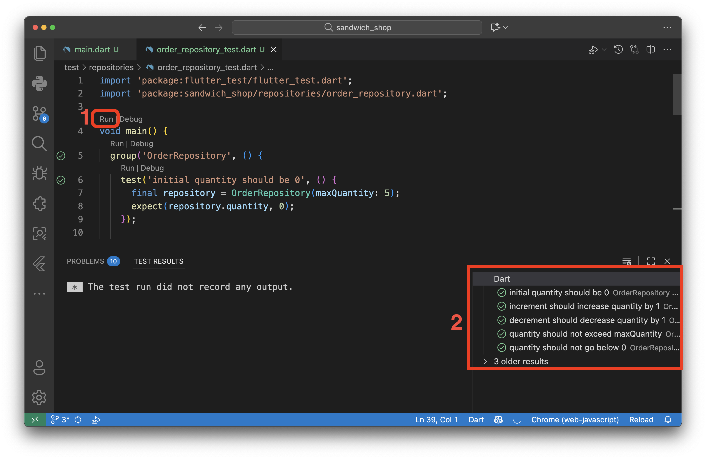

# Worksheet 4 — Unit and Widget Testing

## Table of contents

- [What you need to know beforehand](#what-you-need-to-know-beforehand)
- [Getting help](#getting-help)
- [Getting started](#getting-started)
  - [Continue from Worksheet 3](#continue-from-worksheet-3)
  - [Clone the Sandwich Shop repository](#clone-the-sandwich-shop-repository)
  - [Clean your working tree](#clean-your-working-tree)
  - [Switch to branch 3](#switch-to-branch-3)
- [Why automated testing matters](#why-automated-testing-matters)
- [Unit testing data models](#unit-testing-data-models)
  - [Understand unit tests](#understand-unit-tests)
  - [Add a formatted price getter to the sandwich model](#add-a-formatted-price-getter-to-the-sandwich-model)
  - [Create the model test file](#create-the-model-test-file)
  - [Test model property assignment](#test-model-property-assignment)
  - [Test the formatted price getter](#test-the-formatted-price-getter)
  - [Run unit tests without leaving the editor](#run-unit-tests-without-leaving-the-editor)
  - [Commit your changes (1)](#commit-your-changes-1)
- [Unit testing repositories](#unit-testing-repositories)
  - [Create the repository test file](#create-the-repository-test-file)
  - [Verify sandwich list length](#verify-sandwich-list-length)
  - [Verify sandwich items and attributes](#verify-sandwich-items-and-attributes)
  - [Add getSandwichById to SandwichRepository](#add-getsandwichbyid-to-sandwichrepository)
  - [Test getSandwichById with existing and missing identifiers](#test-getsandwichbyid-with-existing-and-missing-identifiers)
  - [Commit your changes (2)](#commit-your-changes-2)
- [Widget testing in Flutter](#widget-testing-in-flutter)
  - [Understand widget tests](#understand-widget-tests)
  - [Prepare the widget test file](#prepare-the-widget-test-file)
  - [Test OrderItemDisplay in isolation](#test-orderitemdisplay-in-isolation)
  - [Commit your changes (3)](#commit-your-changes-3)
  - [Test initial menu screen rendering](#test-initial-menu-screen-rendering)
  - [Update SandwichCard to use formattedPrice](#update-sandwichcard-to-use-formattedprice)
  - [Commit your changes (4)](#commit-your-changes-4)
- [Simulating user interaction and navigation](#simulating-user-interaction-and-navigation)
  - [Test navigating to the order screen](#test-navigating-to-the-order-screen)
  - [Test adding and removing sandwich items](#test-adding-and-removing-sandwich-items)
  - [Commit your changes (5)](#commit-your-changes-5)
- [Testing boundary conditions and isolated screens](#testing-boundary-conditions-and-isolated-screens)
  - [Test minimum boundary on OrderScreen](#test-minimum-boundary-on-orderscreen)
  - [Test maximum boundary with maxQuantity](#test-maximum-boundary-with-maxquantity)
  - [Commit your changes (6)](#commit-your-changes-6)
- [Running test suites and static analysis](#running-test-suites-and-static-analysis)
  - [Run the whole suite from the Test Explorer](#run-the-whole-suite-from-the-test-explorer)
  - [Format your code with dart format](#format-your-code-with-dart-format)
  - [Analyse your code with the Dart analyser](#analyse-your-code-with-the-dart-analyser)
  - [Commit your changes (7)](#commit-your-changes-7)
- [Exercises](#exercises)

## What you need to know beforehand

Ensure that you have completed [Worksheet 1 — Dart, Git, GitHub and Flutter](./worksheet-1.md), [Worksheet 2 — Stateless and Stateful Widgets](./worksheet-2.md), and [Worksheet 3 — Data Models, Repositories, Assets and In-Page Navigation](./worksheet-3.md). You should have an application separated into models, repositories, and widgets, with stack-based navigation using `Navigator.push` (introduced in the [Navigate between screens and pass data](./worksheet-3.md#navigate-between-screens-and-pass-data) section of Worksheet 3).

## Getting help

To get support with this worksheet, follow the [Discord guide](https://portdotacdotuk-my.sharepoint.com/:p:/g/personal/mani_ghahremani_port_ac_uk/IQCMJP6IiR_bQoYUMdXJSRDYAWnajEALZYEXFZyrJkHS1QU) and post your questions there. You can also attend your timetabled practical sessions and ask a member of teaching staff for guidance.

## Getting started

### Continue from Worksheet 3

You can continue directly with the Sandwich Shop project you updated in Worksheet 3. Open the project folder in VS Code with **File > Open Folder**. You do not need to clone the repository again.

### Clone the Sandwich Shop repository

If you do not have the project from Worksheet 3, clone the [Sandwich Shop repository](https://github.com/manighahrmani/sandwich_shop). Open a terminal and move to a folder that is not synchronised to cloud storage, such as your `Downloads` folder:

```bash
cd ~/Downloads
git clone https://github.com/manighahrmani/sandwich_shop
cd sandwich_shop
```

The `cd` command changes the current folder in the terminal. The first command moves to `Downloads`, and the final command moves into the cloned `sandwich_shop` folder. Open that folder in VS Code with **File > Open Folder**.

You can also clone the repository without typing terminal commands. Open the Source Control panel, select **Clone Repository**, enter `https://github.com/manighahrmani/sandwich_shop`, choose where to save it, then open the cloned folder, as shown below:


### Clean your working tree

This repository opens on the `main` branch, which contains the worksheets rather than the Flutter application. For this worksheet, you need branch `3`, which contains the Sandwich Shop app as it should look after Worksheet 3.

Before switching branches, open the Source Control panel with **Ctrl + Shift + G** on Windows or **⌃ + Shift + G** on macOS and check that there are no uncommitted changes. Commit any work that you want to keep. If you do not want to keep a change, discard it from the Source Control panel, as shown below:


### Switch to branch 3

You can switch branches from the status bar at the bottom of VS Code. Click the current branch name, then select branch `3`, as shown below:



Alternatively, open the integrated terminal from the Command Palette with **Ctrl + Shift + P** on Windows or **⌘ + Shift + P** on macOS, run **Terminal: Create New Integrated Terminal**, then run:

```bash
git checkout 3
```

The `checkout` command replaces the files in your working folder with the files from branch `3`. Check the status bar now says `3` before continuing. If Git refuses to switch branches, return to the Source Control panel and commit or discard your uncommitted changes first.

This is what you should see when you run your app now:


## Why automated testing matters

As your application grows, manually checking every button and screen after every edit becomes slow and error-prone. A small change to a model or repository can quietly break a screen you forgot to inspect.

Automated tests let you describe your expectations in code once. Whenever you run the tests, the machine verifies every expectation in seconds. Flutter divides tests into three tiers:

1. **Unit tests:** fast tests that verify individual functions, methods, or classes in isolation, without starting the Flutter engine.
2. **Widget tests:** medium-speed tests that render widgets in a simulated environment to verify layout, text, and gestures.
3. **Integration tests:** comprehensive tests that run the whole application on a device or in a browser.

In this worksheet we focus on unit and widget tests. For a broader overview of testing concepts and recipes, read the [testing overview in the Flutter documentation](https://docs.flutter.dev/testing/overview) and browse the [Flutter testing cookbook](https://docs.flutter.dev/cookbook/testing).

## Unit testing data models

Unit tests verify that non-UI classes behave correctly. Data models define the shape of your application data and often include formatting or conversion methods. Testing models early guarantees that the data contracts your screens rely on are sound.

### Understand unit tests

Flutter re-exports the Dart `test()` function from `package:flutter_test/flutter_test.dart`. Each test makes one or more assertions with `expect(actual, matcher)`. If the actual value matches the expectation, the test passes; if not, it fails with a diagnostic that names the difference.

To learn more about test structure and matchers, read the [unit testing guide](https://docs.flutter.dev/cookbook/testing/unit/introduction) in the Flutter cookbook.

### Add a formatted price getter to the sandwich model

In Worksheet 3 we created the `Sandwich` model in `lib/models/sandwich.dart`. At the moment, widgets format the price manually by calling `toStringAsFixed(2)`. Moving that formatting logic into the model itself avoids duplicating code across multiple screens and widgets.

Open `lib/models/sandwich.dart` and add a `formattedPrice` getter to the `Sandwich` class:

```dart
String get formattedPrice => '£${price.toStringAsFixed(2)}';
```

Your `lib/models/sandwich.dart` file should now look like this:

```dart
class Sandwich {
  final String id;
  final String name;
  final String description;
  final double price;
  final String imagePath;

  const Sandwich({
    required this.id,
    required this.name,
    required this.description,
    required this.price,
    required this.imagePath,
  });

  String get formattedPrice => '£${price.toStringAsFixed(2)}';
}
```

The updated model should look like this in VS Code:


### Create the model test file

Test files live in the `test/` directory at the root of your project, and their names end with `_test.dart`. The Flutter test runner discovers them automatically by that suffix.

Create a new file named `test/sandwich_model_test.dart`. Start with the imports and an empty `main()`:

```dart
import 'package:flutter_test/flutter_test.dart';
import 'package:sandwich_shop/models/sandwich.dart';

void main() {}
```

The `main()` function is the entry point the test runner executes.

### Test model property assignment

Inside `main()`, use `group()` to bundle related tests under one heading, then add a single `test()` that creates a `Sandwich` instance and checks that its constructor assigns each field correctly:

```dart
void main() {
  group('Sandwich model tests', () {
    test('creates Sandwich instance with given properties', () {
      const sandwich = Sandwich(
        id: 'veggie',
        name: 'Veggie Sub',
        description: 'Loaded with fresh vegetables.',
        price: 5.25,
        imagePath: 'assets/images/six_inch.jpeg',
      );

      expect(sandwich.id, 'veggie');
      expect(sandwich.name, 'Veggie Sub');
      expect(sandwich.description, 'Loaded with fresh vegetables.');
      expect(sandwich.price, 5.25);
      expect(sandwich.imagePath, 'assets/images/six_inch.jpeg');
    });
  });
}
```

When you pass a literal value such as `'veggie'` or `5.25` to `expect()`, it performs an equality check against the actual value.

### Test the formatted price getter

Now add a second `test()` inside the same group to verify that `formattedPrice` correctly prefixes the price with a pound sign and formats the number to two decimal places:

```dart
    test(
        'formattedPrice returns price prefixed with pound sign and two decimals',
        () {
      const sandwich = Sandwich(
        id: 'footlong',
        name: 'Footlong Sub',
        description: 'Test description',
        price: 7.5,
        imagePath: 'assets/images/footlong.jpeg',
      );

      expect(sandwich.formattedPrice, '£7.50');
    });
```

Because `7.5` only specifies one decimal place, this test confirms that `formattedPrice` correctly pads the price to two decimal places (`£7.50`).

### Run unit tests without leaving the editor

When the Dart and Flutter extensions are installed, a small **Run** and **Debug** CodeLens link appears directly above every `main()`, `group()`, and `test()`. Click **Run** above the group to run all tests in the file. The results appear in the **Test Results** panel with a green tick beside each passing test:



You can also run the file from the integrated terminal with `flutter test` (open a terminal with **Ctrl + backtick**):

```bash
flutter test test/sandwich_model_test.dart
```

Your terminal output should look like this:


### Commit your changes (1)

In the Source Control panel, stage `lib/models/sandwich.dart` and `test/sandwich_model_test.dart`, then commit with the message `Add formattedPrice getter to Sandwich model and unit tests`.

## Unit testing repositories

Repositories supply data to the rest of the application. In our project, `SandwichRepository` provides the sandwich menu, so we should confirm it returns valid items and supports querying items by identifier before any widget displays the data.

### Create the repository test file

Create a new file named `test/sandwich_repository_test.dart`. Start with the imports and an empty `main()`:

```dart
import 'package:flutter_test/flutter_test.dart';
import 'package:sandwich_shop/models/sandwich.dart';
import 'package:sandwich_shop/repositories/sandwich_repository.dart';

void main() {}
```

### Verify sandwich list length

Inside `main()`, declare a test group and write a test checking that `getSandwiches()` returns a list with two items:

```dart
void main() {
  group('SandwichRepository unit tests', () {
    test('getSandwiches returns two sandwiches', () {
      final SandwichRepository repository = SandwichRepository();
      final List<Sandwich> sandwiches = repository.getSandwiches();

      expect(sandwiches.length, 2);
    });
  });
}
```

This verifies that the repository returns the expected number of items.

### Verify sandwich items and attributes

A count on its own does not confirm the data is correct. Add a second `test()` inside the group that inspects the two sandwiches and verifies their identifiers, names, prices, and image paths:

```dart
    test('getSandwiches contains valid Footlong and Six-Inch subs', () {
      final SandwichRepository repository = SandwichRepository();
      final List<Sandwich> sandwiches = repository.getSandwiches();

      final Sandwich footlong = sandwiches[0];
      expect(footlong.id, 'footlong');
      expect(footlong.name, 'Footlong Sub');
      expect(footlong.price, 7.50);
      expect(footlong.imagePath, isNotEmpty);

      final Sandwich sixInch = sandwiches[1];
      expect(sixInch.id, 'six-inch');
      expect(sixInch.name, 'Six-Inch Sub');
      expect(sixInch.price, 4.50);
      expect(sixInch.imagePath, isNotEmpty);
    });
```

The `isNotEmpty` matcher is provided by `package:flutter_test/flutter_test.dart`; it passes when the string has at least one character.

### Add getSandwichById to SandwichRepository

Applications often need to look up a specific item by its identifier. Let's add a `getSandwichById()` method to `SandwichRepository`.

Open `lib/repositories/sandwich_repository.dart`. Inside the `SandwichRepository` class, add the following method below `getSandwiches()`:

```dart
  Sandwich? getSandwichById(String id) {
    for (final sandwich in getSandwiches()) {
      if (sandwich.id == id) {
        return sandwich;
      }
    }
    return null;
  }
```

The return type `Sandwich?` indicates that the method may return `null` if no sandwich matches the provided identifier.

### Test getSandwichById with existing and missing identifiers

Now return to `test/sandwich_repository_test.dart` and add two new tests to verify both the successful search and the missing item cases:

```dart
    test('getSandwichById returns matching sandwich when id exists', () {
      final SandwichRepository repository = SandwichRepository();
      final Sandwich? sandwich = repository.getSandwichById('footlong');

      expect(sandwich, isNotNull);
      expect(sandwich?.name, 'Footlong Sub');
      expect(sandwich?.price, 7.50);
    });

    test('getSandwichById returns null when id does not exist', () {
      final SandwichRepository repository = SandwichRepository();
      final Sandwich? sandwich = repository.getSandwichById('non-existent');

      expect(sandwich, isNull);
    });
```

The `isNotNull` and `isNull` matchers confirm that optional return values match the expected presence or absence of data.

Run the repository unit tests from the terminal:

```bash
flutter test test/sandwich_repository_test.dart
```

You should see output confirming that all four repository tests passed:

```text
00:00 +0: SandwichRepository unit tests getSandwiches returns two sandwiches
00:00 +1: SandwichRepository unit tests getSandwiches contains valid Footlong and Six-Inch subs
00:00 +2: SandwichRepository unit tests getSandwichById returns matching sandwich when id exists
00:00 +3: SandwichRepository unit tests getSandwichById returns null when id does not exist
00:00 +4: All tests passed!
```

Your terminal output should look like this:


### Commit your changes (2)

In the Source Control panel, stage `lib/repositories/sandwich_repository.dart` and `test/sandwich_repository_test.dart`, then commit with the message `Add getSandwichById method and unit tests for SandwichRepository`.

## Widget testing in Flutter

While unit tests check data models and repository methods, widget tests verify that widgets look and behave as expected.

### Understand widget tests

Widget tests use `testWidgets()` instead of `test()`. The test callback receives a `WidgetTester` object that can render widgets, search the widget tree for elements, simulate taps, and advance time frame by frame.

For a detailed introduction, read the [widget testing guide](https://docs.flutter.dev/cookbook/testing/widget/introduction) and the [finding widgets in a test](https://docs.flutter.dev/cookbook/testing/widget/finders) recipe in the Flutter documentation.

### Prepare the widget test file

Open the existing `test/widget_test.dart`. Replace its entire contents with the imports we need and an empty `main()`:

```dart
import 'package:flutter/material.dart';
import 'package:flutter_test/flutter_test.dart';
import 'package:sandwich_shop/main.dart';
import 'package:sandwich_shop/models/sandwich.dart';
import 'package:sandwich_shop/screens/menu_screen.dart';
import 'package:sandwich_shop/screens/order_screen.dart';

void main() {}
```

We import `package:flutter/material.dart` so we can wrap individual widgets in a `MaterialApp`, and we import our screens and models so tests can reference them by type.

### Test OrderItemDisplay in isolation

A key advantage of widget testing is that you do not need to launch the entire application to test an individual widget. You can pump any widget directly inside a `MaterialApp` and `Scaffold`.

Let's test `OrderItemDisplay` from `lib/screens/order_screen.dart` in isolation. Add a test group with two tests verifying that zero sandwiches show no emoji and three sandwiches display three emojis:

```dart
void main() {
  group('OrderItemDisplay widget tests', () {
    testWidgets('displays zero sandwiches with no emoji',
        (WidgetTester tester) async {
      await tester.pumpWidget(
        const MaterialApp(
          home: Scaffold(
            body: OrderItemDisplay(0, 'Footlong Sub'),
          ),
        ),
      );

      expect(find.text('0 Footlong Sub sandwich(es): '), findsOneWidget);
    });

    testWidgets('displays three sandwiches with three emojis',
        (WidgetTester tester) async {
      await tester.pumpWidget(
        const MaterialApp(
          home: Scaffold(
            body: OrderItemDisplay(3, 'Footlong Sub'),
          ),
        ),
      );

      expect(find.text('3 Footlong Sub sandwich(es): 🥪🥪🥪'), findsOneWidget);
    });
  });
}
```

The `tester.pumpWidget()` method renders the widget hierarchy in the test environment. Because rendering is asynchronous, you must `await` it.

Run the test file from the terminal or using the CodeLens link above the group:

```bash
flutter test test/widget_test.dart
```

Both isolated tests should pass, as shown below:


### Commit your changes (3)

In the Source Control panel, stage `test/widget_test.dart` and commit your changes with the message `Add isolated widget tests for OrderItemDisplay`.

### Test initial menu screen rendering

Now let's test the main menu screen when the entire application launches. Add a second test group named `App smoke tests` inside `main()` with two tests:

```dart
  group('App smoke tests', () {
    testWidgets('App displays MenuScreen as home', (WidgetTester tester) async {
      await tester.pumpWidget(const App());
      expect(find.byType(MenuScreen), findsOneWidget);
      expect(find.text('Sandwich Menu'), findsOneWidget);
    });

    testWidgets('Displays sandwich cards with names and prices',
        (WidgetTester tester) async {
      await tester.pumpWidget(const App());
      expect(find.text('Footlong Sub'), findsOneWidget);
      expect(find.text('£7.50'), findsOneWidget);
      expect(find.text('Six-Inch Sub'), findsOneWidget);
      expect(find.text('£4.50'), findsOneWidget);
      expect(find.text('Order'), findsNWidgets(2));
    });
  });
```

The `find.text()` finder searches the rendered tree for specific text, while `find.byType()` searches for a widget by its class. The matchers `findsOneWidget` and `findsNWidgets(2)` assert the exact number of matching elements.

### Update SandwichCard to use formattedPrice

Earlier we added `formattedPrice` to `Sandwich`. Open `lib/widgets/sandwich_card.dart` and replace `Text('£${sandwich.price.toStringAsFixed(2)}')` with `sandwich.formattedPrice`:

```dart
Text(
  sandwich.formattedPrice,
  style: const TextStyle(
    fontSize: 16,
    fontWeight: FontWeight.bold,
  ),
),
```

Run `flutter test test/widget_test.dart` to verify that both tests still pass. Your test results should look like this:


### Commit your changes (4)

In the Source Control panel, stage `lib/widgets/sandwich_card.dart` and `test/widget_test.dart`, then commit with the message `Add widget tests for MenuScreen and sandwich cards`.

## Simulating user interaction and navigation

Widget testing is particularly valuable when you simulate user actions such as tapping buttons and verify how the interface responds.

The `tester.tap()` method simulates a touch on any widget located by a finder. After triggering an interaction that calls `setState()` or initiates navigation, you must pump a new frame so the changes render.

Two methods pump frames:

- `tester.pump()`: renders a single frame, which is sufficient after calling `setState()`.
- `tester.pumpAndSettle()`: repeatedly renders frames until all animations, route transitions, and timers finish. You must use `pumpAndSettle()` after calling `Navigator.push()` because route transitions animate over multiple frames.

For more details on gesture simulation, review the [handling taps and gestures](https://docs.flutter.dev/cookbook/testing/widget/tap-drag) recipe in the Flutter documentation.

### Test navigating to the order screen

Add a third test inside the `App smoke tests` group that taps the **Order** button on the first sandwich card and confirms navigation:

```dart
    testWidgets('Tapping Order navigates to OrderScreen with selected sandwich',
        (WidgetTester tester) async {
      await tester.pumpWidget(const App());

      await tester.tap(find.text('Order').first);
      await tester.pumpAndSettle();

      expect(find.byType(OrderScreen), findsOneWidget);
      expect(find.text('Order Footlong Sub'), findsOneWidget);
      expect(find.text('0 Footlong Sub sandwich(es): '), findsOneWidget);
    });
```

Because `find.text('Order')` finds two buttons (one per card), `.first` selects the button on the first card. `await tester.pumpAndSettle()` ensures the slide animation completes before assertions run.

### Test adding and removing sandwich items

Now expand that same test to tap the **Add** and **Remove** buttons on `OrderScreen`, verifying that the quantity and emojis update accordingly:

```dart
    testWidgets('Tapping Order navigates to OrderScreen with selected sandwich',
        (WidgetTester tester) async {
      await tester.pumpWidget(const App());

      await tester.tap(find.text('Order').first);
      await tester.pumpAndSettle();

      expect(find.byType(OrderScreen), findsOneWidget);
      expect(find.text('Order Footlong Sub'), findsOneWidget);
      expect(find.text('0 Footlong Sub sandwich(es): '), findsOneWidget);

      await tester.tap(find.text('Add'));
      await tester.pump();
      expect(find.text('1 Footlong Sub sandwich(es): 🥪'), findsOneWidget);

      await tester.tap(find.text('Remove'));
      await tester.pump();
      expect(find.text('0 Footlong Sub sandwich(es): '), findsOneWidget);
    });
```

Here `tester.pump()` renders the frame immediately following each button tap.

Your test file should look like this in VS Code:


### Commit your changes (5)

In the Source Control panel, stage `test/widget_test.dart` and commit your changes with the message `Test navigation and order counter interactions`.

## Testing boundary conditions and isolated screens

Reliable test suites verify edge cases as well as standard flows. In our app, sandwich quantities must never drop below zero and must never exceed `maxQuantity`.

### Test minimum boundary on OrderScreen

We can test `OrderScreen` in isolation by supplying a sample `Sandwich` directly without loading the full menu. Add a test inside `App smoke tests` confirming that tapping **Remove** when the counter is zero does not drop the quantity into negative numbers:

```dart
    testWidgets('OrderScreen quantity does not drop below zero',
        (WidgetTester tester) async {
      const sandwich = Sandwich(
        id: 'test',
        name: 'Test Sub',
        description: 'Test description',
        price: 5.0,
        imagePath: 'assets/images/footlong.jpeg',
      );

      await tester.pumpWidget(
        const MaterialApp(
          home: OrderScreen(sandwich: sandwich),
        ),
      );

      await tester.tap(find.text('Remove'));
      await tester.pump();
      expect(find.text('0 Test Sub sandwich(es): '), findsOneWidget);
    });
```

### Test maximum boundary with maxQuantity

Next, add a test that sets `maxQuantity: 3` and taps **Add** five times to verify that the counter caps at three items:

```dart
    testWidgets('OrderScreen quantity does not exceed maxQuantity',
        (WidgetTester tester) async {
      const sandwich = Sandwich(
        id: 'test',
        name: 'Test Sub',
        description: 'Test description',
        price: 5.0,
        imagePath: 'assets/images/footlong.jpeg',
      );

      await tester.pumpWidget(
        const MaterialApp(
          home: OrderScreen(sandwich: sandwich, maxQuantity: 3),
        ),
      );

      for (int i = 0; i < 5; i++) {
        await tester.tap(find.text('Add'));
        await tester.pump();
      }

      expect(find.text('3 Test Sub sandwich(es): 🥪🥪🥪'), findsOneWidget);
    });
```

The `for` loop simulates five consecutive taps, while the assertion verifies that only three emojis appear.

Your test file should look like this in VS Code:


### Commit your changes (6)

In the Source Control panel, stage `test/widget_test.dart` and commit your changes with the message `Add isolated boundary tests for OrderScreen`.

## Running test suites and static analysis

Before committing your work or presenting it for a sign-off, always check the entire test suite, code formatting, and static analysis.

### Run the whole suite from the Test Explorer

VS Code collects every test in the project into the **Testing** view. Open it from the flask icon in the Activity Bar on the left, or with the Command Palette (**Ctrl + Shift + P** on Windows or **⌘ + Shift + P** on macOS) by running **Test: Focus on Test Explorer View**. From there you can run or debug the entire tree with one click and see green ticks beside each test.

To run every test in the project from the terminal, execute `flutter test` with no arguments:

```bash
flutter test
```

All unit and widget tests across all test files should pass, as shown below:


### Format your code with dart format

Dart includes an official formatter that enforces consistent spacing, indentation, and line breaks. Run it across your source and test folders:

```bash
dart format lib/ test/
```

If the formatter changed any files, stage and commit them.

### Analyse your code with the Dart analyser

The Dart analyser checks your project for syntax errors, type mismatches, unused imports, and style violations configured in `analysis_options.yaml`. Run it across your source and test folders:

```bash
dart analyze lib/ test/
```

You should see:

```text
Analyzing lib, test...
No issues found!
```

Your terminal output should look like this:


If any warnings or lints appear, resolve them before demonstrating your coursework. To read more about configuring rules, see [customising static analysis](https://dart.dev/tools/analysis) on dart.dev.

### Commit your changes (7)

If you made any formatting fixes, stage the updated files and commit them with the message `Format code and verify static analysis`.

## Exercises

As in Worksheet 1 and Worksheet 2, these exercises apply to your Southsea Cinema coursework and, together with the Worksheet 3 exercises, prepare you for Demo 2. See the [Southsea Cinema coursework brief](https://portdotacdotuk-my.sharepoint.com/:w:/g/personal/mani_ghahremani_port_ac_uk/IQDtIJB3bM7gQ4p03eLUngyyAd7JuhjhHuNA1l0H-qCy3Jw). Be sure to commit your changes regularly as you work through each exercise; small, frequent commits with clear messages are assessed as part of your demo quality mark. You must demonstrate your work for a sign-off during your own timetabled practical session.

In Worksheet 3 you refactored the Southsea Cinema application to show movie cards on the home page and navigate to the dynamic listing page. For Demo 2 you must demonstrate that your codebase is backed by passing automated tests and clean static analysis.

1. Create a unit test file named `test/movie_repository_test.dart` inside your `southsea_cinema` fork. Using `group()`, `test()`, and `expect()`, write unit tests that verify `MovieRepository.getMovies()` returns a list containing at least two movies, and that each movie has a non-empty title, a valid age rating, and a ticket price greater than zero.

2. Create a unit test file named `test/movie_model_test.dart` in your `southsea_cinema` project. Write unit tests verifying that an instantiated `Movie` correctly assigns all fields supplied to its constructor. If your model contains any helper methods or computed properties (such as formatting screening details or prices), add assertions to verify their return values.

3. In `test/widget_test.dart`, write an isolated widget test for your `MovieCard` widget. Pump the widget inside a `MaterialApp` and `Scaffold`, passing a sample `Movie` instance into it. Verify that the card displays the movie title, age rating, screening time, and the booking button.

4. Expand `test/widget_test.dart` to test the full navigation flow from the home page. Pump `SouthseaCinemaApp`, wait for the widget tree to settle with `tester.pumpAndSettle()`, and verify that the cinema title and film cards appear. Simulate tapping the booking button for one of your films with `tester.tap()`, call `tester.pumpAndSettle()`, and assert that the movie listing page opened displaying the chosen film details.

5. Add an interaction test for the movie listing page that simulates selecting a ticket quantity or adding tickets to an order. Verify that the interface responds as expected (for example, displaying the updated ticket quantity or order message) and test edge cases such as the default initial selection.

6. Run your entire test suite from the terminal with `flutter test` or using the VS Code Test Explorer. Ensure that all unit and widget tests pass with zero failures:

    

    Run `dart analyze` and `dart format --output=none --set-exit-if-changed .` across your project to confirm that your codebase has zero analyser issues and matches formatting standards. Run your app in Chrome with `flutter run -d chrome`. **Show your running application and passing test suite to a member of staff** for your Demo 2 sign-off.
