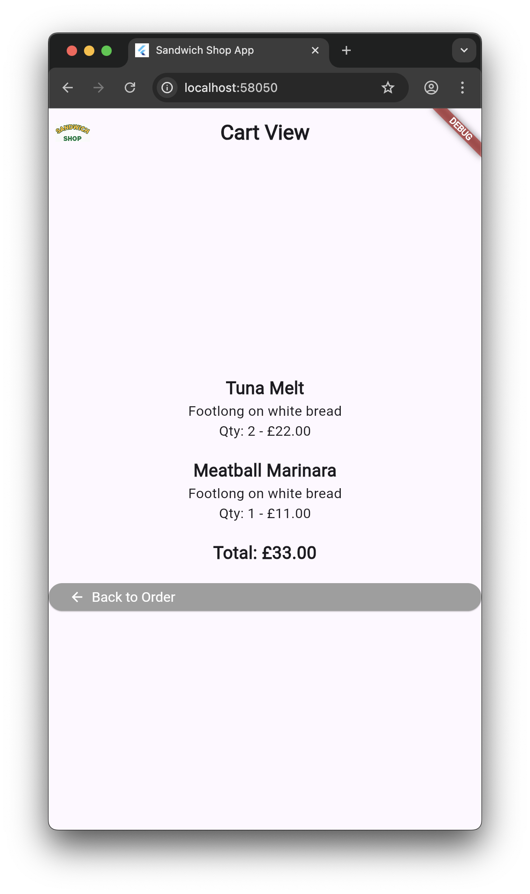
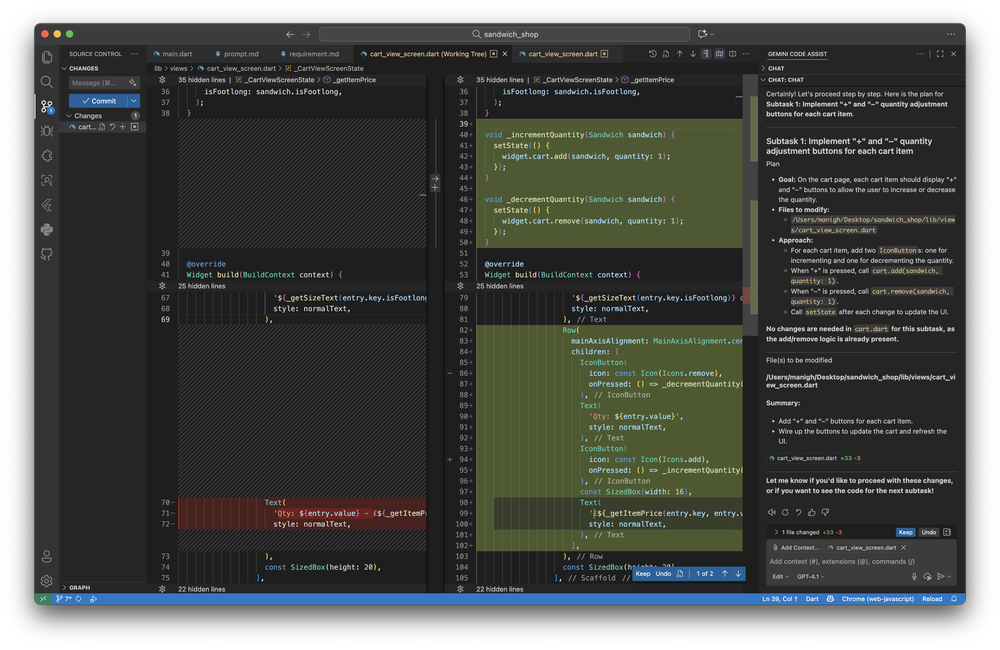
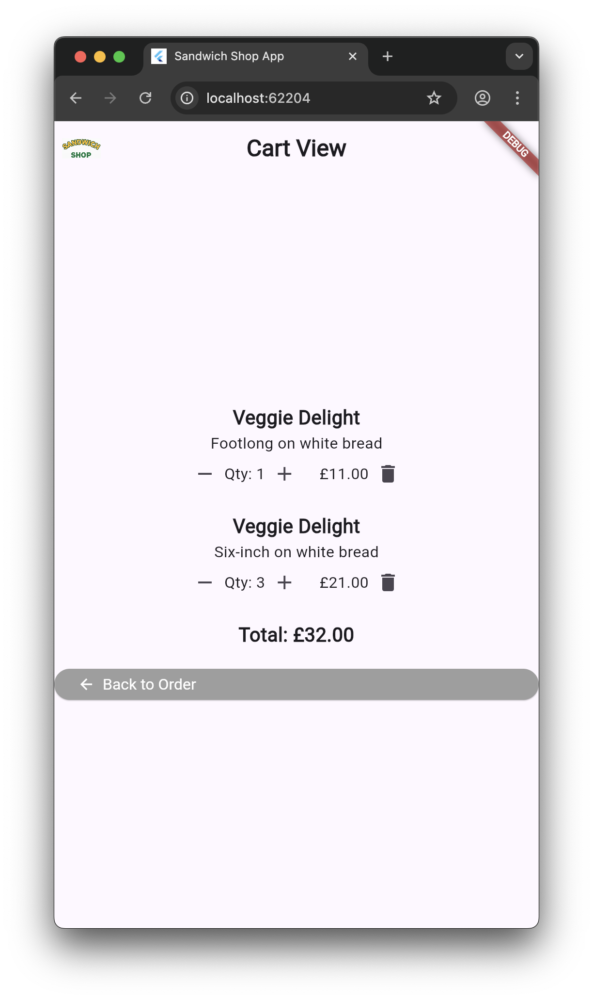

# **Worksheet 6 — AI-Driven Development and Navigation**

## **What you need to know beforehand**

Ensure that you have already completed the following:

- [Worksheet 0 — Introduction to Dart, Git and GitHub](./worksheet-0.md).
- [Worksheet 1 — Introduction to Flutter](./worksheet-1.md).
- [Worksheet 2 — Stateless Widgets](./worksheet-2.md).
- [Worksheet 3 — Stateful widgets](./worksheet-3.md).
- [Worksheet 4 — App Architecture and Testing](./worksheet-4.md).
- [Worksheet 5 — Data Models and Assets](./worksheet-5.md).

## **Getting help**

To get support with this worksheet, join the [Discord channel](https://portdotacdotuk-my.sharepoint.com/:b:/g/personal/mani_ghahremani_port_ac_uk/EbX583gvURRAhqsnhYqmbSEBwIFw6tXRyz_Br1GxIyE8dg) and ask your questions there. Otherwise, attend your timetabled session and ask a member of staff for help.

## **Getting started**

For this worksheet, you need to start with the code from branch 5 of our [GitHub repository](https://github.com/manighahrmani/sandwich_shop/tree/5). You can either clone the repository and checkout branch 5:

```bash
git clone https://github.com/manighahrmani/sandwich_shop.git
cd sandwich_shop
git checkout 5
```

Or manually ensure your code matches the repository. Run the app to make sure everything works as expected before proceeding.

## **Introduction to AI-Driven Development**

One of the learning outcomes of this module is AI-driven development. We have been hinting at this in the earlier worksheets, but let's formalise things a little. Below are the different ways developers use AI:

  - **Vibe Coding**: This refers to the informal and passive approach where developers ask AI for quick solutions without much structure or planning. While this can be useful for simple tasks, it is not sustainable for larger projects and often leads to inconsistent results and technical debt.

  - **Prompt Engineering**: The practice of crafting specific, well-structured prompts to get better results from AI models. This involves understanding how to communicate effectively with AI to get the desired output.

  - **Prompt-driven Development (PDD)**: A more systematic approach where developers use carefully crafted prompts to guide AI through the entire development process. Prompts, often in Markdown format (ending with `.md`), are stored alongside the codebase, modified and refined over time just like code itself. The overall aim is to make AI-driven development a more structured, reproducible and reliable process.

Among some of the advantages of PDD is that well-structured prompts produce more consistent and predictable results. AI can be unpredictable, and predictability is a quality we want in software development. Detailed requirements lead to better code quality and fewer bugs, and if any generated code has issues, we can always go back to the prompt and refine it.

You can learn more about using AI for feature implementation in this video: [AI-Powered App Development with Flutter](https://www.youtube.com/watch?v=fzYN_kgl-OM). The section at 16:58 (Copilot Vision) is particularly relevant for your coursework, as it shows how you can use images and prompts to guide the AI.

### **Prompt-Driven Development in Practice**

Instead of jumping straight into coding, let's start by using AI to help us write proper requirements for a new feature.

Run the app and add a few sandwiches to your cart. You should see a snack bar confirming the addition. You will also see that we have implemented a second screen, `CartScreen` in `lib/views/cart_screen.dart`, that displays the items in the cart. You can navigate to this screen from the order screen by pressing the "View Cart" button. This is what the cart page should look like:



Let's say we want to enhance our cart functionality. Instead of immediately asking for code, we'll first ask our AI assistant to help us create a prompt. Here's a sample prompt you can use (if you are using Copilot, set it to "Ask" mode):

```
I have a sandwich shop app written in Flutter. I need your help writing good prompt I can send to an LLM to help me implement a new feature.

I have two pages: an order screen where users can select sandwiches and add them to their cart, and a cart screen where users can see the items in their cart and the total price.

I want to let the users modify the items in their cart. There are different ways a user might want to modify their cart like changing quantity or removing items entirely.

For each of these features, include a clear description and what should happen when the user performs an action. Output the result in a Markdown code block.
```

This initial prompt can be improved by adding more specific details about the current app structure. You could, for example, include:

```
The app currently has these models:
- Sandwich (with type, size, bread type)
- Cart (with add/remove/clear methods and total price calculation)
It also has one repository:
- Pricing (calculates prices based on quantity and size; the price of a sandwich has nothing to do with its type or bread)
```

This is what we initially got back from the AI: [prompt.md](https://github.com/manighahrmani/sandwich_shop/blob/2157fc03bb82e63206101518e408f1e02762ec54/prompt.md).
You can also talk about the UI requirements or edge cases you want the code to handle. For example, if the user tries to reduce the quantity of an item below 1, it should be removed from the cart.

Save the output as `prompt.md` in your project directory. Review the document and manually edit it if needed.

In our case, we asked the AI to refine the prompt after providing it with a screenshot of the current cart page and an overview of the app structure. You could also provide the AI with screenshots of other apps such as Deliveroo or Uber Eats to give it a better idea of what you want.

This is what we ended up with: [prompt.md](https://github.com/manighahrmani/sandwich_shop/blob/5b8512d5a5b2074c3dada7a1de213860f5110433/prompt.md#L65).

#### **Commit your changes**

Before moving on, commit your prompt file with an appropriate commit message. Remember, in PDD, prompts are part of the codebase.

### **Creating a Requirements Document**

Once you have a solid prompt, you can use AI to write a requirements document. Here's a sample prompt you can use:

```
Write a detailed requirements document for the feature described in my previous prompt. The requirements should include:

1. A clear description of the feature and its purpose.
2. User stories that describe how different users will interact with the feature.
3. Acceptance criteria that define when the feature is considered complete.

Respond in a structured Markdown format with separate subtasks.
```

This is what we got back from Copilot after a few modifications: [requirements.md](https://github.com/manighahrmani/sandwich_shop/blob/75d4eb7e53024b0868c3acd450cb7f028240cbc5/requirement.md#L5).

#### **Commit your changes**

Before implementing the feature, commit your requirements document with an appropriate commit message.

### **From Requirements to Implementation**

Now that you have a clear requirements document, you can use it to guide your implementation. Here's a sample prompt you can use:

```
Let's implement the feature described in my requirements document.

Implement each subtask separately, as I want to commit each one individually. For each subtask, explain your changes in detail, show me what files you are modifying, and then we can proceed to the next subtask.
```

Remember, when using Copilot, you can set it to "Edit" mode to let it modify your files directly. Additionally, provide it with context by pasting relevant parts of your codebase (you can do this by typing a hash symbol `#` followed by the name of the file, for example `#cart.dart`).

Notice how you can pause after each subtask to review the changes. It is an important part of the PDD process to read, test, and commit each change separately. This allows you to ensure the AI is producing code that meets your requirements and adheres to best practices.


Once you have completed all the subtasks, test your app to ensure everything works as expected. As before, update the widget tests for the cart screen in `test/views/cart_screen_test.dart` to cover the new functionality.

Here is a screenshot of our cart page after implementing the modifications:



As before, remember to update the widget tests for the `cart_screen.dart` in `test/widget/cart_screen_test.dart` to cover the new functionality you have added.

#### **Commit your changes**

Once you have implemented and tested the feature, commit your changes with an appropriate commit message.

## **Navigation in Flutter**

In one of the exercises from last week's worksheet, we started creating a cart screen and navigating to it. This week's code provides our implementation of that screen. Let's take a closer look at how navigation works in Flutter.

Here are some key terms to understand:

  - **Route**: A route is a screen or a page in your app. This is equivalent to an `Activity` in Android or a `ViewController` in iOS.
  - **Navigator**: A widget that manages a [stack](<https://en.wikipedia.org/wiki/Stack_(abstract_data_type)>) of routes. It handles pushing new routes onto the stack (navigating to a new screen) and popping them off (going back).

Think of navigation as a stack of cards. When you navigate to a new screen, you place (push) a new card on top of the stack. When you go back, you remove (pop) the top card, revealing the screen underneath.

For our sandwich shop app, basic navigation using `Navigator.push()` and `Navigator.pop()` is sufficient.

### **Basic Navigation**

Our current navigation pattern is the most common and simple one.

In `lib/views/order_screen.dart`, the "View Cart" button's `onPressed` callback calls the `_navigateToCartView()` method:

```dart
void _navigateToCartView() {
  Navigator.push(
    context,
    MaterialPageRoute<void>(
      builder: (BuildContext context) => CartScreen(cart: _cart),
    ),
  );
}
```

The `Navigator.push()` method takes the current `BuildContext` and a `MaterialPageRoute` that builds the new screen. The `builder` function returns the widget for the new screen, in this case `CartScreen`.

Basically, all you need to know is that `Navigator.push()` adds a new screen on top of the current one, in this case, `CartScreen`:

```dart
class CartScreen extends StatefulWidget {
  final Cart cart;

  const CartScreen({super.key, required this.cart});

  @override
  State<CartScreen> createState() {
    return _CartScreenState();
  }
}
```

When the user wants to go back, the "Back to Order" button in the cart screen calls `Navigator.pop(context)` to return to the previous screen.

### **Showing Messages Across Navigation**

It is important to note that Flutter provides a way to show messages that persist across navigation. In our code, we use `ScaffoldMessenger` to show snack bars:

```dart
ScaffoldMessenger.of(context).showSnackBar(snackBar);
```

This is important because `ScaffoldMessenger` ensures the message is shown even if the user navigates to a different screen while it's appearing. Try this: add a sandwich to your cart, then immediately navigate to the cart view. You'll see the confirmation message appears on the cart screen, not just the order screen.

## **Passing Data Between Screens**

### **Passing Data Forwards**

Often, you need to send data to a new screen. This is already being done in your app. When navigating to the cart screen, we are already passing the `_cart` object to the `CartScreen` constructor:

```dart
CartScreen(cart: _cart)
```

The `CartScreen` then receives this data through its constructor:

```dart
class CartScreen extends StatefulWidget {
  final Cart cart;

  const CartScreen({super.key, required this.cart});
  // ...
}
```

This is the standard way to pass data to a new screen in Flutter.

### **Returning Data from a Screen**

Things become slightly more complex when you want to get data back from a screen. For example, you might want to return a confirmation after an order is placed. Let's implement a checkout flow to demonstrate this.

First, create a new file `lib/views/checkout_screen.dart` and add the following code:

```dart
import 'package:flutter/material.dart';
import 'package:sandwich_shop/views/app_styles.dart';
import 'package:sandwich_shop/models/cart.dart';
import 'package:sandwich_shop/models/sandwich.dart';
import 'package:sandwich_shop/repositories/pricing_repository.dart';

class CheckoutScreen extends StatefulWidget {
  final Cart cart;

  const CheckoutScreen({super.key, required this.cart});

  @override
  State<CheckoutScreen> createState() => _CheckoutScreenState();
}

class _CheckoutScreenState extends State<CheckoutScreen> {
  bool _isProcessing = false;

  Future<void> _processPayment() async {
    setState(() {
      _isProcessing = true;
    });

    // A fake delay to simulate payment processing
    await Future.delayed(const Duration(seconds: 2));

    final DateTime currentTime = DateTime.now();
    final int timestamp = currentTime.millisecondsSinceEpoch;
    final String orderId = 'ORD$timestamp';

    final Map orderConfirmation = {
      'orderId': orderId,
      'totalAmount': widget.cart.totalPrice,
      'itemCount': widget.cart.countOfItems,
      'estimatedTime': '15-20 minutes',
    };

    // Check if this State object is being shown in the widget tree
    if (mounted) {
      // Pop the checkout screen and return to the order screen with the confirmation
      Navigator.pop(context, orderConfirmation);
    }
  }

  double _calculateItemPrice(Sandwich sandwich, int quantity) {
    PricingRepository repo = PricingRepository();
    return repo.calculatePrice(
        quantity: quantity, isFootlong: sandwich.isFootlong);
  }

  @override
  Widget build(BuildContext context) {
    List<Widget> columnChildren = [];

    columnChildren.add(const Text('Order Summary', style: heading2));
    columnChildren.add(const SizedBox(height: 20));

    for (MapEntry<Sandwich, int> entry in widget.cart.items.entries) {
      final Sandwich sandwich = entry.key;
      final int quantity = entry.value;
      final double itemPrice = _calculateItemPrice(sandwich, quantity);

      final Widget itemRow = Row(
        mainAxisAlignment: MainAxisAlignment.spaceBetween,
        children: [
          Text(
            '${quantity}x ${sandwich.name}',
            style: normalText,
          ),
          Text(
            '£${itemPrice.toStringAsFixed(2)}',
            style: normalText,
          ),
        ],
      );

      columnChildren.add(itemRow);
      columnChildren.add(const SizedBox(height: 8));
    }

    columnChildren.add(const Divider());
    columnChildren.add(const SizedBox(height: 10));

    final Widget totalRow = Row(
      mainAxisAlignment: MainAxisAlignment.spaceBetween,
      children: [
        const Text('Total:', style: heading2),
        Text(
          '£${widget.cart.totalPrice.toStringAsFixed(2)}',
          style: heading2,
        ),
      ],
    );
    columnChildren.add(totalRow);
    columnChildren.add(const SizedBox(height: 40));

    columnChildren.add(
      const Text(
        'Payment Method: Card ending in 1234',
        style: normalText,
        textAlign: TextAlign.center,
      ),
    );
    columnChildren.add(const SizedBox(height: 20));

    if (_isProcessing) {
      columnChildren.add(
        const Center(
          child: CircularProgressIndicator(),
        ),
      );
      columnChildren.add(const SizedBox(height: 20));
      columnChildren.add(
        const Text(
          'Processing payment...',
          style: normalText,
          textAlign: TextAlign.center,
        ),
      );
    } else {
      columnChildren.add(
        ElevatedButton(
          onPressed: _processPayment,
          child: const Text('Confirm Payment', style: normalText),
        ),
      );
    }

    return Scaffold(
      appBar: AppBar(
        title: const Text('Checkout', style: heading1),
      ),
      body: Padding(
        padding: const EdgeInsets.symmetric(horizontal: 16.0),
        child: Column(
          children: columnChildren,
        ),
      ),
    );
  }
}
```

#### **Commit your changes**

Commit your changes and add widget tests for the new checkout screen in `test/views/checkout_screen_test.dart`.

Now, update `lib/views/cart_screen.dart`. First, add the necessary imports at the top of the file:

```dart
import 'package:sandwich_shop/views/checkout_screen.dart';
import 'package:sandwich_shop/views/order_screen.dart';
```

In the `_CartScreenState` class, add this method to navigate to the checkout screen and handle the returned data:

```dart
Future<void> _navigateToCheckout() async {
  if (widget.cart.items.isEmpty) {
    ScaffoldMessenger.of(context).showSnackBar(
      const SnackBar(
        content: Text('Your cart is empty'),
        duration: Duration(seconds: 2),
      ),
    );
    return;
  }

  final result = await Navigator.push(
    context,
    MaterialPageRoute(
      builder: (context) => CheckoutScreen(cart: widget.cart),
    ),
  );

  if (result != null && mounted) {
    setState(() {
      widget.cart.clear();
    });

    final String orderId = result['orderId'] as String;
    final String estimatedTime = result['estimatedTime'] as String;

    ScaffoldMessenger.of(context).showSnackBar(
      SnackBar(
        content:
            Text('Order $orderId confirmed! Estimated time: $estimatedTime'),
        duration: const Duration(seconds: 4),
        backgroundColor: Colors.green,
      ),
    );

    Navigator.pop(context);
  }
}
```

Finally, add a checkout button to your cart screen's UI. In the `build` method of `_CartScreenState`, add this button just before the "Back to Order" button:

```dart
const SizedBox(height: 20),
Builder(
  builder: (BuildContext context) {
    final bool cartHasItems = widget.cart.items.isNotEmpty;
    if (cartHasItems) {
      return StyledButton(
        onPressed: _navigateToCheckout,
        icon: Icons.payment,
        label: 'Checkout',
        backgroundColor: Colors.orange,
      );
    } else {
      return const SizedBox.shrink();
    }
  },
),
const SizedBox(height: 20),
```

The `_navigateToCheckout()` method uses `await` when calling `Navigator.push()` to wait for the checkout screen to return data, which we store in `result`. When the payment is processed, the checkout screen calls `Navigator.pop(context, orderConfirmation)` to return the data.

We check that the `result` is not null and that the widget is still `mounted` (i.e., it hasn't been disposed of). If so, we clear the cart, update the UI, and show a success message with the order details.

Run your app and test the full checkout flow.

#### **Commit your changes**

Commit the changes for integrating the checkout screen and update any relevant widget tests.

## **Exercises**

Complete the exercises below. Remember to commit your changes after each exercise.

1.  Let's add a simple profile screen where users can enter their details. For now, you can add a link to this screen at the bottom of your order screen (we will improve this in the next exercise).

    As we did earlier in this worksheet, use your AI assistant to help you write a prompt for this feature.

    By the end of this exercise, you should have created a `ProfileScreen` in a new `lib/views/profile_screen.dart` file. There's no need to perform any actual authentication or data persistence yet.

    Make sure to write widget tests for your new profile screen.

    ⚠️ **Show your working profile screen to a member of staff** for a sign-off.

2.  Let's enhance our app's navigation by adding a `Drawer` menu. A `Drawer` is a panel that slides in from the edge of a `Scaffold` to show the app's main navigation options. You can read more about it in its [documentation page](https://api.flutter.dev/flutter/material/Drawer-class.html).

    Implement a drawer that includes navigation to your order screen, cart view, and profile screen.

    Ask your AI assistant to explain how `Drawer` widgets work and how they integrate with the `AppBar`. Could you make this drawer accessible from all screens in your app?

    Consider how the drawer should behave when navigating. Ask your AI assistant about the difference between `Navigator.push()` and `Navigator.pushReplacement()` in this context.

    As always, update your widget tests to cover the new navigation drawer functionality.

    ⚠️ **Show your working navigation drawer to a member of staff** for a sign-off.

3.  (Advanced) Configure your app to handle [deep links](https://docs.flutter.dev/ui/navigation/deep-linking) using `go_router`, which is the recommended approach for URL-based navigation in Flutter.

    Add the `go_router` package to your project by running `flutter pub add go_router`.

    Ask your AI assistant to help you refactor your app to use `MaterialApp.router` with `GoRouter` instead of `MaterialApp`. You'll need to define routes for your main screens like `/`, `/cart`, and `/profile`.

    Test your implementation by running the app on a web browser and typing URLs like `localhost:PORT/#/cart` in the address bar (where `PORT` is the port number your app is running on). The navigation should work correctly with proper browser back-button support.

    This task is **optional** and there's no need to show it to a member of staff for a sign-off.

4.  (Advanced) Create a settings screen where users can configure app-wide preferences, such as enabling dark mode or adjusting font sizes.

    This exercise introduces you to data persistence. You can use the `shared_preferences` package, which allows you to save simple key-value data that persists between app sessions. Add the package by running `flutter pub add shared_preferences`.

    Your task is to create a settings screen and use `shared_preferences` to save at least one user preference. When the user changes a setting, save it. When the app restarts, this preference should be loaded and applied.

    This task is **optional** and there's no need to show it to a member of staff for a sign-off.