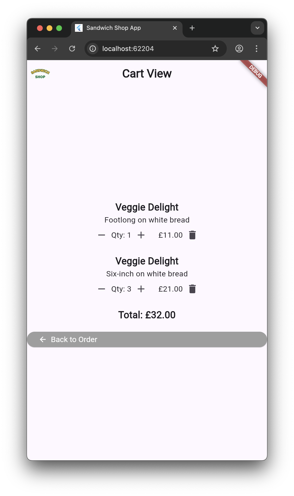

This is worksheet 5:
```md
        # **Worksheet 5 — Data Models and Assets**

        ## **What you need to know beforehand**

        Ensure that you have already completed the following:

        - [Worksheet 0 — Introduction to Dart, Git and GitHub](./worksheet-0.md).
        - [Worksheet 1 — Introduction to Flutter](./worksheet-1.md).
        - [Worksheet 2 — Stateless Widgets](./worksheet-2.md).
        - [Worksheet 3 — Stateful widgets](./worksheet-3.md).
        - [Worksheet 4 — App Architecture and Testing](./worksheet-4.md).

        ## **Getting help**

        To get support with this worksheet, join the [Discord channel](https://portdotacdotuk-my.sharepoint.com/:b:/g/personal/mani_ghahremani_port_ac_uk/EbX583gvURRAhqsnhYqmbSEBwIFw6tXRyz_Br1GxIyE8dg) and ask your questions there. Otherwise, attend your timetabled session and ask a member of staff for help.

        ## **Getting started**

        For this worksheet, as an exception, start with the code from branch 5 of our [GitHub repository](https://github.com/manighahrmani/sandwich_shop/tree/5). You can either clone the repository and checkout branch 5:

        ```bash
        git clone https://github.com/manighahrmani/sandwich_shop.git
        cd sandwich_shop
        git checkout 5
        ```

        Or manually ensure your code matches the repository. Run the app to make sure everything works as expected before proceeding.

        ## **Introduction to Data Models**

        So far, we've been passing simple data types like `String` and `int` between our widgets. As our app grows in complexity, it's better to group related data into custom data types (classes). We call these **data models**.

        If you've worked with databases before, you can think of data models as being similar to **entities**. An entity is a real-world object or concept that can be distinctly identified. In our case, a "Sandwich" is a perfect example of an entity that we can represent with a data model.

        ### **Business Logic Decisions**

        During your development, you as the developer would make certain business decisions about how the app should function. Here is an example of one such decision we have made regarding our app. 

        We assume that the price of a sandwich depends only on its size (footlong vs six-inch), not on the type of sandwich or bread type. This keeps our pricing simple and consistent.

        This is why our `PricingRepository` only needs to know the quantity and size (`isFootlong`) to calculate the total price. The sandwich type (like "Veggie Delight" or "Turkey Club") and bread type don't affect the price.

        ### **Creating the `Sandwich` model**

        Let's start by defining a `Sandwich` model. This will help us manage all the properties of a sandwich in one place.

        Open the Explorer view in VS Code with **Ctrl + Shift + E** on Windows or **⌘ + Shift + E** on macOS. Right-click on the `lib` folder and select **New Folder**. Name this folder `models`. Right-click on the `models` folder and select **New File**. Name this file `sandwich.dart`. This is what your project structure may look like:

        ```
        lib/
        ├── main.dart
        ├── views/
        │   └── app_styles.dart
        ├── view_models/
        ├── models/
        │   └── sandwich.dart
        └── repositories/
            └── pricing_repository.dart
        ```

        You will notice that we have not listed `lib/repository/order_repository.dart`. You can **delete `order_repository.dart` from your `repositories` folder** as it's no longer needed with our new data model approach (more on this later). Make sure to remove the import statement for this file from `lib/main.dart` as well as the `order_repository_test.dart` unit test from the `test/repositories` folder.

        Add the following code to `sandwich.dart`:

        ```dart
        enum BreadType { white, wheat, wholemeal }

        enum SandwichType { 
        veggieDelight, 
        chickenTeriyaki, 
        tunaMelt,
        meatballMarinara,
        }

        class Sandwich {
        final SandwichType type;
        final bool isFootlong;
        final BreadType breadType;

        Sandwich({
            required this.type,
            required this.isFootlong,
            required this.breadType,
        });

        String get name {
            switch (type) {
            case SandwichType.veggieDelight:
                return 'Veggie Delight';
            case SandwichType.chickenTeriyaki:
                return 'Chicken Teriyaki';
            case SandwichType.tunaMelt:
                return 'Tuna Melt';
            case SandwichType.meatballMarinara:
                return 'Meatball Marinara';
            }
        }

        String get image {
            String typeString = type.name;
            String sizeString = '';
            if (isFootlong) {
            sizeString = 'footlong';
            } else {
            sizeString = 'six_inch';
            }
            return 'assets/images/${typeString}_$sizeString.png';
        }
        }
        ```

        Here we have defined a `Sandwich` class with properties for the sandwich type, size, and bread type. Notice how we use enums for both `SandwichType` and `BreadType` to ensure users can only select from valid options. This is a preferable approach to using `String`s, as it reduces the risk of typos and values that are not part of the defined set.

        The `name` getter converts the enum value into a human-readable string, and the `image` getter automatically constructs the correct image path based on the sandwich type and size. For example, a footlong Veggie Delight would have the image path `assets/images/veggieDelight_footlong.png`.

        Use your AI assistant to explain why we use getters here instead of storing the name and image as instance variables received in the constructor.

        Before moving on, use your AI assistant to write a unit test for the `Sandwich` model. Remember to create a `models` folder inside the `test` folder to mirror the structure of the `lib` folder. Your test file should be named `sandwich_test.dart`.

        #### **Commit your changes**

        Here's a reminder to commit your changes (commit them individually, the addition of the model and the test).

        ### **The `Cart` model**

        Now that we can represent a single sandwich, we need a way to manage a collection of them in an order. We need to create a `Cart` class that can hold multiple `Sandwich` objects along with their quantities.

        Right-click on the `models` folder and select **New File**. Name this file `cart.dart`. Ask your AI assistant to help you implement a `Cart` class. Take your time writing a prompt that clearly describes the functionality you want. Think about what typical operations a user would perform on a cart of a food delivery app.

        Remember that the price calculation should use our existing `PricingRepository` since it's the single source of truth for pricing logic. You'll need to import the `PricingRepository` and use its `calculatePrice` method in the `cart.dart` file.

        As before, write unit tests for the `Cart` model in a new file called `cart_test.dart` inside the `test/models` folder.

        #### **Commit your changes**

        Commit the addition of the `Cart` model and its tests before moving on.

        ## **Managing Assets**

        Our `Sandwich` model automatically generates image paths, but we haven't provided any images yet. In Flutter, static files like images, fonts, and configuration files are called **assets**.

        First, create an `assets` folder in the root of your project, at the same level as the `lib` and `test` folders. Inside the `assets` folder, create another folder called `images`.

        Next, you need to tell Flutter about these new assets. Open the `pubspec.yaml` file and add an `assets` section like this (**the `uses-material-design: true` line already exists there, just add everything below it**).

        ```yaml
        flutter:
        uses-material-design: true
        assets:
            - assets/images/
        ```

        Make sure the indentation is correct, as `pubspec.yaml` is sensitive to whitespace. The line `assets:` should be at the same indentation level as `uses-material-design:`.

        Now you can use images saved in this folder in your app. For more information, you can read the official Flutter documentation on [adding assets and images](https://docs.flutter.dev/ui/assets/assets-and-images).

        For your coursework you should **not** to incorporate any videos or audio files, but if you wish to explore this check out [this page](https://docs.flutter.dev/cookbook/plugins/play-video).

        #### **Commit your changes**

        Commit your new assets before moving on.

        ### **Adding a simple logo to the app bar**

        Before we dive into the more complex sandwich image display, let's start with a simple example of using images. We'll add a logo to the app bar.

        We have already provided you with a logo image called `logo.png` for the app bar. If you have cloned/forked our repository, you should already have this, otherwise, download it from [this page](https://github.com/manighahrmani/sandwich_shop/blob/5/assets/images/logo.png) and save it as `logo.png` in the `assets/images` folder.

        In your `lib/main.dart` file, update the `AppBar` in the `build` method of `_OrderScreenState` to include a logo. To change its size, you can wrap the `Image.asset()` widget in a `SizedBox`. Here's how you can do it:

        ```dart
        appBar: AppBar(
        leading: SizedBox(
            height: 100,
            child: Image.asset('assets/images/logo.png'),
        ),
        title: const Text(
            'Sandwich Counter',
            style: heading1,
        ),
        ),
        ```

        The `Image.asset()` widget loads an image from your assets folder. The `leading` property of `AppBar` places the widget before the title. Run your app to see the logo appear in the app bar.

        Although the height of the `AppBar` is typically around 56 pixels so the image will be scaled down to fit, setting one of the dimensions in `SizedBox` helps maintain the aspect ratio of the image.

        For more information about the `Image` widget and its properties, check the [Flutter documentation on Image](https://api.flutter.dev/flutter/widgets/Image-class.html).

        #### **Commit your changes**

        Commit this simple logo addition before moving on to the more complex image display.

        ## **Updating the UI**

        Your `main.dart` should still have several errors (all to do with the use of `OrderRepository`). We will fix these shortly while also creating a simple interface where users can select a sandwich type, size, bread type, and quantity, then add it to their cart.

        ### **Updating the imports**

        First, open `lib/main.dart` and make sure you have exactly the following imports at its top:

        ```dart
        import 'package:flutter/material.dart';
        import 'package:sandwich_shop/views/app_styles.dart';
        import 'package:sandwich_shop/models/sandwich.dart';
        import 'package:sandwich_shop/models/cart.dart';
        ```

        As mentioned before, you need to remove the import for `order_repository.dart` since it's no longer needed. Similarly, remove the old import for `pricing_repository.dart` as we will be using its `calculatePrice` method through the `Cart` model (it is indirectly imported).

        You'll also need to remove the `BreadType` enum from `lib/main.dart` since it's now defined in the `sandwich.dart` file.

        ### **Displaying sandwich images**

        Now let's add dynamic image display that updates based on the user's selection. We'll show the sandwich image that corresponds to the selected type and size.

        You'll need to create images for each sandwich type and size combination. Based on our `SandwichType` enum, you'll need images named like: `veggieDelight_footlong.png` or `veggieDelight_six_inch.png` and so on for all the sandwich types (this means a total of 8 images).

        Use your AI assistant to help you find or create placeholder images for the sandwiches and logo. You can use simple coloured rectangles or search for copyright-free images online. Save these images in the `assets/images` folder with the exact naming convention shown above.

        Now we'll update the UI to include the image display and replace the old order management system with our new cart-based approach.

        Since we're changing the UI structure significantly, you can remove the `OrderItemDisplay` classes from the bottom of your `lib/main.dart` file as it is no longer needed with our new approach.

        Replace the entirety of `_OrderScreenState` with the following:

        ```dart
        class _OrderScreenState extends State<OrderScreen> {
        final Cart _cart = Cart();
        final TextEditingController _notesController = TextEditingController();

        SandwichType _selectedSandwichType = SandwichType.veggieDelight;
        bool _isFootlong = true;
        BreadType _selectedBreadType = BreadType.white;
        int _quantity = 1;

        @override
        void initState() {
            super.initState();
            _notesController.addListener(() {
            setState(() {});
            });
        }

        @override
        void dispose() {
            _notesController.dispose();
            super.dispose();
        }

        void _addToCart() {
            if (_quantity > 0) {
            final Sandwich sandwich = Sandwich(
                type: _selectedSandwichType,
                isFootlong: _isFootlong,
                breadType: _selectedBreadType,
            );

            setState(() {
                _cart.add(sandwich, quantity: _quantity);
            });

            String sizeText;
            if (_isFootlong) {
                sizeText = 'footlong';
            } else {
                sizeText = 'six-inch';
            }
            String confirmationMessage =
                'Added $_quantity $sizeText ${sandwich.name} sandwich(es) on ${_selectedBreadType.name} bread to cart';

            debugPrint(confirmationMessage);
            }
        }

        VoidCallback? _getAddToCartCallback() {
            if (_quantity > 0) {
            return _addToCart;
            }
            return null;
        }

        List<DropdownMenuEntry<SandwichType>> _buildSandwichTypeEntries() {
            List<DropdownMenuEntry<SandwichType>> entries = [];
            for (SandwichType type in SandwichType.values) {
            Sandwich sandwich =
                Sandwich(type: type, isFootlong: true, breadType: BreadType.white);
            DropdownMenuEntry<SandwichType> entry = DropdownMenuEntry<SandwichType>(
                value: type,
                label: sandwich.name,
            );
            entries.add(entry);
            }
            return entries;
        }

        List<DropdownMenuEntry<BreadType>> _buildBreadTypeEntries() {
            List<DropdownMenuEntry<BreadType>> entries = [];
            for (BreadType bread in BreadType.values) {
            DropdownMenuEntry<BreadType> entry = DropdownMenuEntry<BreadType>(
                value: bread,
                label: bread.name,
            );
            entries.add(entry);
            }
            return entries;
        }

        String _getCurrentImagePath() {
            final Sandwich sandwich = Sandwich(
            type: _selectedSandwichType,
            isFootlong: _isFootlong,
            breadType: _selectedBreadType,
            );
            return sandwich.image;
        }

        void _onSandwichTypeChanged(SandwichType? value) {
            if (value != null) {
            setState(() {
                _selectedSandwichType = value;
            });
            }
        }

        void _onSizeChanged(bool value) {
            setState(() {
            _isFootlong = value;
            });
        }

        void _onBreadTypeChanged(BreadType? value) {
            if (value != null) {
            setState(() {
                _selectedBreadType = value;
            });
            }
        }

        void _increaseQuantity() {
            setState(() {
            _quantity++;
            });
        }

        void _decreaseQuantity() {
            if (_quantity > 0) {
            setState(() {
                _quantity--;
            });
            }
        }

        VoidCallback? _getDecreaseCallback() {
            if (_quantity > 0) {
            return _decreaseQuantity;
            }
            return null;
        }

        @override
        Widget build(BuildContext context) {
            return Scaffold(
            appBar: AppBar(
                title: const Text(
                'Sandwich Counter',
                style: heading1,
                ),
            ),
            body: Center(
                child: SingleChildScrollView(
                child: Column(
                    crossAxisAlignment: CrossAxisAlignment.stretch,
                    children: [
                    SizedBox(
                        height: 300,
                        child: Image.asset(
                        _getCurrentImagePath(),
                        fit: BoxFit.cover,
                        errorBuilder: (context, error, stackTrace) {
                            return const Center(
                            child: Text(
                                'Image not found',
                                style: normalText,
                            ),
                            );
                        },
                        ),
                    ),
                    const SizedBox(height: 20),
                    DropdownMenu<SandwichType>(
                        width: double.infinity,
                        label: const Text('Sandwich Type'),
                        textStyle: normalText,
                        initialSelection: _selectedSandwichType,
                        onSelected: _onSandwichTypeChanged,
                        dropdownMenuEntries: _buildSandwichTypeEntries(),
                    ),
                    const SizedBox(height: 20),
                    Row(
                        mainAxisAlignment: MainAxisAlignment.center,
                        children: [
                        const Text('Six-inch', style: normalText),
                        Switch(
                            value: _isFootlong,
                            onChanged: _onSizeChanged,
                        ),
                        const Text('Footlong', style: normalText),
                        ],
                    ),
                    const SizedBox(height: 20),
                    DropdownMenu<BreadType>(
                        width: double.infinity,
                        label: const Text('Bread Type'),
                        textStyle: normalText,
                        initialSelection: _selectedBreadType,
                        onSelected: _onBreadTypeChanged,
                        dropdownMenuEntries: _buildBreadTypeEntries(),
                    ),
                    const SizedBox(height: 20),
                    Row(
                        mainAxisAlignment: MainAxisAlignment.center,
                        children: [
                        const Text('Quantity: ', style: normalText),
                        IconButton(
                            onPressed: _getDecreaseCallback(),
                            icon: const Icon(Icons.remove),
                        ),
                        Text('$_quantity', style: heading2),
                        IconButton(
                            onPressed: _increaseQuantity,
                            icon: const Icon(Icons.add),
                        ),
                        ],
                    ),
                    const SizedBox(height: 20),
                    StyledButton(
                        onPressed: _getAddToCartCallback(),
                        icon: Icons.add_shopping_cart,
                        label: 'Add to Cart',
                        backgroundColor: Colors.green,
                    ),
                    const SizedBox(height: 20),
                    ],
                ),
                ),
            ),
            );
        }
        }
        ```

        Notice that we are assuming your `Cart` model provides an `add` method that takes a `Sandwich` object and an optional `quantity` parameter. If your implementation differs, adjust the `_addToCart` method accordingly.

        The `Image.asset()` shows the current sandwich image. The `_getCurrentImagePath()` method ensures the image updates automatically when users change their selections. The `errorBuilder` property handles cases where an image file doesn't exist, showing a "Image not found" message instead of crashing.

        The dropdown menus, switch, and quantity controls work together to update the image in real-time. When the user adds items to the cart, a confirmation message is printed to the debug console using `debugPrint()`. If you don't see the debug console in VS Code, open the Command Palette (**Ctrl + Shift + P** on Windows or **⌘ + Shift + P** on macOS) and type "Focus on Debug Console View" to open it.

        Notice that we wrap our `Column` in a `SingleChildScrollView` widget. This makes the entire interface scrollable, which is important when the content becomes too tall for the screen. This is particularly useful on smaller devices or when the screen is resized to a smaller height. You may remember doing an exercise on scrollable widgets in [Worksheet 2](./worksheet-2.md).

        If you are confused by what the `errorBuilder` property does, or how the `fit: BoxFit.cover` property affects image display, ask your AI assistant to explain these concepts.

        As always, write widget tests to ensure your UI behaves as expected (several tests in the current `test/views/widget_test.dart` file that you have would almost certainly fail). Test scenarios like adding items to the cart, changing quantities, and selecting different sandwich options.

        #### **Commit your changes**

        Make sure all your changes are committed separately before moving on to the exercises.

        ## **Exercises**

        Complete the exercises below and show your work to a member of staff at your next practical session for a **sign-off**.

        Even though your AI assistant may suggest this, for now, try not to use any third-party packages, only built-in Flutter widgets.

        1.  Our app currently only shows a message (`confirmationMessage`) in the debug console when items are added to the cart. Let's display this message in the UI instead.

            Browse [the catalog of Flutter widgets](https://docs.flutter.dev/ui/widgets) or ask your AI assistant to suggest a suitable widget for displaying this message on the screen.

            Think about how you as the user would want to see this message. Should it appear as a popup, a banner, or somewhere else on the screen? Would you want it to disappear after a few seconds, or stay until the user dismisses it?
            
            Remember not to implement a separate page for the cart yet, we will do that in a later exercise. Once you are done, update the widget tests to relfect your changes.

            ⚠️ **Show your running app displaying the confirmation message in the UI to a member of staff** for a sign-off.

        2.  Let's add a permanent cart summary display to our main screen. In addtion of just showing a confirmation message when items are added, you need to show the number of items in the cart and the total price.

            Try to do this in the simplest way possible. Just make sure that when the "Add to Cart" button is pressed, this displayed summary is updated to reflect the current state of the cart.

            Feel free to use your AI assistant to help you implement this feature, and make sure to write widget tests to verify that the cart summary updates correctly when items are added.

            ⚠️ **Show your running app with the cart summary displaying the number of items and total price to a member of staff** for a sign-off.

        3.  (Advanced) So far, our app only has one screen (`main.dart`). Let's add a second screen to view the cart contents. This is a task which we will cover in more detail in the next worksheet, but let's give it a try now. Here's a [link to the Flutter documentation on navigation](https://docs.flutter.dev/cookbook/navigation/navigation-basics) to help you get started.

            Create a new `StatefulWidget` called `CartScreen` (and its associated state class) in `main.dart` for now. It should display a list of all items in the cart. Each item should show the sandwich name, size, bread type, quantity, and individual total price.

            Think about what pieces of information would be most useful to display in the cart view and how the user might reach/interact with this screen. Write a user story if you are planning to use your AI assistant to help you implement this and make sure to provide sufficient context (e.g., the `Cart` model and its methods).


            Hint: You can use `Navigator.push()` to navigate to the cart screen and `Navigator.pop()` to go back to the main screen. Also, your `CartScreen` will need access to the cart data, so you'll need to pass it through the constructor. To display multiple items from a collection, you can use a for loop inside a `Column`'s children list like this:

            ```dart
            Column(
            children: [
                for (String item in itemList)
                Text(item),
            ],
            )
            ```

            Once you have implemented the new page, move the `CartScreen` widget to a new file called `cart_screen.dart` inside the `views` folder and import it where you are using it (in `OrderScreen`). You could additionally create a `order_screen.dart` file for the `OrderScreen` and `OrderScreenState` classes if you wish. This way, `main.dart` will be short and simple, only containing the `App` class and the `main()` function.

            This is what your `lib/main.dart` file may look like after the refactoring:

            ```dart
            import 'package:flutter/material.dart';
            import 'package:sandwich_shop/views/order_screen.dart';

            void main() {
            runApp(const App());
            }

            class App extends StatelessWidget {
            const App({super.key});

            @override
            Widget build(BuildContext context) {
                return const MaterialApp(
                title: 'Sandwich Shop App',
                home: OrderScreen(maxQuantity: 5),
                );
            }
            }
            ```

            Below is what your project folder may look like after this exercise. Remember to write widget tests to ensure the cart view behaves as expected.

            ```
            sandwich_shop/
            ├── assets/
            │   └── images/
            ├── lib/
            │   ├── main.dart
            │   ├── views/
            │   │   ├── app_styles.dart
            │   │   ├── cart_screen.dart
            │   │   └── order_screen.dart
            │   ├── view_models/
            │   ├── models/
            │   │   ├── cart.dart
            │   │   └── sandwich.dart
            │   └── repositories/
            │       └── pricing_repository.dart
            ├── test/
            │   ├── views/
            │   │   ├── cart_screen_test.dart
            │   │   └── order_screen_test.dart
            │   ├── view_models/
            │   ├── models/
            │   │   ├── cart_test.dart
            │   │   └── sandwich_test.dart
            │   └── repositories/
            │       └── pricing_repository_test.dart
            ├── pubspec.yaml
            └── ...
            ```

            Notice that the widget tests for each screen are in separate files named after the screen they are testing. (Instead of a single `widget_test.dart` file we have `cart_screen_test.dart` and `order_screen_test.dart` files.)

            This task is **optional** and there's no need to show it to a member of staff for a sign-off.

        4.  (Advanced) In the cart view, re-implement the order notes functionality, but this time for the entire order rather than individual sandwiches.

            Similar to what we used to have in [`main.dart`](https://github.com/manighahrmani/sandwich_shop/blob/5/lib/main.dart), add a `TextField` that allows users to add notes for the entire order (e.g., "No onions" or "Extra serviettes").

            Remember to store these notes in the `Cart` model. You may need to update the `Cart` class to include a `notes` property and a method to update it.

            As always remember to update the unit tests and widget tests to cover this new functionality.

            This task is **optional** and there's no need to show it to a member of staff for a sign-off.
```

This is worksheet 6:
```md
        # **Worksheet 6 — AI-Driven Development and Navigation**

        ## **What you need to know beforehand**

        Ensure that you have already completed the following:

        - [Worksheet 0 — Introduction to Dart, Git and GitHub](./worksheet-0.md).
        - [Worksheet 1 — Introduction to Flutter](./worksheet-1.md).
        - [Worksheet 2 — Stateless Widgets](./worksheet-2.md).
        - [Worksheet 3 — Stateful widgets](./worksheet-3.md).
        - [Worksheet 4 — App Architecture and Testing](./worksheet-4.md).
        - [Worksheet 5 — Data Models and Assets](./worksheet-5.md).

        ## **Getting help**

        To get support with this worksheet, join the [Discord channel](https://portdotacdotuk-my.sharepoint.com/:b:/g/personal/mani_ghahremani_port_ac_uk/EbX583gvURRAhqsnhYqmbSEBwIFw6tXRyz_Br1GxIyE8dg) and ask your questions there. Otherwise, attend your timetabled session and ask a member of staff for help.

        ## **Getting started**

        For this worksheet, you need to start with the code from branch 6 of our [GitHub repository](https://github.com/manighahrmani/sandwich_shop/tree/6). You can either clone the repository and checkout branch 6:

        ```bash
        git clone https://github.com/manighahrmani/sandwich_shop.git
        cd sandwich_shop
        git checkout 6
        ```

        Or manually ensure your code matches the repository. Run the app to make sure everything works as expected before proceeding.

        ## **Introduction to AI-Driven Development**

        One of the learning outcomes of this module is AI-driven development. We have been hinting at this in the earlier worksheets, but let's formalise things a little. Below are the different ways developers use AI:

        - **Vibe Coding**: This refers to the informal and passive approach where developers ask AI for quick solutions without much structure or planning. While this can be useful for simple tasks, it is not sustainable for larger projects and often leads to inconsistent results and technical debt.

        - **Prompt Engineering**: The practice of crafting specific, well-structured prompts to get better results from AI models. This involves understanding how to communicate effectively with AI to get the desired output.

        - **Prompt-driven Development (PDD)**: A more systematic approach where developers use carefully crafted prompts to guide AI through the entire development process. Prompts, often in Markdown format (ending with `.md`), are stored alongside the codebase, modified and refined over time just like code itself. The overall aim is to make AI-driven development a more structured, reproducible and reliable process.

        Among some of the advantages of PDD is that well-structured prompts produce more consistent and predictable results. AI can be unpredictable, and predictability is a quality we want in software development. Detailed requirements lead to better code quality and fewer bugs, and if any generated code has issues, we can always go back to the prompt and refine it.

        You can learn more about using AI for feature implementation in this video: [AI-Powered App Development with Flutter](https://www.youtube.com/watch?v=fzYN_kgl-OM). The section at 16:58 (Copilot Vision) is particularly relevant for your coursework, as it shows how you can use images and prompts to guide the AI.

        ### **Prompt-Driven Development in Practice**

        Instead of jumping straight into coding, let's start by using AI to help us write proper requirements for a new feature.

        Run the app and add a few sandwiches to your cart. You should see a snack bar confirming the addition. You will also see that we have implemented a second screen, `CartScreen` in `lib/views/cart_screen.dart`, that displays the items in the cart. You can navigate to this screen from the order screen by pressing the "View Cart" button. This is what the cart page should look like:

        

        Let's say we want to enhance our cart functionality. Instead of immediately asking for code, we'll first ask our AI assistant to help us create a prompt. Here's a sample prompt you can use (if you are using Copilot, set it to "Ask" mode):

        ```
        I have a sandwich shop app written in Flutter. I need your help writing good prompt I can send to an LLM to help me implement a new feature.

        I have two pages: an order screen where users can select sandwiches and add them to their cart, and a cart screen where users can see the items in their cart and the total price.

        I want to let the users modify the items in their cart. There are different ways a user might want to modify their cart like changing quantity or removing items entirely.

        For each of these features, include a clear description and what should happen when the user performs an action. Output the result in a Markdown code block.
        ```

        This initial prompt can be improved by adding more specific details about the current app structure. You could, for example, include:

        ```
        The app currently has these models:
        - Sandwich (with type, size, bread type)
        - Cart (with add/remove/clear methods and total price calculation)
        It also has one repository:
        - Pricing (calculates prices based on quantity and size; the price of a sandwich has nothing to do with its type or bread)
        ```

        This is what we initially got back from the AI: [prompt.md](https://github.com/manighahrmani/sandwich_shop/blob/2157fc03bb82e63206101518e408f1e02762ec54/prompt.md).
        You can also talk about the UI requirements or edge cases you want the code to handle. For example, if the user tries to reduce the quantity of an item below 1, it should be removed from the cart.

        Save the output as `prompt.md` in your project directory. Review the document and manually edit it if needed.

        In our case, we asked the AI to refine the prompt after providing it with a screenshot of the current cart page and an overview of the app structure. You could also provide the AI with screenshots of other apps such as Deliveroo or Uber Eats to give it a better idea of what you want.

        This is what we ended up with: [prompt.md](https://github.com/manighahrmani/sandwich_shop/blob/5b8512d5a5b2074c3dada7a1de213860f5110433/prompt.md#L65).

        #### **Commit your changes**

        Before moving on, commit your prompt file with an appropriate commit message. Remember, in PDD, prompts are part of the codebase.

        ### **Creating a Requirements Document**

        Once you have a solid prompt, you can use AI to write a requirements document. Here's a sample prompt you can use:

        ```
        Write a detailed requirements document for the feature described in my previous prompt. The requirements should include:

        1. A clear description of the feature and its purpose.
        2. User stories that describe how different users will interact with the feature.
        3. Acceptance criteria that define when the feature is considered complete.

        Respond in a structured Markdown format with separate subtasks.
        ```

        This is what we got back from Copilot after a few modifications: [requirements.md](https://github.com/manighahrmani/sandwich_shop/blob/75d4eb7e53024b0868c3acd450cb7f028240cbc5/requirement.md#L5).

        #### **Commit your changes**

        Before implementing the feature, commit your requirements document with an appropriate commit message.

        ### **From Requirements to Implementation**

        Now that you have a clear requirements document, you can use it to guide your implementation. Here's a sample prompt you can use:

        ```
        Let's implement the feature described in my requirements document.

        Implement each subtask separately, as I want to commit each one individually. For each subtask, explain your changes in detail, show me what files you are modifying, and then we can proceed to the next subtask.
        ```

        Remember, when using Copilot, you can set it to "Edit" mode to let it modify your files directly. Additionally, provide it with context by pasting relevant parts of your codebase (you can do this by typing a hash symbol `#` followed by the name of the file, for example `#cart.dart`).

        Notice how you can pause after each subtask to review the changes. It is an important part of the PDD process to read, test, and commit each change separately. This allows you to ensure the AI is producing code that meets your requirements and adheres to best practices.

        
        Once you have completed all the subtasks, test your app to ensure everything works as expected. As before, update the widget tests for the cart screen in `test/views/cart_screen_test.dart` to cover the new functionality.

        Here is a screenshot of our cart page after implementing the modifications:

        

        As before, remember to update the widget tests for the `cart_screen.dart` in `test/views/cart_screen_test.dart` to cover the new functionality you have added.

        #### **Commit your changes**

        Once you have implemented and tested the feature, commit your changes with an appropriate commit message.

        ## **Navigation in Flutter**

        In one of the exercises from last week's worksheet, we started creating a cart screen and navigating to it. This week's code provides our implementation of that screen. Let's take a closer look at how navigation works in Flutter.

        Here are some key terms to understand:

        - **Route**: A route is a screen or a page in your app. This is equivalent to an `Activity` in Android or a `ViewController` in iOS.
        - **Navigator**: A widget that manages a [stack](<https://en.wikipedia.org/wiki/Stack_(abstract_data_type)>) of routes. It handles pushing new routes onto the stack (navigating to a new screen) and popping them off (going back).

        Think of navigation as a stack of cards. When you navigate to a new screen, you place (push) a new card on top of the stack. When you go back, you remove (pop) the top card, revealing the screen underneath.

        For our sandwich shop app, basic navigation using `Navigator.push()` and `Navigator.pop()` is sufficient.

        ### **Basic Navigation**

        Our current navigation pattern is the most common and simple one.

        In `lib/views/order_screen.dart`, the "View Cart" button's `onPressed` callback calls the `_navigateToCartView()` method:

        ```dart
        void _navigateToCartView() {
        Navigator.push(
            context,
            MaterialPageRoute<void>(
            builder: (BuildContext context) => CartScreen(cart: _cart),
            ),
        );
        }
        ```

        The `Navigator.push()` method takes the current `BuildContext` and a `MaterialPageRoute` that builds the new screen. The `builder` function returns the widget for the new screen, in this case `CartScreen`.

        Basically, all you need to know is that `Navigator.push()` adds a new screen on top of the current one, in this case, `CartScreen`:

        ```dart
        class CartScreen extends StatefulWidget {
        final Cart cart;

        const CartScreen({super.key, required this.cart});

        @override
        State<CartScreen> createState() {
            return _CartScreenState();
        }
        }
        ```

        When the user wants to go back, the "Back to Order" button in the cart screen calls `Navigator.pop(context)` to return to the previous screen.

        ### **Showing Messages Across Navigation**

        It is important to note that Flutter provides a way to show messages that persist across navigation. In our code, we use `ScaffoldMessenger` to show snack bars:

        ```dart
        ScaffoldMessenger.of(context).showSnackBar(snackBar);
        ```

        This is important because `ScaffoldMessenger` ensures the message is shown even if the user navigates to a different screen while it's appearing. Try this: add a sandwich to your cart, then immediately navigate to the cart view. You'll see the confirmation message appears on the cart screen, not just the order screen.

        ## **Passing Data Between Screens**

        ### **Passing Data Forwards**

        Often, you need to send data to a new screen. This is already being done in your app. When navigating to the cart screen, we are already passing the `_cart` object to the `CartScreen` constructor:

        ```dart
        CartScreen(cart: _cart)
        ```

        The `CartScreen` then receives this data through its constructor:

        ```dart
        class CartScreen extends StatefulWidget {
        final Cart cart;

        const CartScreen({super.key, required this.cart});
        // ...
        }
        ```

        This is the standard way to pass data to a new screen in Flutter.

        ### **Returning Data from a Screen**

        Things become slightly more complex when you want to get data back from a screen. For example, you might want to return a confirmation after an order is placed. Let's implement a checkout flow to demonstrate this.

        First, create a new file `lib/views/checkout_screen.dart` and add the following code:

        ```dart
        import 'package:flutter/material.dart';
        import 'package:sandwich_shop/views/app_styles.dart';
        import 'package:sandwich_shop/models/cart.dart';
        import 'package:sandwich_shop/models/sandwich.dart';
        import 'package:sandwich_shop/repositories/pricing_repository.dart';

        class CheckoutScreen extends StatefulWidget {
        final Cart cart;

        const CheckoutScreen({super.key, required this.cart});

        @override
        State<CheckoutScreen> createState() => _CheckoutScreenState();
        }

        class _CheckoutScreenState extends State<CheckoutScreen> {
        bool _isProcessing = false;

        Future<void> _processPayment() async {
            setState(() {
            _isProcessing = true;
            });

            // A fake delay to simulate payment processing
            await Future.delayed(const Duration(seconds: 2));

            final DateTime currentTime = DateTime.now();
            final int timestamp = currentTime.millisecondsSinceEpoch;
            final String orderId = 'ORD$timestamp';

            final Map orderConfirmation = {
            'orderId': orderId,
            'totalAmount': widget.cart.totalPrice,
            'itemCount': widget.cart.countOfItems,
            'estimatedTime': '15-20 minutes',
            };

            // Check if this State object is being shown in the widget tree
            if (mounted) {
            // Pop the checkout screen and return to the order screen with the confirmation
            Navigator.pop(context, orderConfirmation);
            }
        }

        double _calculateItemPrice(Sandwich sandwich, int quantity) {
            PricingRepository repo = PricingRepository();
            return repo.calculatePrice(
                quantity: quantity, isFootlong: sandwich.isFootlong);
        }

        @override
        Widget build(BuildContext context) {
            List<Widget> columnChildren = [];

            columnChildren.add(const Text('Order Summary', style: heading2));
            columnChildren.add(const SizedBox(height: 20));

            for (MapEntry<Sandwich, int> entry in widget.cart.items.entries) {
            final Sandwich sandwich = entry.key;
            final int quantity = entry.value;
            final double itemPrice = _calculateItemPrice(sandwich, quantity);

            final Widget itemRow = Row(
                mainAxisAlignment: MainAxisAlignment.spaceBetween,
                children: [
                Text(
                    '${quantity}x ${sandwich.name}',
                    style: normalText,
                ),
                Text(
                    '£${itemPrice.toStringAsFixed(2)}',
                    style: normalText,
                ),
                ],
            );

            columnChildren.add(itemRow);
            columnChildren.add(const SizedBox(height: 8));
            }

            columnChildren.add(const Divider());
            columnChildren.add(const SizedBox(height: 10));

            final Widget totalRow = Row(
            mainAxisAlignment: MainAxisAlignment.spaceBetween,
            children: [
                const Text('Total:', style: heading2),
                Text(
                '£${widget.cart.totalPrice.toStringAsFixed(2)}',
                style: heading2,
                ),
            ],
            );
            columnChildren.add(totalRow);
            columnChildren.add(const SizedBox(height: 40));

            columnChildren.add(
            const Text(
                'Payment Method: Card ending in 1234',
                style: normalText,
                textAlign: TextAlign.center,
            ),
            );
            columnChildren.add(const SizedBox(height: 20));

            if (_isProcessing) {
            columnChildren.add(
                const Center(
                child: CircularProgressIndicator(),
                ),
            );
            columnChildren.add(const SizedBox(height: 20));
            columnChildren.add(
                const Text(
                'Processing payment...',
                style: normalText,
                textAlign: TextAlign.center,
                ),
            );
            } else {
            columnChildren.add(
                ElevatedButton(
                onPressed: _processPayment,
                child: const Text('Confirm Payment', style: normalText),
                ),
            );
            }

            return Scaffold(
            appBar: AppBar(
                title: const Text('Checkout', style: heading1),
            ),
            body: Padding(
                padding: const EdgeInsets.symmetric(horizontal: 16.0),
                child: Column(
                children: columnChildren,
                ),
            ),
            );
        }
        }
        ```

        #### **Commit your changes**

        Commit your changes and add widget tests for the new checkout screen in `test/views/checkout_screen_test.dart`.

        Now, update `lib/views/cart_screen.dart`. First, add the necessary import at the top of the file:

        ```dart
        import 'package:sandwich_shop/views/checkout_screen.dart';
        ```

        In the `_CartScreenState` class, add this method to navigate to the checkout screen and handle the returned data:

        ```dart
        Future<void> _navigateToCheckout() async {
        if (widget.cart.items.isEmpty) {
            ScaffoldMessenger.of(context).showSnackBar(
            const SnackBar(
                content: Text('Your cart is empty'),
                duration: Duration(seconds: 2),
            ),
            );
            return;
        }

        final result = await Navigator.push(
            context,
            MaterialPageRoute(
            builder: (context) => CheckoutScreen(cart: widget.cart),
            ),
        );

        if (result != null && mounted) {
            setState(() {
            widget.cart.clear();
            });

            final String orderId = result['orderId'] as String;
            final String estimatedTime = result['estimatedTime'] as String;

            ScaffoldMessenger.of(context).showSnackBar(
            SnackBar(
                content:
                    Text('Order $orderId confirmed! Estimated time: $estimatedTime'),
                duration: const Duration(seconds: 4),
                backgroundColor: Colors.green,
            ),
            );

            Navigator.pop(context);
        }
        }
        ```

        Finally, add a checkout button to your cart screen's UI. In the `build` method of `_CartScreenState`, add this button just before the "Back to Order" button:

        ```dart
        const SizedBox(height: 20),
        Builder(
        builder: (BuildContext context) {
            final bool cartHasItems = widget.cart.items.isNotEmpty;
            if (cartHasItems) {
            return StyledButton(
                onPressed: _navigateToCheckout,
                icon: Icons.payment,
                label: 'Checkout',
                backgroundColor: Colors.orange,
            );
            } else {
            return const SizedBox.shrink();
            }
        },
        ),
        const SizedBox(height: 20),
        ```

        The `_navigateToCheckout()` method uses `await` when calling `Navigator.push()` to wait for the checkout screen to return data, which we store in `result`. When the payment is processed, the checkout screen calls `Navigator.pop(context, orderConfirmation)` to return the data.

        We check that the `result` is not null and that the widget is still `mounted` (i.e., it hasn't been disposed of). If so, we clear the cart, update the UI, and show a success message with the order details.

        Run your app and test the full checkout flow.

        #### **Commit your changes**

        Commit the changes for integrating the checkout screen and update any relevant widget tests.

        ## **Exercises**

        Complete the exercises below. Remember to commit your changes after each exercise.

        1.  Let's add a simple profile screen where users can enter their details. For now, you can add a link to this screen at the bottom of your order screen (we will improve this in the next exercise).

            As we did earlier in this worksheet, use your AI assistant to help you write a prompt for this feature.

            By the end of this exercise, you should have created a `ProfileScreen` in a new `lib/views/profile_screen.dart` file. There's no need to perform any actual authentication or data persistence yet.

            Make sure to write widget tests for your new profile screen.

            ⚠️ **Show your working profile screen to a member of staff** for a sign-off.

        2.  Let's enhance our app's navigation by adding a `Drawer` menu. A `Drawer` is a panel that slides in from the edge of a `Scaffold` to show the app's main navigation options. You can read more about it in its [documentation page](https://api.flutter.dev/flutter/material/Drawer-class.html).

            Implement a drawer that includes navigation to your order screen, cart view, and profile screen.

            Ask your AI assistant to explain how `Drawer` widgets work and how they integrate with the `AppBar`. Could you make this drawer accessible from all screens in your app?

            Consider how the drawer should behave when navigating. Ask your AI assistant about the difference between `Navigator.push()` and `Navigator.pushReplacement()` in this context.

            As always, update your widget tests to cover the new navigation drawer functionality.

            ⚠️ **Show your working navigation drawer to a member of staff** for a sign-off.

        3.  (Advanced) Configure your app to handle [deep links](https://docs.flutter.dev/ui/navigation/deep-linking) using `go_router`, which is the recommended approach for URL-based navigation in Flutter.

            Add the `go_router` package to your project by running `flutter pub add go_router`.

            Ask your AI assistant to help you refactor your app to use `MaterialApp.router` with `GoRouter` instead of `MaterialApp`. You'll need to define routes for your main screens like `/`, `/cart`, and `/profile`.

            Test your implementation by running the app on a web browser and typing URLs like `localhost:PORT/#/cart` in the address bar (where `PORT` is the port number your app is running on). The navigation should work correctly with proper browser back-button support.

            This task is **optional** and there's no need to show it to a member of staff for a sign-off.

        4.  (Advanced) Create a settings screen where users can configure app-wide preferences, such as enabling dark mode or adjusting font sizes.

            This exercise introduces you to data persistence. You can use the `shared_preferences` package, which allows you to save simple key-value data that persists between app sessions. Add the package by running `flutter pub add shared_preferences`.

            Your task is to create a settings screen and use `shared_preferences` to save at least one user preference. When the user changes a setting, save it. When the app restarts, this preference should be loaded and applied.

            This task is **optional** and there's no need to show it to a member of staff for a sign-off.
```

This is worksheet 7:
```md
        # **Worksheet 7 — State Management and Persistence**

        ## **What you need to know beforehand**

        Ensure that you have already completed the following:

        - [Worksheet 0 — Introduction to Dart, Git and GitHub](./worksheet-0.md).
        - [Worksheet 1 — Introduction to Flutter](./worksheet-1.md).
        - [Worksheet 2 — Stateless Widgets](./worksheet-2.md).
        - [Worksheet 3 — Stateful widgets](./worksheet-3.md).
        - [Worksheet 4 — App Architecture and Testing](./worksheet-4.md).
        - [Worksheet 5 — Data Models and Assets](./worksheet-5.md).
        - [Worksheet 6 — AI-Driven Development and Navigation](./worksheet-6.md).

        ## **Getting help**

        To get support with this worksheet, join the [Discord channel](https://portdotacdotuk-my.sharepoint.com/:b:/g/personal/mani_ghahremani_port_ac_uk/EbX583gvURRAhqsnhYqmbSEBwIFw6tXRyz_Br1GxIyE8dg) and ask your questions there. Otherwise, attend your timetabled session and ask a member of staff for help.

        ## **Getting started**

        For this worksheet, you need to start with the code from branch 7 of our [GitHub repository](https://github.com/manighahrmani/sandwich_shop/tree/6). You can either clone the repository and checkout branch 7:

        ```bash
        git clone https://github.com/manighahrmani/sandwich_shop.git
        cd sandwich_shop
        git checkout 7
        ```

        Or manually ensure your code matches the repository. Run the app to make sure everything works as expected before proceeding.

        ## **Introduction to App State Management**

        ⚠️ **Note**: This is a comprehensive worksheet covering advanced topics you do not have to use to be able to pass your coursework. Complete as much as you can, but do not worry if you cannot finish everything.

        So far, we've been managing ephemeral state within individual widgets using `setState()`. This works well for simple apps, but as your app grows, you'll find that multiple screens need to share the same data. For example, both your order screen and cart screen need access to the cart data.

        Currently, we pass the cart object between screens, but this becomes cumbersome when you have many screens that need the same data. This is where **app state management** comes in.

        ### **The Provider Package**

        Flutter offers several approaches to state management, but we'll use the `provider` package because it's simple to understand and widely used. The provider package uses concepts that apply to other state management approaches as well.

        Add the provider package to your project:

        ```bash
        flutter pub add provider
        ```

        We have purposefully not talked about packages a lot so far and we will do so in [#Third-Party Packages](#third-party-packages) later in this worksheet. The provider package you have installed introduces three key concepts:

        - **Notifier**: A class that extends the `ChangeNotifier` class and holds the app state. It notifies listeners when the state changes. Our `Cart` class will be our notifier.
        - **Provider**: A widget that provides an instance of a `ChangeNotifier` to its descendants. Usually this is done at the top level of your app (in our case, in `main.dart`). We will use `ChangeNotifierProvider` to provide our cart model to the entire app.
        - **Consumer**: A widget that listens to changes in the provided notifier and rebuilds when notified. You will see how we will use `Consumer<Cart>` to listen for changes in the cart and update the UI accordingly.

        For a more in-depth explanation of these concepts, see [this page on app state management](https://docs.flutter.dev/data-and-backend/state-mgmt/simple).

        ### **Creating a Cart Model with ChangeNotifier**

        Let's refactor our `Cart` class to extend `ChangeNotifier` (feel free to revisit our [Object-Oriented Dart Worksheet](./worksheet-0.md#4---object-oriented-programming-in-dart) for a refresher). This will allow widgets to listen for changes and automatically rebuild when the cart is modified.

        Open `lib/models/cart.dart` and update it to the following:

        ```dart
        import 'package:flutter/foundation.dart';
        import 'sandwich.dart';
        import 'package:sandwich_shop/repositories/pricing_repository.dart';

        class Cart extends ChangeNotifier {
        final Map<Sandwich, int> _items = {};

        Map<Sandwich, int> get items => Map.unmodifiable(_items);

        void add(Sandwich sandwich, {int quantity = 1}) {
            if (_items.containsKey(sandwich)) {
            _items[sandwich] = _items[sandwich]! + quantity;
            } else {
            _items[sandwich] = quantity;
            }
            notifyListeners();
        }

        void remove(Sandwich sandwich, {int quantity = 1}) {
            if (_items.containsKey(sandwich)) {
            final currentQty = _items[sandwich]!;
            if (currentQty > quantity) {
                _items[sandwich] = currentQty - quantity;
            } else {
                _items.remove(sandwich);
            }
            notifyListeners();
            }
        }

        void clear() {
            _items.clear();
            notifyListeners();
        }

        double get totalPrice {
            final pricingRepository = PricingRepository();
            double total = 0.0;

            for (Sandwich sandwich in _items.keys) {
            int quantity = _items[sandwich]!;
            total += pricingRepository.calculatePrice(
                quantity: quantity,
                isFootlong: sandwich.isFootlong,
            );
            }

            return total;
        }

        bool get isEmpty => _items.isEmpty;

        int get length => _items.length;

        int get countOfItems {
            int total = 0;
            for (int quantity in _items.values) {
            total += quantity;
            }
            return total;
        }

        int getQuantity(Sandwich sandwich) {
            if (_items.containsKey(sandwich)) {
            return _items[sandwich]!;
            }
            return 0;
        }
        }
        ```

        Before committing your changes, see review the changes in the Source Control panel. The key changes are extending `ChangeNotifier` and calling `notifyListeners()` whenever the cart is modified. This tells any listening widgets that they need to rebuild.

        ### **Providing the Cart to the App**

        Now we need to make the cart available to all screens in our app. Update `lib/main.dart`:

        ```dart
        import 'package:flutter/material.dart';
        import 'package:provider/provider.dart';
        import 'package:sandwich_shop/models/cart.dart';
        import 'package:sandwich_shop/views/order_screen.dart';

        void main() {
        runApp(const App());
        }

        class App extends StatelessWidget {
        const App({super.key});

        @override
        Widget build(BuildContext context) {
            return ChangeNotifierProvider(
            create: (BuildContext context) {
                return Cart();
            },
            child: const MaterialApp(
                title: 'Sandwich Shop App',
                debugShowCheckedModeBanner: false,
                home: OrderScreen(maxQuantity: 5),
            ),
            );
        }
        }
        ```

        Again, review the changes in the Source Control panel before committing. The `ChangeNotifierProvider` creates a single instance of `Cart` and makes it available to all descendant widgets. The `create` function is called once, so we have a single shared cart and `context` is passed to it so our provider (`Cart`) knows where it is in the widget tree.

        We've also added `debugShowCheckedModeBanner: false` to remove the debug banner from the app. This is a purely aesthetic change.

        ### **Consuming the Cart in Screens**

        Now we need to update our screens to use the provided cart instead of creating their own instances. Let's start with the order screen.

        Update `lib/views/order_screen.dart`. First, add the provider import:

        ```dart
        import 'package:provider/provider.dart';
        ```

        Then, in the `_OrderScreenState` class, remove the `final Cart _cart = Cart();` line defining the cart as a local instance variable and update the methods that use the cart:

        ```dart
        class _OrderScreenState extends State<OrderScreen> {
        final TextEditingController _notesController = TextEditingController();

        SandwichType _selectedSandwichType = SandwichType.veggieDelight;
        bool _isFootlong = true;
        BreadType _selectedBreadType = BreadType.white;
        int _quantity = 1;

        @override
        void initState() {
            super.initState();
            _notesController.addListener(() {
            setState(() {});
            });
        }

        @override
        void dispose() {
            _notesController.dispose();
            super.dispose();
        }

        Future<void> _navigateToProfile() async {
            final Map<String, String>? result =
                await Navigator.push<Map<String, String>>(
            context,
            MaterialPageRoute<Map<String, String>>(
                builder: (BuildContext context) => const ProfileScreen(),
            ),
            );

            final bool hasResult = result != null;
            final bool widgetStillMounted = mounted;

            if (hasResult && widgetStillMounted) {
            _showWelcomeMessage(result);
            }
        }

        void _showWelcomeMessage(Map<String, String> profileData) {
            final String name = profileData['name']!;
            final String location = profileData['location']!;
            final String welcomeMessage = 'Welcome, $name! Ordering from $location';

            final SnackBar welcomeSnackBar = SnackBar(
            content: Text(welcomeMessage),
            duration: const Duration(seconds: 3),
            );

            ScaffoldMessenger.of(context).showSnackBar(welcomeSnackBar);
        }

        void _addToCart() {
            if (_quantity > 0) {
            final Sandwich sandwich = Sandwich(
                type: _selectedSandwichType,
                isFootlong: _isFootlong,
                breadType: _selectedBreadType,
            );

            final Cart cart = Provider.of<Cart>(context, listen: false);
            cart.add(sandwich, quantity: _quantity);

            String sizeText;
            if (_isFootlong) {
                sizeText = 'footlong';
            } else {
                sizeText = 'six-inch';
            }
            String confirmationMessage =
                'Added $_quantity $sizeText ${sandwich.name} sandwich(es) on ${_selectedBreadType.name} bread to cart';

            ScaffoldMessengerState scaffoldMessenger = ScaffoldMessenger.of(context);
            SnackBar snackBar = SnackBar(
                content: Text(confirmationMessage),
                duration: const Duration(seconds: 2),
            );
            scaffoldMessenger.showSnackBar(snackBar);
            }
        }

        VoidCallback? _getAddToCartCallback() {
            if (_quantity > 0) {
            return _addToCart;
            }
            return null;
        }

        void _navigateToCartView() {
            Navigator.push(
            context,
            MaterialPageRoute<void>(
                builder: (BuildContext context) => const CartScreen(),
            ),
            );
        }

        List<DropdownMenuEntry<SandwichType>> _buildSandwichTypeEntries() {
            List<DropdownMenuEntry<SandwichType>> entries = [];
            for (SandwichType type in SandwichType.values) {
            Sandwich sandwich =
                Sandwich(type: type, isFootlong: true, breadType: BreadType.white);
            DropdownMenuEntry<SandwichType> entry = DropdownMenuEntry<SandwichType>(
                value: type,
                label: sandwich.name,
            );
            entries.add(entry);
            }
            return entries;
        }

        List<DropdownMenuEntry<BreadType>> _buildBreadTypeEntries() {
            List<DropdownMenuEntry<BreadType>> entries = [];
            for (BreadType bread in BreadType.values) {
            DropdownMenuEntry<BreadType> entry = DropdownMenuEntry<BreadType>(
                value: bread,
                label: bread.name,
            );
            entries.add(entry);
            }
            return entries;
        }

        String _getCurrentImagePath() {
            final Sandwich sandwich = Sandwich(
            type: _selectedSandwichType,
            isFootlong: _isFootlong,
            breadType: _selectedBreadType,
            );
            return sandwich.image;
        }

        @override
        Widget build(BuildContext context) {
            return Scaffold(
            appBar: AppBar(
                leading: Padding(
                padding: const EdgeInsets.all(8.0),
                child: SizedBox(
                    height: 100,
                    child: Image.asset('assets/images/logo.png'),
                ),
                ),
                title: const Text(
                'Sandwich Counter',
                style: heading1,
                ),
                actions: [
                Consumer<Cart>(
                    builder: (context, cart, child) {
                    return Padding(
                        padding: const EdgeInsets.all(8.0),
                        child: Row(
                        mainAxisSize: MainAxisSize.min,
                        children: [
                            const Icon(Icons.shopping_cart),
                            const SizedBox(width: 4),
                            Text('${cart.countOfItems}'),
                        ],
                        ),
                    );
                    },
                ),
                ],
            ),
            body: Center(
                child: SingleChildScrollView(
                child: Column(
                    crossAxisAlignment: CrossAxisAlignment.stretch,
                    children: [
                    SizedBox(
                        height: 300,
                        child: Image.asset(
                        _getCurrentImagePath(),
                        fit: BoxFit.cover,
                        errorBuilder: (context, error, stackTrace) {
                            return const Center(
                            child: Text(
                                'Image not found',
                                style: normalText,
                            ),
                            );
                        },
                        ),
                    ),
                    const SizedBox(height: 20),
                    DropdownMenu<SandwichType>(
                        width: double.infinity,
                        label: const Text('Sandwich Type'),
                        textStyle: normalText,
                        initialSelection: _selectedSandwichType,
                        onSelected: (SandwichType? value) {
                        if (value != null) {
                            setState(() => _selectedSandwichType = value);
                        }
                        },
                        dropdownMenuEntries: _buildSandwichTypeEntries(),
                    ),
                    const SizedBox(height: 20),
                    Row(
                        mainAxisAlignment: MainAxisAlignment.center,
                        children: [
                        const Text('Six-inch', style: normalText),
                        Switch(
                            value: _isFootlong,
                            onChanged: (value) => setState(() => _isFootlong = value),
                        ),
                        const Text('Footlong', style: normalText),
                        ],
                    ),
                    const SizedBox(height: 20),
                    DropdownMenu<BreadType>(
                        width: double.infinity,
                        label: const Text('Bread Type'),
                        textStyle: normalText,
                        initialSelection: _selectedBreadType,
                        onSelected: (BreadType? value) {
                        if (value != null) {
                            setState(() => _selectedBreadType = value);
                        }
                        },
                        dropdownMenuEntries: _buildBreadTypeEntries(),
                    ),
                    const SizedBox(height: 20),
                    Row(
                        mainAxisAlignment: MainAxisAlignment.center,
                        children: [
                        const Text('Quantity: ', style: normalText),
                        IconButton(
                            onPressed: _quantity > 0
                                ? () => setState(() => _quantity--)
                                : null,
                            icon: const Icon(Icons.remove),
                        ),
                        Text('$_quantity', style: heading2),
                        IconButton(
                            onPressed: () => setState(() => _quantity++),
                            icon: const Icon(Icons.add),
                        ),
                        ],
                    ),
                    const SizedBox(height: 20),
                    StyledButton(
                        onPressed: _getAddToCartCallback(),
                        icon: Icons.add_shopping_cart,
                        label: 'Add to Cart',
                        backgroundColor: Colors.green,
                    ),
                    const SizedBox(height: 20),
                    StyledButton(
                        onPressed: _navigateToCartView,
                        icon: Icons.shopping_cart,
                        label: 'View Cart',
                        backgroundColor: Colors.blue,
                    ),
                    const SizedBox(height: 20),
                    StyledButton(
                        onPressed: _navigateToProfile,
                        icon: Icons.person,
                        label: 'Profile',
                        backgroundColor: Colors.purple,
                    ),
                    const SizedBox(height: 20),
                    Consumer<Cart>(
                        builder: (context, cart, child) {
                        return Text(
                            'Cart: ${cart.countOfItems} items - £${cart.totalPrice.toStringAsFixed(2)}',
                            style: normalText,
                            textAlign: TextAlign.center,
                        );
                        },
                    ),
                    const SizedBox(height: 20),
                    ],
                ),
                ),
            ),
            );
        }
        }
        ```

        You will have an error caused by how the `CartScreen` is constructed without a cart parameter. We will fix this next. Just review the changes in the Source Control panel.

        Notice how we use `Provider.of<Cart>(context, listen: false)` to access the cart when we don't need to rebuild the widget when the cart changes (hover your mouse over `listen` in VS Code to see what it does). This is also the case when adding items to the cart or navigating to another screen.

        On the other hand, for the cart summary display and the cart indicator in the app bar, we use `Consumer<Cart>` to automatically rebuild when the cart changes. We additionally have a small cart indicator in the app that shows the total number of items in the cart.

        Now update `lib/views/cart_screen.dart` to remove the cart parameter and use the provided cart instead:

        ```dart
        import 'package:flutter/material.dart';
        import 'package:provider/provider.dart';
        import 'package:sandwich_shop/views/app_styles.dart';
        import 'package:sandwich_shop/views/order_screen.dart';
        import 'package:sandwich_shop/models/cart.dart';
        import 'package:sandwich_shop/models/sandwich.dart';
        import 'package:sandwich_shop/repositories/pricing_repository.dart';
        import 'package:sandwich_shop/views/checkout_screen.dart';

        class CartScreen extends StatefulWidget {
        const CartScreen({super.key});

        @override
        State<CartScreen> createState() {
            return _CartScreenState();
        }
        }

        class _CartScreenState extends State<CartScreen> {
        Future<void> _navigateToCheckout() async {
            final Cart cart = Provider.of<Cart>(context, listen: false);
            
            if (cart.items.isEmpty) {
            ScaffoldMessenger.of(context).showSnackBar(
                const SnackBar(
                content: Text('Your cart is empty'),
                duration: Duration(seconds: 2),
                ),
            );
            return;
            }

            final result = await Navigator.push(
            context,
            MaterialPageRoute(
                builder: (context) => const CheckoutScreen(),
            ),
            );

            if (result != null && mounted) {
            cart.clear();

            final String orderId = result['orderId'] as String;
            final String estimatedTime = result['estimatedTime'] as String;

            ScaffoldMessenger.of(context).showSnackBar(
                SnackBar(
                content:
                    Text('Order $orderId confirmed! Estimated time: $estimatedTime'),
                duration: const Duration(seconds: 4),
                backgroundColor: Colors.green,
                ),
            );

            Navigator.pop(context);
            }
        }

        String _getSizeText(bool isFootlong) {
            if (isFootlong) {
            return 'Footlong';
            } else {
            return 'Six-inch';
            }
        }

        double _getItemPrice(Sandwich sandwich, int quantity) {
            final PricingRepository pricingRepository = PricingRepository();
            return pricingRepository.calculatePrice(
            quantity: quantity,
            isFootlong: sandwich.isFootlong,
            );
        }

        void _incrementQuantity(Sandwich sandwich) {
            final Cart cart = Provider.of<Cart>(context, listen: false);
            cart.add(sandwich, quantity: 1);
            ScaffoldMessenger.of(context).showSnackBar(
            const SnackBar(content: Text('Quantity increased')),
            );
        }

        void _decrementQuantity(Sandwich sandwich) {
            final Cart cart = Provider.of<Cart>(context, listen: false);
            final wasPresent = cart.items.containsKey(sandwich);
            cart.remove(sandwich, quantity: 1);
            if (!cart.items.containsKey(sandwich) && wasPresent) {
            ScaffoldMessenger.of(context).showSnackBar(
                const SnackBar(content: Text('Item removed from cart')),
            );
            } else {
            ScaffoldMessenger.of(context).showSnackBar(
                const SnackBar(content: Text('Quantity decreased')),
            );
            }
        }

        void _removeItem(Sandwich sandwich) {
            final Cart cart = Provider.of<Cart>(context, listen: false);
            cart.remove(sandwich, quantity: cart.getQuantity(sandwich));
            ScaffoldMessenger.of(context).showSnackBar(
            const SnackBar(content: Text('Item removed from cart')),
            );
        }

        @override
        Widget build(BuildContext context) {
            return Scaffold(
            appBar: AppBar(
                leading: Padding(
                padding: const EdgeInsets.all(8.0),
                child: SizedBox(
                    height: 100,
                    child: Image.asset('assets/images/logo.png'),
                ),
                ),
                title: const Text(
                'Cart View',
                style: heading1,
                ),
                actions: [
                Consumer<Cart>(
                    builder: (context, cart, child) {
                    return Padding(
                        padding: const EdgeInsets.all(8.0),
                        child: Row(
                        mainAxisSize: MainAxisSize.min,
                        children: [
                            const Icon(Icons.shopping_cart),
                            const SizedBox(width: 4),
                            Text('${cart.countOfItems}'),
                        ],
                        ),
                    );
                    },
                ),
                ],
            ),
            body: Center(
                child: SingleChildScrollView(
                child: Consumer<Cart>(
                    builder: (context, cart, child) {
                    return Column(
                        crossAxisAlignment: CrossAxisAlignment.stretch,
                        children: [
                        const SizedBox(height: 20),
                        if (cart.items.isEmpty)
                            const Text(
                            'Your cart is empty.',
                            style: heading2,
                            textAlign: TextAlign.center,
                            )
                        else
                            for (MapEntry<Sandwich, int> entry in cart.items.entries)
                            Column(
                                children: [
                                Text(entry.key.name, style: heading2),
                                Text(
                                    '${_getSizeText(entry.key.isFootlong)} on ${entry.key.breadType.name} bread',
                                    style: normalText,
                                ),
                                Row(
                                    mainAxisAlignment: MainAxisAlignment.center,
                                    children: [
                                    IconButton(
                                        icon: const Icon(Icons.remove),
                                        onPressed: () => _decrementQuantity(entry.key),
                                    ),
                                    Text(
                                        'Qty: ${entry.value}',
                                        style: normalText,
                                    ),
                                    IconButton(
                                        icon: const Icon(Icons.add),
                                        onPressed: () => _incrementQuantity(entry.key),
                                    ),
                                    const SizedBox(width: 16),
                                    Text(
                                        '£${_getItemPrice(entry.key, entry.value).toStringAsFixed(2)}',
                                        style: normalText,
                                    ),
                                    IconButton(
                                        icon: const Icon(Icons.delete),
                                        tooltip: 'Remove item',
                                        onPressed: () => _removeItem(entry.key),
                                    ),
                                    ],
                                ),
                                const SizedBox(height: 20),
                                ],
                            ),
                        Text(
                            'Total: £${cart.totalPrice.toStringAsFixed(2)}',
                            style: heading2,
                            textAlign: TextAlign.center,
                        ),
                        const SizedBox(height: 20),
                        Builder(
                            builder: (BuildContext context) {
                            final bool cartHasItems = cart.items.isNotEmpty;
                            if (cartHasItems) {
                                return StyledButton(
                                onPressed: _navigateToCheckout,
                                icon: Icons.payment,
                                label: 'Checkout',
                                backgroundColor: Colors.orange,
                                );
                            } else {
                                return const SizedBox.shrink();
                            }
                            },
                        ),
                        const SizedBox(height: 20),
                        StyledButton(
                            onPressed: () => Navigator.pop(context),
                            icon: Icons.arrow_back,
                            label: 'Back to Order',
                            backgroundColor: Colors.grey,
                        ),
                        const SizedBox(height: 20),
                        ],
                    );
                    },
                ),
                ),
            ),
            );
        }
        }
        ```

        Again, you will have an error because the `CheckoutScreen` is constructed without a cart parameter. Review the changes in the Source Control and commit them.

        Finally, update `lib/views/checkout_screen.dart` to use the provided cart:

        ```dart
        import 'package:flutter/material.dart';
        import 'package:provider/provider.dart';
        import 'package:sandwich_shop/views/app_styles.dart';
        import 'package:sandwich_shop/models/cart.dart';
        import 'package:sandwich_shop/models/sandwich.dart';
        import 'package:sandwich_shop/repositories/pricing_repository.dart';

        class CheckoutScreen extends StatefulWidget {
        const CheckoutScreen({super.key});

        @override
        State<CheckoutScreen> createState() => _CheckoutScreenState();
        }

        class _CheckoutScreenState extends State<CheckoutScreen> {
        bool _isProcessing = false;

        Future<void> _processPayment() async {
            setState(() {
            _isProcessing = true;
            });

            await Future.delayed(const Duration(seconds: 2));

            final DateTime currentTime = DateTime.now();
            final int timestamp = currentTime.millisecondsSinceEpoch;
            final String orderId = 'ORD$timestamp';

            final Cart cart = Provider.of<Cart>(context, listen: false);
            final Map orderConfirmation = {
            'orderId': orderId,
            'totalAmount': cart.totalPrice,
            'itemCount': cart.countOfItems,
            'estimatedTime': '15-20 minutes',
            };

            if (mounted) {
            Navigator.pop(context, orderConfirmation);
            }
        }

        double _calculateItemPrice(Sandwich sandwich, int quantity) {
            PricingRepository repo = PricingRepository();
            return repo.calculatePrice(
                quantity: quantity, isFootlong: sandwich.isFootlong);
        }

        @override
        Widget build(BuildContext context) {
            return Scaffold(
            appBar: AppBar(
                leading: Padding(
                padding: const EdgeInsets.all(8.0),
                child: SizedBox(
                    height: 100,
                    child: Image.asset('assets/images/logo.png'),
                ),
                ),
                title: const Text('Checkout', style: heading1),
                actions: [
                Consumer<Cart>(
                    builder: (context, cart, child) {
                    return Padding(
                        padding: const EdgeInsets.all(8.0),
                        child: Row(
                        mainAxisSize: MainAxisSize.min,
                        children: [
                            const Icon(Icons.shopping_cart),
                            const SizedBox(width: 4),
                            Text('${cart.countOfItems}'),
                        ],
                        ),
                    );
                    },
                ),
                ],
            ),
            body: Padding(
                padding: const EdgeInsets.symmetric(horizontal: 16.0),
                child: Consumer<Cart>(
                builder: (context, cart, child) {
                    List<Widget> columnChildren = [];

                    columnChildren.add(const Text('Order Summary', style: heading2));
                    columnChildren.add(const SizedBox(height: 20));

                    for (MapEntry<Sandwich, int> entry in cart.items.entries) {
                    final Sandwich sandwich = entry.key;
                    final int quantity = entry.value;
                    final double itemPrice = _calculateItemPrice(sandwich, quantity);

                    final Widget itemRow = Row(
                        mainAxisAlignment: MainAxisAlignment.spaceBetween,
                        children: [
                        Text(
                            '${quantity}x ${sandwich.name}',
                            style: normalText,
                        ),
                        Text(
                            '£${itemPrice.toStringAsFixed(2)}',
                            style: normalText,
                        ),
                        ],
                    );

                    columnChildren.add(itemRow);
                    columnChildren.add(const SizedBox(height: 8));
                    }

                    columnChildren.add(const Divider());
                    columnChildren.add(const SizedBox(height: 10));

                    final Widget totalRow = Row(
                    mainAxisAlignment: MainAxisAlignment.spaceBetween,
                    children: [
                        const Text('Total:', style: heading2),
                        Text(
                        '£${cart.totalPrice.toStringAsFixed(2)}',
                        style: heading2,
                        ),
                    ],
                    );
                    columnChildren.add(totalRow);
                    columnChildren.add(const SizedBox(height: 40));

                    columnChildren.add(
                    const Text(
                        'Payment Method: Card ending in 1234',
                        style: normalText,
                        textAlign: TextAlign.center,
                    ),
                    );
                    columnChildren.add(const SizedBox(height: 20));

                    if (_isProcessing) {
                    columnChildren.add(
                        const Center(
                        child: CircularProgressIndicator(),
                        ),
                    );
                    columnChildren.add(const SizedBox(height: 20));
                    columnChildren.add(
                        const Text(
                        'Processing payment...',
                        style: normalText,
                        textAlign: TextAlign.center,
                        ),
                    );
                    } else {
                    columnChildren.add(
                        ElevatedButton(
                        onPressed: _processPayment,
                        child: const Text('Confirm Payment', style: normalText),
                        ),
                    );
                    }

                    return Column(
                    children: columnChildren,
                    );
                },
                ),
            ),
            );
        }
        }
        ```

        Don't forget to update the profile screen to maintain consistency with the app bar design. This is a new page that we have added (it was one of the exercises from the previous worksheet). In `lib/views/profile_screen.dart`, add the provider import and update the app bar:

        ```dart
        import 'package:provider/provider.dart';
        import 'package:sandwich_shop/models/cart.dart';
        ```

        Then update the app bar in the build method:

        ```dart
        appBar: AppBar(
        leading: Padding(
            padding: const EdgeInsets.all(8.0),
            child: SizedBox(
            height: 100,
            child: Image.asset('assets/images/logo.png'),
            ),
        ),
        title: const Text(
            'Profile',
            style: heading1,
        ),
        actions: [
            Consumer<Cart>(
            builder: (context, cart, child) {
                return Padding(
                padding: const EdgeInsets.all(8.0),
                child: Row(
                    mainAxisSize: MainAxisSize.min,
                    children: [
                    const Icon(Icons.shopping_cart),
                    const SizedBox(width: 4),
                    Text('${cart.countOfItems}'),
                    ],
                ),
                );
            },
            ),
        ],
        ),
        ```

        Test your app to ensure the state management is working correctly. The cart should now be shared across all screens and automatically update when modified.

        Before moving on, make sure to update the widget tests for all screens to check for the newly added functionality (some of the current tests will fail, and we have not tested the existence of the cart indicator).

        ## **Third-Party Packages**

        There are a lot of third-party Flutter packages that can add functionality to your app. These packages are published on [pub.dev](https://pub.dev). Those of you who are familiar with JavaScript may find this similar to npm packages.

        We recommend against using them as much as possible. Every package is a potential source of bugs and security vulnerabilities. Installing a package means trusting the package maintainers, who are often an open-source volunteer and not a professionals paid by Google. You are trusting them not to introduce malicious code or make mistakes that could affect your app. See this YouTube video for an example of one such incident that could have had catastrophic consequences: [The largest supply-chain attack ever](https://youtu.be/QVqIx-Y8s-s).

        To add a package to your project, use the `flutter pub add` command:

        ```bash
        flutter pub add package_name
        ```

        This automatically adds the package to your `pubspec.yaml` file and downloads it. You can then import and use the package in your Dart code.

        `add` is a subcommand of the `flutter pub` command. This is one of the many commands that Flutter provides to manage your project's dependencies. You can learn more about `flutter pub` and its subcommands (e.g., `outdated` which lists outdated packages in your project) in the [official documentation](https://dart.dev/tools/pub/cmd). Once you clone your project on a different machine, you can run `flutter pub get` to download all dependencies listed in `pubspec.yaml` although Visual Studio Code should do this automatically when you open the project.

        For your coursework, **minimize the number of third-party packages you use**. Focus on learning Flutter's built-in capabilities first.

        ## **Data Persistence**

        So far, all our app data, for example the cart contents, is lost when the app is closed. Real apps need to persist data. Flutter offers several approaches to data persistence, depending on your needs.

        ### **Shared Preferences for Simple Settings**

        For simple key-value data like user preferences, use the `shared_preferences` package. Some of you may have already used this package in the previous worksheet, feel free to skip this section if you have.

        `shared_preferences` is perfect for storing settings like theme preferences, user names, or simple configuration options.

        For this section, you must run the app on a device (your operating system, connected device or emulator) but not web. We will be building a settings screen which would allow us to modify the font size (the font sizes imported from `app_styles.dart`).

        Add the package to your project:

        ```bash
        flutter pub add shared_preferences
        ```

        First, let's update our `app_styles.dart` to load font sizes from shared preferences. This will make font size changes visible throughout the entire app. Update `lib/views/app_styles.dart`:

        ```dart
        import 'package:flutter/material.dart';
        import 'package:shared_preferences/shared_preferences.dart';

        class AppStyles {
        static double _baseFontSize = 16.0;
        
        static Future<void> loadFontSize() async {
            final SharedPreferences prefs = await SharedPreferences.getInstance();
            _baseFontSize = prefs.getDouble('fontSize') ?? 16.0;
        }
        
        static Future<void> saveFontSize(double fontSize) async {
            final SharedPreferences prefs = await SharedPreferences.getInstance();
            await prefs.setDouble('fontSize', fontSize);
            _baseFontSize = fontSize;
        }
        
        static double get baseFontSize => _baseFontSize;
        
        static TextStyle get normalText => TextStyle(fontSize: _baseFontSize);
        
        static TextStyle get heading1 => TextStyle(
            fontSize: _baseFontSize + 8,
            fontWeight: FontWeight.bold,
        );
        
        static TextStyle get heading2 => TextStyle(
            fontSize: _baseFontSize + 4,
            fontWeight: FontWeight.bold,
        );
        }

        TextStyle get normalText => AppStyles.normalText;
        TextStyle get heading1 => AppStyles.heading1;
        TextStyle get heading2 => AppStyles.heading2;
        ```

        Now create a settings screen that demonstrates shared preferences. Create a new file `lib/views/settings_screen.dart`:

        ```dart
        import 'package:flutter/material.dart';
        import 'package:sandwich_shop/views/app_styles.dart';

        class SettingsScreen extends StatefulWidget {
        const SettingsScreen({super.key});

        @override
        State<SettingsScreen> createState() => _SettingsScreenState();
        }

        class _SettingsScreenState extends State<SettingsScreen> {
        double _fontSize = 16.0;
        bool _isLoading = true;

        @override
        void initState() {
            super.initState();
            _loadSettings();
        }

        Future<void> _loadSettings() async {
            await AppStyles.loadFontSize();
            setState(() {
            _fontSize = AppStyles.baseFontSize;
            _isLoading = false;
            });
        }

        Future<void> _saveFontSize(double fontSize) async {
            await AppStyles.saveFontSize(fontSize);
            setState(() {
            _fontSize = fontSize;
            });
        }

        @override
        Widget build(BuildContext context) {
            if (_isLoading) {
            return const Scaffold(
                body: Center(
                child: CircularProgressIndicator(),
                ),
            );
            }

            return Scaffold(
            appBar: AppBar(
                leading: Padding(
                padding: const EdgeInsets.all(8.0),
                child: SizedBox(
                    height: 100,
                    child: Image.asset('assets/images/logo.png'),
                ),
                ),
                title: Text('Settings', style: AppStyles.heading1),
            ),
            body: Padding(
                padding: const EdgeInsets.all(16.0),
                child: Column(
                children: [
                    Text('Font Size', style: AppStyles.heading2),
                    const SizedBox(height: 20),
                    Text(
                    'Current size: ${_fontSize.toInt()}px',
                    style: TextStyle(fontSize: _fontSize),
                    ),
                    const SizedBox(height: 20),
                    Slider(
                    value: _fontSize,
                    min: 12.0,
                    max: 24.0,
                    divisions: 6,
                    label: _fontSize.toInt().toString(),
                    onChanged: _saveFontSize,
                    ),
                    const SizedBox(height: 20),
                    Text(
                    'This is sample text to preview the font size.',
                    style: TextStyle(fontSize: _fontSize),
                    ),
                    const SizedBox(height: 20),
                    Text(
                    'Font size changes are saved automatically. Restart the app to see changes in all screens.',
                    style: AppStyles.normalText,
                    textAlign: TextAlign.center,
                    ),
                    const SizedBox(height: 20),
                    ElevatedButton(
                    onPressed: () => Navigator.pop(context),
                    child: Text('Back to Order', style: AppStyles.normalText),
                    ),
                ],
                ),
            ),
            );
        }
        }
        ```

        Next, we need to initialize the font size when the app starts. Update `lib/main.dart` to load the saved font size:

        ```dart
        import 'package:flutter/material.dart';
        import 'package:provider/provider.dart';
        import 'package:sandwich_shop/models/cart.dart';
        import 'package:sandwich_shop/views/order_screen.dart';
        import 'package:sandwich_shop/views/app_styles.dart';

        void main() async {
        WidgetsFlutterBinding.ensureInitialized();
        await AppStyles.loadFontSize();
        runApp(const App());
        }

        class App extends StatelessWidget {
        const App({super.key});

        @override
        Widget build(BuildContext context) {
            return ChangeNotifierProvider(
            create: (BuildContext context) {
                return Cart();
            },
            child: const MaterialApp(
                title: 'Sandwich Shop App',
                debugShowCheckedModeBanner: false,
                home: OrderScreen(maxQuantity: 5),
            ),
            );
        }
        }
        ```

        Now add a button to navigate to the settings screen in your order screen. In `lib/views/order_screen.dart`, inside the `_OrderScreenState` class, add this method to handle navigation to the settings screen:

        ```dart
        void _navigateToSettings() {
        Navigator.push(
            context,
            MaterialPageRoute<void>(
            builder: (BuildContext context) => const SettingsScreen(),
            ),
        );
        }
        ```

        Then add this button in the build method after the profile button:

        ```dart
        const SizedBox(height: 20),
        StyledButton(
        onPressed: _navigateToSettings,
        icon: Icons.settings,
        label: 'Settings',
        backgroundColor: Colors.grey,
        ),
        ```

        Don't forget to import the settings screen:

        ```dart
        import 'package:sandwich_shop/views/settings_screen.dart';
        ```

        Since our text styles are no longer constant (they now depend on shared preferences), you'll need to remove the `const` keyword from widgets that use these styles. You'll see errors like "Invalid constant value".

        The easiest way to fix these is to open the Problems panel in VS Code (in Command Palette, type "Problems: Focus on Problems View" and hit Enter), then look for errors related to const constructors. Right click on each error or select them and use the Quick Fix (**Ctrl + .** on Windows or **⌘ + .** on Mac) to remove the `const` keyword.

        See below what this should look like:

        

        This would change:
        ```dart
        const Center(
        child: Text(
            'Image not found',
            style: normalText,
        ),
        )
        ```

        To:
        ```dart
        Center(
        child: Text(
            'Image not found',
            style: normalText,
        ),
        )
        ```

        You'll need to do this for any widget that uses `normalText`, `heading1`, or `heading2` styles.

        Once you have tested the settings screen and ensured that font size changes persist across app restarts, add widget tests for the settings screen and make sure the tests still pass for all other screens. And as always remember to commit your changes regularly.

        ### **SQLite for Complex Data (Optional)**

        For more complex data that requires querying and relationships, use SQLite. This is suitable for storing structured data like order history, user profiles, or any data that benefits from SQL queries.

        SQLite is similar to PostgreSQL but simpler. Like PostgreSQL, you create tables with columns and data types, but SQLite is embedded in your app rather than running as a separate server.

        In this section, which **is completely optional to do**, we will implement a simple order history feature using SQLite. For more information on SQLite, see the [official documentation](https://docs.flutter.dev/cookbook/persistence/sqlite).

        Start by adding the required packages to your project with the following command. [`sqflite`](https://pub.dev/packages/sqflite) is the SQLite plugin for Flutter, and [`path`](https://pub.dev/packages/path) helps with the location of the database file:

        ```bash
        flutter pub add sqflite path
        ```

        Let's create a simple order history feature. First, create a model for saved orders. This model represents a row in our database table. Create `lib/models/saved_order.dart`:

        ```dart
        class SavedOrder {
        final int id;
        final String orderId;
        final double totalAmount;
        final int itemCount;
        final DateTime orderDate;

        SavedOrder({
            required this.id,
            required this.orderId,
            required this.totalAmount,
            required this.itemCount,
            required this.orderDate,
        });

        Map<String, Object?> toMap() {
            return {
            'orderId': orderId,
            'totalAmount': totalAmount,
            'itemCount': itemCount,
            'orderDate': orderDate.millisecondsSinceEpoch,
            };
        }

        SavedOrder.fromMap(Map<String, Object?> map)
            : id = map['id'] as int,
                orderId = map['orderId'] as String,
                totalAmount = map['totalAmount'] as double,
                itemCount = map['itemCount'] as int,
                orderDate =
                    DateTime.fromMillisecondsSinceEpoch(map['orderDate'] as int);
        }
        ```

        The `toMap()` method converts our Dart object into a Map (like a dictionary) that SQLite can store. The `fromMap()` constructor does the opposite - it takes a Map from SQLite and creates a Dart object. We store dates as milliseconds since epoch because SQLite doesn't have a native date type.

        Now create a database service to handle all database operations. Create `lib/services/database_service.dart`:

        ```dart
        import 'dart:async';
        import 'package:path/path.dart';
        import 'package:sqflite/sqflite.dart';
        import 'package:sandwich_shop/models/saved_order.dart';

        class DatabaseService {
        static Database? _database;

        Future<Database> get database async {
            if (_database != null) return _database!;
            _database = await _initDatabase();
            return _database!;
        }

        Future<Database> _initDatabase() async {
            final String path = join(await getDatabasesPath(), 'sandwich_shop.db');
            
            return await openDatabase(
            path,
            version: 1,
            onCreate: (Database db, int version) async {
                await db.execute('''
                CREATE TABLE orders(
                    id INTEGER PRIMARY KEY AUTOINCREMENT,
                    orderId TEXT NOT NULL,
                    totalAmount REAL NOT NULL,
                    itemCount INTEGER NOT NULL,
                    orderDate INTEGER NOT NULL
                )
                ''');
            },
            );
        }

        Future<void> insertOrder(SavedOrder order) async {
            final Database db = await database;
            await db.insert('orders', order.toMap());
        }

        Future<List<SavedOrder>> getOrders() async {
            final Database db = await database;
            final List<Map<String, Object?>> maps = await db.query(
            'orders',
            orderBy: 'orderDate DESC',
            );

            List<SavedOrder> orders = [];
            for (int i = 0; i < maps.length; i++) {
            orders.add(SavedOrder.fromMap(maps[i]));
            }
            return orders;
        }

        Future<void> deleteOrder(int id) async {
            final Database db = await database;
            await db.delete(
            'orders',
            where: 'id = ?',
            whereArgs: [id],
            );
        }
        }
        ```

        The database is created automatically when first accessed. The `onCreate` callback runs only once to set up the table structure. The `maps.length` gives us the number of rows returned from the query, and we use it to convert each row (`Map`) into a `SavedOrder` object.

        Update the checkout screen to save orders to the database. In `lib/views/checkout_screen.dart`, add the imports:

        ```dart
        import 'package:sandwich_shop/services/database_service.dart';
        import 'package:sandwich_shop/models/saved_order.dart';
        ```

        Then update the `_processPayment` method to the following:

        ```dart
        Future<void> _processPayment() async {
        final Cart cart = Provider.of<Cart>(context, listen: false);
        
        setState(() {
            _isProcessing = true;
        });

        await Future.delayed(const Duration(seconds: 2));

        final DateTime currentTime = DateTime.now();
        final int timestamp = currentTime.millisecondsSinceEpoch;
        final String orderId = 'ORD$timestamp';
        
        final SavedOrder savedOrder = SavedOrder(
            id: 0, // Will be auto-generated by database
            orderId: orderId,
            totalAmount: cart.totalPrice,
            itemCount: cart.countOfItems,
            orderDate: currentTime,
        );

        final DatabaseService databaseService = DatabaseService();
        await databaseService.insertOrder(savedOrder);

        final Map orderConfirmation = {
            'orderId': orderId,
            'totalAmount': cart.totalPrice,
            'itemCount': cart.countOfItems,
            'estimatedTime': '15-20 minutes',
        };

        if (mounted) {
            Navigator.pop(context, orderConfirmation);
        }
        }
        ```

        Create an order history screen. Create `lib/views/order_history_screen.dart`:

        ```dart
        import 'package:flutter/material.dart';
        import 'package:sandwich_shop/views/app_styles.dart';
        import 'package:sandwich_shop/services/database_service.dart';
        import 'package:sandwich_shop/models/saved_order.dart';

        class OrderHistoryScreen extends StatefulWidget {
        const OrderHistoryScreen({super.key});

        @override
        State<OrderHistoryScreen> createState() => _OrderHistoryScreenState();
        }

        class _OrderHistoryScreenState extends State<OrderHistoryScreen> {
        final DatabaseService _databaseService = DatabaseService();
        List<SavedOrder> _orders = [];
        bool _isLoading = true;

        @override
        void initState() {
            super.initState();
            _loadOrders();
        }

        Future<void> _loadOrders() async {
            final List<SavedOrder> orders = await _databaseService.getOrders();
            setState(() {
            _orders = orders;
            _isLoading = false;
            });
        }

        String _formatDate(DateTime date) {
            String output = '${date.day}/${date.month}/${date.year}';
            output += ' ${date.hour}:${date.minute.toString().padLeft(2, '0')}';
            return output;
        }

        @override
        Widget build(BuildContext context) {
            if (_isLoading) {
            return Scaffold(
                appBar: AppBar(
                leading: Padding(
                    padding: const EdgeInsets.all(8.0),
                    child: SizedBox(
                    height: 100,
                    child: Image.asset('assets/images/logo.png'),
                    ),
                ),
                title: Text('Order History', style: AppStyles.heading1),
                ),
                body: const Center(child: CircularProgressIndicator()),
            );
            }

            if (_orders.isEmpty) {
            return Scaffold(
                appBar: AppBar(
                leading: Padding(
                    padding: const EdgeInsets.all(8.0),
                    child: SizedBox(
                    height: 100,
                    child: Image.asset('assets/images/logo.png'),
                    ),
                ),
                title: Text('Order History', style: AppStyles.heading1),
                ),
                body: Center(
                child: Text('No orders yet', style: AppStyles.heading2),
                ),
            );
            }

            return Scaffold(
            appBar: AppBar(
                leading: Padding(
                padding: const EdgeInsets.all(8.0),
                child: SizedBox(
                    height: 100,
                    child: Image.asset('assets/images/logo.png'),
                ),
                ),
                title: Text('Order History', style: AppStyles.heading1),
            ),
            body: Padding(
                padding: const EdgeInsets.symmetric(horizontal: 16.0),
                child: Column(
                children: [
                    const SizedBox(height: 20),
                    Expanded(
                    child: ListView.builder(
                        itemCount: _orders.length,
                        itemBuilder: (context, index) {
                        final SavedOrder order = _orders[index];
                        return Column(
                            children: [
                            Row(
                                mainAxisAlignment: MainAxisAlignment.spaceBetween,
                                children: [
                                Text(order.orderId, style: AppStyles.heading2),
                                Text('£${order.totalAmount.toStringAsFixed(2)}',
                                    style: AppStyles.heading2),
                                ],
                            ),
                            const SizedBox(height: 8),
                            Row(
                                mainAxisAlignment: MainAxisAlignment.spaceBetween,
                                children: [
                                Text('${order.itemCount} items',
                                    style: AppStyles.normalText),
                                Text(_formatDate(order.orderDate),
                                    style: AppStyles.normalText),
                                ],
                            ),
                            const SizedBox(height: 20),
                            ],
                        );
                        },
                    ),
                    ),
                ],
                ),
            ),
            );
        }
        }
        ```

        To navigate to this page, we need to add a button to `lib/views/order_screen.dart` that takes us to order history screen. In `lib/views/order_screen.dart`, inside the `_OrderScreenState` class, add this method after the existing navigation methods:

        ```dart
        void _navigateToOrderHistory() {
        Navigator.push(
            context,
            MaterialPageRoute<void>(
            builder: (BuildContext context) => const OrderHistoryScreen(),
            ),
        );
        }
        ```

        And add this button in the build method after the settings button:

        ```dart
        const SizedBox(height: 20),
        StyledButton(
        onPressed: _navigateToOrderHistory,
        icon: Icons.history,
        label: 'Order History',
        backgroundColor: Colors.indigo,
        ),
        ```

        Don't forget to import the order history screen:

        ```dart
        import 'package:sandwich_shop/views/order_history_screen.dart';
        ```

        As with shared preferences, test this feature on a device or simulator (not web). Complete a few orders and navigate to the order history screen to see your saved orders. 

        The database file is stored at `/data/data/<your_app_id>/databases/sandwich_shop.db` on Android devices.

        Remember to add widget tests for the order history screen and the updated checkout and order screens. Also, since we have added a model and a service, use your AI assistant to help you write unit tests for these new classes. To test SQLite functionality, you can use the `sqflite_common_ffi` package which allows you to run SQLite in a Dart VM environment (like during tests). Add it to your `dev_dependencies` in `pubspec.yaml` by running:

        ```bash
        flutter pub add --dev sqflite_common_ffi
        ```

        Read more about it in the [official documentation](https://pub.dev/packages/sqflite_common_ffi). Once you have added all the tests, make sure to manually check to make sure all functionality is tested and that all tests pass by running `flutter test`.

        We have not mentioned committing your changes in this section but we would ideally want you to commit each step of the way. For example, after creating the model, after creating the service, after updating the checkout screen, and after creating the order history screen. Well done if you have completed the worksheet up to this point!

        ## **Exercises**

        This week we have had a heavy worksheet so we will keep the exercises light. Complete the following exercises at your own pace.

        1. Our codebase currently has a lot of redundancy and inconsistencies. For example, the app bar is implemented separately in each screen, and the cart indicator is also duplicated.

            You can choose to place duplicated code (widgets) in a separate file, ideally called `common_widgets.dart` inside the `views` folder and import it wherever needed. You can for example, take your solution to the second exercise form [Worksheet 6](worksheet-6.md#exercises) and place it there. Think about what else can be placed there to decrease redundancy and declutter your codebase.

            The goal of this exercise is to eliminate duplication, standardize the look of the app across all screens, and ideally add a more consistent navigation experience.

            ⚠️ **Show your consistent appbar across all pages to a member of staff** for a sign-off.

        2. (Advanced) Our database operations so far are only limited to creating a table, inserting and reading data. You are already familiar with SQL commands like `UPDATE` and `DELETE` from your previous database module.

            Extend the functionality of the order history screen to allow users to modify their orders after a certain period of time (e.g., 5 minutes after placing the order).

            This task is **optional** and there's no need to show it to a member of staff for a sign-off.

        3. (Advanced) We've shown you examples of unit testing and widget testing so far. Another type of testing is integration testing, which tests the complete app or a large part of it.

            In Flutter, integration tests are written using the `integration_test` package. You can read more about it in the [official documentation](https://docs.flutter.dev/testing/integration-tests). We will cover this topic in more detail in the next worksheet but you are welcome to explore it now.

            As a solid goal, write integration tests that cover the main user flows in your app, such as placing an order from start to finish.

            This task is **optional** and there's no need to show it to a member of staff for a sign-off.
```

This is the code they end with after completing worksheet 7.

lib/models/cart.dart
```dart
import 'package:flutter/foundation.dart';
import 'sandwich.dart';
import 'package:sandwich_shop/repositories/pricing_repository.dart';

class Cart extends ChangeNotifier {
  final Map<Sandwich, int> _items = {};

  Map<Sandwich, int> get items => Map.unmodifiable(_items);

  void add(Sandwich sandwich, {int quantity = 1}) {
    if (_items.containsKey(sandwich)) {
      _items[sandwich] = _items[sandwich]! + quantity;
    } else {
      _items[sandwich] = quantity;
    }
    notifyListeners();
  }

  void remove(Sandwich sandwich, {int quantity = 1}) {
    if (_items.containsKey(sandwich)) {
      final currentQty = _items[sandwich]!;
      if (currentQty > quantity) {
        _items[sandwich] = currentQty - quantity;
      } else {
        _items.remove(sandwich);
      }
      notifyListeners();
    }
  }

  void clear() {
    _items.clear();
    notifyListeners();
  }

  double get totalPrice {
    final pricingRepository = PricingRepository();
    double total = 0.0;

    for (Sandwich sandwich in _items.keys) {
      int quantity = _items[sandwich]!;
      total += pricingRepository.calculatePrice(
        quantity: quantity,
        isFootlong: sandwich.isFootlong,
      );
    }

    return total;
  }

  bool get isEmpty => _items.isEmpty;

  int get length => _items.length;

  int get countOfItems {
    int total = 0;
    for (int quantity in _items.values) {
      total += quantity;
    }
    return total;
  }

  int getQuantity(Sandwich sandwich) {
    if (_items.containsKey(sandwich)) {
      return _items[sandwich]!;
    }
    return 0;
  }
}
```

lib/models/sandwich.dart
```dart
enum BreadType { white, wheat, wholemeal }

enum SandwichType {
  veggieDelight,
  chickenTeriyaki,
  tunaMelt,
  meatballMarinara,
}

class Sandwich {
  final SandwichType type;
  final bool isFootlong;
  final BreadType breadType;

  Sandwich({
    required this.type,
    required this.isFootlong,
    required this.breadType,
  });

  String get name {
    switch (type) {
      case SandwichType.veggieDelight:
        return 'Veggie Delight';
      case SandwichType.chickenTeriyaki:
        return 'Chicken Teriyaki';
      case SandwichType.tunaMelt:
        return 'Tuna Melt';
      case SandwichType.meatballMarinara:
        return 'Meatball Marinara';
    }
  }

  String get image {
    String typeString = type.name;
    String sizeString = '';
    if (isFootlong) {
      sizeString = 'footlong';
    } else {
      sizeString = 'six_inch';
    }
    return 'assets/images/${typeString}_$sizeString.png';
  }
}
```

lib/models/saved_order.dart
```dart
class SavedOrder {
  final int id;
  final String orderId;
  final double totalAmount;
  final int itemCount;
  final DateTime orderDate;

  SavedOrder({
    required this.id,
    required this.orderId,
    required this.totalAmount,
    required this.itemCount,
    required this.orderDate,
  });

  Map<String, Object?> toMap() {
    return {
      'orderId': orderId,
      'totalAmount': totalAmount,
      'itemCount': itemCount,
      'orderDate': orderDate.millisecondsSinceEpoch,
    };
  }

  SavedOrder.fromMap(Map<String, Object?> map)
      : id = map['id'] as int,
        orderId = map['orderId'] as String,
        totalAmount = map['totalAmount'] as double,
        itemCount = map['itemCount'] as int,
        orderDate =
            DateTime.fromMillisecondsSinceEpoch(map['orderDate'] as int);
}
```

lib/repositories/pricing_repository.dart
```dart
class PricingRepository {
  double calculatePrice({required int quantity, required bool isFootlong}) {
    double price = 0.0;

    if (isFootlong) {
      price = 11.00;
    } else {
      price = 7.00;
    }

    return quantity * price;
  }
}
```

lib/services/database_service.dart
```dart
import 'dart:async';
import 'package:path/path.dart';
import 'package:sqflite/sqflite.dart';
import 'package:sandwich_shop/models/saved_order.dart';

class DatabaseService {
  static Database? _database;

  Future<Database> get database async {
    if (_database != null) return _database!;
    _database = await _initDatabase();
    return _database!;
  }

  Future<Database> _initDatabase() async {
    final String path = join(await getDatabasesPath(), 'sandwich_shop.db');

    return await openDatabase(
      path,
      version: 1,
      onCreate: (Database db, int version) async {
        await db.execute('''
          CREATE TABLE orders(
            id INTEGER PRIMARY KEY AUTOINCREMENT,
            orderId TEXT NOT NULL,
            totalAmount REAL NOT NULL,
            itemCount INTEGER NOT NULL,
            orderDate INTEGER NOT NULL
          )
        ''');
      },
    );
  }

  Future<void> insertOrder(SavedOrder order) async {
    final Database db = await database;
    await db.insert('orders', order.toMap());
  }

  Future<List<SavedOrder>> getOrders() async {
    final Database db = await database;
    final List<Map<String, Object?>> maps = await db.query(
      'orders',
      orderBy: 'orderDate DESC',
    );

    List<SavedOrder> orders = [];
    for (int i = 0; i < maps.length; i++) {
      orders.add(SavedOrder.fromMap(maps[i]));
    }
    return orders;
  }

  Future<void> deleteOrder(int id) async {
    final Database db = await database;
    await db.delete(
      'orders',
      where: 'id = ?',
      whereArgs: [id],
    );
  }
}
```

lib/views/app_styles.dart
```dart
import 'package:flutter/material.dart';
import 'package:shared_preferences/shared_preferences.dart';

class AppStyles {
  static double _baseFontSize = 16.0;

  static Future<void> loadFontSize() async {
    final SharedPreferences prefs = await SharedPreferences.getInstance();
    _baseFontSize = prefs.getDouble('fontSize') ?? 16.0;
  }

  static Future<void> saveFontSize(double fontSize) async {
    final SharedPreferences prefs = await SharedPreferences.getInstance();
    await prefs.setDouble('fontSize', fontSize);
    _baseFontSize = fontSize;
  }

  static double get baseFontSize => _baseFontSize;

  static TextStyle get normalText => TextStyle(fontSize: _baseFontSize);

  static TextStyle get heading1 => TextStyle(
        fontSize: _baseFontSize + 8,
        fontWeight: FontWeight.bold,
      );

  static TextStyle get heading2 => TextStyle(
        fontSize: _baseFontSize + 4,
        fontWeight: FontWeight.bold,
      );
}

TextStyle get normalText => AppStyles.normalText;
TextStyle get heading1 => AppStyles.heading1;
TextStyle get heading2 => AppStyles.heading2;
```

lib/views/cart_screen.dart
```dart
import 'package:flutter/material.dart';
import 'package:provider/provider.dart';
import 'package:sandwich_shop/views/app_styles.dart';
import 'package:sandwich_shop/models/cart.dart';
import 'package:sandwich_shop/models/sandwich.dart';
import 'package:sandwich_shop/repositories/pricing_repository.dart';
import 'package:sandwich_shop/views/checkout_screen.dart';
import 'package:sandwich_shop/widgets/common_widgets.dart';

class CartScreen extends StatefulWidget {
  const CartScreen({super.key});

  @override
  State<CartScreen> createState() {
    return _CartScreenState();
  }
}

class _CartScreenState extends State<CartScreen> {
  Future<void> _navigateToCheckout() async {
    final Cart cart = Provider.of<Cart>(context, listen: false);

    if (cart.items.isEmpty) {
      ScaffoldMessenger.of(context).showSnackBar(
        const SnackBar(
          content: Text('Your cart is empty'),
          duration: Duration(seconds: 2),
        ),
      );
      return;
    }

    final result = await Navigator.push(
      context,
      MaterialPageRoute(
        builder: (context) => const CheckoutScreen(),
      ),
    );

    if (result != null && mounted) {
      cart.clear();

      final String orderId = result['orderId'] as String;
      final String estimatedTime = result['estimatedTime'] as String;

      ScaffoldMessenger.of(context).showSnackBar(
        SnackBar(
          content:
              Text('Order $orderId confirmed! Estimated time: $estimatedTime'),
          duration: const Duration(seconds: 4),
          backgroundColor: Colors.green,
        ),
      );

      Navigator.pop(context);
    }
  }

  String _getSizeText(bool isFootlong) {
    if (isFootlong) {
      return 'Footlong';
    } else {
      return 'Six-inch';
    }
  }

  double _getItemPrice(Sandwich sandwich, int quantity) {
    final PricingRepository pricingRepository = PricingRepository();
    return pricingRepository.calculatePrice(
      quantity: quantity,
      isFootlong: sandwich.isFootlong,
    );
  }

  void _incrementQuantity(Sandwich sandwich) {
    final Cart cart = Provider.of<Cart>(context, listen: false);
    cart.add(sandwich, quantity: 1);
    ScaffoldMessenger.of(context).showSnackBar(
      const SnackBar(content: Text('Quantity increased')),
    );
  }

  void _decrementQuantity(Sandwich sandwich) {
    final Cart cart = Provider.of<Cart>(context, listen: false);
    final wasPresent = cart.items.containsKey(sandwich);
    cart.remove(sandwich, quantity: 1);
    if (!cart.items.containsKey(sandwich) && wasPresent) {
      ScaffoldMessenger.of(context).showSnackBar(
        const SnackBar(content: Text('Item removed from cart')),
      );
    } else {
      ScaffoldMessenger.of(context).showSnackBar(
        const SnackBar(content: Text('Quantity decreased')),
      );
    }
  }

  void _removeItem(Sandwich sandwich) {
    final Cart cart = Provider.of<Cart>(context, listen: false);
    cart.remove(sandwich, quantity: cart.getQuantity(sandwich));
    ScaffoldMessenger.of(context).showSnackBar(
      const SnackBar(content: Text('Item removed from cart')),
    );
  }

  @override
  Widget build(BuildContext context) {
    return Scaffold(
      appBar: CommonAppBar(
        title: 'Cart',
        actions: [
          Consumer<Cart>(
            builder: (context, cart, child) {
              return Padding(
                padding: const EdgeInsets.all(8.0),
                child: Row(
                  mainAxisSize: MainAxisSize.min,
                  children: [
                    const Icon(Icons.shopping_cart),
                    const SizedBox(width: 4),
                    Text('${cart.countOfItems}'),
                  ],
                ),
              );
            },
          ),
        ],
      ),
      body: Center(
        child: SingleChildScrollView(
          child: Consumer<Cart>(
            builder: (context, cart, child) {
              return Column(
                crossAxisAlignment: CrossAxisAlignment.stretch,
                children: [
                  const SizedBox(height: 20),
                  if (cart.items.isEmpty)
                    Text(
                      'Your cart is empty.',
                      style: heading2,
                      textAlign: TextAlign.center,
                    )
                  else
                    for (MapEntry<Sandwich, int> entry in cart.items.entries)
                      Column(
                        children: [
                          Text(entry.key.name, style: heading2),
                          Text(
                            '${_getSizeText(entry.key.isFootlong)} on ${entry.key.breadType.name} bread',
                            style: normalText,
                          ),
                          Row(
                            mainAxisAlignment: MainAxisAlignment.center,
                            children: [
                              IconButton(
                                icon: const Icon(Icons.remove),
                                onPressed: () => _decrementQuantity(entry.key),
                              ),
                              Text(
                                'Qty: ${entry.value}',
                                style: normalText,
                              ),
                              IconButton(
                                icon: const Icon(Icons.add),
                                onPressed: () => _incrementQuantity(entry.key),
                              ),
                              const SizedBox(width: 16),
                              Text(
                                '£${_getItemPrice(entry.key, entry.value).toStringAsFixed(2)}',
                                style: normalText,
                              ),
                              IconButton(
                                icon: const Icon(Icons.delete),
                                tooltip: 'Remove item',
                                onPressed: () => _removeItem(entry.key),
                              ),
                            ],
                          ),
                          const SizedBox(height: 20),
                        ],
                      ),
                  Text(
                    'Total: £${cart.totalPrice.toStringAsFixed(2)}',
                    style: heading2,
                    textAlign: TextAlign.center,
                  ),
                  const SizedBox(height: 20),
                  Builder(
                    builder: (BuildContext context) {
                      final bool cartHasItems = cart.items.isNotEmpty;
                      if (cartHasItems) {
                        return StyledButton(
                          onPressed: _navigateToCheckout,
                          icon: Icons.payment,
                          label: 'Checkout',
                          backgroundColor: Colors.orange,
                        );
                      } else {
                        return const SizedBox.shrink();
                      }
                    },
                  ),
                  const SizedBox(height: 20),
                  StyledButton(
                    onPressed: () => Navigator.pop(context),
                    icon: Icons.arrow_back,
                    label: 'Back to Order',
                    backgroundColor: Colors.grey,
                  ),
                  const SizedBox(height: 20),
                ],
              );
            },
          ),
        ),
      ),
    );
  }
}
```

lib/views/checkout_screen.dart
```dart
import 'package:flutter/material.dart';
import 'package:provider/provider.dart';
import 'package:sandwich_shop/views/app_styles.dart';
import 'package:sandwich_shop/models/cart.dart';
import 'package:sandwich_shop/models/sandwich.dart';
import 'package:sandwich_shop/repositories/pricing_repository.dart';
import 'package:sandwich_shop/services/database_service.dart';
import 'package:sandwich_shop/models/saved_order.dart';
import 'package:sandwich_shop/widgets/common_widgets.dart';

class CheckoutScreen extends StatefulWidget {
  const CheckoutScreen({super.key});

  @override
  State<CheckoutScreen> createState() => _CheckoutScreenState();
}

class _CheckoutScreenState extends State<CheckoutScreen> {
  bool _isProcessing = false;

  Future<void> _processPayment() async {
    final Cart cart = Provider.of<Cart>(context, listen: false);

    setState(() {
      _isProcessing = true;
    });

    await Future.delayed(const Duration(seconds: 2));

    final DateTime currentTime = DateTime.now();
    final int timestamp = currentTime.millisecondsSinceEpoch;
    final String orderId = 'ORD$timestamp';

    final SavedOrder savedOrder = SavedOrder(
      id: 0, // Will be auto-generated by database
      orderId: orderId,
      totalAmount: cart.totalPrice,
      itemCount: cart.countOfItems,
      orderDate: currentTime,
    );

    final DatabaseService databaseService = DatabaseService();
    await databaseService.insertOrder(savedOrder);

    final Map orderConfirmation = {
      'orderId': orderId,
      'totalAmount': cart.totalPrice,
      'itemCount': cart.countOfItems,
      'estimatedTime': '15-20 minutes',
    };

    if (mounted) {
      Navigator.pop(context, orderConfirmation);
    }
  }

  double _calculateItemPrice(Sandwich sandwich, int quantity) {
    PricingRepository repo = PricingRepository();
    return repo.calculatePrice(
        quantity: quantity, isFootlong: sandwich.isFootlong);
  }

  @override
  Widget build(BuildContext context) {
    return Scaffold(
      appBar: const CommonAppBar(title: 'Checkout'),
      body: Padding(
        padding: const EdgeInsets.symmetric(horizontal: 16.0),
        child: Consumer<Cart>(
          builder: (context, cart, child) {
            List<Widget> columnChildren = [];

            columnChildren.add(Text('Order Summary', style: heading2));
            columnChildren.add(const SizedBox(height: 20));

            for (MapEntry<Sandwich, int> entry in cart.items.entries) {
              final Sandwich sandwich = entry.key;
              final int quantity = entry.value;
              final double itemPrice = _calculateItemPrice(sandwich, quantity);

              final Widget itemRow = Row(
                mainAxisAlignment: MainAxisAlignment.spaceBetween,
                children: [
                  Text(
                    '${quantity}x ${sandwich.name}',
                    style: normalText,
                  ),
                  Text(
                    '£${itemPrice.toStringAsFixed(2)}',
                    style: normalText,
                  ),
                ],
              );

              columnChildren.add(itemRow);
              columnChildren.add(const SizedBox(height: 8));
            }

            columnChildren.add(const Divider());
            columnChildren.add(const SizedBox(height: 10));

            final Widget totalRow = Row(
              mainAxisAlignment: MainAxisAlignment.spaceBetween,
              children: [
                Text('Total:', style: heading2),
                Text(
                  '£${cart.totalPrice.toStringAsFixed(2)}',
                  style: heading2,
                ),
              ],
            );
            columnChildren.add(totalRow);
            columnChildren.add(const SizedBox(height: 40));

            columnChildren.add(
              Text(
                'Payment Method: Card ending in 1234',
                style: normalText,
                textAlign: TextAlign.center,
              ),
            );
            columnChildren.add(const SizedBox(height: 20));

            if (_isProcessing) {
              columnChildren.add(
                const Center(
                  child: CircularProgressIndicator(),
                ),
              );
              columnChildren.add(const SizedBox(height: 20));
              columnChildren.add(
                Text(
                  'Processing payment...',
                  style: normalText,
                  textAlign: TextAlign.center,
                ),
              );
            } else {
              columnChildren.add(
                ElevatedButton(
                  onPressed: _processPayment,
                  child: Text('Confirm Payment', style: normalText),
                ),
              );
            }

            return Column(
              children: columnChildren,
            );
          },
        ),
      ),
    );
  }
}
```

lib/views/order_history_screen.dart
```dart
import 'package:flutter/material.dart';
import 'package:sandwich_shop/views/app_styles.dart';
import 'package:sandwich_shop/services/database_service.dart';
import 'package:sandwich_shop/models/saved_order.dart';
import 'package:sandwich_shop/widgets/common_widgets.dart';

class OrderHistoryScreen extends StatefulWidget {
  const OrderHistoryScreen({super.key});

  @override
  State<OrderHistoryScreen> createState() => _OrderHistoryScreenState();
}

class _OrderHistoryScreenState extends State<OrderHistoryScreen> {
  final DatabaseService _databaseService = DatabaseService();
  List<SavedOrder> _orders = [];
  bool _isLoading = true;

  @override
  void initState() {
    super.initState();
    _loadOrders();
  }

  Future<void> _loadOrders() async {
    final List<SavedOrder> orders = await _databaseService.getOrders();
    if (mounted) {
      setState(() {
        _orders = orders;
        _isLoading = false;
      });
    }
  }

  String _formatDate(DateTime date) {
    String output = '${date.day}/${date.month}/${date.year}';
    output += ' ${date.hour}:${date.minute.toString().padLeft(2, '0')}';
    return output;
  }

  void _goBack() {
    Navigator.pop(context);
  }

  @override
  Widget build(BuildContext context) {
    if (_isLoading) {
      return const Scaffold(
        appBar: CommonAppBar(title: 'Order History'),
        body: Center(child: CircularProgressIndicator()),
      );
    }

    if (_orders.isEmpty) {
      return Scaffold(
        appBar: const CommonAppBar(title: 'Order History'),
        body: Padding(
          padding: const EdgeInsets.all(16.0),
          child: Column(
            mainAxisAlignment: MainAxisAlignment.center,
            children: [
              Text('No orders yet', style: AppStyles.heading2),
              const SizedBox(height: 20),
              StyledButton(
                onPressed: () => Navigator.pop(context),
                icon: Icons.arrow_back,
                label: 'Back to Order',
                backgroundColor: Colors.blue,
              ),
            ],
          ),
        ),
      );
    }

    return Scaffold(
      appBar: const CommonAppBar(title: 'Order History'),
      body: Padding(
        padding: const EdgeInsets.symmetric(horizontal: 16.0),
        child: Column(
          children: [
            const SizedBox(height: 20),
            Expanded(
              child: ListView.builder(
                itemCount: _orders.length,
                itemBuilder: (context, index) {
                  final SavedOrder order = _orders[index];
                  return Column(
                    children: [
                      Row(
                        mainAxisAlignment: MainAxisAlignment.spaceBetween,
                        children: [
                          Text(order.orderId, style: AppStyles.heading2),
                          Text('£${order.totalAmount.toStringAsFixed(2)}',
                              style: AppStyles.heading2),
                        ],
                      ),
                      const SizedBox(height: 8),
                      Row(
                        mainAxisAlignment: MainAxisAlignment.spaceBetween,
                        children: [
                          Text('${order.itemCount} items',
                              style: AppStyles.normalText),
                          Text(_formatDate(order.orderDate),
                              style: AppStyles.normalText),
                        ],
                      ),
                      const SizedBox(height: 20),
                    ],
                  );
                },
              ),
            ),
            const SizedBox(height: 20),
            StyledButton(
              onPressed: _goBack,
              icon: Icons.arrow_back,
              label: 'Back to Order',
              backgroundColor: Colors.blue,
            ),
          ],
        ),
      ),
    );
  }
}
```

lib/views/order_screen.dart
```dart
import 'package:flutter/material.dart';
import 'package:sandwich_shop/views/app_styles.dart';
import 'package:sandwich_shop/views/cart_screen.dart';
import 'package:sandwich_shop/models/cart.dart';
import 'package:sandwich_shop/models/sandwich.dart';
import 'package:sandwich_shop/views/profile_screen.dart';
import 'package:provider/provider.dart';
import 'package:sandwich_shop/views/settings_screen.dart';
import 'package:sandwich_shop/views/order_history_screen.dart';
import 'package:sandwich_shop/widgets/common_widgets.dart';

class OrderScreen extends StatefulWidget {
  final int maxQuantity;

  const OrderScreen({super.key, this.maxQuantity = 10});

  @override
  State<OrderScreen> createState() {
    return _OrderScreenState();
  }
}

class _OrderScreenState extends State<OrderScreen> {
  final TextEditingController _notesController = TextEditingController();

  SandwichType _selectedSandwichType = SandwichType.veggieDelight;
  bool _isFootlong = true;
  BreadType _selectedBreadType = BreadType.white;
  int _quantity = 1;

  @override
  void initState() {
    super.initState();
    _notesController.addListener(() {
      setState(() {});
    });
  }

  @override
  void dispose() {
    _notesController.dispose();
    super.dispose();
  }

  void _navigateToSettings() {
    Navigator.push(
      context,
      MaterialPageRoute<void>(
        builder: (BuildContext context) => const SettingsScreen(),
      ),
    );
  }

  Future<void> _navigateToProfile() async {
    final Map<String, String>? result =
        await Navigator.push<Map<String, String>>(
      context,
      MaterialPageRoute<Map<String, String>>(
        builder: (BuildContext context) => const ProfileScreen(),
      ),
    );

    final bool hasResult = result != null;
    final bool widgetStillMounted = mounted;

    if (hasResult && widgetStillMounted) {
      _showWelcomeMessage(result);
    }
  }

  void _showWelcomeMessage(Map<String, String> profileData) {
    final String name = profileData['name']!;
    final String location = profileData['location']!;
    final String welcomeMessage = 'Welcome, $name! Ordering from $location';

    final SnackBar welcomeSnackBar = SnackBar(
      content: Text(welcomeMessage),
      duration: const Duration(seconds: 3),
    );

    ScaffoldMessenger.of(context).showSnackBar(welcomeSnackBar);
  }

  void _addToCart() {
    if (_quantity > 0) {
      final Sandwich sandwich = Sandwich(
        type: _selectedSandwichType,
        isFootlong: _isFootlong,
        breadType: _selectedBreadType,
      );

      final Cart cart = Provider.of<Cart>(context, listen: false);
      cart.add(sandwich, quantity: _quantity);

      String sizeText;
      if (_isFootlong) {
        sizeText = 'footlong';
      } else {
        sizeText = 'six-inch';
      }
      String confirmationMessage =
          'Added $_quantity $sizeText ${sandwich.name} sandwich(es) on ${_selectedBreadType.name} bread to cart';

      ScaffoldMessengerState scaffoldMessenger = ScaffoldMessenger.of(context);
      SnackBar snackBar = SnackBar(
        content: Text(confirmationMessage),
        duration: const Duration(seconds: 2),
      );
      scaffoldMessenger.showSnackBar(snackBar);
    }
  }

  VoidCallback? _getAddToCartCallback() {
    if (_quantity > 0) {
      return _addToCart;
    }
    return null;
  }

  void _navigateToCartView() {
    Navigator.push(
      context,
      MaterialPageRoute<void>(
        builder: (BuildContext context) => const CartScreen(),
      ),
    );
  }

  void _navigateToOrderHistory() {
    Navigator.push(
      context,
      MaterialPageRoute<void>(
        builder: (BuildContext context) => const OrderHistoryScreen(),
      ),
    );
  }

  List<DropdownMenuEntry<SandwichType>> _buildSandwichTypeEntries() {
    List<DropdownMenuEntry<SandwichType>> entries = [];
    for (SandwichType type in SandwichType.values) {
      Sandwich sandwich =
          Sandwich(type: type, isFootlong: true, breadType: BreadType.white);
      DropdownMenuEntry<SandwichType> entry = DropdownMenuEntry<SandwichType>(
        value: type,
        label: sandwich.name,
      );
      entries.add(entry);
    }
    return entries;
  }

  List<DropdownMenuEntry<BreadType>> _buildBreadTypeEntries() {
    List<DropdownMenuEntry<BreadType>> entries = [];
    for (BreadType bread in BreadType.values) {
      DropdownMenuEntry<BreadType> entry = DropdownMenuEntry<BreadType>(
        value: bread,
        label: bread.name,
      );
      entries.add(entry);
    }
    return entries;
  }

  String _getCurrentImagePath() {
    final Sandwich sandwich = Sandwich(
      type: _selectedSandwichType,
      isFootlong: _isFootlong,
      breadType: _selectedBreadType,
    );
    return sandwich.image;
  }

  @override
  Widget build(BuildContext context) {
    return Scaffold(
      appBar: CommonAppBar(
        title: 'Sandwich Counter',
        actions: [
          Consumer<Cart>(
            builder: (context, cart, child) {
              return Padding(
                padding: const EdgeInsets.all(8.0),
                child: Row(
                  mainAxisSize: MainAxisSize.min,
                  children: [
                    const Icon(Icons.shopping_cart),
                    const SizedBox(width: 4),
                    Text('${cart.countOfItems}'),
                  ],
                ),
              );
            },
          ),
        ],
      ),
      body: Center(
        child: SingleChildScrollView(
          child: Column(
            crossAxisAlignment: CrossAxisAlignment.stretch,
            children: [
              SizedBox(
                height: 300,
                child: Image.asset(
                  _getCurrentImagePath(),
                  fit: BoxFit.cover,
                  errorBuilder: (context, error, stackTrace) {
                    return Center(
                      child: Text(
                        'Image not found',
                        style: normalText,
                      ),
                    );
                  },
                ),
              ),
              const SizedBox(height: 20),
              DropdownMenu<SandwichType>(
                width: double.infinity,
                label: const Text('Sandwich Type'),
                textStyle: normalText,
                initialSelection: _selectedSandwichType,
                onSelected: (SandwichType? value) {
                  if (value != null) {
                    setState(() => _selectedSandwichType = value);
                  }
                },
                dropdownMenuEntries: _buildSandwichTypeEntries(),
              ),
              const SizedBox(height: 20),
              Row(
                mainAxisAlignment: MainAxisAlignment.center,
                children: [
                  Text('Six-inch', style: normalText),
                  Switch(
                    value: _isFootlong,
                    onChanged: (value) => setState(() => _isFootlong = value),
                  ),
                  Text('Footlong', style: normalText),
                ],
              ),
              const SizedBox(height: 20),
              DropdownMenu<BreadType>(
                width: double.infinity,
                label: const Text('Bread Type'),
                textStyle: normalText,
                initialSelection: _selectedBreadType,
                onSelected: (BreadType? value) {
                  if (value != null) {
                    setState(() => _selectedBreadType = value);
                  }
                },
                dropdownMenuEntries: _buildBreadTypeEntries(),
              ),
              const SizedBox(height: 20),
              Row(
                mainAxisAlignment: MainAxisAlignment.center,
                children: [
                  Text('Quantity: ', style: normalText),
                  IconButton(
                    onPressed: _quantity > 0
                        ? () => setState(() => _quantity--)
                        : null,
                    icon: const Icon(Icons.remove),
                  ),
                  Text('$_quantity', style: heading2),
                  IconButton(
                    onPressed: () => setState(() => _quantity++),
                    icon: const Icon(Icons.add),
                  ),
                ],
              ),
              const SizedBox(height: 20),
              StyledButton(
                onPressed: _getAddToCartCallback(),
                icon: Icons.add_shopping_cart,
                label: 'Add to Cart',
                backgroundColor: Colors.green,
              ),
              const SizedBox(height: 20),
              StyledButton(
                onPressed: _navigateToCartView,
                icon: Icons.shopping_cart,
                label: 'View Cart',
                backgroundColor: Colors.blue,
              ),
              const SizedBox(height: 20),
              StyledButton(
                onPressed: _navigateToProfile,
                icon: Icons.person,
                label: 'Profile',
                backgroundColor: Colors.purple,
              ),
              const SizedBox(height: 20),
              StyledButton(
                onPressed: _navigateToSettings,
                icon: Icons.settings,
                label: 'Settings',
                backgroundColor: Colors.grey,
              ),
              const SizedBox(height: 20),
              StyledButton(
                onPressed: _navigateToOrderHistory,
                icon: Icons.history,
                label: 'Order History',
                backgroundColor: Colors.indigo,
              ),
              const SizedBox(height: 20),
              Consumer<Cart>(
                builder: (context, cart, child) {
                  return Text(
                    'Cart: ${cart.countOfItems} items - £${cart.totalPrice.toStringAsFixed(2)}',
                    style: normalText,
                    textAlign: TextAlign.center,
                  );
                },
              ),
              const SizedBox(height: 20),
            ],
          ),
        ),
      ),
    );
  }
}
```

lib/views/profile_screen.dart
```dart
import 'package:flutter/material.dart';
import 'package:provider/provider.dart';
import 'package:sandwich_shop/views/app_styles.dart';
import 'package:sandwich_shop/models/cart.dart';
import 'package:sandwich_shop/widgets/common_widgets.dart';

class ProfileScreen extends StatefulWidget {
  const ProfileScreen({super.key});

  @override
  State<ProfileScreen> createState() => _ProfileScreenState();
}

class _ProfileScreenState extends State<ProfileScreen> {
  final TextEditingController _nameController = TextEditingController();
  final TextEditingController _locationController = TextEditingController();

  @override
  void dispose() {
    _nameController.dispose();
    _locationController.dispose();
    super.dispose();
  }

  void _saveProfile() {
    final String name = _nameController.text.trim();
    final String location = _locationController.text.trim();

    final bool nameIsNotEmpty = name.isNotEmpty;
    final bool locationIsNotEmpty = location.isNotEmpty;
    final bool bothFieldsFilled = nameIsNotEmpty && locationIsNotEmpty;

    if (bothFieldsFilled) {
      _returnProfileData(name, location);
    } else {
      _showValidationError();
    }
  }

  void _returnProfileData(String name, String location) {
    final Map<String, String> profileData = {
      'name': name,
      'location': location,
    };
    Navigator.pop(context, profileData);
  }

  void _showValidationError() {
    const SnackBar validationSnackBar = SnackBar(
      content: Text('Please fill in all fields'),
      duration: Duration(seconds: 2),
    );
    ScaffoldMessenger.of(context).showSnackBar(validationSnackBar);
  }

  @override
  Widget build(BuildContext context) {
    return Scaffold(
      appBar: CommonAppBar(
        title: 'Profile',
        actions: [
          Consumer<Cart>(
            builder: (context, cart, child) {
              return Padding(
                padding: const EdgeInsets.all(8.0),
                child: Row(
                  mainAxisSize: MainAxisSize.min,
                  children: [
                    const Icon(Icons.shopping_cart),
                    const SizedBox(width: 4),
                    Text('${cart.countOfItems}'),
                  ],
                ),
              );
            },
          ),
        ],
      ),
      body: Padding(
        padding: const EdgeInsets.all(16.0),
        child: Column(
          crossAxisAlignment: CrossAxisAlignment.stretch,
          children: [
            Text('Enter your details:', style: heading2),
            const SizedBox(height: 20),
            TextField(
              controller: _nameController,
              decoration: const InputDecoration(
                labelText: 'Your Name',
                border: OutlineInputBorder(),
              ),
            ),
            const SizedBox(height: 16),
            TextField(
              controller: _locationController,
              decoration: const InputDecoration(
                labelText: 'Preferred Location',
                border: OutlineInputBorder(),
              ),
            ),
            const SizedBox(height: 20),
            ElevatedButton(
              onPressed: _saveProfile,
              child: const Text('Save Profile'),
            ),
          ],
        ),
      ),
    );
  }
}
```

lib/views/settings_screen.dart
```dart
import 'package:flutter/material.dart';
import 'package:sandwich_shop/views/app_styles.dart';
import 'package:sandwich_shop/widgets/common_widgets.dart';

class SettingsScreen extends StatefulWidget {
  const SettingsScreen({super.key});

  @override
  State<SettingsScreen> createState() => _SettingsScreenState();
}

class _SettingsScreenState extends State<SettingsScreen> {
  double _fontSize = 16.0;
  bool _isLoading = true;

  @override
  void initState() {
    super.initState();
    _loadSettings();
  }

  Future<void> _loadSettings() async {
    await AppStyles.loadFontSize();
    setState(() {
      _fontSize = AppStyles.baseFontSize;
      _isLoading = false;
    });
  }

  Future<void> _saveFontSize(double fontSize) async {
    await AppStyles.saveFontSize(fontSize);
    setState(() {
      _fontSize = fontSize;
    });
  }

  @override
  Widget build(BuildContext context) {
    if (_isLoading) {
      return const Scaffold(
        body: Center(
          child: CircularProgressIndicator(),
        ),
      );
    }

    return Scaffold(
      appBar: const CommonAppBar(title: 'Settings'),
      body: Padding(
        padding: const EdgeInsets.all(16.0),
        child: Column(
          children: [
            Text('Font Size', style: AppStyles.heading2),
            const SizedBox(height: 20),
            Text(
              'Current size: ${_fontSize.toInt()}px',
              style: TextStyle(fontSize: _fontSize),
            ),
            const SizedBox(height: 20),
            Slider(
              value: _fontSize,
              min: 12.0,
              max: 24.0,
              divisions: 6,
              label: _fontSize.toInt().toString(),
              onChanged: _saveFontSize,
            ),
            const SizedBox(height: 20),
            Text(
              'This is sample text to preview the font size.',
              style: TextStyle(fontSize: _fontSize),
            ),
            const SizedBox(height: 20),
            Text(
              'Font size changes are saved automatically. Restart the app to see changes in all screens.',
              style: AppStyles.normalText,
              textAlign: TextAlign.center,
            ),
            const SizedBox(height: 20),
            ElevatedButton(
              onPressed: () => Navigator.pop(context),
              child: Text('Back to Order', style: AppStyles.normalText),
            ),
          ],
        ),
      ),
    );
  }
}
```

lib/widgets/common_widgets.dart
```dart
import 'package:flutter/material.dart';
import 'package:sandwich_shop/views/app_styles.dart';

class CommonAppBar extends StatelessWidget implements PreferredSizeWidget {
  final String title;
  final List<Widget>? actions;

  const CommonAppBar({
    super.key,
    required this.title,
    this.actions,
  });

  @override
  Widget build(BuildContext context) {
    return AppBar(
      leading: Padding(
        padding: const EdgeInsets.all(8.0),
        child: SizedBox(
          height: 100,
          child: Image.asset('assets/images/logo.png'),
        ),
      ),
      title: Text(title, style: AppStyles.heading1),
      actions: actions,
    );
  }

  @override
  Size get preferredSize => const Size.fromHeight(kToolbarHeight);
}

class StyledButton extends StatelessWidget {
  final VoidCallback? onPressed;
  final IconData icon;
  final String label;
  final Color backgroundColor;

  const StyledButton({
    super.key,
    required this.onPressed,
    required this.icon,
    required this.label,
    required this.backgroundColor,
  });

  @override
  Widget build(BuildContext context) {
    final ButtonStyle buttonStyle = ElevatedButton.styleFrom(
      backgroundColor: backgroundColor,
      foregroundColor: Colors.white,
      textStyle: AppStyles.normalText,
    );

    return ElevatedButton(
      onPressed: onPressed,
      style: buttonStyle,
      child: Row(
        children: [
          Icon(icon),
          const SizedBox(width: 8),
          Text(label),
        ],
      ),
    );
  }
}
```

lib/main.dart
```dart
import 'package:flutter/material.dart';
import 'package:provider/provider.dart';
import 'package:sandwich_shop/models/cart.dart';
import 'package:sandwich_shop/views/order_screen.dart';
import 'package:sandwich_shop/views/app_styles.dart';

void main() async {
  WidgetsFlutterBinding.ensureInitialized();
  await AppStyles.loadFontSize();
  runApp(const App());
}

class App extends StatelessWidget {
  const App({super.key});

  @override
  Widget build(BuildContext context) {
    return ChangeNotifierProvider(
      create: (BuildContext context) {
        return Cart();
      },
      child: const MaterialApp(
        title: 'Sandwich Shop App',
        debugShowCheckedModeBanner: false,
        home: OrderScreen(maxQuantity: 5),
      ),
    );
  }
}
```

test/models/cart_test.dart
```dart
import 'package:flutter_test/flutter_test.dart';
import 'package:sandwich_shop/models/cart.dart';
import 'package:sandwich_shop/models/sandwich.dart';

void main() {
  group('Cart', () {
    late Cart cart;
    late Sandwich sandwichA;
    late Sandwich sandwichB;

    setUp(() {
      cart = Cart();
      sandwichA = Sandwich(
        type: SandwichType.veggieDelight,
        isFootlong: false,
        breadType: BreadType.wheat,
      );
      sandwichB = Sandwich(
        type: SandwichType.chickenTeriyaki,
        isFootlong: true,
        breadType: BreadType.white,
      );
    });

    test('should start empty', () {
      expect(cart.isEmpty, isTrue);
      expect(cart.length, 0);
      expect(cart.items, isEmpty);
    });

    test('should add a sandwich with default quantity 1', () {
      cart.add(sandwichA);
      expect(cart.getQuantity(sandwichA), 1);
      expect(cart.length, 1);
      expect(cart.isEmpty, isFalse);
    });

    test('should add a sandwich with custom quantity', () {
      cart.add(sandwichA, quantity: 3);
      expect(cart.getQuantity(sandwichA), 3);
      expect(cart.length, 1);
    });

    test('should increase quantity if same sandwich is added again', () {
      cart.add(sandwichA);
      cart.add(sandwichA, quantity: 2);
      expect(cart.getQuantity(sandwichA), 3);
    });

    test('should add multiple different sandwiches', () {
      cart.add(sandwichA);
      cart.add(sandwichB, quantity: 2);
      expect(cart.getQuantity(sandwichA), 1);
      expect(cart.getQuantity(sandwichB), 2);
      expect(cart.length, 2);
    });

    test('should remove quantity of a sandwich', () {
      cart.add(sandwichA, quantity: 3);
      cart.remove(sandwichA, quantity: 2);
      expect(cart.getQuantity(sandwichA), 1);
      expect(cart.length, 1);
    });

    test('should remove sandwich completely if quantity drops to zero', () {
      cart.add(sandwichA, quantity: 2);
      cart.remove(sandwichA, quantity: 2);
      expect(cart.getQuantity(sandwichA), 0);
      expect(cart.isEmpty, isTrue);
      expect(cart.length, 0);
    });

    test('should not throw an error when removing a sandwich not in cart', () {
      expect(() => cart.remove(sandwichA), returnsNormally);
    });

    test('should clear all items', () {
      cart.add(sandwichA);
      cart.add(sandwichB);
      cart.clear();
      expect(cart.isEmpty, isTrue);
      expect(cart.items, isEmpty);
    });

    test('getQuantity returns correct quantity', () {
      cart.add(sandwichA, quantity: 4);
      expect(cart.getQuantity(sandwichA), 4);
      expect(cart.getQuantity(sandwichB), 0);
    });

    test('items getter is unmodifiable', () {
      cart.add(sandwichA);
      final Map<Sandwich, int> items = cart.items;
      expect(() => items[sandwichB] = 2, throwsUnsupportedError);
    });

    test('totalPrice calculates sum using PricingRepository', () {
      cart.add(sandwichA, quantity: 2);
      cart.add(sandwichB, quantity: 1);
      expect(cart.totalPrice, isA<double>());
      expect(cart.totalPrice, greaterThan(0));
    });

    test('should handle adding and removing multiple sandwiches correctly', () {
      cart.add(sandwichA, quantity: 2);
      cart.add(sandwichB, quantity: 3);
      cart.remove(sandwichA, quantity: 1);
      cart.remove(sandwichB, quantity: 2);
      expect(cart.getQuantity(sandwichA), 1);
      expect(cart.getQuantity(sandwichB), 1);
      expect(cart.length, 2);
    });

    test('should not allow negative quantities', () {
      cart.add(sandwichA, quantity: 2);
      cart.remove(sandwichA, quantity: 5);
      expect(cart.getQuantity(sandwichA), 0);
      expect(cart.isEmpty, isTrue);
    });
  });
}
```

test/models/sandwich_test.dart
```dart
import 'package:flutter_test/flutter_test.dart';
import 'package:sandwich_shop/models/sandwich.dart';

void main() {
  group('Sandwich', () {
    test('should create a Sandwich with correct properties', () {
      final Sandwich sandwich = Sandwich(
        type: SandwichType.veggieDelight,
        isFootlong: true,
        breadType: BreadType.wholemeal,
      );

      expect(sandwich.type, SandwichType.veggieDelight);
      expect(sandwich.isFootlong, isTrue);
      expect(sandwich.breadType, BreadType.wholemeal);
      expect(sandwich.name, 'Veggie Delight');
      expect(sandwich.image, 'assets/images/veggieDelight_footlong.png');
    });

    test('should support all BreadType enum values', () {
      for (final BreadType bread in BreadType.values) {
        final Sandwich sandwich = Sandwich(
          type: SandwichType.tunaMelt,
          isFootlong: false,
          breadType: bread,
        );
        expect(sandwich.breadType, bread);
      }
    });

    test('should support all SandwichType enum values and correct names', () {
      final Map<SandwichType, String> expectedNames = {
        SandwichType.veggieDelight: 'Veggie Delight',
        SandwichType.chickenTeriyaki: 'Chicken Teriyaki',
        SandwichType.tunaMelt: 'Tuna Melt',
        SandwichType.meatballMarinara: 'Meatball Marinara',
      };
      for (final SandwichType type in SandwichType.values) {
        final Sandwich sandwich = Sandwich(
          type: type,
          isFootlong: false,
          breadType: BreadType.white,
        );
        expect(sandwich.type, type);
        expect(sandwich.name, expectedNames[type]);
      }
    });

    test('should generate correct image path for footlong', () {
      final Sandwich sandwich = Sandwich(
        type: SandwichType.chickenTeriyaki,
        isFootlong: true,
        breadType: BreadType.wheat,
      );
      expect(sandwich.image, 'assets/images/chickenTeriyaki_footlong.png');
    });

    test('should generate correct image path for six inch', () {
      final Sandwich sandwich = Sandwich(
        type: SandwichType.meatballMarinara,
        isFootlong: false,
        breadType: BreadType.white,
      );
      expect(sandwich.image, 'assets/images/meatballMarinara_six_inch.png');
    });
  });
}
```

test/models/saved_order_test.dart
```dart
import 'package:flutter_test/flutter_test.dart';
import 'package:sandwich_shop/models/saved_order.dart';

void main() {
  group('SavedOrder', () {
    testWidgets('creates SavedOrder with all required fields', (tester) async {
      final DateTime testDate = DateTime(2023, 12, 25, 14, 30);
      final SavedOrder order = SavedOrder(
        id: 1,
        orderId: 'ORD123456',
        totalAmount: 25.50,
        itemCount: 3,
        orderDate: testDate,
      );

      expect(order.id, equals(1));
      expect(order.orderId, equals('ORD123456'));
      expect(order.totalAmount, equals(25.50));
      expect(order.itemCount, equals(3));
      expect(order.orderDate, equals(testDate));
    });

    testWidgets('toMap converts SavedOrder to Map correctly', (tester) async {
      final DateTime testDate = DateTime(2023, 12, 25, 14, 30);
      final SavedOrder order = SavedOrder(
        id: 1,
        orderId: 'ORD123456',
        totalAmount: 25.50,
        itemCount: 3,
        orderDate: testDate,
      );

      final Map<String, Object?> map = order.toMap();

      expect(map['orderId'], equals('ORD123456'));
      expect(map['totalAmount'], equals(25.50));
      expect(map['itemCount'], equals(3));
      expect(map['orderDate'], equals(testDate.millisecondsSinceEpoch));
      expect(map.containsKey('id'), isFalse);
    });

    testWidgets('fromMap creates SavedOrder from Map correctly',
        (tester) async {
      final DateTime testDate = DateTime(2023, 12, 25, 14, 30);
      final Map<String, Object?> map = {
        'id': 1,
        'orderId': 'ORD123456',
        'totalAmount': 25.50,
        'itemCount': 3,
        'orderDate': testDate.millisecondsSinceEpoch,
      };

      final SavedOrder order = SavedOrder.fromMap(map);

      expect(order.id, equals(1));
      expect(order.orderId, equals('ORD123456'));
      expect(order.totalAmount, equals(25.50));
      expect(order.itemCount, equals(3));
      expect(order.orderDate, equals(testDate));
    });

    testWidgets('toMap and fromMap are inverse operations', (tester) async {
      final DateTime testDate = DateTime(2023, 12, 25, 14, 30);
      final SavedOrder originalOrder = SavedOrder(
        id: 1,
        orderId: 'ORD123456',
        totalAmount: 25.50,
        itemCount: 3,
        orderDate: testDate,
      );

      final Map<String, Object?> map = originalOrder.toMap();
      map['id'] = originalOrder.id;
      final SavedOrder reconstructedOrder = SavedOrder.fromMap(map);

      expect(reconstructedOrder.id, equals(originalOrder.id));
      expect(reconstructedOrder.orderId, equals(originalOrder.orderId));
      expect(reconstructedOrder.totalAmount, equals(originalOrder.totalAmount));
      expect(reconstructedOrder.itemCount, equals(originalOrder.itemCount));
      expect(reconstructedOrder.orderDate, equals(originalOrder.orderDate));
    });

    testWidgets('handles different data types correctly', (tester) async {
      final DateTime testDate = DateTime(2023, 1, 1, 0, 0);
      final SavedOrder order = SavedOrder(
        id: 999,
        orderId: 'ORD999999999',
        totalAmount: 0.01,
        itemCount: 1,
        orderDate: testDate,
      );

      final Map<String, Object?> map = order.toMap();
      map['id'] = order.id;
      final SavedOrder reconstructedOrder = SavedOrder.fromMap(map);

      expect(reconstructedOrder.id, equals(999));
      expect(reconstructedOrder.orderId, equals('ORD999999999'));
      expect(reconstructedOrder.totalAmount, equals(0.01));
      expect(reconstructedOrder.itemCount, equals(1));
      expect(reconstructedOrder.orderDate, equals(testDate));
    });
  });
}
```

test/repositories/pricing_repository_test.dart
```dart
import 'package:flutter_test/flutter_test.dart';
import 'package:sandwich_shop/repositories/pricing_repository.dart';

void main() {
  group('PricingRepository', () {
    final repository = PricingRepository();

    test('calculates price for single six-inch correctly', () {
      final price = repository.calculatePrice(quantity: 1, isFootlong: false);
      expect(price, 7.00);
    });

    test('calculates price for multiple footlongs correctly', () {
      final price = repository.calculatePrice(quantity: 3, isFootlong: true);
      expect(price, 33.00);
    });

    test('calculates price for zero quantity as zero', () {
      final price = repository.calculatePrice(quantity: 0, isFootlong: true);
      expect(price, 0.00);
    });
  });
}
```

test/services/database_service_test.dart
```dart
import 'package:flutter_test/flutter_test.dart';
import 'package:sandwich_shop/services/database_service.dart';
import 'package:sandwich_shop/models/saved_order.dart';

void main() {
  group('DatabaseService', () {
    late DatabaseService databaseService;

    setUp(() {
      databaseService = DatabaseService();
    });

    testWidgets('creates database service instance', (tester) async {
      expect(databaseService, isNotNull);
      expect(databaseService, isA<DatabaseService>());
    });

    testWidgets('database service has required methods', (tester) async {
      expect(databaseService.insertOrder, isA<Function>());
      expect(databaseService.getOrders, isA<Function>());
      expect(databaseService.deleteOrder, isA<Function>());
    });

    testWidgets('can create SavedOrder for database operations',
        (tester) async {
      final DateTime testDate = DateTime(2023, 12, 25, 14, 30);
      final SavedOrder order = SavedOrder(
        id: 0,
        orderId: 'ORD123456',
        totalAmount: 25.50,
        itemCount: 3,
        orderDate: testDate,
      );

      expect(order.orderId, equals('ORD123456'));
      expect(order.totalAmount, equals(25.50));
      expect(order.itemCount, equals(3));
      expect(order.orderDate, equals(testDate));
    });

    testWidgets('SavedOrder toMap excludes id field', (tester) async {
      final DateTime testDate = DateTime(2023, 12, 25, 14, 30);
      final SavedOrder order = SavedOrder(
        id: 1,
        orderId: 'ORD123456',
        totalAmount: 25.50,
        itemCount: 3,
        orderDate: testDate,
      );

      final Map<String, Object?> map = order.toMap();
      expect(map.containsKey('id'), isFalse);
      expect(map['orderId'], equals('ORD123456'));
      expect(map['totalAmount'], equals(25.50));
      expect(map['itemCount'], equals(3));
      expect(map['orderDate'], equals(testDate.millisecondsSinceEpoch));
    });
  });
}
```

test/helpers/test_helpers.dart
```dart
import 'package:flutter/material.dart';
import 'package:flutter_test/flutter_test.dart';
import 'package:provider/provider.dart';
import 'package:sandwich_shop/models/cart.dart';
import 'package:sandwich_shop/widgets/common_widgets.dart';
import 'package:sqflite_common_ffi/sqflite_ffi.dart';

void initializeTestDatabase() {
  sqfliteFfiInit();
  databaseFactory = databaseFactoryFfi;
}

MaterialApp createTestApp(Widget child, {Cart? cart}) {
  Cart cartValue;
  if (cart != null) {
    cartValue = cart;
  } else {
    cartValue = Cart();
  }
  return MaterialApp(
    home: ChangeNotifierProvider<Cart>.value(
      value: cartValue,
      child: child,
    ),
  );
}

void testCommonAppBarLogo(WidgetTester tester) {
  final appBarFinder = find.byType(AppBar);
  expect(appBarFinder, findsOneWidget);

  final appBarImagesFinder = find.descendant(
    of: appBarFinder,
    matching: find.byType(Image),
  );
  expect(appBarImagesFinder, findsOneWidget);

  final Image logoImage = tester.widget(appBarImagesFinder);
  expect((logoImage.image as AssetImage).assetName, 'assets/images/logo.png');
}

void testCartIndicator(WidgetTester tester, int expectedCount) {
  final appBarFinder = find.byType(AppBar);
  final cartIconFinder = find.descendant(
    of: appBarFinder,
    matching: find.byIcon(Icons.shopping_cart),
  );
  expect(cartIconFinder, findsOneWidget);

  final cartCountFinder = find.descendant(
    of: appBarFinder,
    matching: find.text(expectedCount.toString()),
  );
  expect(cartCountFinder, findsOneWidget);
}

void testStyledButtonProperties(
  WidgetTester tester,
  String buttonText, {
  IconData? expectedIcon,
  Color? expectedBackgroundColor,
  bool shouldBeEnabled = true,
}) {
  final Finder buttonFinder = find.widgetWithText(StyledButton, buttonText);
  expect(buttonFinder, findsOneWidget);

  final StyledButton button = tester.widget<StyledButton>(buttonFinder);

  if (shouldBeEnabled) {
    expect(button.onPressed, isNotNull);
  } else {
    expect(button.onPressed, isNull);
  }

  if (expectedIcon != null) {
    expect(button.icon, equals(expectedIcon));
  }

  if (expectedBackgroundColor != null) {
    expect(button.backgroundColor, equals(expectedBackgroundColor));
  }
}

void testBasicScaffoldStructure(WidgetTester tester) {
  expect(find.byType(Scaffold), findsOneWidget);
  expect(find.byType(AppBar), findsOneWidget);
}
```

test/models/cart_test.dart
```dart
import 'package:flutter_test/flutter_test.dart';
import 'package:sandwich_shop/models/cart.dart';
import 'package:sandwich_shop/models/sandwich.dart';

void main() {
  group('Cart', () {
    late Cart cart;
    late Sandwich sandwichA;
    late Sandwich sandwichB;

    setUp(() {
      cart = Cart();
      sandwichA = Sandwich(
        type: SandwichType.veggieDelight,
        isFootlong: false,
        breadType: BreadType.wheat,
      );
      sandwichB = Sandwich(
        type: SandwichType.chickenTeriyaki,
        isFootlong: true,
        breadType: BreadType.white,
      );
    });

    test('should start empty', () {
      expect(cart.isEmpty, isTrue);
      expect(cart.length, 0);
      expect(cart.items, isEmpty);
    });

    test('should add a sandwich with default quantity 1', () {
      cart.add(sandwichA);
      expect(cart.getQuantity(sandwichA), 1);
      expect(cart.length, 1);
      expect(cart.isEmpty, isFalse);
    });

    test('should add a sandwich with custom quantity', () {
      cart.add(sandwichA, quantity: 3);
      expect(cart.getQuantity(sandwichA), 3);
      expect(cart.length, 1);
    });

    test('should increase quantity if same sandwich is added again', () {
      cart.add(sandwichA);
      cart.add(sandwichA, quantity: 2);
      expect(cart.getQuantity(sandwichA), 3);
    });

    test('should add multiple different sandwiches', () {
      cart.add(sandwichA);
      cart.add(sandwichB, quantity: 2);
      expect(cart.getQuantity(sandwichA), 1);
      expect(cart.getQuantity(sandwichB), 2);
      expect(cart.length, 2);
    });

    test('should remove quantity of a sandwich', () {
      cart.add(sandwichA, quantity: 3);
      cart.remove(sandwichA, quantity: 2);
      expect(cart.getQuantity(sandwichA), 1);
      expect(cart.length, 1);
    });

    test('should remove sandwich completely if quantity drops to zero', () {
      cart.add(sandwichA, quantity: 2);
      cart.remove(sandwichA, quantity: 2);
      expect(cart.getQuantity(sandwichA), 0);
      expect(cart.isEmpty, isTrue);
      expect(cart.length, 0);
    });

    test('should not throw an error when removing a sandwich not in cart', () {
      expect(() => cart.remove(sandwichA), returnsNormally);
    });

    test('should clear all items', () {
      cart.add(sandwichA);
      cart.add(sandwichB);
      cart.clear();
      expect(cart.isEmpty, isTrue);
      expect(cart.items, isEmpty);
    });

    test('getQuantity returns correct quantity', () {
      cart.add(sandwichA, quantity: 4);
      expect(cart.getQuantity(sandwichA), 4);
      expect(cart.getQuantity(sandwichB), 0);
    });

    test('items getter is unmodifiable', () {
      cart.add(sandwichA);
      final Map<Sandwich, int> items = cart.items;
      expect(() => items[sandwichB] = 2, throwsUnsupportedError);
    });

    test('totalPrice calculates sum using PricingRepository', () {
      cart.add(sandwichA, quantity: 2);
      cart.add(sandwichB, quantity: 1);
      expect(cart.totalPrice, isA<double>());
      expect(cart.totalPrice, greaterThan(0));
    });

    test('should handle adding and removing multiple sandwiches correctly', () {
      cart.add(sandwichA, quantity: 2);
      cart.add(sandwichB, quantity: 3);
      cart.remove(sandwichA, quantity: 1);
      cart.remove(sandwichB, quantity: 2);
      expect(cart.getQuantity(sandwichA), 1);
      expect(cart.getQuantity(sandwichB), 1);
      expect(cart.length, 2);
    });

    test('should not allow negative quantities', () {
      cart.add(sandwichA, quantity: 2);
      cart.remove(sandwichA, quantity: 5);
      expect(cart.getQuantity(sandwichA), 0);
      expect(cart.isEmpty, isTrue);
    });
  });
}
```

test/models/sandwich_test.dart
```dart
import 'package:flutter_test/flutter_test.dart';
import 'package:sandwich_shop/models/sandwich.dart';

void main() {
  group('Sandwich', () {
    test('should create a Sandwich with correct properties', () {
      final Sandwich sandwich = Sandwich(
        type: SandwichType.veggieDelight,
        isFootlong: true,
        breadType: BreadType.wholemeal,
      );

      expect(sandwich.type, SandwichType.veggieDelight);
      expect(sandwich.isFootlong, isTrue);
      expect(sandwich.breadType, BreadType.wholemeal);
      expect(sandwich.name, 'Veggie Delight');
      expect(sandwich.image, 'assets/images/veggieDelight_footlong.png');
    });

    test('should support all BreadType enum values', () {
      for (final BreadType bread in BreadType.values) {
        final Sandwich sandwich = Sandwich(
          type: SandwichType.tunaMelt,
          isFootlong: false,
          breadType: bread,
        );
        expect(sandwich.breadType, bread);
      }
    });

    test('should support all SandwichType enum values and correct names', () {
      final Map<SandwichType, String> expectedNames = {
        SandwichType.veggieDelight: 'Veggie Delight',
        SandwichType.chickenTeriyaki: 'Chicken Teriyaki',
        SandwichType.tunaMelt: 'Tuna Melt',
        SandwichType.meatballMarinara: 'Meatball Marinara',
      };
      for (final SandwichType type in SandwichType.values) {
        final Sandwich sandwich = Sandwich(
          type: type,
          isFootlong: false,
          breadType: BreadType.white,
        );
        expect(sandwich.type, type);
        expect(sandwich.name, expectedNames[type]);
      }
    });

    test('should generate correct image path for footlong', () {
      final Sandwich sandwich = Sandwich(
        type: SandwichType.chickenTeriyaki,
        isFootlong: true,
        breadType: BreadType.wheat,
      );
      expect(sandwich.image, 'assets/images/chickenTeriyaki_footlong.png');
    });

    test('should generate correct image path for six inch', () {
      final Sandwich sandwich = Sandwich(
        type: SandwichType.meatballMarinara,
        isFootlong: false,
        breadType: BreadType.white,
      );
      expect(sandwich.image, 'assets/images/meatballMarinara_six_inch.png');
    });
  });
}
```

test/models/saved_order_test.dart
```dart
import 'package:flutter_test/flutter_test.dart';
import 'package:sandwich_shop/models/saved_order.dart';

void main() {
  group('SavedOrder', () {
    testWidgets('creates SavedOrder with all required fields', (tester) async {
      final DateTime testDate = DateTime(2023, 12, 25, 14, 30);
      final SavedOrder order = SavedOrder(
        id: 1,
        orderId: 'ORD123456',
        totalAmount: 25.50,
        itemCount: 3,
        orderDate: testDate,
      );

      expect(order.id, equals(1));
      expect(order.orderId, equals('ORD123456'));
      expect(order.totalAmount, equals(25.50));
      expect(order.itemCount, equals(3));
      expect(order.orderDate, equals(testDate));
    });

    testWidgets('toMap converts SavedOrder to Map correctly', (tester) async {
      final DateTime testDate = DateTime(2023, 12, 25, 14, 30);
      final SavedOrder order = SavedOrder(
        id: 1,
        orderId: 'ORD123456',
        totalAmount: 25.50,
        itemCount: 3,
        orderDate: testDate,
      );

      final Map<String, Object?> map = order.toMap();

      expect(map['orderId'], equals('ORD123456'));
      expect(map['totalAmount'], equals(25.50));
      expect(map['itemCount'], equals(3));
      expect(map['orderDate'], equals(testDate.millisecondsSinceEpoch));
      expect(map.containsKey('id'), isFalse);
    });

    testWidgets('fromMap creates SavedOrder from Map correctly',
        (tester) async {
      final DateTime testDate = DateTime(2023, 12, 25, 14, 30);
      final Map<String, Object?> map = {
        'id': 1,
        'orderId': 'ORD123456',
        'totalAmount': 25.50,
        'itemCount': 3,
        'orderDate': testDate.millisecondsSinceEpoch,
      };

      final SavedOrder order = SavedOrder.fromMap(map);

      expect(order.id, equals(1));
      expect(order.orderId, equals('ORD123456'));
      expect(order.totalAmount, equals(25.50));
      expect(order.itemCount, equals(3));
      expect(order.orderDate, equals(testDate));
    });

    testWidgets('toMap and fromMap are inverse operations', (tester) async {
      final DateTime testDate = DateTime(2023, 12, 25, 14, 30);
      final SavedOrder originalOrder = SavedOrder(
        id: 1,
        orderId: 'ORD123456',
        totalAmount: 25.50,
        itemCount: 3,
        orderDate: testDate,
      );

      final Map<String, Object?> map = originalOrder.toMap();
      map['id'] = originalOrder.id;
      final SavedOrder reconstructedOrder = SavedOrder.fromMap(map);

      expect(reconstructedOrder.id, equals(originalOrder.id));
      expect(reconstructedOrder.orderId, equals(originalOrder.orderId));
      expect(reconstructedOrder.totalAmount, equals(originalOrder.totalAmount));
      expect(reconstructedOrder.itemCount, equals(originalOrder.itemCount));
      expect(reconstructedOrder.orderDate, equals(originalOrder.orderDate));
    });

    testWidgets('handles different data types correctly', (tester) async {
      final DateTime testDate = DateTime(2023, 1, 1, 0, 0);
      final SavedOrder order = SavedOrder(
        id: 999,
        orderId: 'ORD999999999',
        totalAmount: 0.01,
        itemCount: 1,
        orderDate: testDate,
      );

      final Map<String, Object?> map = order.toMap();
      map['id'] = order.id;
      final SavedOrder reconstructedOrder = SavedOrder.fromMap(map);

      expect(reconstructedOrder.id, equals(999));
      expect(reconstructedOrder.orderId, equals('ORD999999999'));
      expect(reconstructedOrder.totalAmount, equals(0.01));
      expect(reconstructedOrder.itemCount, equals(1));
      expect(reconstructedOrder.orderDate, equals(testDate));
    });
  });
}
```

test/repositories/pricing_repository_test.dart
```dart
import 'package:flutter_test/flutter_test.dart';
import 'package:sandwich_shop/repositories/pricing_repository.dart';

void main() {
  group('PricingRepository', () {
    final repository = PricingRepository();

    test('calculates price for single six-inch correctly', () {
      final price = repository.calculatePrice(quantity: 1, isFootlong: false);
      expect(price, 7.00);
    });

    test('calculates price for multiple footlongs correctly', () {
      final price = repository.calculatePrice(quantity: 3, isFootlong: true);
      expect(price, 33.00);
    });

    test('calculates price for zero quantity as zero', () {
      final price = repository.calculatePrice(quantity: 0, isFootlong: true);
      expect(price, 0.00);
    });
  });
}
```

test/services/database_service_test.dart
```dart
import 'package:flutter_test/flutter_test.dart';
import 'package:sandwich_shop/services/database_service.dart';
import 'package:sandwich_shop/models/saved_order.dart';

void main() {
  group('DatabaseService', () {
    late DatabaseService databaseService;

    setUp(() {
      databaseService = DatabaseService();
    });

    testWidgets('creates database service instance', (tester) async {
      expect(databaseService, isNotNull);
      expect(databaseService, isA<DatabaseService>());
    });

    testWidgets('database service has required methods', (tester) async {
      expect(databaseService.insertOrder, isA<Function>());
      expect(databaseService.getOrders, isA<Function>());
      expect(databaseService.deleteOrder, isA<Function>());
    });

    testWidgets('can create SavedOrder for database operations',
        (tester) async {
      final DateTime testDate = DateTime(2023, 12, 25, 14, 30);
      final SavedOrder order = SavedOrder(
        id: 0,
        orderId: 'ORD123456',
        totalAmount: 25.50,
        itemCount: 3,
        orderDate: testDate,
      );

      expect(order.orderId, equals('ORD123456'));
      expect(order.totalAmount, equals(25.50));
      expect(order.itemCount, equals(3));
      expect(order.orderDate, equals(testDate));
    });

    testWidgets('SavedOrder toMap excludes id field', (tester) async {
      final DateTime testDate = DateTime(2023, 12, 25, 14, 30);
      final SavedOrder order = SavedOrder(
        id: 1,
        orderId: 'ORD123456',
        totalAmount: 25.50,
        itemCount: 3,
        orderDate: testDate,
      );

      final Map<String, Object?> map = order.toMap();
      expect(map.containsKey('id'), isFalse);
      expect(map['orderId'], equals('ORD123456'));
      expect(map['totalAmount'], equals(25.50));
      expect(map['itemCount'], equals(3));
      expect(map['orderDate'], equals(testDate.millisecondsSinceEpoch));
    });
  });
}
```

test/views/cart_screen_test.dart
```dart
import 'package:flutter/material.dart';
import 'package:flutter_test/flutter_test.dart';
import 'package:sandwich_shop/views/cart_screen.dart';
import 'package:sandwich_shop/models/cart.dart';
import 'package:sandwich_shop/models/sandwich.dart';
import 'package:sandwich_shop/widgets/common_widgets.dart';
import '../helpers/test_helpers.dart';

void main() {
  group('CartScreen', () {
    testWidgets('displays empty cart message when cart is empty',
        (WidgetTester tester) async {
      final Cart emptyCart = Cart();
      const CartScreen cartScreen = CartScreen();
      final MaterialApp app = createTestApp(cartScreen, cart: emptyCart);

      await tester.pumpWidget(app);

      expect(find.text('Cart'), findsOneWidget);
      expect(find.text('Your cart is empty.'), findsOneWidget);
      expect(find.text('Total: £0.00'), findsOneWidget);
    });

    testWidgets('displays cart items when cart has items',
        (WidgetTester tester) async {
      final Cart cart = Cart();
      final Sandwich sandwich = Sandwich(
        type: SandwichType.veggieDelight,
        isFootlong: true,
        breadType: BreadType.white,
      );
      cart.add(sandwich, quantity: 2);

      const CartScreen cartScreen = CartScreen();
      final MaterialApp app = createTestApp(cartScreen, cart: cart);

      await tester.pumpWidget(app);

      expect(find.text('Cart'), findsOneWidget);
      expect(find.text('Veggie Delight'), findsOneWidget);
      expect(find.text('Footlong on white bread'), findsOneWidget);
      expect(find.text('Qty: 2'), findsOneWidget);
      expect(find.text('£22.00'), findsOneWidget);
      expect(find.text('Total: £22.00'), findsOneWidget);
    });

    testWidgets('displays multiple cart items correctly',
        (WidgetTester tester) async {
      final Cart cart = Cart();
      final Sandwich sandwich1 = Sandwich(
        type: SandwichType.veggieDelight,
        isFootlong: true,
        breadType: BreadType.white,
      );
      final Sandwich sandwich2 = Sandwich(
        type: SandwichType.chickenTeriyaki,
        isFootlong: false,
        breadType: BreadType.wheat,
      );
      cart.add(sandwich1, quantity: 1);
      cart.add(sandwich2, quantity: 3);

      const CartScreen cartScreen = CartScreen();
      final MaterialApp app = createTestApp(cartScreen, cart: cart);

      await tester.pumpWidget(app);

      expect(find.text('Veggie Delight'), findsOneWidget);
      expect(find.text('Chicken Teriyaki'), findsOneWidget);
      expect(find.text('Footlong on white bread'), findsOneWidget);
      expect(find.text('Six-inch on wheat bread'), findsOneWidget);
      expect(find.text('Qty: 1'), findsOneWidget);
      expect(find.text('Qty: 3'), findsOneWidget);
      expect(find.text('Total: £32.00'), findsOneWidget);
    });

    testWidgets('shows checkout button when cart has items',
        (WidgetTester tester) async {
      final Cart cart = Cart();
      final Sandwich sandwich = Sandwich(
        type: SandwichType.veggieDelight,
        isFootlong: true,
        breadType: BreadType.white,
      );
      cart.add(sandwich, quantity: 1);

      const CartScreen cartScreen = CartScreen();
      final MaterialApp app = createTestApp(cartScreen, cart: cart);

      await tester.pumpWidget(app);

      expect(find.widgetWithText(StyledButton, 'Checkout'), findsOneWidget);
    });

    testWidgets('hides checkout button when cart is empty',
        (WidgetTester tester) async {
      final Cart emptyCart = Cart();
      const CartScreen cartScreen = CartScreen();
      final MaterialApp app = createTestApp(cartScreen, cart: emptyCart);

      await tester.pumpWidget(app);

      expect(find.widgetWithText(StyledButton, 'Checkout'), findsNothing);
    });

    testWidgets('increment quantity button works correctly',
        (WidgetTester tester) async {
      final Cart cart = Cart();
      final Sandwich sandwich = Sandwich(
        type: SandwichType.veggieDelight,
        isFootlong: true,
        breadType: BreadType.white,
      );
      cart.add(sandwich, quantity: 1);

      const CartScreen cartScreen = CartScreen();
      final MaterialApp app = createTestApp(cartScreen, cart: cart);

      await tester.pumpWidget(app);

      expect(find.text('Qty: 1'), findsOneWidget);

      final Finder addButtonFinder = find.byIcon(Icons.add);
      await tester.tap(addButtonFinder);
      await tester.pumpAndSettle();

      expect(find.text('Qty: 2'), findsOneWidget);
      expect(find.text('Quantity increased'), findsOneWidget);
    });

    testWidgets('decrement quantity button works correctly',
        (WidgetTester tester) async {
      final Cart cart = Cart();
      final Sandwich sandwich = Sandwich(
        type: SandwichType.veggieDelight,
        isFootlong: true,
        breadType: BreadType.white,
      );
      cart.add(sandwich, quantity: 2);

      const CartScreen cartScreen = CartScreen();
      final MaterialApp app = createTestApp(cartScreen, cart: cart);

      await tester.pumpWidget(app);

      expect(find.text('Qty: 2'), findsOneWidget);

      final Finder removeButtonFinder = find.byIcon(Icons.remove);
      await tester.tap(removeButtonFinder);
      await tester.pumpAndSettle();

      expect(find.text('Qty: 1'), findsOneWidget);
      expect(find.text('Quantity decreased'), findsOneWidget);
    });

    testWidgets('remove item button works correctly',
        (WidgetTester tester) async {
      final Cart cart = Cart();
      final Sandwich sandwich = Sandwich(
        type: SandwichType.veggieDelight,
        isFootlong: true,
        breadType: BreadType.white,
      );
      cart.add(sandwich, quantity: 2);

      const CartScreen cartScreen = CartScreen();
      final MaterialApp app = createTestApp(cartScreen, cart: cart);

      await tester.pumpWidget(app);

      expect(find.text('Veggie Delight'), findsOneWidget);

      final Finder deleteButtonFinder = find.byIcon(Icons.delete);
      await tester.tap(deleteButtonFinder);
      await tester.pumpAndSettle();

      expect(find.text('Veggie Delight'), findsNothing);
      expect(find.text('Your cart is empty.'), findsOneWidget);
      expect(find.text('Item removed from cart'), findsOneWidget);
    });

    testWidgets('back button navigates back', (WidgetTester tester) async {
      final Cart cart = Cart();
      const CartScreen cartScreen = CartScreen();
      final MaterialApp app = createTestApp(cartScreen, cart: cart);

      await tester.pumpWidget(app);

      testStyledButtonProperties(tester, 'Back to Order');
    });

    testWidgets('displays common app bar elements correctly',
        (WidgetTester tester) async {
      final Cart cart = Cart();
      final Sandwich sandwich = Sandwich(
        type: SandwichType.veggieDelight,
        isFootlong: true,
        breadType: BreadType.white,
      );
      cart.add(sandwich, quantity: 3);

      const CartScreen cartScreen = CartScreen();
      final MaterialApp app = createTestApp(cartScreen, cart: cart);

      await tester.pumpWidget(app);

      testCommonAppBarLogo(tester);
      testCartIndicator(tester, 3);
      testBasicScaffoldStructure(tester);
    });
  });
}
```

test/views/checkout_screen_test.dart
```dart
import 'package:flutter/material.dart';
import 'package:flutter_test/flutter_test.dart';
import 'package:sandwich_shop/views/checkout_screen.dart';
import 'package:sandwich_shop/models/cart.dart';
import 'package:sandwich_shop/models/sandwich.dart';
import '../helpers/test_helpers.dart';

void main() {
  group('CheckoutScreen', () {
    setUpAll(() {
      initializeTestDatabase();
    });
    testWidgets('displays order summary with empty cart',
        (WidgetTester tester) async {
      final Cart emptyCart = Cart();
      const CheckoutScreen checkoutScreen = CheckoutScreen();
      final MaterialApp app = createTestApp(checkoutScreen, cart: emptyCart);

      await tester.pumpWidget(app);

      expect(find.text('Checkout'), findsOneWidget);
      expect(find.text('Order Summary'), findsOneWidget);
      expect(find.text('Total:'), findsOneWidget);
      expect(find.text('Payment Method: Card ending in 1234'), findsOneWidget);
      expect(find.text('Confirm Payment'), findsOneWidget);
    });

    testWidgets('displays order summary with single item',
        (WidgetTester tester) async {
      final Cart cart = Cart();
      final Sandwich sandwich = Sandwich(
        type: SandwichType.veggieDelight,
        isFootlong: true,
        breadType: BreadType.white,
      );
      cart.add(sandwich, quantity: 2);

      const CheckoutScreen checkoutScreen = CheckoutScreen();
      final MaterialApp app = createTestApp(checkoutScreen, cart: cart);

      await tester.pumpWidget(app);

      expect(find.text('Order Summary'), findsOneWidget);
      expect(find.text('2x Veggie Delight'), findsOneWidget);
      expect(find.text('Total:'), findsOneWidget);
      expect(find.byType(Divider), findsOneWidget);
    });

    testWidgets('displays order summary with multiple items',
        (WidgetTester tester) async {
      final Cart cart = Cart();
      final Sandwich sandwich1 = Sandwich(
        type: SandwichType.veggieDelight,
        isFootlong: true,
        breadType: BreadType.white,
      );
      final Sandwich sandwich2 = Sandwich(
        type: SandwichType.chickenTeriyaki,
        isFootlong: false,
        breadType: BreadType.wheat,
      );
      cart.add(sandwich1, quantity: 1);
      cart.add(sandwich2, quantity: 3);

      const CheckoutScreen checkoutScreen = CheckoutScreen();
      final MaterialApp app = createTestApp(checkoutScreen, cart: cart);

      await tester.pumpWidget(app);

      expect(find.text('1x Veggie Delight'), findsOneWidget);
      expect(find.text('3x Chicken Teriyaki'), findsOneWidget);
      expect(find.text('Total:'), findsOneWidget);
    });

    testWidgets('shows confirm payment button initially',
        (WidgetTester tester) async {
      final Cart cart = Cart();
      const CheckoutScreen checkoutScreen = CheckoutScreen();
      final MaterialApp app = createTestApp(checkoutScreen, cart: cart);

      await tester.pumpWidget(app);

      expect(find.text('Confirm Payment'), findsOneWidget);
      expect(find.byType(ElevatedButton), findsOneWidget);
      expect(find.byType(CircularProgressIndicator), findsNothing);
      expect(find.text('Processing payment...'), findsNothing);
    });

    testWidgets('shows processing state when payment is initiated',
        (WidgetTester tester) async {
      final Cart cart = Cart();
      final Sandwich sandwich = Sandwich(
        type: SandwichType.veggieDelight,
        isFootlong: true,
        breadType: BreadType.white,
      );
      cart.add(sandwich, quantity: 1);

      const CheckoutScreen checkoutScreen = CheckoutScreen();
      final MaterialApp app = createTestApp(checkoutScreen, cart: cart);

      await tester.pumpWidget(app);

      final Finder confirmButtonFinder = find.text('Confirm Payment');
      await tester.tap(confirmButtonFinder);
      await tester.pump();

      expect(find.byType(CircularProgressIndicator), findsOneWidget);
      expect(find.text('Processing payment...'), findsOneWidget);
      expect(find.text('Confirm Payment'), findsNothing);

      // Wait for the payment processing to complete (2 seconds + some buffer)
      await tester.pump(const Duration(seconds: 3));
    });

    testWidgets('calculates item prices correctly for footlong sandwiches',
        (WidgetTester tester) async {
      final Cart cart = Cart();
      final Sandwich footlongSandwich = Sandwich(
        type: SandwichType.veggieDelight,
        isFootlong: true,
        breadType: BreadType.white,
      );
      cart.add(footlongSandwich, quantity: 1);

      const CheckoutScreen checkoutScreen = CheckoutScreen();
      final MaterialApp app = createTestApp(checkoutScreen, cart: cart);

      await tester.pumpWidget(app);

      expect(find.text('1x Veggie Delight'), findsOneWidget);
      expect(find.textContaining('£11.00'), findsWidgets);
    });

    testWidgets('calculates item prices correctly for six-inch sandwiches',
        (WidgetTester tester) async {
      final Cart cart = Cart();
      final Sandwich sixInchSandwich = Sandwich(
        type: SandwichType.veggieDelight,
        isFootlong: false,
        breadType: BreadType.white,
      );
      cart.add(sixInchSandwich, quantity: 1);

      const CheckoutScreen checkoutScreen = CheckoutScreen();
      final MaterialApp app = createTestApp(checkoutScreen, cart: cart);

      await tester.pumpWidget(app);

      expect(find.text('1x Veggie Delight'), findsOneWidget);
      expect(find.textContaining('£7.00'), findsWidgets);
    });

    testWidgets('displays correct total for mixed sandwich sizes',
        (WidgetTester tester) async {
      final Cart cart = Cart();
      final Sandwich footlongSandwich = Sandwich(
        type: SandwichType.veggieDelight,
        isFootlong: true,
        breadType: BreadType.white,
      );
      final Sandwich sixInchSandwich = Sandwich(
        type: SandwichType.chickenTeriyaki,
        isFootlong: false,
        breadType: BreadType.wheat,
      );
      cart.add(footlongSandwich, quantity: 1);
      cart.add(sixInchSandwich, quantity: 2);

      const CheckoutScreen checkoutScreen = CheckoutScreen();
      final MaterialApp app = createTestApp(checkoutScreen, cart: cart);

      await tester.pumpWidget(app);

      expect(find.text('1x Veggie Delight'), findsOneWidget);
      expect(find.text('2x Chicken Teriyaki'), findsOneWidget);
      expect(find.textContaining('£25.00'), findsWidgets);
    });

    testWidgets('payment method text is displayed correctly',
        (WidgetTester tester) async {
      final Cart cart = Cart();
      const CheckoutScreen checkoutScreen = CheckoutScreen();
      final MaterialApp app = createTestApp(checkoutScreen, cart: cart);

      await tester.pumpWidget(app);

      final Finder paymentMethodFinder =
          find.text('Payment Method: Card ending in 1234');
      expect(paymentMethodFinder, findsOneWidget);

      final Text paymentMethodText = tester.widget<Text>(paymentMethodFinder);
      expect(paymentMethodText.textAlign, equals(TextAlign.center));
    });

    testWidgets('shows correct quantity and name format',
        (WidgetTester tester) async {
      final Cart cart = Cart();
      final Sandwich sandwich = Sandwich(
        type: SandwichType.chickenTeriyaki,
        isFootlong: false,
        breadType: BreadType.wheat,
      );
      cart.add(sandwich, quantity: 3);

      const CheckoutScreen checkoutScreen = CheckoutScreen();
      final MaterialApp app = createTestApp(checkoutScreen, cart: cart);

      await tester.pumpWidget(app);

      expect(find.text('3x Chicken Teriyaki'), findsOneWidget);
    });
  });
}
```

test/views/order_history_screen_test.dart
```dart
import 'package:flutter/material.dart';
import 'package:flutter_test/flutter_test.dart';
import 'package:sandwich_shop/views/order_history_screen.dart';
import '../helpers/test_helpers.dart';

void main() {
  group('OrderHistoryScreen', () {
    setUpAll(() {
      initializeTestDatabase();
    });

    testWidgets('displays loading indicator initially',
        (WidgetTester tester) async {
      const OrderHistoryScreen orderHistoryScreen = OrderHistoryScreen();
      const MaterialApp app = MaterialApp(home: orderHistoryScreen);

      await tester.pumpWidget(app);

      expect(find.text('Order History'), findsOneWidget);
      expect(find.byType(CircularProgressIndicator), findsOneWidget);
      testCommonAppBarLogo(tester);
      testBasicScaffoldStructure(tester);
    });
  });
}
```

test/views/order_screen_test.dart
```dart
import 'package:flutter/material.dart';
import 'package:flutter_test/flutter_test.dart';
import 'package:provider/provider.dart';
import 'package:sandwich_shop/views/order_screen.dart';
import 'package:sandwich_shop/models/sandwich.dart';
import 'package:sandwich_shop/models/cart.dart';
import 'package:sandwich_shop/widgets/common_widgets.dart';
import '../helpers/test_helpers.dart';

void dummyFunction() {}

void main() {
  group('OrderScreen - Initial State', () {
    testWidgets('displays the initial UI elements correctly',
        (WidgetTester tester) async {
      final Cart cart = Cart();
      const OrderScreen orderScreen = OrderScreen();
      final MaterialApp app = createTestApp(orderScreen, cart: cart);
      await tester.pumpWidget(app);

      expect(find.text('Sandwich Counter'), findsOneWidget);

      expect(find.byType(Image), findsNWidgets(2));

      expect(find.text('Veggie Delight'), findsWidgets);

      final Finder switchFinder = find.byType(Switch);
      final Switch sizeSwitch = tester.widget<Switch>(switchFinder);
      expect(sizeSwitch.value, isTrue);

      expect(find.text('white'), findsWidgets);

      expect(find.text('1'), findsOneWidget);

      expect(find.widgetWithText(StyledButton, 'Add to Cart'), findsOneWidget);
      expect(find.widgetWithText(StyledButton, 'View Cart'), findsOneWidget);
      expect(find.widgetWithText(StyledButton, 'Profile'), findsOneWidget);
      expect(find.widgetWithText(StyledButton, 'Settings'), findsOneWidget);
      expect(
          find.widgetWithText(StyledButton, 'Order History'), findsOneWidget);
    });

    testWidgets('displays cart indicator in app bar',
        (WidgetTester tester) async {
      final Cart cart = Cart();
      const OrderScreen orderScreen = OrderScreen();
      final MaterialApp app = createTestApp(orderScreen, cart: cart);
      await tester.pumpWidget(app);

      testCartIndicator(tester, 0);
    });
  });

  group('OrderScreen - Cart Summary', () {
    testWidgets('displays initial cart summary with zero items and price',
        (WidgetTester tester) async {
      final Cart cart = Cart();
      const OrderScreen orderScreen = OrderScreen();
      final MaterialApp app = MaterialApp(
        home: ChangeNotifierProvider<Cart>.value(
          value: cart,
          child: orderScreen,
        ),
      );
      await tester.pumpWidget(app);

      expect(find.text('Cart: 0 items - £0.00'), findsOneWidget);
    });

    testWidgets('updates cart summary when items are added to cart',
        (WidgetTester tester) async {
      final Cart cart = Cart();
      const OrderScreen orderScreen = OrderScreen();
      final MaterialApp app = MaterialApp(
        home: ChangeNotifierProvider<Cart>.value(
          value: cart,
          child: orderScreen,
        ),
      );
      await tester.pumpWidget(app);

      final Finder addToCartButtonFinder =
          find.widgetWithText(StyledButton, 'Add to Cart');
      await tester.ensureVisible(addToCartButtonFinder);
      await tester.pumpAndSettle();
      await tester.tap(addToCartButtonFinder);
      await tester.pumpAndSettle();

      expect(find.text('Cart: 1 items - £11.00'), findsOneWidget);
    });

    testWidgets('updates cart summary when quantity is increased before adding',
        (WidgetTester tester) async {
      final Cart cart = Cart();
      const OrderScreen orderScreen = OrderScreen();
      final MaterialApp app = MaterialApp(
        home: ChangeNotifierProvider<Cart>.value(
          value: cart,
          child: orderScreen,
        ),
      );
      await tester.pumpWidget(app);

      final Finder addButtonFinder = find.byIcon(Icons.add);
      await tester.ensureVisible(addButtonFinder);
      await tester.pumpAndSettle();
      await tester.tap(addButtonFinder);
      await tester.pumpAndSettle();
      await tester.tap(addButtonFinder);
      await tester.pumpAndSettle();

      final Finder addToCartButtonFinder =
          find.widgetWithText(StyledButton, 'Add to Cart');
      await tester.ensureVisible(addToCartButtonFinder);
      await tester.pumpAndSettle();
      await tester.tap(addToCartButtonFinder);
      await tester.pumpAndSettle();

      expect(find.text('Cart: 3 items - £33.00'), findsOneWidget);
    });

    testWidgets('cart summary accumulates when multiple items are added',
        (WidgetTester tester) async {
      final Cart cart = Cart();
      const OrderScreen orderScreen = OrderScreen();
      final MaterialApp app = MaterialApp(
        home: ChangeNotifierProvider<Cart>.value(
          value: cart,
          child: orderScreen,
        ),
      );
      await tester.pumpWidget(app);

      final Finder addToCartButtonFinder =
          find.widgetWithText(StyledButton, 'Add to Cart');
      await tester.ensureVisible(addToCartButtonFinder);
      await tester.pumpAndSettle();
      await tester.tap(addToCartButtonFinder);
      await tester.pumpAndSettle();

      expect(find.text('Cart: 1 items - £11.00'), findsOneWidget);

      final Finder addButtonFinder = find.byIcon(Icons.add);
      await tester.ensureVisible(addButtonFinder);
      await tester.pumpAndSettle();
      await tester.tap(addButtonFinder);
      await tester.pumpAndSettle();

      await tester.ensureVisible(addToCartButtonFinder);
      await tester.pumpAndSettle();
      await tester.tap(addToCartButtonFinder);
      await tester.pumpAndSettle();

      expect(find.text('Cart: 3 items - £33.00'), findsOneWidget);
    });

    testWidgets('cart indicator in app bar updates when items are added',
        (WidgetTester tester) async {
      final Cart cart = Cart();
      const OrderScreen orderScreen = OrderScreen();
      final MaterialApp app = MaterialApp(
        home: ChangeNotifierProvider<Cart>.value(
          value: cart,
          child: orderScreen,
        ),
      );
      await tester.pumpWidget(app);

      final appBarFinder = find.byType(AppBar);
      final cartCountFinder = find.descendant(
        of: appBarFinder,
        matching: find.text('0'),
      );
      expect(cartCountFinder, findsOneWidget);

      final Finder addToCartButtonFinder =
          find.widgetWithText(StyledButton, 'Add to Cart');
      await tester.ensureVisible(addToCartButtonFinder);
      await tester.pumpAndSettle();
      await tester.tap(addToCartButtonFinder);
      await tester.pumpAndSettle();

      final updatedCartCountFinder = find.descendant(
        of: appBarFinder,
        matching: find.text('1'),
      );
      expect(updatedCartCountFinder, findsOneWidget);
    });
  });

  group('OrderScreen - Interactions', () {
    testWidgets('shows SnackBar confirmation when item is added to cart',
        (WidgetTester tester) async {
      final Cart cart = Cart();
      const OrderScreen orderScreen = OrderScreen();
      final MaterialApp app = MaterialApp(
        home: ChangeNotifierProvider<Cart>.value(
          value: cart,
          child: orderScreen,
        ),
      );
      await tester.pumpWidget(app);

      final Finder addToCartButtonFinder =
          find.widgetWithText(StyledButton, 'Add to Cart');
      await tester.ensureVisible(addToCartButtonFinder);
      await tester.pumpAndSettle();
      await tester.tap(addToCartButtonFinder);
      await tester.pumpAndSettle();

      const String expectedMessage =
          'Added 1 footlong Veggie Delight sandwich(es) on white bread to cart';

      expect(find.text(expectedMessage), findsOneWidget);
    });

    testWidgets('updates sandwich type when a new option is selected',
        (WidgetTester tester) async {
      final Cart cart = Cart();
      const OrderScreen orderScreen = OrderScreen();
      final MaterialApp app = MaterialApp(
        home: ChangeNotifierProvider<Cart>.value(
          value: cart,
          child: orderScreen,
        ),
      );
      await tester.pumpWidget(app);

      final Finder sandwichDropdownFinder =
          find.byType(DropdownMenu<SandwichType>);
      await tester.tap(sandwichDropdownFinder);
      await tester.pumpAndSettle();

      final Finder chickenTeriyakiOptionFinder =
          find.text('Chicken Teriyaki').last;
      await tester.tap(chickenTeriyakiOptionFinder);
      await tester.pumpAndSettle();

      expect(find.text('Chicken Teriyaki'), findsWidgets);
    });

    testWidgets('updates sandwich size when the switch is toggled',
        (WidgetTester tester) async {
      final Cart cart = Cart();
      const OrderScreen orderScreen = OrderScreen();
      final MaterialApp app = MaterialApp(
        home: ChangeNotifierProvider<Cart>.value(
          value: cart,
          child: orderScreen,
        ),
      );
      await tester.pumpWidget(app);

      final Finder switchFinder = find.byType(Switch);
      await tester.tap(switchFinder);
      await tester.pump();

      final Switch sizeSwitch = tester.widget<Switch>(switchFinder);
      expect(sizeSwitch.value, isFalse);
    });

    testWidgets('updates bread type when a new option is selected',
        (WidgetTester tester) async {
      final Cart cart = Cart();
      const OrderScreen orderScreen = OrderScreen();
      final MaterialApp app = MaterialApp(
        home: ChangeNotifierProvider<Cart>.value(
          value: cart,
          child: orderScreen,
        ),
      );
      await tester.pumpWidget(app);

      final Finder breadDropdownFinder = find.byType(DropdownMenu<BreadType>);
      await tester.tap(breadDropdownFinder);
      await tester.pumpAndSettle();

      final Finder wheatOptionFinder = find.text('wheat').last;
      await tester.tap(wheatOptionFinder);
      await tester.pumpAndSettle();

      expect(find.text('wheat'), findsWidgets);
    });

    testWidgets('increases quantity when add button is tapped',
        (WidgetTester tester) async {
      final Cart cart = Cart();
      const OrderScreen orderScreen = OrderScreen();
      final MaterialApp app = MaterialApp(
        home: ChangeNotifierProvider<Cart>.value(
          value: cart,
          child: orderScreen,
        ),
      );
      await tester.pumpWidget(app);

      final Finder addButtonFinder = find.byIcon(Icons.add);
      await tester.ensureVisible(addButtonFinder);
      await tester.pumpAndSettle();
      await tester.tap(addButtonFinder);
      await tester.pumpAndSettle();

      expect(find.text('2'), findsOneWidget);
    });

    testWidgets('decreases quantity when remove button is tapped',
        (WidgetTester tester) async {
      final Cart cart = Cart();
      const OrderScreen orderScreen = OrderScreen();
      final MaterialApp app = MaterialApp(
        home: ChangeNotifierProvider<Cart>.value(
          value: cart,
          child: orderScreen,
        ),
      );
      await tester.pumpWidget(app);

      final Finder addButtonFinder = find.byIcon(Icons.add);
      await tester.ensureVisible(addButtonFinder);
      await tester.pumpAndSettle();
      await tester.tap(addButtonFinder);
      await tester.pumpAndSettle();
      expect(find.text('2'), findsOneWidget);

      final Finder removeButtonFinder = find.byIcon(Icons.remove);
      await tester.ensureVisible(removeButtonFinder);
      await tester.pumpAndSettle();
      await tester.tap(removeButtonFinder);
      await tester.pumpAndSettle();

      expect(find.text('1'), findsOneWidget);
    });

    testWidgets('quantity does not go below zero and buttons are disabled',
        (WidgetTester tester) async {
      final Cart cart = Cart();
      const OrderScreen orderScreen = OrderScreen();
      final MaterialApp app = MaterialApp(
        home: ChangeNotifierProvider<Cart>.value(
          value: cart,
          child: orderScreen,
        ),
      );
      await tester.pumpWidget(app);

      final Finder removeButtonFinder =
          find.widgetWithIcon(IconButton, Icons.remove);
      await tester.ensureVisible(removeButtonFinder);
      await tester.pumpAndSettle();
      await tester.tap(removeButtonFinder);
      await tester.pumpAndSettle();

      expect(find.text('0'), findsNWidgets(2));
      IconButton removeButton = tester.widget<IconButton>(removeButtonFinder);
      expect(removeButton.onPressed, isNull);

      final Finder addToCartButtonFinder =
          find.widgetWithText(StyledButton, 'Add to Cart');
      final StyledButton styledButton =
          tester.widget<StyledButton>(addToCartButtonFinder);
      expect(styledButton.onPressed, isNull);

      await tester.ensureVisible(removeButtonFinder);
      await tester.pumpAndSettle();
      await tester.tap(removeButtonFinder);
      await tester.pumpAndSettle();

      expect(find.text('0'), findsNWidgets(2));
    });

    testWidgets('navigates to cart view when View Cart button is tapped',
        (WidgetTester tester) async {
      final Cart cart = Cart();
      const OrderScreen orderScreen = OrderScreen();
      final MaterialApp app = MaterialApp(
        home: ChangeNotifierProvider<Cart>.value(
          value: cart,
          child: orderScreen,
        ),
      );
      await tester.pumpWidget(app);

      final Finder viewCartButtonFinder =
          find.widgetWithText(StyledButton, 'View Cart');
      expect(viewCartButtonFinder, findsOneWidget);

      final StyledButton viewCartButton =
          tester.widget<StyledButton>(viewCartButtonFinder);
      expect(viewCartButton.onPressed, isNotNull);
    });

    testWidgets('navigates to profile when Profile button is tapped',
        (WidgetTester tester) async {
      final Cart cart = Cart();
      const OrderScreen orderScreen = OrderScreen();
      final MaterialApp app = MaterialApp(
        home: ChangeNotifierProvider<Cart>.value(
          value: cart,
          child: orderScreen,
        ),
      );
      await tester.pumpWidget(app);

      final Finder profileButtonFinder =
          find.widgetWithText(StyledButton, 'Profile');
      expect(profileButtonFinder, findsOneWidget);

      final StyledButton profileButton =
          tester.widget<StyledButton>(profileButtonFinder);
      expect(profileButton.onPressed, isNotNull);
    });

    testWidgets('navigates to settings when Settings button is tapped',
        (WidgetTester tester) async {
      final Cart cart = Cart();
      const OrderScreen orderScreen = OrderScreen();
      final MaterialApp app = MaterialApp(
        home: ChangeNotifierProvider<Cart>.value(
          value: cart,
          child: orderScreen,
        ),
      );
      await tester.pumpWidget(app);

      final Finder settingsButtonFinder =
          find.widgetWithText(StyledButton, 'Settings');
      expect(settingsButtonFinder, findsOneWidget);

      final StyledButton settingsButton =
          tester.widget<StyledButton>(settingsButtonFinder);
      expect(settingsButton.onPressed, isNotNull);
    });

    testWidgets(
        'navigates to order history when Order History button is tapped',
        (WidgetTester tester) async {
      final Cart cart = Cart();
      const OrderScreen orderScreen = OrderScreen();
      final MaterialApp app = MaterialApp(
        home: ChangeNotifierProvider<Cart>.value(
          value: cart,
          child: orderScreen,
        ),
      );
      await tester.pumpWidget(app);

      final Finder orderHistoryButtonFinder =
          find.widgetWithText(StyledButton, 'Order History');
      expect(orderHistoryButtonFinder, findsOneWidget);

      final StyledButton orderHistoryButton =
          tester.widget<StyledButton>(orderHistoryButtonFinder);
      expect(orderHistoryButton.onPressed, isNotNull);
    });
  });
}
```

test/views/profile_screen_test.dart
```dart
import 'package:flutter/material.dart';
import 'package:flutter_test/flutter_test.dart';
import 'package:provider/provider.dart';
import 'package:sandwich_shop/views/profile_screen.dart';
import 'package:sandwich_shop/models/cart.dart';
import '../helpers/test_helpers.dart';

void main() {
  group('ProfileScreen', () {
    testWidgets('displays initial UI elements correctly',
        (WidgetTester tester) async {
      final Cart cart = Cart();
      const ProfileScreen profileScreen = ProfileScreen();
      final MaterialApp app = createTestApp(profileScreen, cart: cart);

      await tester.pumpWidget(app);

      expect(find.text('Profile'), findsOneWidget);
      expect(find.text('Enter your details:'), findsOneWidget);
      expect(find.text('Your Name'), findsOneWidget);
      expect(find.text('Preferred Location'), findsOneWidget);
      expect(find.text('Save Profile'), findsOneWidget);
      expect(find.byType(TextField), findsNWidgets(2));
      expect(find.byType(ElevatedButton), findsOneWidget);
    });

    testWidgets('displays common app bar elements correctly',
        (WidgetTester tester) async {
      final Cart cart = Cart();
      const ProfileScreen profileScreen = ProfileScreen();
      final MaterialApp app = createTestApp(profileScreen, cart: cart);

      await tester.pumpWidget(app);

      testCommonAppBarLogo(tester);
      testCartIndicator(tester, 0);
      testBasicScaffoldStructure(tester);
      expect(find.byType(Column), findsOneWidget);
      expect(find.byType(SizedBox), findsWidgets);
    });

    testWidgets('text fields accept input correctly',
        (WidgetTester tester) async {
      final Cart cart = Cart();
      const ProfileScreen profileScreen = ProfileScreen();
      final MaterialApp app = createTestApp(profileScreen, cart: cart);

      await tester.pumpWidget(app);

      final Finder nameFieldFinder =
          find.widgetWithText(TextField, 'Your Name');
      final Finder locationFieldFinder =
          find.widgetWithText(TextField, 'Preferred Location');

      await tester.enterText(nameFieldFinder, 'John Doe');
      await tester.enterText(locationFieldFinder, 'London');
      await tester.pump();

      expect(find.text('John Doe'), findsOneWidget);
      expect(find.text('London'), findsOneWidget);
    });

    testWidgets('shows validation error when name field is empty',
        (WidgetTester tester) async {
      final Cart cart = Cart();
      const ProfileScreen profileScreen = ProfileScreen();
      final MaterialApp app = createTestApp(profileScreen, cart: cart);

      await tester.pumpWidget(app);

      final Finder locationFieldFinder =
          find.widgetWithText(TextField, 'Preferred Location');
      final Finder saveButtonFinder = find.text('Save Profile');

      await tester.enterText(locationFieldFinder, 'London');
      await tester.tap(saveButtonFinder);
      await tester.pumpAndSettle();

      expect(find.text('Please fill in all fields'), findsOneWidget);
    });

    testWidgets('shows validation error when location field is empty',
        (WidgetTester tester) async {
      final Cart cart = Cart();
      const ProfileScreen profileScreen = ProfileScreen();
      final MaterialApp app = createTestApp(profileScreen, cart: cart);

      await tester.pumpWidget(app);

      final Finder nameFieldFinder =
          find.widgetWithText(TextField, 'Your Name');
      final Finder saveButtonFinder = find.text('Save Profile');

      await tester.enterText(nameFieldFinder, 'John Doe');
      await tester.tap(saveButtonFinder);
      await tester.pumpAndSettle();

      expect(find.text('Please fill in all fields'), findsOneWidget);
    });

    testWidgets('shows validation error when both fields are empty',
        (WidgetTester tester) async {
      final Cart cart = Cart();
      const ProfileScreen profileScreen = ProfileScreen();
      final MaterialApp app = createTestApp(profileScreen, cart: cart);

      await tester.pumpWidget(app);

      final Finder saveButtonFinder = find.text('Save Profile');

      await tester.tap(saveButtonFinder);
      await tester.pumpAndSettle();

      expect(find.text('Please fill in all fields'), findsOneWidget);
    });

    testWidgets('trims whitespace from input fields',
        (WidgetTester tester) async {
      Map<String, String>? result;
      final Cart cart = Cart();
      const ProfileScreen profileScreen = ProfileScreen();
      final MaterialApp app = MaterialApp(
        home: ChangeNotifierProvider<Cart>.value(
          value: cart,
          child: Builder(
            builder: (BuildContext context) {
              return Scaffold(
                body: ElevatedButton(
                  onPressed: () async {
                    result = await Navigator.push<Map<String, String>>(
                      context,
                      MaterialPageRoute<Map<String, String>>(
                        builder: (BuildContext context) =>
                            ChangeNotifierProvider<Cart>.value(
                          value: cart,
                          child: profileScreen,
                        ),
                      ),
                    );
                  },
                  child: const Text('Go to Profile'),
                ),
              );
            },
          ),
        ),
      );

      await tester.pumpWidget(app);
      await tester.tap(find.text('Go to Profile'));
      await tester.pumpAndSettle();

      final Finder nameFieldFinder =
          find.widgetWithText(TextField, 'Your Name');
      final Finder locationFieldFinder =
          find.widgetWithText(TextField, 'Preferred Location');
      final Finder saveButtonFinder = find.text('Save Profile');

      await tester.enterText(nameFieldFinder, '  John Doe  ');
      await tester.enterText(locationFieldFinder, '  London  ');
      await tester.tap(saveButtonFinder);
      await tester.pumpAndSettle();

      expect(result, isNotNull);
      expect(result!['name'], equals('John Doe'));
      expect(result!['location'], equals('London'));
    });

    testWidgets('returns profile data when both fields are filled',
        (WidgetTester tester) async {
      Map<String, String>? result;
      final Cart cart = Cart();
      const ProfileScreen profileScreen = ProfileScreen();
      final MaterialApp app = MaterialApp(
        home: ChangeNotifierProvider<Cart>.value(
          value: cart,
          child: Builder(
            builder: (BuildContext context) {
              return Scaffold(
                body: ElevatedButton(
                  onPressed: () async {
                    result = await Navigator.push<Map<String, String>>(
                      context,
                      MaterialPageRoute<Map<String, String>>(
                        builder: (BuildContext context) =>
                            ChangeNotifierProvider<Cart>.value(
                          value: cart,
                          child: profileScreen,
                        ),
                      ),
                    );
                  },
                  child: const Text('Go to Profile'),
                ),
              );
            },
          ),
        ),
      );

      await tester.pumpWidget(app);
      await tester.tap(find.text('Go to Profile'));
      await tester.pumpAndSettle();

      final Finder nameFieldFinder =
          find.widgetWithText(TextField, 'Your Name');
      final Finder locationFieldFinder =
          find.widgetWithText(TextField, 'Preferred Location');
      final Finder saveButtonFinder = find.text('Save Profile');

      await tester.enterText(nameFieldFinder, 'Jane Smith');
      await tester.enterText(locationFieldFinder, 'Manchester');
      await tester.tap(saveButtonFinder);
      await tester.pumpAndSettle();

      expect(result, isNotNull);
      expect(result!['name'], equals('Jane Smith'));
      expect(result!['location'], equals('Manchester'));
    });

    testWidgets('text fields have proper decoration',
        (WidgetTester tester) async {
      final Cart cart = Cart();
      const ProfileScreen profileScreen = ProfileScreen();
      final MaterialApp app = MaterialApp(
        home: ChangeNotifierProvider<Cart>.value(
          value: cart,
          child: profileScreen,
        ),
      );

      await tester.pumpWidget(app);

      final Finder nameFieldFinder =
          find.widgetWithText(TextField, 'Your Name');
      final Finder locationFieldFinder =
          find.widgetWithText(TextField, 'Preferred Location');

      final TextField nameField = tester.widget<TextField>(nameFieldFinder);
      final TextField locationField =
          tester.widget<TextField>(locationFieldFinder);

      expect(nameField.decoration?.labelText, equals('Your Name'));
      expect(nameField.decoration?.border, isA<OutlineInputBorder>());
      expect(locationField.decoration?.labelText, equals('Preferred Location'));
      expect(locationField.decoration?.border, isA<OutlineInputBorder>());
    });

    testWidgets('save button is always enabled', (WidgetTester tester) async {
      final Cart cart = Cart();
      const ProfileScreen profileScreen = ProfileScreen();
      final MaterialApp app = MaterialApp(
        home: ChangeNotifierProvider<Cart>.value(
          value: cart,
          child: profileScreen,
        ),
      );

      await tester.pumpWidget(app);

      final Finder saveButtonFinder = find.byType(ElevatedButton);
      final ElevatedButton saveButton =
          tester.widget<ElevatedButton>(saveButtonFinder);

      expect(saveButton.onPressed, isNotNull);
    });

    testWidgets('handles special characters in input fields',
        (WidgetTester tester) async {
      Map<String, String>? result;
      final Cart cart = Cart();
      const ProfileScreen profileScreen = ProfileScreen();
      final MaterialApp app = MaterialApp(
        home: ChangeNotifierProvider<Cart>.value(
          value: cart,
          child: Builder(
            builder: (BuildContext context) {
              return Scaffold(
                body: ElevatedButton(
                  onPressed: () async {
                    result = await Navigator.push<Map<String, String>>(
                      context,
                      MaterialPageRoute<Map<String, String>>(
                        builder: (BuildContext context) =>
                            ChangeNotifierProvider<Cart>.value(
                          value: cart,
                          child: profileScreen,
                        ),
                      ),
                    );
                  },
                  child: const Text('Go to Profile'),
                ),
              );
            },
          ),
        ),
      );

      await tester.pumpWidget(app);
      await tester.tap(find.text('Go to Profile'));
      await tester.pumpAndSettle();

      final Finder nameFieldFinder =
          find.widgetWithText(TextField, 'Your Name');
      final Finder locationFieldFinder =
          find.widgetWithText(TextField, 'Preferred Location');
      final Finder saveButtonFinder = find.text('Save Profile');

      await tester.enterText(nameFieldFinder, 'José María');
      await tester.enterText(locationFieldFinder, 'São Paulo');
      await tester.tap(saveButtonFinder);
      await tester.pumpAndSettle();

      expect(result, isNotNull);
      expect(result!['name'], equals('José María'));
      expect(result!['location'], equals('São Paulo'));
    });

    testWidgets('column has correct cross axis alignment',
        (WidgetTester tester) async {
      final Cart cart = Cart();
      const ProfileScreen profileScreen = ProfileScreen();
      final MaterialApp app = MaterialApp(
        home: ChangeNotifierProvider<Cart>.value(
          value: cart,
          child: profileScreen,
        ),
      );

      await tester.pumpWidget(app);

      final Finder columnFinder = find.byType(Column);
      final Column column = tester.widget<Column>(columnFinder);

      expect(column.crossAxisAlignment, equals(CrossAxisAlignment.stretch));
    });

    testWidgets('snackbar has correct duration', (WidgetTester tester) async {
      final Cart cart = Cart();
      const ProfileScreen profileScreen = ProfileScreen();
      final MaterialApp app = MaterialApp(
        home: ChangeNotifierProvider<Cart>.value(
          value: cart,
          child: profileScreen,
        ),
      );

      await tester.pumpWidget(app);

      final Finder saveButtonFinder = find.text('Save Profile');

      await tester.tap(saveButtonFinder);
      await tester.pumpAndSettle();

      expect(find.text('Please fill in all fields'), findsOneWidget);

      final Finder snackBarFinder = find.byType(SnackBar);
      final SnackBar snackBar = tester.widget<SnackBar>(snackBarFinder);
      expect(snackBar.duration, equals(const Duration(seconds: 2)));
    });

    testWidgets('handles empty strings after trimming',
        (WidgetTester tester) async {
      final Cart cart = Cart();
      const ProfileScreen profileScreen = ProfileScreen();
      final MaterialApp app = MaterialApp(
        home: ChangeNotifierProvider<Cart>.value(
          value: cart,
          child: profileScreen,
        ),
      );

      await tester.pumpWidget(app);

      final Finder nameFieldFinder =
          find.widgetWithText(TextField, 'Your Name');
      final Finder locationFieldFinder =
          find.widgetWithText(TextField, 'Preferred Location');
      final Finder saveButtonFinder = find.text('Save Profile');

      await tester.enterText(nameFieldFinder, '   ');
      await tester.enterText(locationFieldFinder, '   ');
      await tester.tap(saveButtonFinder);
      await tester.pumpAndSettle();

      expect(find.text('Please fill in all fields'), findsOneWidget);
    });
  });
}
```

test/views/settings_screen_test.dart
```dart
import 'package:flutter/material.dart';
import 'package:flutter_test/flutter_test.dart';
import 'package:sandwich_shop/views/settings_screen.dart';
import 'package:shared_preferences/shared_preferences.dart';
import '../helpers/test_helpers.dart';

void main() {
  group('SettingsScreen', () {
    setUp(() async {
      SharedPreferences.setMockInitialValues({});
    });

    testWidgets('displays loading indicator initially',
        (WidgetTester tester) async {
      const SettingsScreen settingsScreen = SettingsScreen();
      const MaterialApp app = MaterialApp(home: settingsScreen);

      await tester.pumpWidget(app);

      expect(find.byType(CircularProgressIndicator), findsOneWidget);
    });

    testWidgets('displays settings UI after loading',
        (WidgetTester tester) async {
      const SettingsScreen settingsScreen = SettingsScreen();
      const MaterialApp app = MaterialApp(home: settingsScreen);

      await tester.pumpWidget(app);
      await tester.pumpAndSettle();

      expect(find.text('Settings'), findsOneWidget);
      expect(find.text('Font Size'), findsOneWidget);
      expect(find.text('Current size: 16px'), findsOneWidget);
      expect(find.byType(Slider), findsOneWidget);
      expect(find.text('This is sample text to preview the font size.'),
          findsOneWidget);
      expect(
          find.text(
              'Font size changes are saved automatically. Restart the app to see changes in all screens.'),
          findsOneWidget);
      expect(
          find.widgetWithText(ElevatedButton, 'Back to Order'), findsOneWidget);
    });

    testWidgets('displays common app bar elements correctly',
        (WidgetTester tester) async {
      const SettingsScreen settingsScreen = SettingsScreen();
      const MaterialApp app = MaterialApp(home: settingsScreen);

      await tester.pumpWidget(app);
      await tester.pumpAndSettle();

      testCommonAppBarLogo(tester);
      testBasicScaffoldStructure(tester);
    });

    testWidgets('slider changes font size', (WidgetTester tester) async {
      const SettingsScreen settingsScreen = SettingsScreen();
      const MaterialApp app = MaterialApp(home: settingsScreen);

      await tester.pumpWidget(app);
      await tester.pumpAndSettle();

      expect(find.text('Current size: 16px'), findsOneWidget);

      final Finder sliderFinder = find.byType(Slider);
      final Slider slider = tester.widget<Slider>(sliderFinder);
      expect(slider.value, equals(16.0));

      await tester.drag(sliderFinder, const Offset(100, 0));
      await tester.pumpAndSettle();

      expect(find.text('Current size: 16px'), findsNothing);
      expect(find.textContaining('Current size:'), findsOneWidget);
    });

    testWidgets('slider has correct range and divisions',
        (WidgetTester tester) async {
      const SettingsScreen settingsScreen = SettingsScreen();
      const MaterialApp app = MaterialApp(home: settingsScreen);

      await tester.pumpWidget(app);
      await tester.pumpAndSettle();

      final Finder sliderFinder = find.byType(Slider);
      final Slider slider = tester.widget<Slider>(sliderFinder);

      expect(slider.min, equals(12.0));
      expect(slider.max, equals(24.0));
      expect(slider.divisions, equals(6));
    });

    testWidgets('preview text updates with font size',
        (WidgetTester tester) async {
      const SettingsScreen settingsScreen = SettingsScreen();
      const MaterialApp app = MaterialApp(home: settingsScreen);

      await tester.pumpWidget(app);
      await tester.pumpAndSettle();

      final Finder previewTextFinder =
          find.text('This is sample text to preview the font size.');
      expect(previewTextFinder, findsOneWidget);

      final Text previewText = tester.widget<Text>(previewTextFinder);
      expect(previewText.style?.fontSize, equals(16.0));

      final Finder sliderFinder = find.byType(Slider);
      await tester.drag(sliderFinder, const Offset(50, 0));
      await tester.pumpAndSettle();

      final Text updatedPreviewText = tester.widget<Text>(previewTextFinder);
      expect(updatedPreviewText.style?.fontSize, isNot(equals(16.0)));
    });

    testWidgets('current size text updates with font size',
        (WidgetTester tester) async {
      const SettingsScreen settingsScreen = SettingsScreen();
      const MaterialApp app = MaterialApp(home: settingsScreen);

      await tester.pumpWidget(app);
      await tester.pumpAndSettle();

      final Finder currentSizeTextFinder = find.text('Current size: 16px');
      expect(currentSizeTextFinder, findsOneWidget);

      final Text currentSizeText = tester.widget<Text>(currentSizeTextFinder);
      expect(currentSizeText.style?.fontSize, equals(16.0));

      final Finder sliderFinder = find.byType(Slider);
      await tester.drag(sliderFinder, const Offset(50, 0));
      await tester.pumpAndSettle();

      final Finder updatedCurrentSizeTextFinder =
          find.textContaining('Current size:');
      expect(updatedCurrentSizeTextFinder, findsOneWidget);

      final Text updatedCurrentSizeText =
          tester.widget<Text>(updatedCurrentSizeTextFinder);
      expect(updatedCurrentSizeText.style?.fontSize, isNot(equals(16.0)));
    });

    testWidgets('back button navigates back', (WidgetTester tester) async {
      const SettingsScreen settingsScreen = SettingsScreen();
      const MaterialApp app = MaterialApp(home: settingsScreen);

      await tester.pumpWidget(app);
      await tester.pumpAndSettle();

      final Finder backButtonFinder =
          find.widgetWithText(ElevatedButton, 'Back to Order');
      expect(backButtonFinder, findsOneWidget);

      final ElevatedButton backButton =
          tester.widget<ElevatedButton>(backButtonFinder);
      expect(backButton.onPressed, isNotNull);
    });

    testWidgets('loads saved font size from preferences',
        (WidgetTester tester) async {
      SharedPreferences.setMockInitialValues({'fontSize': 20.0});

      const SettingsScreen settingsScreen = SettingsScreen();
      const MaterialApp app = MaterialApp(home: settingsScreen);

      await tester.pumpWidget(app);
      await tester.pumpAndSettle();

      expect(find.text('Current size: 20px'), findsOneWidget);

      final Finder sliderFinder = find.byType(Slider);
      final Slider slider = tester.widget<Slider>(sliderFinder);
      expect(slider.value, equals(20.0));
    });
  });
}
```

test/widgets/common_widgets_test.dart
```dart
import 'package:flutter/material.dart';
import 'package:flutter_test/flutter_test.dart';
import 'package:sandwich_shop/widgets/common_widgets.dart';

void dummyFunction() {}

void main() {
  group('CommonAppBar', () {
    testWidgets('displays title and logo correctly',
        (WidgetTester tester) async {
      const CommonAppBar appBar = CommonAppBar(title: 'Test Title');
      const MaterialApp app = MaterialApp(
        home: Scaffold(appBar: appBar),
      );

      await tester.pumpWidget(app);

      expect(find.text('Test Title'), findsOneWidget);
      expect(find.byType(Image), findsOneWidget);

      final Image logoImage = tester.widget(find.byType(Image));
      expect(
          (logoImage.image as AssetImage).assetName, 'assets/images/logo.png');
    });

    testWidgets('displays actions when provided', (WidgetTester tester) async {
      const CommonAppBar appBar = CommonAppBar(
        title: 'Test Title',
        actions: [
          Icon(Icons.shopping_cart),
          Text('Cart'),
        ],
      );
      const MaterialApp app = MaterialApp(
        home: Scaffold(appBar: appBar),
      );

      await tester.pumpWidget(app);

      expect(find.byIcon(Icons.shopping_cart), findsOneWidget);
      expect(find.text('Cart'), findsOneWidget);
    });

    testWidgets('has correct preferred size', (WidgetTester tester) async {
      const CommonAppBar appBar = CommonAppBar(title: 'Test Title');

      expect(
          appBar.preferredSize, equals(const Size.fromHeight(kToolbarHeight)));
    });
  });

  group('StyledButton', () {
    testWidgets('renders correctly with icon and label when enabled',
        (WidgetTester tester) async {
      const StyledButton testButton = StyledButton(
        onPressed: dummyFunction,
        icon: Icons.add_shopping_cart,
        label: 'Test Button',
        backgroundColor: Colors.green,
      );

      const MaterialApp testApp = MaterialApp(
        home: Scaffold(body: testButton),
      );

      await tester.pumpWidget(testApp);

      expect(find.byIcon(Icons.add_shopping_cart), findsOneWidget);
      expect(find.text('Test Button'), findsOneWidget);

      final Finder elevatedButtonFinder = find.byType(ElevatedButton);
      final ElevatedButton button =
          tester.widget<ElevatedButton>(elevatedButtonFinder);
      expect(button.enabled, isTrue);
    });

    testWidgets('renders correctly and is disabled when onPressed is null',
        (WidgetTester tester) async {
      const StyledButton testButton = StyledButton(
        onPressed: null,
        icon: Icons.add_shopping_cart,
        label: 'Test Button',
        backgroundColor: Colors.green,
      );

      const MaterialApp testApp = MaterialApp(
        home: Scaffold(body: testButton),
      );

      await tester.pumpWidget(testApp);

      expect(find.byIcon(Icons.add_shopping_cart), findsOneWidget);
      expect(find.text('Test Button'), findsOneWidget);

      final Finder elevatedButtonFinder = find.byType(ElevatedButton);
      final ElevatedButton button =
          tester.widget<ElevatedButton>(elevatedButtonFinder);
      expect(button.enabled, isFalse);
    });

    testWidgets('displays different icons correctly',
        (WidgetTester tester) async {
      const StyledButton testButton = StyledButton(
        onPressed: dummyFunction,
        icon: Icons.settings,
        label: 'Settings',
        backgroundColor: Colors.grey,
      );

      const MaterialApp testApp = MaterialApp(
        home: Scaffold(body: testButton),
      );

      await tester.pumpWidget(testApp);

      expect(find.byIcon(Icons.settings), findsOneWidget);
      expect(find.text('Settings'), findsOneWidget);
    });

    testWidgets('has row layout structure', (WidgetTester tester) async {
      const StyledButton testButton = StyledButton(
        onPressed: dummyFunction,
        icon: Icons.star,
        label: 'Star Button',
        backgroundColor: Colors.blue,
      );

      const MaterialApp testApp = MaterialApp(
        home: Scaffold(body: testButton),
      );

      await tester.pumpWidget(testApp);

      expect(find.byType(Row), findsOneWidget);
      expect(find.byIcon(Icons.star), findsOneWidget);
      expect(find.text('Star Button'), findsOneWidget);
    });
  });
}
```

test/widget_tests.dart
```dart
import 'package:flutter/material.dart';
import 'package:flutter_test/flutter_test.dart';
import 'package:provider/provider.dart';
import 'package:sandwich_shop/main.dart';
import 'package:sandwich_shop/models/cart.dart';
import 'package:sandwich_shop/views/order_screen.dart';

void main() {
  group('App', () {
    testWidgets('renders OrderScreen as the home screen',
        (WidgetTester tester) async {
      const App app = App();
      await tester.pumpWidget(app);
      expect(find.byType(OrderScreen), findsOneWidget);
    });

    testWidgets('provides Cart through ChangeNotifierProvider',
        (WidgetTester tester) async {
      const App app = App();
      await tester.pumpWidget(app);

      expect(find.byType(ChangeNotifierProvider<Cart>), findsOneWidget);

      expect(find.byType(MaterialApp), findsOneWidget);
    });

    testWidgets('displays logo in app bar', (WidgetTester tester) async {
      const App app = App();
      await tester.pumpWidget(app);

      final appBarFinder = find.byType(AppBar);
      expect(appBarFinder, findsOneWidget);

      final appBarImagesFinder = find.descendant(
        of: appBarFinder,
        matching: find.byType(Image),
      );
      expect(appBarImagesFinder, findsOneWidget);

      final Image logoImage = tester.widget(appBarImagesFinder);
      expect(
          (logoImage.image as AssetImage).assetName, 'assets/images/logo.png');
    });

    testWidgets('displays app bar title', (WidgetTester tester) async {
      const App app = App();
      await tester.pumpWidget(app);

      expect(find.text('Sandwich Counter'), findsOneWidget);
    });

    testWidgets('displays cart indicator with initial values',
        (WidgetTester tester) async {
      const App app = App();
      await tester.pumpWidget(app);

      expect(find.text('Cart: 0 items - £0.00'), findsOneWidget);
    });

    testWidgets('has proper app structure with Provider and MaterialApp',
        (WidgetTester tester) async {
      const App app = App();
      await tester.pumpWidget(app);

      expect(find.byType(ChangeNotifierProvider<Cart>), findsOneWidget);
      expect(find.byType(MaterialApp), findsOneWidget);

      final OrderScreen orderScreen = tester.widget(find.byType(OrderScreen));
      expect(orderScreen.maxQuantity, equals(5));

      final MaterialApp materialApp = tester.widget(find.byType(MaterialApp));
      expect(materialApp.title, equals('Sandwich Shop App'));
      expect(materialApp.debugShowCheckedModeBanner, equals(false));
    });
  });
}
```

Now I need your help writing worksheet 8 for me.

I want to cover integration testing and introduce them to Firebase. Also I want to say a little about releasing apps for production.

## Integration testing

For this section I want to rely on this page (add a link to it at some point): https://docs.flutter.dev/cookbook/testing/integration/introduction

This is the content of this page:
```
Unit tests and widget tests validate individual classes, functions, or widgets. They don't validate how individual pieces work together in whole or capture the performance of an app running on a real device. To perform these tasks, use integration tests.

Integration tests verify the behavior of the complete app. This test can also be called end-to-end testing or GUI testing.

The Flutter SDK includes the integration_test package.

Terminology
host machine
The system on which you develop your app, like a desktop computer.

target device
The mobile device, browser, or desktop application that runs your Flutter app.

If you run your app in a web browser or as a desktop application, the host machine and the target device are the same.

Dependent package
To run integration tests, add the integration_test package as a dependency for your Flutter app test file.

To migrate existing projects that use flutter_driver, consult the Migrating from flutter_driver guide.

Tests written with the integration_test package can perform the following tasks.

Run on the target device. To test multiple Android or iOS devices, use Firebase Test Lab.
Run from the host machine with flutter test integration_test.
Use flutter_test APIs. This makes integration tests similar to writing widget tests.
Use cases for integration testing
The other guides in this section explain how to use integration tests to validate functionality and performance.
```

Note that I don't want to focus on performance at all, the whole section is to give them a taste of integration testing mainly to check if different components of the app work together correctly (not in an optimised way).

Next I want to show them how to write integration test (show them how some of these can be automated with AI, see earlier worksheets how I have taught them Prompt Driven Development). This is the page and add a link to it at some point in this section: https://docs.flutter.dev/testing/integration-tests

This is the content of this page:
```
ntroduction
This guide describes how to run integration tests with your Flutter app. With it, you'll learn how to do the following:

Set up integration tests.
Verify if an app displays specific text.
Tap specific widgets.
Run integration tests.
The guide references the counter_app project that comes with Flutter and the Flutter integration_test package. The integration_test package lets you:

Use the flutter drive command to run tests on a physical device or emulator.
Run on Firebase Test Lab, to automate testing on a variety of devices.
Use flutter_test APIs to write tests in a style similar to widget tests.
Create a new app to test
Integration testing requires an app to test. This example uses the built-in Counter App example that Flutter produces when you run the flutter create command. The counter app allows a user to tap on a button to increase a counter.

To create an instance of the built-in Flutter app, run the following command in your terminal:

flutter create counter_app
content_copy
Change into the counter_app directory.

Open lib/main.dart in your preferred IDE.

Add a key parameter to the floatingActionButton() widget with an instance of a Key class with a string value of increment.

 floatingActionButton: FloatingActionButton(
   key: const ValueKey('increment'),
   onPressed: _incrementCounter,
   tooltip: 'Increment',
   child: const Icon(Icons.add),
 ),
content_copy
Save your lib/main.dart file.

After these changes, the lib/main.dart file should resemble the following code.

lib/main.dart
import 'package:flutter/material.dart';

void main() => runApp(const MyApp());

class MyApp extends StatelessWidget {
  const MyApp({super.key});

  @override
  Widget build(BuildContext context) {
    return const MaterialApp(
      title: 'Counter App',
      home: MyHomePage(title: 'Counter App Home Page'),
    );
  }
}

class MyHomePage extends StatefulWidget {
  const MyHomePage({super.key, required this.title});

  final String title;

  @override
  State<MyHomePage> createState() => _MyHomePageState();
}

class _MyHomePageState extends State<MyHomePage> {
  int _counter = 0;

  void _incrementCounter() {
    setState(() {
      _counter++;
    });
  }

  @override
  Widget build(BuildContext context) {
    return Scaffold(
      appBar: AppBar(title: Text(widget.title)),
      body: Center(
        child: Column(
          mainAxisAlignment: MainAxisAlignment.center,
          children: <Widget>[
            const Text('You have pushed the button this many times:'),
            Text(
              '$_counter',
              style: Theme.of(context).textTheme.headlineMedium,
            ),
          ],
        ),
      ),
      floatingActionButton: FloatingActionButton(
        // Provide a Key to this button. This allows finding this
        // specific button inside the test suite, and tapping it.
        key: const Key('increment'),
        onPressed: _incrementCounter,
        tooltip: 'Increment',
        child: const Icon(Icons.add),
      ),
    );
  }
}
content_copy
Add the integration_test dependency
You need to add the testing packages to your new app.

To add integration_test and flutter_test packages as dev_dependencies using sdk: flutter, run following command.

flutter pub add 'dev:integration_test:{"sdk":"flutter"}'
content_copy
Output:

Building flutter tool...
Resolving dependencies... 
Got dependencies.
Resolving dependencies... 
+ file 7.0.0
+ flutter_driver 0.0.0 from sdk flutter
+ fuchsia_remote_debug_protocol 0.0.0 from sdk flutter
+ integration_test 0.0.0 from sdk flutter
...
  test_api 0.6.1 (0.7.1 available)
  vm_service 13.0.0 (14.2.1 available)
+ webdriver 3.0.3
Changed 8 dependencies!
7 packages have newer versions incompatible with dependency constraints.
Try `flutter pub outdated` for more information.
content_copy
Updated pubspec.yaml file:

pubspec.yaml
# ...
dev_dependencies:
  # ... added dependencies
  flutter_test:
    sdk: flutter
  flutter_lints: ^6.0.0
  integration_test:
    sdk: flutter
# ...
content_copy
Create the integration test files
Integration tests reside in a separate directory inside your Flutter project.

Create a new directory named integration_test.
Add empty file named app_test.dart in that directory.
The resulting directory tree should resemble the following:

counter_app/
  lib/
    main.dart
  integration_test/
    app_test.dart
content_copy
Write the integration test
The integration test file consists of a Dart code file with dependencies on integration_test, flutter_test, and your app's Dart file.

Open your integration_test/app_test.dart file in your preferred IDE.

Copy the following code and paste it into your integration_test/app_test.dart file. The last import should point to the main.dart file of your counter_app. (This import points to the example app called introduction.)

integration_test/counter_test.dart
import 'package:flutter/material.dart';
import 'package:flutter_test/flutter_test.dart';
import 'package:how_to/main.dart';
import 'package:integration_test/integration_test.dart';

void main() {
  IntegrationTestWidgetsFlutterBinding.ensureInitialized();

  group('end-to-end test', () {
    testWidgets('tap on the floating action button, verify counter', (
      tester,
    ) async {
      // Load app widget.
      await tester.pumpWidget(const MyApp());

      // Verify the counter starts at 0.
      expect(find.text('0'), findsOneWidget);

      // Finds the floating action button to tap on.
      final fab = find.byKey(const ValueKey('increment'));

      // Emulate a tap on the floating action button.
      await tester.tap(fab);

      // Trigger a frame.
      await tester.pumpAndSettle();

      // Verify the counter increments by 1.
      expect(find.text('1'), findsOneWidget);
    });
  });
}
content_copy
This example goes through three steps:

Initialize IntegrationTestWidgetsFlutterBinding. This singleton service executes tests on a physical device.

Interact and test widgets using the WidgetTester class.

Test the important scenarios.

Run integration tests
The integration tests that run vary depending on the platform on which you test.

To test a desktop platform, use the command line or a CI system.
To test a mobile platform, use the command line or Firebase Test Lab.
To test in a web browser, use the command line.
```

The rest of this page has been omitted as they need to follow the instructions on the page to run the tests. The rest of the page is linked with this URL: https://docs.flutter.dev/testing/integration-tests#test-on-a-desktop-platform

There is also a page on profiling integration tests but I think this is out of scope for this course: https://docs.flutter.dev/cookbook/testing/integration/profiling

## Deployment

For deployment, most of what they need to know is found on this page: https://docs.flutter.dev/deployment/

It covers topics like obfuscation: https://docs.flutter.dev/deployment/obfuscate

```
What is code obfuscation?
Code obfuscation is the process of modifying an app's binary to make it harder for humans to understand. Obfuscation hides function and class names in your compiled Dart code, replacing each symbol with another symbol, making it difficult for an attacker to reverse engineer your proprietary app.

Limitations and warnings
Flutter's code obfuscation works only on a release build.

Warning
It is a poor security practice to store secrets in an app.

Obfuscating your code does not encrypt resources nor does it protect against reverse engineering. It only renames symbols with more obscure names.

Web apps don't support obfuscation. A web app can be minified, which provides a similar result. When you build a release version of a Flutter web app, the web compiler minifies the app. To learn more, see Build and release a web app.

Supported targets
The following build targets support the obfuscation process described on this page:

aar
apk
appbundle
ios
ios-framework
ipa
linux
macos
macos-framework
windows
For detailed information about the command line options available for a build target, run the following command. The --obfuscate and --split-debug-info options should be listed in the output. If they aren't, you'll need to install a newer version of Flutter to obfuscate your code.

flutter build <build-target> -h
content_copy
<build-target>: The build target. For example, apk.
Obfuscate your app
To obfuscate your app and create a symbol map, use the flutter build command in release mode with the --obfuscate and --split-debug-info options. If you want to debug your obfuscated app in the future, you will need the symbol map.

Run the following command to obfuscate your app and generate a SYMBOLS file:

flutter build <build-target> \ 
   --obfuscate \ 
   --split-debug-info=/<symbols-directory>
content_copy
<build-target>: The build target. For example, apk.
<symbols-directory>: The directory where the SYMBOLS file should be placed. For example, out/android.
Once you've obfuscated your binary, backup the SYMBOLS file. You might need this if you lose your original SYMBOLs file and you want to de-obfuscate a stack trace.

Read an obfuscated stack trace
To debug a stack trace created by an obfuscated app, use the following steps to make it human readable:

Find the matching SYMBOLS file. For example, a crash from an Android arm64 device would need app.android-arm64.symbols.

Provide both the stack trace (stored in a file) and the SYMBOLS file to the flutter symbolize command.

flutter symbolize \
   -i <stack-trace-file> \
   -d <obfuscated-symbols-file>
content_copy
<stack-trace-file>: The file path for the stacktrace. For example, ???.
<obfuscated-symbols-file>: The file path for the symbols file that contains the obfuscated symbols. For example, out/android/app.android-arm64.symbols.
For more information about the symbolize command, run flutter symbolize -h.

Read an obfuscated name
You can generate a JSON file that contains an obfuscation map. An obfuscation map is a JSON array with pairs of original names and obfuscated names. For example, ["MaterialApp", "ex", "Scaffold", "ey"], where ex is the obfuscated name of MaterialApp.

To generate an obfuscation map, use the following command:

flutter build <build-target> \
   --obfuscate \
   --split-debug-info=/<symbols-directory> \
   --extra-gen-snapshot-options=--save-obfuscation-map=/<obfuscation-map-file>
content_copy
<build-target>: The build target. For example, apk.
<symbols-directory>: The directory where the symbols should be placed. For example, out/android
<obfuscation-map-file>: The file path where the JSON obfuscation map should be placed. For example, out/android/map.json
Caveat
Be aware of the following when coding an app that will eventually be an obfuscated binary.

Code that relies on matching specific class, function, or library names will fail. For example, the following call to expect() won't work in an obfuscated binary:

expect(foo.runtimeType.toString(), equals('Foo'));
content_copy
Enum names are not obfuscated currently.
```

Just explain this concept to them and why it is important. Also talk about release modes (debug, profile, release) and why they should always use release mode for production apps. Maybe also include things like `flutter clean` before building for release (or other techniques they should know when they are submitting their coursework). For their coursework they are submitting a GitHub repo so they should be aware of these things, add a section on README.md too.

Also the following which they should checkout by visiting the link depending on their target and needs: https://docs.flutter.dev/deployment

Create app flavors for Android
Create app flavors for iOS and macOS
Build and release an Android app
Build and release an iOS app
Build and release a macOS app
Build and release a Linux app
Build and release a Windows app
Build and release a web app
Set up continuous deployment

## Firebase

Explain firstly what are cloud providers and why they are useful. Then introduce Firebase and its features. I want to focus on the following features:
Authentication (for signing in users)
Firestore Database (for storing the orders as well as other data in this specific example, order history etc.)
Hosting
Storage (for images)

This is something that only the motivated students with extra time should explore and it will give them more marks for their coursework if they do. But they need to independently explore this and I don't want the worksheet to be too prescriptive on it:

This is a beginners guide to firebase in general: https://firebase.google.com/docs/guides

And this is the setup guide for Flutter in particular: https://firebase.google.com/docs/flutter

I believe to use the data features of Firebase they need to know about JSON and serialization

Give them this link and explain it shortly: https://docs.flutter.dev/data-and-backend/serialization/json

there is also an interactive codelab they can do if they want to practice: https://firebase.google.com/codelabs/firebase-get-to-know-flutter#0

For their coursework I think they would mainly want to use the Realtime Database: https://firebase.google.com/docs/database/flutter/start

Here are the content of this page, explain the topics to them from 0 (they may not know about JSON or serialization):

```
        Which JSON serialization method is right for me?
        This article covers two general strategies for working with JSON:

        Manual serialization
        Automated serialization using code generation
        Different projects come with different complexities and use cases. For smaller proof-of-concept projects or quick prototypes, using code generators might be overkill. For apps with several JSON models with more complexity, encoding by hand can quickly become tedious, repetitive, and lend itself to many small errors.

        Use manual serialization for smaller projects
        Manual JSON decoding refers to using the built-in JSON decoder in dart:convert. It involves passing the raw JSON string to the jsonDecode() function, and then looking up the values you need in the resulting Map<String, dynamic>. It has no external dependencies or particular setup process, and it's good for a quick proof of concept.

        Manual decoding does not perform well when your project becomes bigger. Writing decoding logic by hand can become hard to manage and error-prone. If you have a typo when accessing a nonexistent JSON field, your code throws an error during runtime.

        If you do not have many JSON models in your project and are looking to test a concept quickly, manual serialization might be the way you want to start. For an example of manual encoding, see Serializing JSON manually using dart:convert.

        Tip
        For hands-on practice deserializing JSON and taking advantage of Dart 3's new features, check out the Dive into Dart's patterns and records codelab.

        Use code generation for medium to large projects
        JSON serialization with code generation means having an external library generate the encoding boilerplate for you. After some initial setup, you run a file watcher that generates the code from your model classes. For example, json_serializable and built_value are these kinds of libraries.

        This approach scales well for a larger project. No hand-written boilerplate is needed, and typos when accessing JSON fields are caught at compile-time. The downside with code generation is that it requires some initial setup. Also, the generated source files might produce visual clutter in your project navigator.

        You might want to use generated code for JSON serialization when you have a medium or a larger project. To see an example of code generation based JSON encoding, see Serializing JSON using code generation libraries.

        Is there a GSON/Jackson/Moshi equivalent in Flutter?
        The simple answer is no.

        Such a library would require using runtime reflection, which is disabled in Flutter. Runtime reflection interferes with tree shaking, which Dart has supported for quite a long time. With tree shaking, you can "shake off" unused code from your release builds. This optimizes the app's size significantly.

        Since reflection makes all code implicitly used by default, it makes tree shaking difficult. The tools cannot know what parts are unused at runtime, so the redundant code is hard to strip away. App sizes cannot be easily optimized when using reflection.

        Although you cannot use runtime reflection with Flutter, some libraries give you similarly easy-to-use APIs but are based on code generation instead. This approach is covered in more detail in the code generation libraries section.


        Serializing JSON manually using dart:convert
        Basic JSON serialization in Flutter is very simple. Flutter has a built-in dart:convert library that includes a straightforward JSON encoder and decoder.

        The following sample JSON implements a simple user model.

        {
        "name": "John Smith",
        "email": "john@example.com"
        }
        content_copy
        With dart:convert, you can serialize this JSON model in two ways.

        Serializing JSON inline
        By looking at the dart:convert documentation, you'll see that you can decode the JSON by calling the jsonDecode() function, with the JSON string as the method argument.

        final user = jsonDecode(jsonString) as Map<String, dynamic>;

        print('Howdy, ${user['name']}!');
        print('We sent the verification link to ${user['email']}.');
        content_copy
        Unfortunately, jsonDecode() returns a dynamic, meaning that you do not know the types of the values until runtime. With this approach, you lose most of the statically typed language features: type safety, autocompletion and most importantly, compile-time exceptions. Your code will become instantly more error-prone.

        For example, whenever you access the name or email fields, you could quickly introduce a typo. A typo that the compiler doesn't know about since the JSON lives in a map structure.

        Serializing JSON inside model classes
        Combat the previously mentioned problems by introducing a plain model class, called User in this example. Inside the User class, you'll find:

        A User.fromJson() constructor, for constructing a new User instance from a map structure.
        A toJson() method, which converts a User instance into a map.
        With this approach, the calling code can have type safety, autocompletion for the name and email fields, and compile-time exceptions. If you make typos or treat the fields as ints instead of Strings, the app won't compile, instead of crashing at runtime.

        user.dart

        class User {
        final String name;
        final String email;

        User(this.name, this.email);

        User.fromJson(Map<String, dynamic> json)
            : name = json['name'] as String,
            email = json['email'] as String;

        Map<String, dynamic> toJson() => {'name': name, 'email': email};
        }
        content_copy
        The responsibility of the decoding logic is now moved inside the model itself. With this new approach, you can decode a user easily.

        final userMap = jsonDecode(jsonString) as Map<String, dynamic>;
        final user = User.fromJson(userMap);

        print('Howdy, ${user.name}!');
        print('We sent the verification link to ${user.email}.');
        content_copy
        To encode a user, pass the User object to the jsonEncode() function. You don't need to call the toJson() method, since jsonEncode() already does it for you.

        String json = jsonEncode(user);
        content_copy
        With this approach, the calling code doesn't have to worry about JSON serialization at all. However, the model class still definitely has to. In a production app, you would want to ensure that the serialization works properly. In practice, the User.fromJson() and User.toJson() methods both need to have unit tests in place to verify correct behavior.

        Note
        The cookbook contains a more comprehensive worked example of using JSON model classes, using an isolate to parse the JSON file on a background thread. This approach is ideal if you need your app to remain responsive while the JSON file is being decoded.

        However, real-world scenarios are not always that simple. Sometimes JSON API responses are more complex, for example since they contain nested JSON objects that must be parsed through their own model class.

        It would be nice if there were something that handled the JSON encoding and decoding for you. Luckily, there is!


        Serializing JSON using code generation libraries
        Although there are other libraries available, this guide uses json_serializable, an automated source code generator that generates the JSON serialization boilerplate for you.

        Choosing a library
        You might have noticed two Flutter Favorite packages on pub.dev that generate JSON serialization code, json_serializable and built_value. How do you choose between these packages? The json_serializable package allows you to make regular classes serializable by using annotations, whereas the built_value package provides a higher-level way of defining immutable value classes that can also be serialized to JSON.

        Since the serialization code is not handwritten or maintained manually anymore, you minimize the risk of having JSON serialization exceptions at runtime.

        Setting up json_serializable in a project
        To include json_serializable in your project, you need one regular dependency, and two dev dependencies. In short, dev dependencies are dependencies that are not included in our app source code—they are only used in the development environment.

        To add the dependencies, run flutter pub add:

        flutter pub add json_annotation dev:build_runner dev:json_serializable
        content_copy
        Run flutter pub get inside your project root folder (or click Packages get in your editor) to make these new dependencies available in your project.

        Creating model classes the json_serializable way
        The following shows how to convert the User class to a json_serializable class. For the sake of simplicity, this code uses the simplified JSON model from the previous samples.

        user.dart

        import 'package:json_annotation/json_annotation.dart';

        /// This allows the `User` class to access private members in
        /// the generated file. The value for this is *.g.dart, where
        /// the star denotes the source file name.
        part 'user.g.dart';

        /// An annotation for the code generator to know that this class needs the
        /// JSON serialization logic to be generated.
        @JsonSerializable()
        class User {
        User(this.name, this.email);

        String name;
        String email;

        /// A necessary factory constructor for creating a new User instance
        /// from a map. Pass the map to the generated `_$UserFromJson()` constructor.
        /// The constructor is named after the source class, in this case, User.
        factory User.fromJson(Map<String, dynamic> json) => _$UserFromJson(json);

        /// `toJson` is the convention for a class to declare support for serialization
        /// to JSON. The implementation simply calls the private, generated
        /// helper method `_$UserToJson`.
        Map<String, dynamic> toJson() => _$UserToJson(this);
        }
        content_copy
        With this setup, the source code generator generates code for encoding and decoding the name and email fields from JSON.

        If needed, it is also easy to customize the naming strategy. For example, if the API returns objects with snake_case, and you want to use lowerCamelCase in your models, you can use the @JsonKey annotation with a name parameter:

        /// Tell json_serializable that "registration_date_millis" should be
        /// mapped to this property.
        @JsonKey(name: 'registration_date_millis')
        final int registrationDateMillis;
        content_copy
        It's best if both server and client follow the same naming strategy.
        @JsonSerializable() provides fieldRename enum for totally converting dart fields into JSON keys.

        Modifying @JsonSerializable(fieldRename: FieldRename.snake) is equivalent to adding @JsonKey(name: '<snake_case>') to each field.

        Sometimes server data is uncertain, so it is necessary to verify and protect data on client.
        Other commonly used @JsonKey annotations include:

        /// Tell json_serializable to use "defaultValue" if the JSON doesn't
        /// contain this key or if the value is `null`.
        @JsonKey(defaultValue: false)
        final bool isAdult;

        /// When `true` tell json_serializable that JSON must contain the key, 
        /// If the key doesn't exist, an exception is thrown.
        @JsonKey(required: true)
        final String id;

        /// When `true` tell json_serializable that generated code should 
        /// ignore this field completely. 
        @JsonKey(ignore: true)
        final String verificationCode;
        content_copy
        Running the code generation utility
        When creating json_serializable classes the first time, you'll get errors similar to the following:

        Target of URI hasn't been generated: 'user.g.dart'.
        content_copy
        These errors are entirely normal and are simply because the generated code for the model class does not exist yet. To resolve this, run the code generator that generates the serialization boilerplate.

        There are two ways of running the code generator.

        One-time code generation
        By running dart run build_runner build --delete-conflicting-outputs in the project root, you generate JSON serialization code for your models whenever they are needed. This triggers a one-time build that goes through the source files, picks the relevant ones, and generates the necessary serialization code for them.

        While this is convenient, it would be nice if you did not have to run the build manually every time you make changes in your model classes.

        Generating code continuously
        A watcher makes our source code generation process more convenient. It watches changes in our project files and automatically builds the necessary files when needed. Start the watcher by running dart run build_runner watch --delete-conflicting-outputs in the project root.

        It is safe to start the watcher once and leave it running in the background.

        Consuming json_serializable models
        To decode a JSON string the json_serializable way, you do not have actually to make any changes to our previous code.

        final userMap = jsonDecode(jsonString) as Map<String, dynamic>;
        final user = User.fromJson(userMap);
        content_copy
        The same goes for encoding. The calling API is the same as before.

        String json = jsonEncode(user);
        content_copy
        With json_serializable, you can forget any manual JSON serialization in the User class. The source code generator creates a file called user.g.dart, that has all the necessary serialization logic. You no longer have to write automated tests to ensure that the serialization works—it's now the library's responsibility to make sure the serialization works appropriately.

        Generating code for nested classes
        You might have code that has nested classes within a class. If that is the case, and you have tried to pass the class in JSON format as an argument to a service (such as Firebase, for example), you might have experienced an Invalid argument error.

        Consider the following Address class:

        import 'package:json_annotation/json_annotation.dart';
        part 'address.g.dart';

        @JsonSerializable()
        class Address {
        String street;
        String city;

        Address(this.street, this.city);

        factory Address.fromJson(Map<String, dynamic> json) =>
            _$AddressFromJson(json);
        Map<String, dynamic> toJson() => _$AddressToJson(this);
        }
        content_copy
        The Address class is nested inside the User class:

        import 'package:json_annotation/json_annotation.dart';

        import 'address.dart';

        part 'user.g.dart';

        @JsonSerializable()
        class User {
        User(this.name, this.address);

        String name;
        Address address;

        factory User.fromJson(Map<String, dynamic> json) => _$UserFromJson(json);
        Map<String, dynamic> toJson() => _$UserToJson(this);
        }
        content_copy
        Running dart run build_runner build --delete-conflicting-outputs in the terminal creates the *.g.dart file, but the private _$UserToJson() function looks something like the following:

        Map<String, dynamic> _$UserToJson(User instance) => <String, dynamic>{
        'name': instance.name,
        'address': instance.address,
        };
        content_copy
        All looks fine now, but if you do a print() on the user object:

        Address address = Address('My st.', 'New York');
        User user = User('John', address);
        print(user.toJson());
        content_copy
        The result is:

        {name: John, address: Instance of 'address'}
        content_copy
        When what you probably want is output like the following:

        {name: John, address: {street: My st., city: New York}}
        content_copy
        To make this work, pass explicitToJson: true in the @JsonSerializable() annotation over the class declaration. The User class now looks as follows:

        import 'package:json_annotation/json_annotation.dart';

        import 'address.dart';

        part 'user.g.dart';

        @JsonSerializable(explicitToJson: true)
        class User {
        User(this.name, this.address);

        String name;
        Address address;

        factory User.fromJson(Map<String, dynamic> json) => _$UserFromJson(json);
        Map<String, dynamic> toJson() => _$UserToJson(this);
        }
        content_copy
        For more information, see explicitToJson in the JsonSerializable class for the json_annotation package.
```

You also need to explain the concept of Factory in Dart as they will need it for the `fromJson` method.


I want to keep this worksheet shorter than last week so don't give them too many exercises at the end. Their main tasks should be to setup some features in Firebase, write some integration tests and deploy their app (the worksheet should not hold their hands and walk them through all these topics from A-Z, it should just introduce and maybe give some examples). Still, keep worksheet 8 in the same style as previous worksheets.