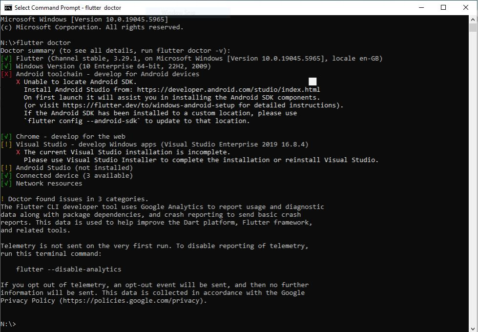
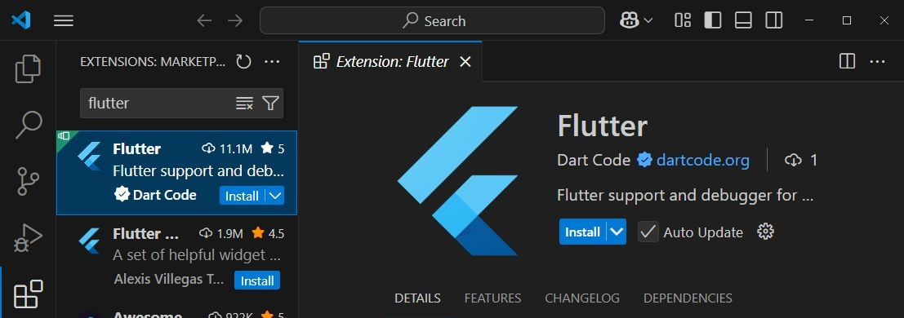
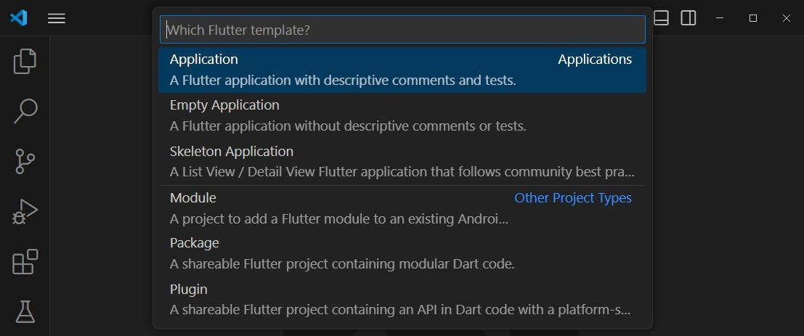
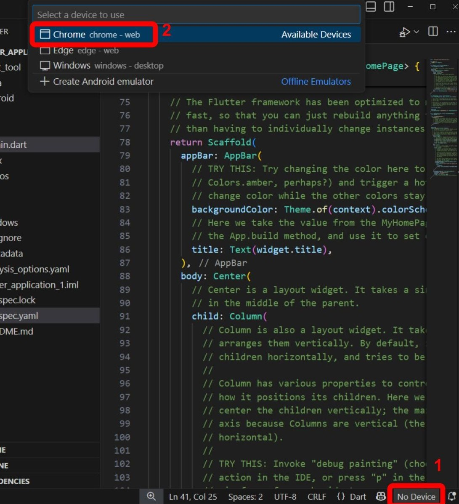
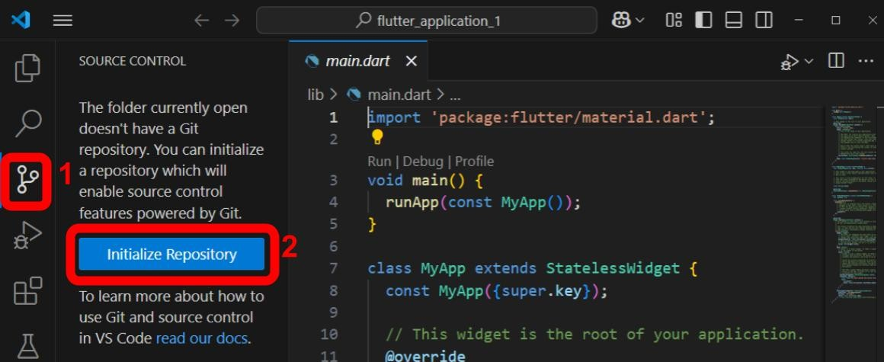
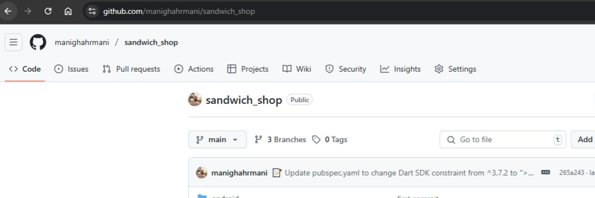
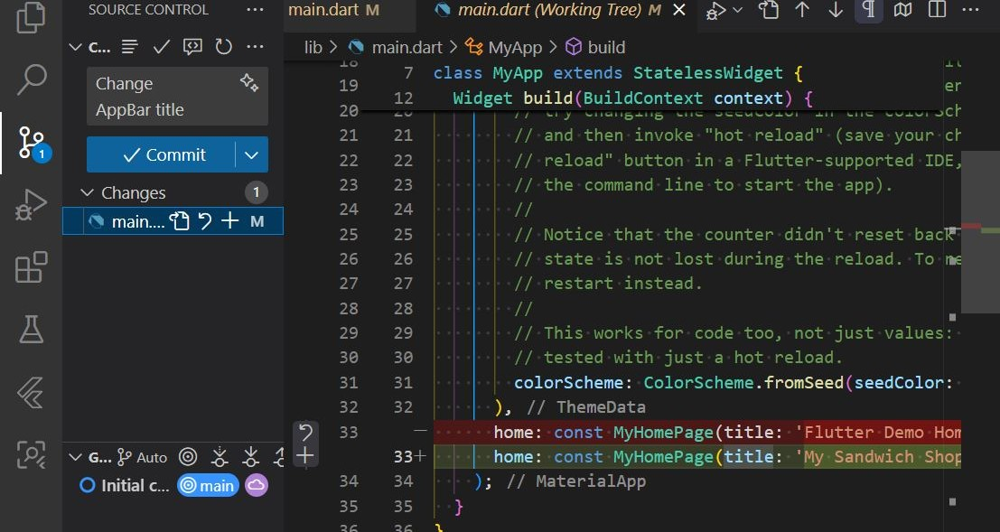

# Worksheet 1 — Introduction to Flutter

## What You Need To Know Beforehand

Ensure that you have already completed the following:

- Introduction to the Dart language.
- Introduction to Git and GitHub.

## Set Up Your Development Environment

We first need to ensure all the necessary tools are installed on your computer. You can use either the university computers or your personal Mac or Windows computer. Skip to the section that matches your operating system.

### University Computers

1. **Log in to AppsAnywhere**

   Use the shortcut on the desktop or head to AppsAnywhere using this link: [appsanywhere.port.ac.uk](https://appsanywhere.port.ac.uk/sso). Once you have logged in, you will see a dialogue shown below. First, tick the box for "Always allow appsanywhere.port.ac.uk to open links of this type in the associated app" and then click on the "Open AppsAnywhere Launcher" button.

   

1. **Install Git**

   In [AppsAnywhere](https://appsanywhere.port.ac.uk/sso), search for **Git** and click on launch. Do not select "GitHub Desktop" (see below).

   

   To verify the installation, open the Start Menu by pressing the **Windows** key, type **Git Bash**, and select it. Write the following command in the terminal and press Enter:

   ```bash
   git --version
   ```

   You should see a version number indicating that Git is installed successfully.

1. **Install the Flutter SDK**

   In [AppsAnywhere](https://appsanywhere.port.ac.uk/sso), search for **Flutter And Dart SDK** and click on launch.

   To verify the installation, search for **Command Prompt** or **PowerShell** in the Start Menu and open it. Write the following command and press Enter:

   ```bash
   flutter --doctor
   ```

   This may take a while, but it should return a report of your Flutter installation status similar to what is shown below:

   

1. **Install Visual Studio Code**

   In [AppsAnywhere](https://appsanywhere.port.ac.uk/sso), search for **Visual Studio Code** and launch it. It can take a while to load, so be patient.

### Personal Windows Computer

1.  **Open the Terminal**

Open the Start Menu by pressing the **Windows** key, type **PowerShell**, and select **Run as Administrator**. You need administrator rights to install the package manager. If you don't have this permission, use the university computers instead.

1.  **Install the Chocolatey Package Manager**

We will use a package manager called Chocolatey to easily install all the required tools. First, check if it's already installed by running `choco --version`. If you see a version number, you can skip to the next step.

If it's not installed, go to the [Chocolatey installation page](https://chocolatey.org/install) and follow the instructions. You should find a command similar to the one below:

```powershell
Set-ExecutionPolicy Bypass -Scope Process -Force; [System.Net.ServicePointManager]::SecurityProtocol = [System.Net.ServicePointManager]::SecurityProtocol -bor 3072; iex ((New-Object System.Net.WebClient).DownloadString('https://community.chocolatey.org/install.ps1'))
```

1.  **Install Development Tools**

With Chocolatey installed, you can now install Git, Visual Studio Code, and the Flutter SDK with the following commands. Run the following commands one by one in your PowerShell terminal (with administrator rights):

```powershell
choco install git -y
choco install vscode -y
choco install flutter -y
```

Make sure to read any prompts carefully before closing the terminal. You may be asked to run additional commands to add Flutter to your system's PATH variable.

1.  **Verify the Installation**

Close your current terminal and open a new one (it doesn't need to be as an administrator this time). Run the following to check your installations:

```powershell
flutter doctor
```

### Personal macOS Computer

1.  **Open the Terminal**

You can open the built-in Terminal app by pressing **⌘ + Space** to open Spotlight, typing **Terminal**, and pressing **Return**.

1.  **Install the Homebrew Package Manager**

Homebrew is a package manager for macOS that simplifies installing software. To check if you have it installed, run `brew --version` in the terminal. If you see a version number, you can skip to the next step.

If it is missing, visit the [Homebrew website](https://brew.sh/) and copy the installation command provided on the homepage. Paste it into your terminal and press **Return** to install Homebrew. The command will look similar to the one below:

```bash
/bin/bash -c "$(curl -fsSL https://raw.githubusercontent.com/Homebrew/install/HEAD/install.sh)"
```

1.  **Install Development Tools**

Once Homebrew is ready, you can install the necessary tools. Run the following commands in your terminal:

```bash
brew install --cask visual-studio-code
brew install --cask flutter
```

Make sure to read any prompts carefully before closing the terminal. You may be asked to run additional commands to add Flutter to your system's PATH variable.

1.  **Verify the Installation**

Close your current terminal and open a new one. Run the following command to check your installations:

```bash
flutter doctor
```

## Your Flutter Application

Now that our environment is set up, we can create our first Flutter project.

1. **Set Up Visual Studio Code**

   To sync your VS Code settings, first open [GitHub](https://github.com/) in your browser and log in to your account.

   Back in VS Code, click on the Account icon in the bottom left corner and select **Backup and Sync Settings** (see below). This should automatically sync your settings, including themes and extensions, with your GitHub account.

   

   If this is your first time using VS Code, you need to install the Flutter extension. Open the Extensions view by clicking on the Extensions icon in the Activity Bar on the side of the window or by pressing **Ctrl + Shift + X** (Windows) or **⌘ + Shift + X** (macOS). In the search bar, type **Flutter** and install the extension shown below:

   

1. **Create a New Flutter Project**

   In VS Code, open the Command Palette using **Ctrl + Shift + P** (Windows) or **⌘ + Shift + P** (macOS). In the palette, type **Flutter: New Project** and press Enter (see below).

   

   Select **Application** when prompted to select a Flutter template and press Enter. You will then be prompted to choose a project location and name. We recommend your user folder in the C drive.

   Choose a name for your project, such as `sandwich_shop`, and press Enter. VS Code will now create a new Flutter project in the specified folder and open it for you.

1. **Understand the Project Structure**

   You should see a new folder structure in the Explorer view on the left side of VS Code (see below). You are encouraged to explore and find out what the other files and folders are for, but here are the most important ones:

   - `lib/`: This folder contains the Dart code for your application. The main entry point is `lib/main.dart`.
   - `pubspec.yaml`: YAML, which stands for ["YAML Ain't Markup Language"](https://www.redhat.com/en/topics/automation/what-is-yaml), is a human-readable data serialization language. In Flutter, this YAML file specifies the assets of the project (e.g., images), the configuration of the app, and the dependencies (packages) that the app uses. It is similar to `package.json` in a Node.js project or `requirements.txt` in a Python project.

   

   The default application created by the Flutter template is a simple counter app. `lib/main.dart` contains the following:

   - `void main() => runApp(const MyApp());`: This is the entry point of the app. The `runApp` function takes a `Widget` (`MyApp` in this case) and makes it the top-level widget (the root widget) of the application.
   - `class MyApp extends StatelessWidget`: This is the root widget and remains constant throughout the app's lifecycle. Its main job is to set up the `MaterialApp`, which defines the app's title, theme (colour scheme), and the home screen.
   - `class MyHomePage extends StatefulWidget`: This is the home screen widget. In this app, the counter value is the state that changes.
   - `_incrementCounter()`: This is a method that increments the `_counter` variable when the button is pressed. The call to `setState()` tells the Flutter framework that the state has changed, causing the UI to be updated.
   - `build(BuildContext context)`: This method of `MyHomePage` builds the UI of the widget. It returns a `Scaffold` widget, which provides a basic structure for the app's visual layout, including an `AppBar`, a body with a `Text` widget displaying the counter value, and a `FloatingActionButton` to increment the counter.

   We will learn more about stateless and stateful widgets in later worksheets. This is just a brief overview to get you started.

1. **Select a Target Device**

   At the bottom right of the VS Code window, you'll see a status bar. Click on the device name (it might say "No Device") to open the device selector. For now, choose a browser like **Edge** or **Chrome**. You can alternatively set this by opening the Command Palette (**Ctrl + Shift + P** or **⌘ + Shift + P**) and typing **Flutter: Select Device**. Then select the browser from the list.

   

1. **Run the App**

   You can run the app in several ways:

   - Press the **F5** key (you may need to press **Fn + F5** on some keyboards).
   - Open the Command Palette (**Ctrl + Shift + P** or **⌘ + Shift + P**) and type **Terminal: Create New Terminal** to open a terminal, then run the following command:

     ```bash
     flutter run
     ```

   - Click the "Run" button that appears above the `main` function in `lib/main.dart`.

   VS Code will now build and run your application. Once complete, a browser window should open displaying the counter app. Click the `+` button to see the counter increase.

   

1. **Hot Reload**

   Hot reload is a feature that allows you to quickly see changes in your code without restarting the app. Enable it by clicking the lightning bolt icon (⚡) on top of VS Code while the app is running (see below). If you ran the app using the terminal, you can also type `r` in the terminal where the app is running to trigger a hot reload.

   

   While the app is running, change the colour scheme from deep purple to orange. In `lib/main.dart`, search for **ColorScheme** (use **Ctrl + F** or **⌘ + F** to search). Change `Colors.deepPurple` to `Colors.orange` in the `colorSchemeSeed` property of the `ThemeData` widget. You should see the UI update in the browser instantly.

## Setting Up a GitHub Repository

Lastly, let's put our project on GitHub. This will allow us to track changes and back up our work online.

1. **Initialize the Repository**

   In the Activity Bar on the left side of the VS Code window, click on the Source Control icon (it looks like a branch, see below). Click on **Initialize Repository** to set up Git for your project as shown below.

   

   Alternatively, you can run the following command in the terminal to initialize Git:

   ```bash
   git init
   ```

1. **Make the First Commit**

   Now you should see all your project files listed in the Source Control panel. Hover your mouse over **Changes** and click the `+` icon to stage the creation of all files as a single change to be committed. Then, enter a commit message like **Initial commit** in the text box at the top and click the **Commit** button to commit your changes.

   

   Alternatively, you can run the following commands in the terminal:

   ```bash
   git add .
   git commit -m "Initial commit"
   ```

   You may see a pop-up asking you if you would like to stage all changes and commit them directly. Click **Always** to skip this step in the future.

   The **Commit** button will now say **Publish Branch** or **Sync Changes** as shown below, which means you have committed your changes locally but not yet pushed them to a remote repository (to GitHub). Click on this button to push your changes to GitHub.

   

   You can do this from the terminal as well by running:

   ```bash
   git push -u origin main
   ```

   You may be asked to allow VS Code to log in to your GitHub account. If so, click on **Allow** and select **GitHub** in the next dialog. This should open your browser.

   Next, you will be asked to set a name for your GitHub repository. Enter `sandwich_shop` as the name. It doesn't matter if you make it public, but for your coursework, you should make it **private**.

   

1. **Verify the Repository on GitHub**

   You can verify this by opening your web browser and navigating to your GitHub account. You should see the newly created repository named `sandwich_shop` with all your project files.

   

   The link to the repository should look like this: `https://github.com/YOUR_USERNAME/sandwich_shop`, where `YOUR_USERNAME` is your GitHub username.

1. **Make Another Commit**

   Let's make another commit. In `lib/main.dart`, change the text in the `AppBar` widget from `'Flutter Demo Home Page'` to `'My Sandwich Shop'`. Save the file (**Ctrl + S** or **⌘ + S**) or better yet, enable auto-save by opening the Command Palette (**Ctrl + Shift + P** or **⌘ + Shift + P**) and typing **Auto Save**, then press Enter to select **Toggle Auto Save**.

   Go back to the Source Control panel (use the Command Palette and enter **Focus on Source Control View** if you can't see it), stage the changes, and commit them with a message like **Change AppBar title**. Remember to always write meaningful commit messages that describe what changes you made. The commit message should ideally be written in the imperative mood, like **Add new feature** or **Fix bug**.

   Before you click on commit, you can also click on the changed files below the **Changes** section to see the differences (diff) between the current version and the last committed version.

   

   Once you have clicked on commit and then sync changes, you should be able to see the changes to the file in your GitHub repository.

Of course. Here are the revised exercises for your worksheet.

## Exercises

1. We've already modified the title of the `AppBar` widget. This is different to the title of the app itself which you can see in the browser tab. As a simple exercise, find out what determines the title of the app in the code and change it to something more appropriate like "Sandwich Shop App". Remember to view the changes live with hot reload and to commit your changes to GitHub.

1. **Modify the UI Text and Style**

   The default app displays a counter. Your task is to change this. In `lib/main.dart`, find the `Column` widget inside the `_MyHomePageState`. This `Column` contains two `Text` widgets.

   - First, remove one of the `Text` widgets.
   - Next, modify the remaining `Text` widget so that it displays a static welcome message, like "Welcome to my shop\!", instead of the counter variable.
   - Finally, give your message some style. A `Text` widget has a `style` property that accepts a `TextStyle` widget. Use this to change the `fontSize`, `color`, and `fontWeight` of your text. For a full list of what you can change, have a look at the [official documentation for the TextStyle class](https://api.flutter.dev/flutter/painting/TextStyle-class.html).

1. **Understand and Modify `pubspec.yaml`**

   The `pubspec.yaml` file is the heart of your project's configuration. It manages dependencies, fonts, images, and project metadata. Open this file and take a moment to read through it. You can use an LLM or the [official documentation on the pubspec file](https://dart.dev/tools/pub/pubspec) to understand each section.

   Your task is to modify the file to match the cleaned-up version below. This involves:

   - Changing the project `name` and `description`.
   - Changing the Dart SDK `environment` constraint. The default `^3.7.0` uses caret syntax, meaning it works for any version up to (but not including) `4.0.0`. The new constraint, `>=2.17.0 <4.0.0`, makes the project compatible with a wider range of older Dart SDK versions.
   - Updating the version constraints for the `cupertino_icons` and `flutter_lints` packages.
   - Removing all the comments to make the file more readable.

   **Target `pubspec.yaml`:**

   ```yaml
   name: sandwich_shop
   description: "A Flutter project for a sandwich shop."
   publish_to: "none"

   version: 1.0.0+1

   environment:
     sdk: ">=2.17.0 <4.0.0"

   dependencies:
     flutter:
       sdk: flutter
     cupertino_icons: ^1.0.0

   dev_dependencies:
     flutter_test:
       sdk: flutter
     flutter_lints: ^2.0.0

   flutter:
     uses-material-design: true
   ```

   After saving your changes, you must synchronise the dependencies. VS Code often does this automatically, but you can do it manually by running `flutter pub get` in the terminal.

1. **Add a Reset Button**

   In the `MyHomePage` widget, add a new `FloatingActionButton` next to the existing one that resets the counter to `0`.

   - **Hint**: You can wrap the existing `FloatingActionButton` in a `Row` widget to add another button next to it.
   - **Hint**: You'll need to create a new method called `_resetCounter()` that sets the `_counter` to `0` inside a `setState()` call.

1. **(Advanced) Run on a Mobile Device**

   Running on a web browser is great for quick development, but the ultimate goal is often a mobile app. Follow the official documentation to set up your physical phone for Flutter development and run the app on it.

   - [Set up an Android device](https://docs.flutter.dev/get-started/install/windows#android-setup) (works for Mac/Windows/Linux).
   - [Set up an iOS device](https://docs.flutter.dev/get-started/install/macos#deploy-to-ios-devices) (requires macOS).
